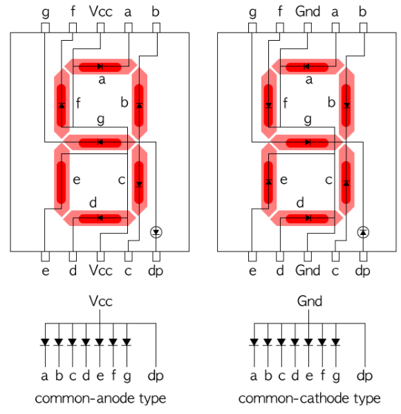

# Flexible Numeric Display (`FND` or 7-Segment Display)

`common cathode` 방식과 `common anode` 방식으로 나뉘며,  
일반적으로 ***common인 단자*** 를 통해 복수 개의 `FND`중 해당 `FND`를 선택이 이루어짐.

> `Cathode`는 전자가 방출되거나 양이온이 다가가는 "전극" 으로  
> 
> * 전기를 소모하는소자에서는 `음극`이고 
> * 배터리 등의 소자에선 `양극`을 가리킴.  
>  
> `Anode`는 그 반대에 해당한다.  
>  
> `FND`의 경우 ***전기를 소모하는 소자*** 이므로 `cathode`는 ***음극*** 임  
> (사실, 대부분이 전기를 소모하는 소자라 cathode를 음극이라고 생각해도 거의 맞음: 배터리 다루는 경우가 아니라면...).

{style="display: block; margin:0 auto; width:500"}

Common Cathode 에서 각 숫자에 해당하는 Bit 값은 다음과 같음.

| A | B | C | D | E | F | G | DP | display |
|---|:---:|:---:|:---:|:---:|:---:|:---:|:---:|---|
| 1 | 1 | 1 | 1 | 1 | 1 | 0 | 0 | 0 |
| 0 | 1 | 1 | 0 | 0 | 0 | 0 | 0 | 1 |
| 1 | 1 | 0 | 1 | 1 | 0 | 1 | 0 | 2 |
| 1 | 1 | 1 | 1 | 0 | 0 | 1 | 0 | 3 |
| 0 | 1 | 1 | 0 | 0 | 1 | 1 | 0 | 4 |
| 1 | 0 | 1 | 1 | 0 | 1 | 1 | 0 | 5 |
| 1 | 0 | 1 | 1 | 1 | 1 | 1 | 0 | 6 |
| 1 | 1 | 1 | 0 | 0 | 0 | 0 | 0 | 7 |
| 1 | 1 | 1 | 1 | 1 | 1 | 1 | 0 | 8 |
| 1 | 1 | 1 | 1 | 0 | 1 | 1 | 0 | 9 |
| 0 | 0 | 0 | 0 | 0 | 0 | 0 | 1 | . |

* Common Anode 의 경우에는 위의 bit pattern에서  `0`과 `1`을 반전시키면 됨.

참고로, 제한된 port로 복수 개의 `FND`를 동작시킬 경우, ***잔상효과*** 를 이용하는게 일반적임.

* 이 경우, Arduino 등으로 돌려보면, Brightness가 변하는 것이 보이기 쉬움: 주기에 따라 다름.

---

## Example

* [Tinkercad Ex](https://www.tinkercad.com/things/g7iYv4feVBG)

