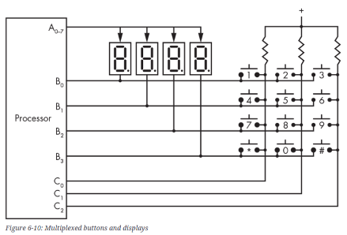

# 제한된 Port 활용하기.

일반적으로 processor의 ***I/O pin (or port)는 그 수가 제한*** 되어있기 때문에,  
`multiplexing`이 사실상 필수이다.

> `MUX`는 n개의 입력과 1개의 출력을 가짐.

다음은 secrete life of programs: Understand Computers 의 6장에 있는 그림으로  
***제한된 Processor의 port에서 다양한 I/O 장치를 multiplexing한 개략도*** 임.

4개의 Flexible Numeric Display (`FND` or 7-Segment Display)에서 $4 \times 9$ 개의 Pins에  
12개의 Buttons에 해당하는 12개의 Pins가 필요한 상황인데,  
실제로는 

* 8bit의 `Port A`와 
* 4bit의 `Port B`, 그리고 
* 3bit의 `Port C` 만으로 

처리한 구조를 간단하게 보여준다.

간략히 보면, 

* `Port A`는 모든 `FND`에 공유되어 연결되어 있으면서 
* `Port B`를 통해 특정 `FND`를 선택해서 output을 보내는 구조이다. 
* 그리고 `Port B`는 
    * `FND`를 선택 (`low` 인 경우 선택)하는 동시에, 
    * 12개의 `버튼`을 4개 그룹으로 나누어 같이 선택하고 있다. 

추가적으로, 

* `FND`에는 `Port A`가 연결되어 있고(Processor 관점에서 `output`), 
* Button에는 3개의 입력핀으로 구성된 `Port C`가 연결(Processor 관점에서 `input`)된다. 

앞서 살펴본 것처럼 

* 4개의 `FND`가 `Port A`를 시간으로 분할하여 공유하는 것처럼, 
* 4그룹의 버튼들도 `Port C`를 시간을 분할하여 공유하는 방식이다.

사실 위의 예는 매우 간단한 구조에 속한다. 

보다 많은 I/O 소자들을 Multiplexing하는 경우,  

* `MUX`, 
* `DEMUX`, 
* `Parallel2Serial Converter` 등의 소자들이 이용되기도 한다.

> 하나의 pin을 이용하여 serial communication을 이용하여 여러 bit의 정보를 보내는 소자를 활용하는 경우도 많다.  
> [Serial communication](ce06_1_07_parallel_com.md)과 [Parallel communication](ce06_1_07_parallel_com.md)의 차이에 대한 개념을 꼭 이해하고, 이들을 활용하자.

---

## Tinkercad Example 

다음 Tinkercad 예제에서는 Arduino UNO의 `Port D`와 `Port A` 일부를 활용하여 2개의 `FND`, 6개의 `Button`을 아까 살펴본 방식으로 연결하고 있다.

다시 한번 말하지만, embedding system을 다룰 경우, 이같이 제한된 port에 여러 소자를 연결하는 응용사례는 매우 일반적이다.

* [Tinkercad Ex](https://www.tinkercad.com/things/1XBaZDlOTSJ)

