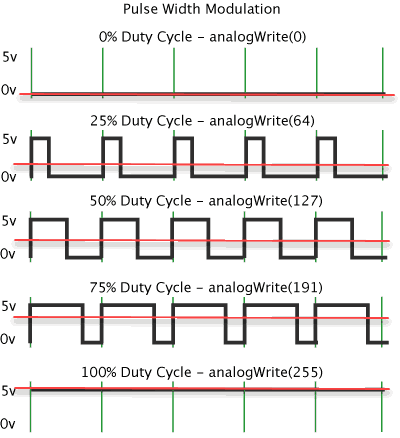

# Brightness Control and Duty Cycle

LED 등을 사용할 때, brightness adjustment가 필요하다면, duty cycle을 조정하면 됨.

> `duty cycle`이란 ^^signal의 1주기 동안 on 상태인 시간이 어느 정도의 퍼센트를 차지하고 있는지를 나타내는 지표^^ 로 단위는 ***퍼센트*** 를 사용한다.

다른 말로는 `PWM`을 이용한다고 말함. PWM은 Pulse Width Modulation의 약자로 일정 주기(period)내에서 duty cycle을 변화시켜 평균 전압을 제어하는 방법을 가르키며, 이는 앞서 애기한 내용을 좀더 공학적으로 표현한 것이라고 생각해도 된다.

* duty cycle을 통해 평균 전압을 조정한다.
* LED의 경우, 이는 brightness를 조절하게 됨.

앞서 살펴본 예들에서 LED가 계속해서 on 상태가 아닌 일정 주기로 잠시 on 상태이고 다른 시간에는 다른 LED가 선택되어 on 상태가 되는 multiplexing이 사용되므로, on 상태인 시간을 줄이는 경우, 즉 duty cycle을 낮추면 LDE의 brightness가 낮아지게 된다.

단, ^^평균 전압은 linearity가 성립^^ 하지만, 사람이 인식하는 ^^brightness는 linearity가 성립하지 않음^^. (심지어 지나치게 duty cycle이 낮을 경우, 사람들이 깜빡이는 것을 느낄 수도 있음.)

## References

[Duty Cycle : wikipedia](https://ko.wikipedia.org/wiki/%EB%93%80%ED%8B%B0_%EC%82%AC%EC%9D%B4%ED%81%B4)