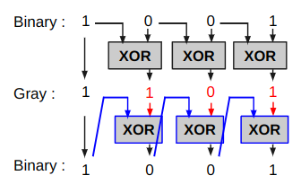
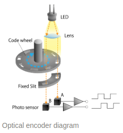
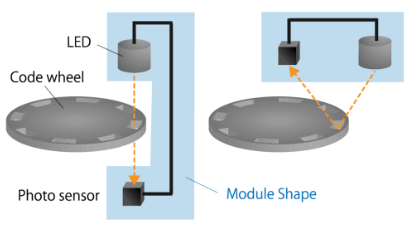
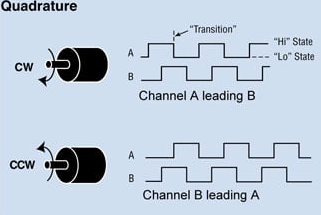

# Gray Code and Quadrature

## Graycode

Frank Gray (1887-1969)가 개발한 encoding. binary code(이진코드)들과 달리, 인접한 숫자들 간의 차이는 1개의 비트에 불과함.

* 일반적으로 숫자를 하나 증가 또는 감소하는 카운터들에서 최소한의 비트로 빨리 처리가 가능하므로 많이 사용된다.
* 또한, 회전축(shaft)의 위치를 encoding할때, encoder들 간의 propagation delay가 있더라도 에러가 발생하지 않기 때문에 Quadrature Encoder 등에서 많이 사용됨.

다음 표는 십진수 0에서 10까지에 대한 binary code와 gray code값을 보여준다.

|digit|binary|gray|
|:---:|:---:|:---:|
|0| 0000|0000|
|1|0001|0001|
|2|0010|0011|
|3|0011|0010|
|4|0100|0110|
|5|0101|0111|
|6|0110|0101|
|7|0111|0100|
|8|1000|1100|
|9|1001|1101|
|10|1010|1111|
|11|1011|1110|
|12|1100|1010|
|13|1101|1011|
|14|1110|1001|
|15|1111|1000|

gray code는 binary code로부터 계산된다.

* 맨처음 나오는 1은 그대로 사용.
* 맨 처음 나온 1 이후 자리의 값은 ^^binary code에서 `앞서 있는 자리의 값`과 `현재 값`^^ 을 `XOR` 수행하여 구함.
* 위 그림의 하단부는 gray code에서 binary code로 변환을 보여줌.

다음의 경우를 위의 그림처럼 표현해 보라.

$$
110101_{2} \Rightarrow 101111_\text{gray} 
$$

---

### gray code의 적용사례 : Optical Encoder

* 위의 그림은 gray code 중 하나인 quadrature 를 적용한 광학방식의 encoder임.
* 해당 구조에서 나오는 waveform은 아래 "quadrature부분" 을 참고할 것.

Optical Encoder는 광센서를 활용하여 shaft의 회전방향과 속도등을 측정하는 것으로 다음과 같이 2가지 방식으로 나뉜다.

* 좌측은 transmitive 방식이고, 우측은 reflective 방식임.

---

### python library for graycode

구현이 그리 어렵지 않으나 "바퀴를 다시 만들지 말라"는 격언대로 가급적 널리 사용되거나 자신이 많이 쓰는 라이브러리에 해당 기능이 있다면 그걸 사용하는게 나음.

* [sympy's graycode](https://docs.sympy.org/latest/modules/combinatorics/graycode.html)

---

## Quadrature

^^2-bit Gray code^^ 라고 불 수 있음.

2-bit이기 때문에 sensor가 2개를 사용하는데, 이 ^^2개의 센서만으로 shaft의 회전방향과 회전속도 등을 확인^^ 할 수 있다는 장점을 가짐.

라디오나 자동자 오디오의 음성크기를 제어하는 ***knob*** 등이 대표적인 예임.

십진수와 binary encoding과의 관계는 다음 표와 같다.

|digit|binary|gray|
|:---:|:---:|:---:|
|0| 00 |00|
|1| 01 |01|
|2| 10 |11|
|3| 11 |10|

일반적이 shaft에 적용될 때, 위의 테이블에서 십진수의 `0,1,2,3` 이 순환적으로 반복된다고 생각하면된다. 

`00`, `01` 의 순서로 나올 경우,  clockwise로 회전 중이고, `00`, `10` 의 역순일 경우 counterclockwise로 회전하는 것임.

다음의 waveform 을 위의 테이블과 함께 보면 이해하기 쉬움.

> Quadrature encoding 의 장점은 압도적인 가성비이다.   
> 실제 매우 저가의 quadrature encoder에서도 한 회전(revolution)을 4096 등분한 resolution을 제공하고 있는데, 이를 absolute encoding을 적용할 경우, 센서가 12개 (즉, 12-bit encoding)나 필요하다. $(4096=2^2 \times 2^{10} =2^{12})$