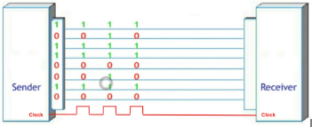
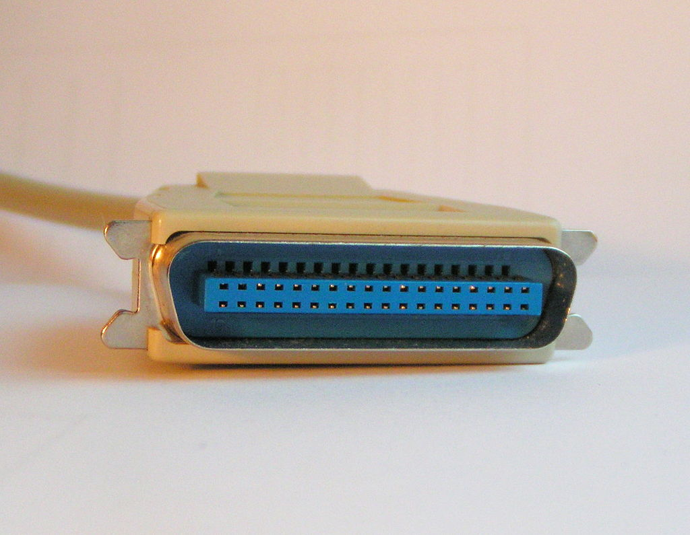

# Parallel Communication (병렬통신)

> 병렬통신은 여러 bit의 데이터를 한번에 여러 channel (or wire)을 이용하여 전송하는 방식임.

1bit씩 보내는 Seiral Communication과 달리 Parallel communication은 여러 bit를 그 수에 해당하는 connection으로 동시에 보내며, gate 나 ic 칩의 GPIO단자들을 동기화 시켜 연결하는 방식으로 데이터를 전송시킨다고 생각하면 된다.

한번에 6비트의 데이터를 전송하려면 6개의 전선 (or Channel)이 필요하기 때문에 parallel communication은 일단 여러 channel이 필요하다. 또한 각 channel의 timing을 맞추기위한 `strobe` 신호도 필요하며, 고속화될 경우 추가적인 channel들이 더 요구된다.

* 위 그림에서 `Clock`가 high인 경우 receiver는 valid한 신호라고 생각하고 입력 bit들을 읽어들임.
* IEEE 1284 에서는 `strobe`가 위 그림의 `clock`과 같은 역할을 했으나 동작 level은 반대로 low인 경우가 valid한 순간이 됨.

## 단점

* ideal 한 경우, parallel communication은 serial 방식보다 빠르지만, 실제로 구현시 고려해야할 이슈(channel간의 crosstalk등)들로 인해 고속화에 제한이 큼.
* 여러 channel의 전송 timing을 고속으로 동기화는 매우 어려운 기술이고 구현에 보다 많은 channel과 device가 필요함. (이게 다 cost로 연결됨)
* 때문에 computer 주변기기의 전송방식은 현재 대부분 serial 방식을 채택하고 있음.
* 또한 장거리 전송에도 취약함.

Parallel communication은 아주 짧은 거리에서 낮은 전압등을 사용하면서 동기화가 가능한 여건, 즉 Chip내부에서의 통신으로 주로 이용되며 **미터** 단위의 전송거리가 요구되는 환경에서는 거의 사용되지 않음.

무엇보다 고속화가 어렵고 cost가 높다는 문제점이 주변기기와의 통신으로는 부적합하다. 

## 예

이전 HDD 연결하는데 사용된 IDE (or PATA, 40 pin)와 Centronic Port (or IEEE 1284, 36 pin)가 대표적인 병렬통신 방식의 주변기기 인터페이스임. 대용량의 데이터 전송(HDD, 프린터 등)을 빠르게 하기 위해 병렬방식을 채택한 경우로 당시엔 고속 serial 통신 기술이 없었던 터라 병렬로 속도를 올린 경우임 (Serial Communication은 clock 속도가 올라가야하는데 당시 clock속도는 현재와 비교하여 매우 느렸음). 

둘 다 현재는 사용되지 않는다.

