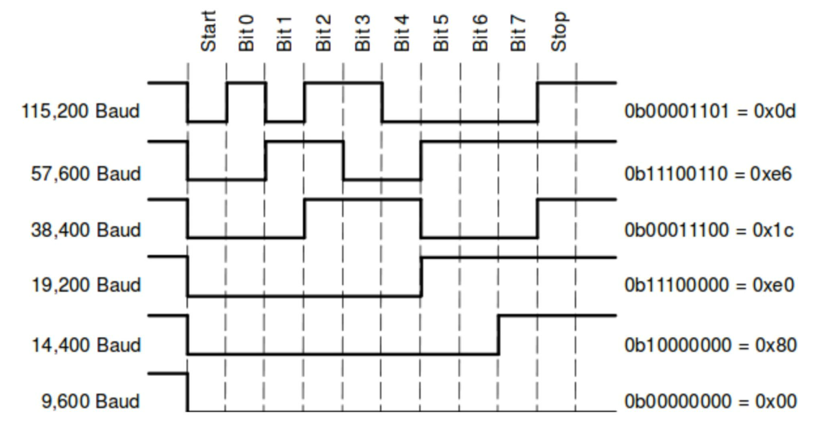
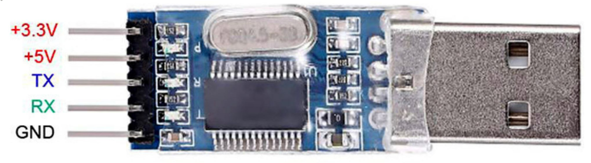
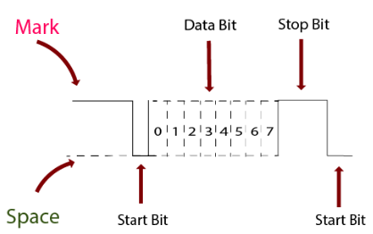
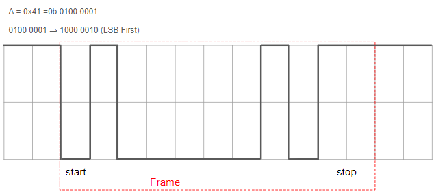
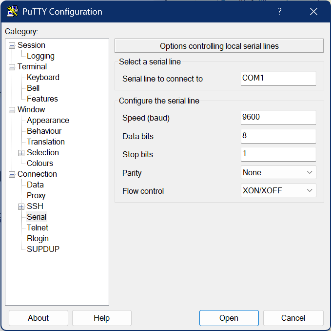
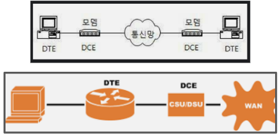
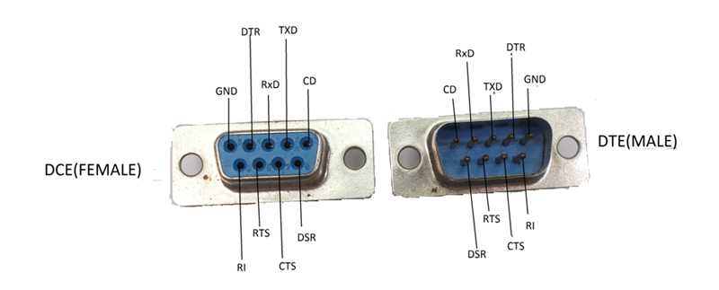
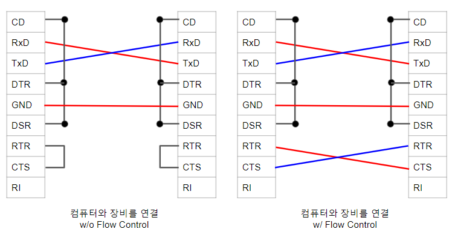
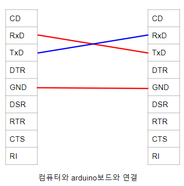

# Serial Communication (직렬통신, 시리얼 통신)

^^ideal하게는 parallel communication이 serial communication보다 빠르다^^ 고 할 수 있지만,  
실제로는 여러 connection 간의 동기화가 쉽지 않고,  
***기기의 동작 clock이 매우 빨라지면서*** 사실상 **주변기기와의 연결은 serial 방식이 대세** 이다.  
(실제로 parallel 방식보다 `serial 방식`들이 **주변기기** 를 연결할 때 보다 고속이다.)

> parallel 방식은 사실상 cpu나 microprocessor 내부에서 데이터를 주고받는 방식이고,  
> 주변기기와의 연결은 serial 방식이 대세임.  
> 예를 들면,  
> HDD 에서 사용되는 방식도 과거 IDE의 경우 parallel방식 이었으나  
> 현재는 SATA (Serial Advanced Technology Attachment)로 다 전환된 상태임.

일반적으로 장거리 통신(cpu내에서의 통신 외에 거의 장거리라고 본다.) 및 고속으로 주변기기와 통신하는데에  Serial Communication  이 사용된다.

종류는 동기화 여부에 따라 다음 2가지로 나뉨.

* Synchronous Serial Communication 
* Asynchronous Serial Communication 

---

---

## Recommended Standard 232, 422, 485

컴퓨터로 

* 특정 장치의 제어 등을 하거나 
* embedded system과 통신을 하는 경우 

serial communication이 주로 사용된다.

최근 ***네트워크가 발전*** 하면서 

* `LAN` (Local Area Network, Synchronous Serial Communication의 한 종류)에 연결된 장비들도 늘어나고 있지만, 
* 통신망에 항상 연결되지 않은 경우를 고려해야하는 산업계의 경우, 
    * 사용하는 주요 방식은 아직도 RS-232, RS-422, RS-485 들과 같은
    * **Asynchronous Serial Communication** 이다. 
    
특히, `RS-232`는 1960년대에 개발되었지만 현재까지도 단거리 통신(특히, 컴퓨터와 장비간의 1:1연결을 위한)으로 매우 많이 사용되고 있다. 

> 위의 RS-232, RS-422등은  
> 
> * 디지털 신호를 직렬전송하는 규약을 정의한 `UART` (Universal Asynchronous Receiver Transmitter)의 신호를 
> * **통신선로** 로 전송하기 위한 ***전기적인 신호 방식에 대한 규약*** 임.

---

### RS-232

RS(Recommended Standard)-232는 

* 1960년대에 Electronic Industries Alliance (미국전자산업협회)가 제안한 규격으로 
* 115.2kbps 이하의 속도로 
* ***15m 이내의 단거리에서 장비간(컴퓨터 포함)의 serial communication*** 을 
* **1:1로 수행(point-to-point)** 한다. 

RS-232의 경우, 

* D-SUB 9핀 커넥터 (D-SUB9)이 주로 사용되었으나, 
* 최근 컴퓨터에서는 USB포트 만이 제공되는 경우가 많아지면서 
* USB 포트에서 동작하는 경우가 대부분(이 경우, `USB to Serial Converter`가 사용됨.)이다. 

학교에서 **마이크로컨트롤러 실습** 등의 경우 주로 사용되는데 이는 구현 및 사용이 쉽고 동시에 안전정인 성능을 보여주기 때문이다.  

***RS-232는 3개의 선(TxD, RxD, GND; 2,3,5번핀)만 사용(즉, `full duplex`임)하며, 아주 간단한 프로그래밍으로 쉽게 통신이 가능함.***

> 실제로 RS-232에서 
>
> * 사용하는 pin의 갯수는 3개가 아닌 9개이다. 
> * 하지만, TxD, RxD, GND를 제외한 다른 핀들은 이전에 사용되던 modem 등의 연결을 위한 pin들이거나 flow control을 위한 것들이라
> * 현재 RS-232가 거의 바로 옆에서 1:1로 간단하게 통신하기 위해서 사용되면서,
> * 이들 나머지 핀들은 사용되지 않는 경우가 대부분임. 
>  

현재 RS-232는 

* Single-Ended (Differential signaling이 아닌 하나의 선으로 신호를 보낸다는 것)이면서 
* Null-Modem 방식으로 사용되는 경우가 대다수이다 

(물론 이는 개인적인 의견임을 강조한다. 고급 기술자 분들의 경우나 다른 분야의 경우는 다를 수 있다.). 

---

### RS-422

RS-422는 

* 1976년에 제안된 규격으로 
* 기존의 RS-232보다 **빠른 전송 속도(10Mbps)** 와 **먼 전송거리(1.5km)** 를 자랑한다. 
* 또한 1대의 master와 10개의 receiver로 구성되는 Multi-drop 방식으로 **여러 장비 간의 통신** 이 가능하다 (RS-232는 1:1연결 밖에 안됨). 
* 하지만 장거리 전송을 위해 ***Differential signaling*** 을 도입하여 필요한 wire 수는 증가함 (패착...). 

---

### RS-485

RS-485는 

* 보다 많은 장비들이 연결되도록 만들어진 규격으로 
* 기존 RS-422 규격을 따르는 device도 제어할 수 있다. 
* 동일한 회선으로 32대의 장비들이 연결되어 통신할 수 있다는 장점을 지니고 확장성도 우수함. 
* ***Differential Signaling*** 임.

단, full-duplex를 지원하는 RS-232와 RS-422와 달리, RS-485는 half-duplex가 표준 결선방식으로 지원됨.

---

요약하면, RS-232, RS-422, RS-485 모두 ***산업계의 자동화 부분*** 에서 많이 사용되는 방식이며  
`Asynchronous Serial Communication` 의 대표적인 예라고 볼 수 있다. 

학교에서 공부할 때는 주로 RS-232를 다루게 될 확률이 제일 높다.  
RS-232는 워낙 많이 사용되다 보니, bluetooth 등의 방식으로 무선연결에서도 이를 emulate해서 사용하는 경우가 많다.

> 사용하는 pin의 수 증가는 전선 케이블의 가격 상승으로 이어진다.  
> 어떤 분들은 "구리가격이 정말 비싸고 반도체는 모래에서 만들어지기 때문"에  
> pin수를 줄이는 게 가격에 매우 큰 영향을 준다고 말씀하시기도 함.
>
> 즉, RS-232는 IoT가 대중화되어도 살아남을 확률이 높다.

---

---

## UART (Universal Asynchronous Receiver Transmitter)

> ***`Serial`로 장비 간에 비동기로 데이터를 전송하는 IC*** 를 가리키며,  
> TTL Level (Transistor-Transistor Logic Level, 주로 5V)로 데이터가 전송된다.  
> 
> 대표적 제품으로 MAX232 가 있으나,  
> 워낙 많이 사용되기 때문에 최근의 대부분 마이크로컨트롤러 나 임베디드 프로세서 내부에 통합되어 있다.  
> 
> `RS-232` 는 `UART` 를 통신기기레벨로 구현한 것으로 
> ***-12~+12V Level로 동작*** 한다.  
> (전압 차이 때문에 UART 에 RS-232를 직접 연결하면 큰일난다.)

* USART (Universal Synchronous/Asynchronous Receiver Transmitter) 과 같은 다른 대체자들도 있으나  
> ***대부분 직렬통신이라고 하면 `UART`를 가리킴*** .

다음 그림은 UART에서 7bit 길이의 특정 데이터들을 여러 Baud rate로 보내는 방식을 파형으로 나타낸 것임. 

<figure Markdown>
{align="center", width="800"}
</figure>

- `Data Chunk`(데이터 부분, start 다음에서 end 전)에서 ***LSB가 먼저 보내짐***.
- Oscilloscope 에선 어떻게 보일지 생각해볼 것 (아래에 나옴).

RS-232로 전송되는 경우 직접 연결하면 voltage 차이가 있기 때문에 device의 손상이 발생한다.  
반드시 전압 차를 조정해주는 기능이 있는 소자가 중간에 있어야 함.  
***USB로 연결되는 경우에도 적절한 converter 필요.***

- Arduino : 5V TTL Level
- Raspberry Pi : 3.3V TTL Level

**참고**: [TTL 이란](https://dsaint31.tistory.com/731)

FTDI `FT232`, Silicon Labs `CP2102` 및 Prolific `PL2303` 등이  
USB를 serial port로 인식하게 해주는 converter임.

다음은 PL2302 의 사진임.  

* 이 모듈을 컴퓨터의 USB단자에 연결하고, 
* 이 모듈의 `TX` 는 상대 디바이스의 `RX` 에 연결하고 
* 이 모듈의 `RX` 는 상대 디바이스의 `TX` 에 연결하며 
* `GND`는 `GND`에 연결하고, 
* 상대 디바이스의 `VCC`는 디바이스 스펙에 맞게 5V 또는 3.3V에 연결.

<figure Markdown>
{align="center"}
</figure>
 * [참고 url](https://docs.whiteat.com/usbtottl-usbtoserial/)

---

---

## Mark-Space Signaling

Mark와 Space는 Telegraph 시스템에서 사용되던 용어이며,  
serial communication의 많은 부분이 teletype에서 아이디어를 얻어서 만들어진 터라  
아직도 serial communication에서 쓰이고 있다.  

* Mark는 high level(`1`)을 
* Space는 low level(`0`)을 의미

> 종이에 기재된다면,  
> 
> * Mark는 종이에 output이 남는 것이고, 
> * Space는 종이에 인쇄되는 거 없이 비어 있는 것을 의미(no-Mark)한다.

RS-232에서 

* Mark에서 Space로의 transition이 발생하면, idle상태에서 data전송이 시작됨을 알리는 `START`로 간주한다. 
* 이후 약속된 길이의 bit로 구성된 데이터(`Data Chunk`)가 전송되고,  
* 이후 `END`에 해당하는 ***1 또는 1.5, 2bit 길이*** 의 `Mark`가 전송되면서 데이터 전송이 끝나고 다시 idle상태로 들어가게 된다.

<figure Markdown>
{align="center', width="800"}
</figure>

* 위 그림에서 데이터는 7bit에 해당함. 
    * 7bit를 `Data chunk`의 길이라고 부르며, 
    * 8bit, 5bit등이 될 수도 있다.
* serial communication에서 ***보내는 데이터의 bit수*** (Data chunk의 길이)는 반드시 약속되어 있어야 함.

Serial communication에서는 각각의 bit가 ***정해진 시간으로 구별*** 되어지며 이 시간을 정하는 게 `Baud rate`임. 
(비동기라 clock을 공유하지 않기 때문임.)

> 결국 serial communication은 **time division multiplexing** 을 통해 데이터를 직렬로 전송한다. 

다음 그림은 RS-232로 문자 A를 전송한 경우임.

<figure Markdown>
{align="center", width="600"}
</figure>

* Stop bit는 2 bit임.
* Parity bit는 사용하지 않음.
* Data chunk 길이는 8bit임.
* 하나의 데이터를 보낸 구간을 `frame`이라고 부름.

위에서 보이듯이 ***Serial communication*** 을 위해서는  stop bit의 길이라던지, parity bit 사용여부 등이 설정되어야 함.

다음 그림은 serial communication을 위한 putty 터미널 설정임.

<figure Markdown>
{align="center", width="600"}
</figure>

* `Speed (baud)` : 
    * 초당 몇 개의 symbols을 보내느냐를 나타내는 것이 `Baud rate`인데, 
    * 대부분 `0`,`1`을 전송하는터라 초당 보내는 bit로 생각해도 큰 문제 없음. 
    * 위 그림은 9600 bit를 초당 보내는 것임.
* `Data bits` : 
    * Data chunk의 길이. 
    * 이 설정에선 8 bit.
* `Stop bits` : 
    * stop 신호의 길이로 여기서 1bit 로 함. 
    * 앞서 설명에 맞추려면 2bit로 해야함.
* `Parity` : 
    * `odd`, `even`, `Mark`, `Space`, `none` 을 고를 수 있으며 
    * 에러를 찾아내는 `Parity`비트의 사용모드(어느 모드라도 1bit 초과의 에러검출은 안됨)를 지정함. 
    * 보통 `none`을 이용해도 큰 문제 없음.
        - `even`, `odd` : parity비트 포함하여 1의 갯수가 짝수 또는 홀수가 되도록 parity bit의 값을 결정.
        - `Mark`, `Space` : parity bit가 `1` 또는 `0`으로 추가.
        - `none` : parity bit를 사용하지 않음. 일반적으로 단거리에서 RS-232통신 중에는 그리 오류가 발생하지 않기 때문에 `none`도 많이 사용됨.
* `Flow control` : 
    * RS-232의 pin이 9개인 이유가 이들 flow control을 위한 것인데, 
    * 보통 단순한 예제를 수행하는 경우는 `None`을 선택함.

---

---

##  RS-232 연결단자 설명

### DTE and DCE

> RS-232는 modem을 사용하던 시절 만들어진 규약이라 다음의 네트워크 구성에 대한 용어의 개념을 알아야 각 연결선의 역할이 이해가 됨.

`DTE (Data Terminal Equipment)`

* 컴퓨터나 Router, multiplexer 등과 같이 데이터를 생산하거나 수신하는 장치를 의미함.
* 사용자에게 가까운 위치에 놓이는 장치.
  
`DCE (Data Communication Equipment)`

* Data Circuit-terminating Equipment 라고도 불림.
* 네트워크 쪽에 위치하는 장비로 통신 네트워크에 연결되는 장비.
* modem 이나 network interface card등을 가리킴.
* DTE 와의 데이터 전송 동기화를 위한 clock을 제공.

---

### RS-232 Connector

1번 `CD` : (DCE송신, DTE수신)
: `(Data) Carrier Detect`, `DCD`로 기재되기도 함.  
DCE(=Modem)가 상대편 Modem 등에 전화선을 통해 접속이 이루어지면, 상대편 Modem이 `Carrier Signal`을 보내주는데,  
이 신호를 왔음을 DCE가 DTE(=컴퓨터)에 알려주는 신호선임.  
***<u>통신 라인이 설정</u>됨을 의미***  
(전화가 걸렸을 때 High, 끊어지면 Low. 끊기 위해서 Low로 설정하면 2초후 전화 끊김.). 

2번 `RxD` : (DCE송신, DTE수신) ***
: `Rx`라고도 하는데, 데이터가 들어오는 신호선임.

3번 `TxD` : (DCE수신, DTE송신) ***
: `Tx`라고도 하는데, 데이터가 나가는 신호선임.

4번 `DTR` : (DCE수신, DTE송신)
: Data Terminal Ready,  
DTE가 DCE에게 데이터 송수신이 필요함을 알리는 신호선으로  
***<u>통신 포트를 초기화한 직후</u> 이 신호가 출력됨.***

5번 `GND` ***
: 그라운드.

6번 `DSR` : (DCE송신, DTE수신)
: Data Set Ready,  
DCE가 DTE에게 데이터 송수신 준비가 되었음을 알리는 신호선으로  
modem 등이 `DTR` 신호를 받고 상태 체크 후 통신할 준비가 되었음을 알리기 위해 이 신호를 출력.

7번 `RTS`/`RTR` : (DCE수신, DTE송신) 

* `Request To Send (half-duplex)` 
: 컴퓨터 등의 DTE (Data Terminal Equipment)가 modem 등의 DCE (Data Communication Equipment)에게 데이터를 보내겠다고 알리는 신호선.
* `Ready To Receive (full-duplex)` 
: DTE의 버퍼가 충분하여 DCE가 보내는 데이터를 받을 수 있음을 DCE에게 알림. 만일 버퍼가 다 차면, low로 설정하며, 이 경우 DCE는 상대편에게 데이터를 보내지 말라고 연락하는 방식으로 flow control용임. 

8번 `CTS` : (DCE송신, DTE수신) 

* `Clear To Send (half-duplex)` : DCE가 DTE에게 데이터를 받을 준비가 되었음을 알리는 신호선으로 `RTS`를 받고 modem이 DTE로부터 데이터를 받을 수 있음을 알리는 것이며 이후 DTE는 `TxD`를 사용할 수 있음.
* `Clear To Send (full-duplex)` : modem의 버퍼가 충분하여 DTE로부터의 데이터를 받을 수 있음을 알림(high). 만약 버퍼가 가득 차거나 상대방이 데이터 전송을 하지 말라고 하는 경우에는 low가 됨. `RTS`와 함께 flow control용임. 

9번  `RI` : (DCE송신, DTE수신)
: Ring Indicator,  
상대편 modem이 통신을 하기 위해 modem으로 보낸 신호를 수신했음을 DCE가 DTE에게 보내는 신호선.

### RS-232 Cable

컴퓨터(DTE)와 Modem(DCE)간의 전화선 연결 등으로 인해 사용되는 `CD`, `DTR`, `DSR` 은 Null Modem의 경우 의미가 없다. 

* 때문에 연결을 아예 안하던지, 
* 이 3개를 connector에서 서로 연결해버려서 (상대방과의 연결이 아닌 connector pin들을 묶는 것) 사용한다.

`RTS`와 `CTS`는 flow control에 관여하는 핀들인데,  
<u>RS-232의 경우 hardware적인 flow control을 하지 않는 경우가 많다.</u>  
때문에 역시 연결을 아예 안하던지, connector 상에서 서로 연결해버리는 경우도 많다.

이를 반영하여 컴퓨터와 RS-232를 인터페이스로 제공하는 장비와 연결은 다음과 같음.

{style="display: block; margin:0 auto; width:500px"}

하지만, Arduino 나 Raspberry Pi등에 연결하는 경우,  
또는 단순한 장비와의 연결 Connection은 다음과 같이 ***3개의 연결*** 이면 충분함 (Single ended and full duplex). 

{style="display: block; margin: 0 auto; width:300px"}

---

---

## 다른 serial interface

* SPI
* I2C
* TWI
* OneWire
