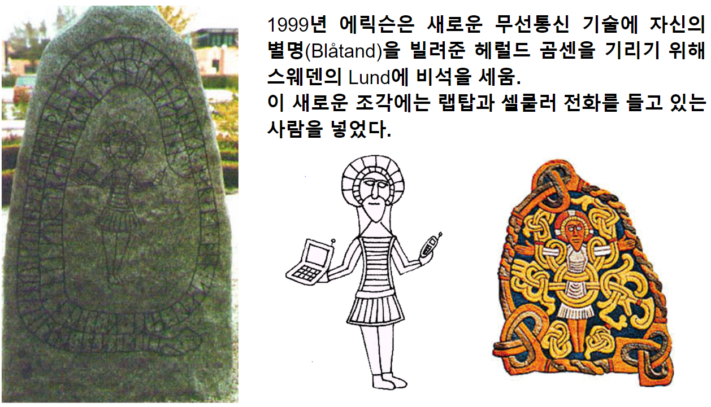

# Network 01

## Ethernet

컴퓨터 네트워크 기술의 하나로, 전세계의 사무실이나 가정에서 일반적으로 사용되는 ***LAN에서 가장 많이 활용되는 기술 규격***.

* [Ethernet이란](https://dsaint31.tistory.com/438)

> ***Network Adaptor 또는 LAN card라고 불리는 device*** 가 바로 Ethernet 통신을 가능하게 해줌.  
> `Adapter`의 사전적 의미가 ^^두 접점을 연결하는 접합기^^ 로, 네트워크 어댑터는 네트워크에 연결되도록 해주는 접합기라는 뜻임.

---

## Hub, Switch, Router, Gateway

* [Hub, Switch, NAT 장비, Router, Gateway](https://dsaint31.tistory.com/226)

---

## Wi-Fi

Ethernet의 무선 버전.

---

## Bluetooth

USB의 무선버전.

* 적외선 통신보다 먼 거리 통신 가능
* 낮은 전략 소모량과 단거리 라디오 전파 통신(2.5GHz ISM대역) 사용한다.

> 1994년 Ericsson (Mattison/Haartsen)의 “MC-link” 프로젝트로 시작되었으나 이름이 10세기 덴마크 왕의 헤럴드 곰센의 별명인 Blåtand(어두운 피부색)을 따서 Bluetooth로 바뀌게 됨.  
> 
