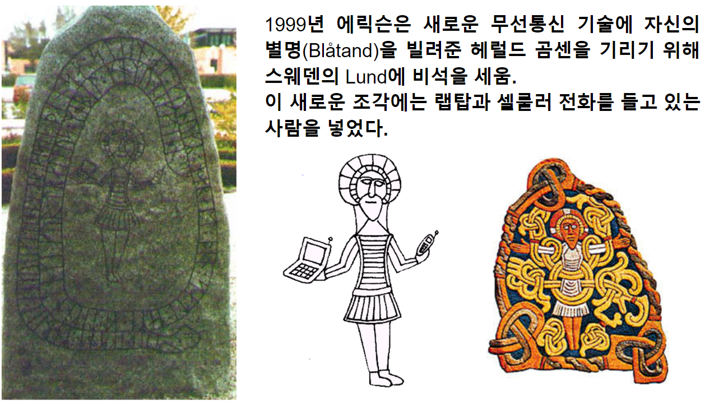

# Network 01

## Ethernet

컴퓨터 [네트워크](https://ds31x.github.io/wiki/network/) 기술의 하나로,  
전세계의 사무실이나 가정에서 일반적으로 사용되는 ***LAN에서 가장 많이 활용되는 기술 규격***.

* [Ethernet이란](https://dsaint31.tistory.com/438)

> ***Network Adaptor 또는 LAN card라고 불리는 device*** 가 바로 Ethernet 통신을 가능하게 해 줌.  
> `Adapter`의 사전적 의미가 ^^두 접점을 연결하는 접합기^^ 로, 네트워크 어댑터는 네트워크에 연결되도록 해주는 접합기라는 뜻임.

---

## Hub, Switch, Router, Gateway

* [Hub, Switch, NAT 장비, Router, Gateway](https://dsaint31.tistory.com/226)

---

## Wi-Fi

Ethernet의 무선 버전.

사실, Wi-Fi라는 이름은 1999년 설립된 Wi-Fi Alliance가 무선 LAN 표준인 IEEE 802.11 제품을 마케팅하기 위해 만든 브랜드명임.

오늘날에는 IEEE 802.11 기반 무선 네트워크 를 의미하며,  "Wireless Fidelity"의 줄임말 처럼 사용되나. 엄밀히는 상업적 브랜드 명칭임.

> 공학 등에서 fidelity는
> 원본(원래 신호)에 대한 재현의 정확도를 의미함.

---

## Bluetooth

USB의 무선버전.

* 적외선 통신보다 먼 거리 통신 가능
* 낮은 전략 소모량과 단거리 라디오 전파 통신(2.5GHz ISM대역) 사용한다.

> 1994년 Ericsson (Mattison/Haartsen)의 “MC-link” 프로젝트로 시작되었으나
> 이름이 10세기 덴마크 왕의 헤럴드 곰센의 별명인 Blåtand(어두운 피부색)을 따서 Bluetooth로 바뀌게 됨.  
> {style="display: block; margin:0 auto; width: 400"}
