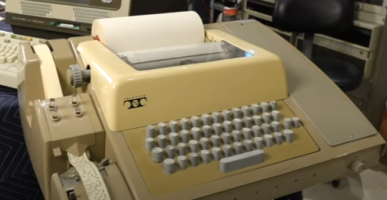

# Keyboard, Monitor and Mouse 

## Keyboard

컴퓨터에 연결되어 텍스트 입력 등을 통해 컴퓨터에게 명령을 내리거나, 데이터를 입력하는 peripherals (주변기기).

^^Teleprinter (전신타자기, `t`ele`ty`pewriter) 스타일의 **키보드**^^ 가 input device로 1960년대부터 등장하여  
**1970년대에 컴퓨터(3세대)에 접속한 거의 모든 terminal에서 입력을 담당함.**

* **Note** : [What the Terminal is](../../OS/console_terminal_shell_kernel.md#terminal)

다음 그림은 초창기 Teletypewriter 형태의 Keyboard 를 보여준다.

{style="display: block; margin:0 auto; width=300px"}
<figcaption>Public Domain, <a href="https://commons.wikimedia.org/w/index.php?curid=225986">Link</a></figcaption>

이를 통해 기존의 batch job형태가 아닌 컴퓨터와의 interaction 이 가능해지기 시작함.  
이는 ***1970년대 초반 time-sharing computer (시분할 시스템)의 등장*** 과도 연관됨 (모니터는 대중화가 키보드에 비해선 좀 더 늦음).

* **Note** : [Time Sharing System](../../OS/operating_system.md#4-2-3-time-sharing)

> 1960년 후반에 RV 자동차(Recreational Vehicle) 크기의 컴퓨터가 등장하면서  
> 회사나 큰 부서에서 컴퓨터를 사용하기 시작함.  
> 이는 컴퓨터에 대한 사용빈도의 증가로 이어졌으며  
> 점점 interactive한 컴퓨터의 사용의 필요성 커졌고,  
> 이를 가능하게하는 input/output device의 개발로 이어지게 됨.

1963년도(2세대말)의 Teletype ASR-33 의 경우, 출력은 모니터가 아닌 ***종이에 인쇄되는 프린터*** 가 담당함. 

{stype="display:block; margin:0 auto;width:300px"}
<figcaption>ASR33의 사진</figcaption>

> `t`ele`ty`pewriter의 약어인 `tty`가 terminal을 의미하는 abbreviation임.

---

---

## Monitor

사실 radar나 TV 등에서 이미 screen은 사용 (1920 년 후반에 텔레비전이 처음 등장했고, 1958년에는 미국 가정에서 텔레비전 시청이 이루어짐)되었지만, 컴퓨터에 적용되기에는 좀더 시간이 걸렸다. 

* tty에서 hard-copy tty에서 screen (or video display unit)이 적용되기 시작한 것은 1960년 후반으로 당시 time-sharing computer의 등장과 밀접한 관련 있음. 
* 초기의 모니터(or screen)을 이용한 tty들은 초기 LSI chip에 의존하는 방식으로 cpu없이 매우 저렴한 가격으로 만들어졌고 이는 보다 비싸고 느리며 시끄러운 hard-copy terminal들을 대체하기 시작함.

모니터는 결국, ***1976년 PC가 등장(4세대)*** 하면서 키보드와 함께 대표적인 input/output device로 자리잡게됨. 

* 1980년대 초반 IBM이 컴퓨터 장비를 위한 CRT 모니터를 내놓고, 1984년에는 16칼라 모니터를 개발함.

---

---

## Mouse 

mouse 는 1980년대 널리 퍼지게 된 입력장치 (당시에는 "볼마우스" 로 오늘날 "광마우스" 와 차이점이 있음). 

* 1980년대 이후 사실상 ***입력장치는 키보드와 마우스 콤비*** 로 이루어짐.

* Quadrature encoder 2개를 이용한 것으로 Stanford Research Institute의 ***Douglas C. Engelbart (1925~2013)*** 가 1968년 발명.

하지만, touch screen의 등장으로 가장 사용빈도가 줄어들고 있음.