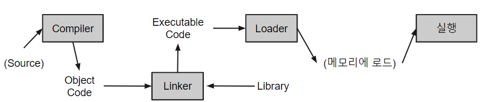

# Compiler Language and Interpreter Language

## Compiler Language

{width="500"}

* Compiler(고급언어를 기계어로 번역)를 사용하는 고급 언어.
* 프로그램 전체를 읽어들여 이를 object code(목적코드)로 바꿈.
* 컴파일러 능력에 따른 최적화 등이 가능.
* 한번 번역한 경우 빠르게 프로그램 전체 실행이 가능하나, 소스 변경시 전체를 다시 컴파일해야함.

대표적인 예로 Fortan, Pascal, Cobol, Ada, C, C++ 등을 들 수 있음.

Java도 compiler language라고 볼 수 있음 (단 compile의 결과물인 byte code가 Java VM에서 동작한다).

## Interpreter Language

* `Interpreter(행, line 단위로 기계어로 번역)`에 의해, line 단위로 컴파일 없이 실행되는 언어.
* 고급 언어의 한 종류.
* Script Language로도 불림.
    * 컴파일 없이 라인 단위 실행이 가능하므로 개발단계에서 적은 양의 수정에 대한 결과를 쉽게 확인 가능.
    * 대화식 프로그래밍이 가능하여 교육용으로 적합.

대표적인 예로 `Python`, PHP, ASP, Java Script, Perl 등을 들 수 있다.

## 비교

| Compiler Language | Interpreter Lanugae |
| :---: | :---: |
|object code생성 | 일반적으로 object code만들지 않음 |
| program단위로 translation이 이루어짐 | statement단위로 translation이 이루어짐 |
| translation에 많은 시간이 필요. | translation 속도가 빠름 |
| execution 속도가 빠름 | execution 속도가 느린 편 |
| executable code로 변환된 이후에는 compiler 필요없음 | 원칙대로는 interpreter가 수행을 위해 필요함|
| 결과물이 OS 종속적인 경우 많음(VM에서 동작하는 Java는 예외)| 결과물(?)이 OS 독립적인 경우가 많음(interpreter만 제공된다면)|

`Object code (목적코드)`
: object module(목적파일)이라고도 불리며, compiler가 source code로부터 컴파일을 수행하여 생성한 code 혹은 파일을 의미함. `machine language`나 intermediate language (register transfer language,RTL)과 같은 binary code이며, linker등을 통해 여러 다른 object code와 연결되어 executable code가 된다.