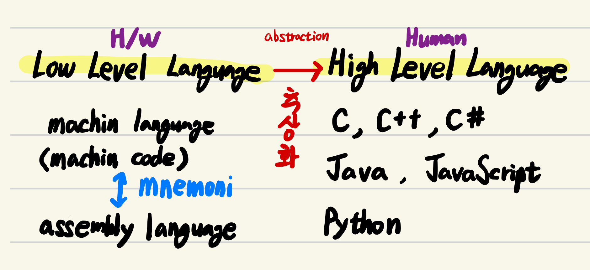

# Low level language vs. High level language

{style="display: block; margin: 0 auto; width=400px"}

## Low-Level Language

* 컴퓨터 H/W 내의 물리적 동작을 이해하고, 각 동작에 대응하는 명령어를 이용하여 프로그래밍.
* H/W에 대한 지식이 매우 많이 요구됨.
* 기계가 이해하기 쉬워서 빠른 동작이 가능하나 사람은 이해가 매우 어려움.

Machine language와 Assembly language가 대표적.

## High-Level Language

* 사람이 이해하기 쉬운 언어.
* Abstraction이라는 개념을 도입하여 H/W에 대한 직접적 이해 없이도 프로그래밍이 가능.
    * 기억장소(memory)의 address 대신 variable(변수)의 이름(or identifier)으로 데이터를 기억장치에 쓰거나 읽을 수 있음 (Symbolic Addressing).
    * 자연어의 단어나 표현을 이용하여 ^^컴퓨터의 동작을 추상화^^
    * 한 표현으로 여러 기계어 코드의 동작을 지시할 수 있음.

오늘날 프로그래밍언어라고 불리는 모든 것들이 다 high level language (고급언어)임.

## Note : Abstraction (추상화)

* 주어진 작업이나 객체를 속성들의 일부분을 가지고 필요한 만큼 묘사할 수 있는 방법을 지원하는 것
* 필수적인 attribute(속성)들만으로 주어진 것을 묘사하므로 나머지 속성들은 은닉 또는 삭제됨

#### 추상화의 범주

* 자료 추상화(Data Abstraction)
    * 문자열, 수, tree와 같은 계산될 자료의 특성을 추상화
    * string, number, tree 등
* 제어 추상화(Algorithm Abstraction)
    * 실행 순서를 제어하는 특성을 추상화 : [`Control Structure`](https://ds31x.blogspot.com/2023/07/basic-control-structures-and-control.html)
        * 제어 추상화의 예 : 반복문, 조건문, 프로시저 호출 등
        * Loop statements, Condition statements, Procedure call
    * 여러 기계어를 모아 이해하기 쉬운 추상 구문으로 만드는 것.
    * 관련된 프로시저 그룹의 추상화(library, package등)

