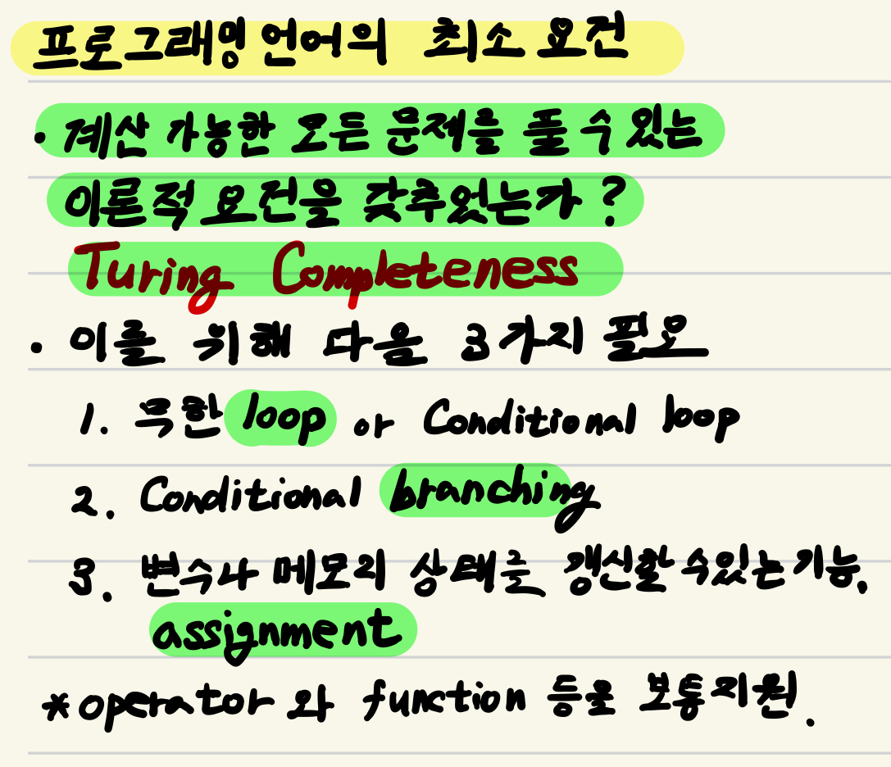

---
tags:
    - programming
    - low-level language
    - high-level language
    - control structure
    - abstraction
---

# Programming Language

어떤 주어진 문제를 해결하기 위해, ^^인간과 컴퓨터 사이에서 의사 소통을 가능케 하는 인공적인 언어^^

* Natural Language(자연어)와 달리 미리 정해진 규칙에 따라 엄격하게 정의됨.
* compiler나 interpreter등을 통해 컴퓨터(기계)가 수행할 수 있는 machine language(기계어, binary code)로 변환되어 수행됨.

> 다른 관점으로 Programming Language를 말한다면,  
> 
> * 메모리에서 데이터를 관리하기 위해 변수를 선언하고 값을 할당하는 등의 기능(`변수선언 및 할당`)과  
> * 데이터의 값에 대한 `조건`문 및 해당 조건문의 결과에 따른 `분기`할 수 있는 기능을 제공하고,  
> * 특정 조건등에 따른 `반복`문 기능 등을 제공해야 한다.  
>
> 때문에 Programming Language를 배울 때,  
>  
> * 변수의 선언과 값을 할당하는 것과 
> * 데이터를 담는 방법, 
> * 조건문, 분기문, 반복문 등을 기본적으로 배우게 됨.
>  
> 여기서 조건문, 분기문, 반복문 등을 ***control structure*** 라고 부름.

{style="display: block; margin: 0 auto; width=600px"}

참고 : [Control structure](https://ds31x.blogspot.com/2023/07/basic-control-structures-and-control.html)

---

---

## 분류

#### 기계친화적인지 인간친화적인지에 따른 분류 : Abstraction 수준에 의한 분류

* Low-level Language
* High-level Language

> 분류 기준 중 가장 명확한 편이나, 개인적으로 기계친화적이라고 느껴지는 언어들도 고급언어라는 게 함정.
>
> Low-level language에서 abstraction 수준이 낮고, High-level language로 갈수록 abstraction 수준이 높음.

***참고:*** 
    Abstraction은 복잡한 대상에 대해 핵심적인 개념이나 기능만을 드러내고, 세부적인 구현이나 수행에 필요하지 않은 요소들을 숨기거나 제거하여 해당 대상을 현재 수행하는 작업에서 쉽게 사용할 수 있도록 하는 것을 의미함.  
    예를 들어, 우리가 자동차를 운전할 때, 핸들을 돌리거나 가속 페달을 밟는 것만으로 방향을 조정하고 속도를 제어할 수 있음. 하지만 내부적으로는 복잡한 엔진 작동, 기계적 연결, 전자 제어 등이 수행됨. 이처럼 사용자에게 복잡한 세부 사항을 숨기고, 필요한 기능만을 제공하는 것이 추상화임.

---

#### 작동방식에 따른 구분.

* Compiler Language 
* Interpreter Language (or Scripting Language)

> interpreter language의 성능향상을 위한 JIT등의 기술들로 인해 구분이 모호해지고 있음. 우선 명시적인 compile과정이 없을 경우, interpreter language라고 생각해도 된다. 
> 최근 scripting language는 general purpose programming language보다 특정 domain에 한정된 DSL(domain-specific language)들을 지칭하는 경우가 많아지면서 특정 task나 환경에 국한된 언어들(대부분이 interpreter방식)을 가르키는 데 쓰인다.

---

#### 프로그래밍 작성 기법 별 구분 (paradigm)

* 명령형 프로그래밍 언어 (Imperative Programming Language)
    * 절차적 프로그래밍 언어 (Procedural Programming Language)
        * 구조적 프로그래밍 언어 (Structured Programming Language) \*\*
    * 객체지향 프로그래밍 언어 (Object Oriented Programming Language) \*\*\*
* 선언적 프로그래밍 언어 (Declarative Programming Language)
    * 논리형 프로그래밍 언어 (Logic Programming Language)
    * 함수형 프로그래밍 언어 (Functional Programming Language) \*\*\*

> 사실 가장 모호한 분류이기도 함: 최근 프로그래밍 언어들은 이들을 다중으로 지원하는 형태임.
