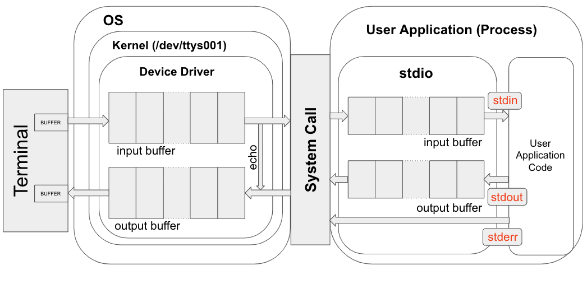

# Command Line Interface (CLI)

이 문서에서는 `CLI`에 대한 소개와 이를 수행해주는 `Terminal`을 살펴보고, 이들을 통한 `I/O가 이루어지는 과정`을 간략히 설명한다.  
Terminal을 통한 CLI방식으로 I/O가 이루어지는 과정을 살펴보면서, I/O `Interrupt`와 `Context switching`에 대한 개념을 소개하며, OS가 제공하는 I/O를 위한 `system call`의 개념과 이를 이용하는 `표준 입출력 라이브러리`에 대한 개념도 간략히 살펴본다. 

## Command Line Interface 란?

> 키보드를 이용하여 terminal을 통해 computer와 대화하는 방식.  

키보드로 command(명령)을 typing하여 입력하고, computer도 terminal 등에 문자를 출력하여 응답하는 방식임. (실제로 컴퓨터 초기에는 typewriter처럼 컴퓨터가 종이에 출력을 해줌.)

## Graphic User Interface 란?

> 마우스를 이용하여 icon등이 그려진 button 등을 눌러서 computer에게 지시를 내리는 방식. 

computer 전문가 들보다는 다른 업무를 위해 computer를 사용하는 이들에게 익숙한 방식. 자동화등의 측면에서는 효율이 떨어진다.

## Terminal

>컴퓨터 초창기에는 HW로 ***컴퓨터에 연결된 물리적인 I/O 장치*** 였으나, 현재는 ***S/W로 사용자에게 CLI를 제공*** 한다. 

사용자의 명령을 기다리는 command prompt를 보여주고 사용자가 명령을 입력하면 그 결과를 문자로 출력하여 반응함.  
Terminal은

* 키보드나 모니터의 장치 드라이버로부터 입력과 출력에 대한 처리를 위해 도움을 받아야 하고, 
* 이는 OS를 통해 이루어짐. 
  

즉, CLI를 채택한 user application들은 Terminal을 통해 입출력이 이루어지고 있으나 실제로는 내부에서 OS의 도움을 받고 있음. 

* Termianl : 사용자와 상호작용.
* OS (including device drivers) : 물리적 I/O 디바이스와 Terminal, User Application을 중재.
* User Application (system call 사용) : CLI 를 OS와 Terminal의 도움을 받아 제공받고, 이를 통해 사용자와 상호작용을 수행.

## I/O Interrupt for CLI based User Application.

> 현대의 OS는 대부분 Time Division Technique을 이용하여 마치 여러 Program이 동시에 실행되는 것처럼 보이는 Time Sharing System이다.  

하지만, 실제로는 한 순간에 하나의 core 당 하나의 program이 동작하는 것이고 core를 사용하는 시간을 나누어 여러 개의 program들이 동시에 동작되도록 보이는 것 뿐이다.  

`process` and `process context`
: 실제 동작하는 program의 명령어들과 데이터는 core의 regiser들에 저장되어 있어야 한다. **한 core에서 동작하는 단위** 를 `process`라고 부르며 이 process가 core에서 재실행되기 위해 필요한 데이터들을 `process context`라고 부른다.  

`context switching`
: 하나의 core에서 여러 process가 시분할(Time Dividing)으로 실행되는 경우, 실행되던 process의 context가 기억장치에 저장(`stack`이 이용됨)이 되고, 실행될 process의 context가 register등에 load되어야 하며, 이런 과정을 `context switching` 이라고 부름.

CLI 를 사용하는 User application이 단일 process로 동작한다고 가정할 때, 이 역시 하나의 core에서 수행되기 위해서는 자신의 context가 cpu의 register들에 load 되어야 한다. 사용자의 키보드로부터의 입력을 대기하는 순간에 core를 사용하고 있는 건 비효율적이므로 ^^OS가 I/O(입출력)을 대기하는 process들은 보통 context switching을 시켜서 sleep상태로 두는^^ 경우가 일반적이다.  
즉, User appliation이 I/O를 수행하기 위해 OS에게 `system call`을 하는 순간, OS는 사용자가 키보드 및 모니터로부터 I/O을 완료하기 전까지 해당 process를 `sleep` 시킨다. (해당 system call이 buffered input을 지원하면서 요구한 경우이고, 사용자가 키보드를 누를 때마다 처리가 이루어지도록 지정도 가능하긴 함.)

I/O가 이루어지고 있는 동안, OS는 해당 User applicatoin을 sleep 시키고, 다른 process를 수행할 수 있다. 이후 I/O가 종료되면 OS는 해당 User appliation을 깨워서 core에서 수행되도록 context switching을 수행한다. 다시 말하면, I/O 종료 event가 발생하면 `interrupt` 에 의해 User appliation은 sleep 상태에서 나와 다시 core에서 수행되는 것으로 생각할 수 있다.  

위의 내용은 매우 간단히 애기한 것으로 실제 동작은 보다 복잡하다. **context switching은 부하가 많이 걸리는 작업** 으로 지나치게 많이 발생할 경우 오히려 효율이 매우 떨어지게 되어 사용자가 컴퓨터가 매우 느리다고 생각할 수 있다. 때문에, 이를 효과적으로 수행하기 위해 OS는 다양한 알고리즘을 사용하며 보다 많은 구성요소들의 도움을 받는다. 

실제로 사용자가 키보드의 키를 누를 때마다, 마우스를 움직일 때마다 event가 발생하는 것이고, 이는 `interrupt`를 발생시켜 OS가 해당 interrupt를 처리하는 ISR을 수행하게 한다. `Interrupt`에 대한 좀더 자세한 내용은 [Interrupt 요약](https://dsaint31.tistory.com/entry/CE-Interrupt-%EC%9A%94%EC%95%BD-Computer-%EA%B8%B0%EC%A4%80)을 참고하라.  

위와 같은 과정을 거치므로 CLI에서도 I/O 동작은 매우 느린 수행에 해당한다. 때문에 I/O를 수행하는 동작을 할 때, 해당 I/O가 확실히 이루어지고 나서 다음 명령어를 실행해야하는 경우라면, 해당 system call에 대한 응답을 대기하면서 해당 process를 멈추고 있는 block mode function으로 I/O를 처리하는게 맞지만, I/O에 상관없이 다음 구문을 수행할 수 있는 경우라면 I/O작업과 process 수행이 병렬로 이루어지도록 non-blocking mode function으로 I/O처리하는 것을 고려해볼 수 있다.

## Buffer 와 Standard I/O Library

### Buffer

위에서 살펴봤듯이 I/O는 매우 느린 작업이며, 어디서 수행되고 있느냐에 따라 속도 차이가 매우 크다. Core에서 I/O 작업을 위한 처리 가능 속도와 사용자와 상호작용 중인 키보드에서의 처리 가능 속도는 매우 큰 차이를 보일 수 밖에 없다. 이처럼 처리 속도 차이가 큰 요소들이 결합할 경우, 해당 속도차로 인한 문제를 줄여주기 위해 buffer가 도입된다.

앞서 살펴본 I/O는 사용자가 Terminal을 통해 User application과 상호작용하는 것이라고 볼 수 있다. 즉, CLI는 키보드와 모니터의 드라이버와 OS, Terminal이 모두 함께 참여하여야 가능하다. 구성 요소들의 처리 속도에 차이가 존재하므로 이들 사이에서 입출력을 원활하게 하기 위해 input buffer와 output buffer가 존재한다. 아래 그림을 보면 각 장치 드라이버 뿐 아니라 User application이 사용하는 system call 라이브러리에도 buffer들이 존재함을 확인할 수 있다. 

> terminal은 단순히 computer가 사용자에게 보내는 텍스트만을 출력하지 않으며, 사용자가 키보드로 입력하고 있는 글자 하나 하나를 echo처리(화면에 그대로 출력해줌)한다. 위 그림에서 buffer들의 연결을 잘 보면 echo를 위한 연결을 확인할 수 있다. 

참고로 S/W적으로 buffer는 FIFO (First in First out)인 Queue 데이터 구조를 취하기(물리적으로는 register와 memory이지만, SW적으로는 `Queue`임: 좀더 엄밀하게는 circular queue.)때문에 아래 그림에서도 FIFO 방식으로 그려졌다.

### Standard I/O Library and Handle

Standard I/O Library (표준입출력 라이브러리)는 다양한 User application들이 CLI를 쉽게 구현할 수 있도록 표준화된 라이브러리이며 C 언어의 `stdio`, Python의 `sys.stdin`와 `sys.stdout`등을 예로 들 수 있다. 사실 I/O는 terminal 이외에도 file에 읽고 쓰는 경우나 프린터로 출력 등을 포함하며, 많은 경우 file I/O로 이해하는게 보다 쉽다. 

이는 UNIX 의 경우, 많은 device resource를 file로 추상화하여 마치 file을 이용하는 것처럼 I/O device들을 사용하기 때문으로, UNIX기반의 많은 OS에서 네트워크 통신을 위한 socket, serial communication을 위한 port 등에 I/O를 수행하는 방법이 이들을 file로 추상화해서 이루어진다.

User application의 관점에서 I/O 장치 (file I/O의 경우 storage)와 같은 OS가 device driver를 통해 관리하는 resource들에 접근하기 위한 수단은 `system call` 이다. User application의 process는 이들 system call을 통해 얻는 `handle` 또는 `해당 리소스에 대한 descriptor (특히 file descriptor)`등을 이용하여 해당 리소스를 사용할 수 있다(정확히는 원하는 동작을 해달라고 OS에게 제어 요청을 한다). 어떤 처리를 담당하는 객체(Object)를 흔히 `handle`이라고 칭한다.

Device를 통한 I/O를 수행하는 프로그래밍 코드는 `handle`을 얻어서 처리한 이후에는 다시 OS에 반환을 명시적으로 해주는 코드를 포함하는 방식이 일반적으로 사용된다. 앞서 설명한대로 OS는 file I/O와 같은 방식으로 다양한 device를 통한 I/O를 다룰 수 있게 system call을 제공한다. 그리고 다양한 프로그래밍 언어는 이 system call들을 사용하여 표준입출력을 할 수 있는 표준 입출력라이브러리를 제공한다. 표준 입출력 라이브러리는 system call 위에서 동작하기 때문에, 이를 고수준 입출력이라고 부르며, system call을 직접 사용하는 방식을 저수준 입출력이라고 나누어 부르기도 한다. 보통 `file`을 사용한 I/O를 배우고 나면 다른 I/O device들을 다루는 방법도 거의 유사하기 때문에 쉽게 확장가능하다. 

CLI를 위해 Linux에서는 User application에서 terminal과 데이터를 주고받기 위해 우선, 2개의 file handle을 열게 된다 (1개는 input으로 1개는 output으로). C언어의 경우 표준입출력라이브러리에서 이 두 file handle에 대한 file pointer를 제공한다. 즉, `stdio` 표준입출력라이브러리의 `stdin`과 `stdout`을 사용하여 terminal과 입출력을 수행하게 된다. 사실 `stderr`로 표준 에러를 출력하는 file pointer가 하나 더 있으며, User application에서 에러 관련 출력을 하는 경우에는 `stderr`를 사용한다 (차이는 `stderr`에서 user application이 제공하는 buffer가 없다는 점으로 user application이 sleep 등으로 중간에 서 있는 경우 `stdout`은 출력이 되지 않으나 `stderr`는 출력가능함).  

### Handle

이들 `handle`은 ^^OS에서 표준 입출력 장치를 file처럼 추상화한 file descriptor를 기반으로 버퍼 등의 기능을 추가한 것^^ 으로, 프로그래머는 이들 handle을 사용하여 I/O를 처리하지만, 결국에는 OS의 해당하는 system call을 통해 I/O가 이루어지게 된다.
