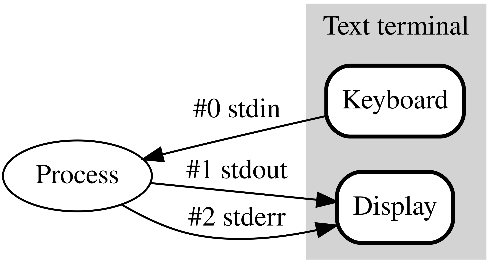
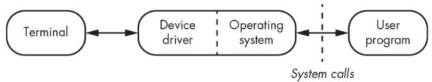

# Command Line Interface (CLI)

이 문서에서는 `CLI`에 대한 소개와 이를 수행해주는 `Terminal`을 살펴본다. 

그리고 이들을 통한 `I/O가 이루어지는 과정`을 간략히 설명한다.  
Terminal을 통한 CLI방식으로 I/O가 이루어지는 과정을 살펴보면서, I/O `Interrupt`와 `Context switching`에 대한 개념을 소개하며, OS가 제공하는 I/O를 위한 `system call`의 개념과 이를 이용하는 `표준 입출력 라이브러리`에 대한 개념도 간략히 살펴본다. 

> `CLI`에 대한 간단한 개념만 필요한 경우엔 `CLI`와 `Terminal` 까지만 읽어도 좋다.

---

---

## 1. Command Line Interface (CLI) 란?

> 키보드를 이용하여 terminal을 통해 computer와 대화하는 방식.  

흔히 interactive 방식과 scripting 방식 두가지로 동작함.

### 1-1. Interactive 방식 (or 대화식 모드)

키보드로 command(명령)을 typing하여 입력하고, computer도 terminal 등에 문자를 출력하여 응답하는 Interactive 방식임.  
(실제로 컴퓨터 초기에는 typewriter처럼 컴퓨터가 종이에 출력을 해줌.)

> REPL (Run-Evaluation-Print, Loop의 약어) 모드라고도 불림.

### 1-2. Scripting 방식 (or Shell Scripting방식)

OS의 shell이 해석하여 실행할 수 있는 instructions을 특수한 종류의 파일(shell script 파일)로 실행되는 순서대로 기재해놓고,  
해당 파일을 실행하여 일련의 instructions들을 한번에 실행하는 방식.

> python에서 `.py`파일로 만든 소스 파일을 수행하는 것과 유사하게, `.sh` (or `.zsh`) 파일들을 shell 이 수행하는데 이를 scripting 방식이라고 함.

---

## 3. Graphic User Interface 란?

> 마우스를 이용하여 icon등이 그려진 button 등을 눌러서 computer에게 지시를 내리는 방식. 

computer 전문가 들보다는 다른 업무(웹툰 그리기, 문서 작성)들을 위해 computer를 사용하는 이들에게 익숙한 방식.  
자동화 등의 측면에서는 효율이 떨어진다.

---

---

## 4. Terminal

> 컴퓨터 초창기에는 H/W로 ***컴퓨터에 연결된 물리적인 I/O 장치 (`Console`, `tty` 이라고도 불림`)*** 였으나,  
> 현재는 ***S/W로 사용자에게 CLI를 제공*** 한다. 

사용자의 명령을 기다리는 command prompt를 보여주고  
사용자가 명령을 입력하면 그 결과를 문자로 출력하여 반응함.

> ***오늘날 `Terminal` 은 `CLI`를 제공하는 S/W*** 이기 때문에,  `Terminal emulator`, `soft terminal` 과 같이 불리기도 함. 

`Terminal`은

* 키보드나 모니터의 장치 드라이버로부터  
* ***입력과 출력에 대한 처리*** 를 위해 도움을 받는데, 
* 이는 OS를 통해 이루어짐. 

<figure markdown>
{width="400"}
</figure markdown>  

즉, `CLI`를 채택한 user application들은 ***`Terminal`을 통해 입출력*** 이 이루어지고 있으나 실제로는 내부에서 `OS`의 도움을 받고 있음. 

* Terminal : 사용자와 상호작용을 담당.
* OS (including device drivers) : 물리적 I/O 디바이스와 Terminal, User Application을 중재.
* User Application (system call 사용) : User CLI application은 `CLI` 를 **OS와 Terminal의 도움을 받아 제공** 하고, 해당 `CLI`를 통해 사용자와 상호작용을 수행.

오늘날 많이 이용되는 `Terminal`들은 다음과 같음.

* `xterm`
* `rxvt`
* `Gnome Terminal`
* `iterm2`

물리적인 Terminal을 `Console`이라고도 부르는데, 보다 자세한 건 다음을 참고하라.

**참고** : [Console, Terminal and Shell](../../OS/console_terminal_shell_kernel.md)

> 오늘날 Terminal은 SW이지만, OS의 관점에서는 일종의 device로 보고 처리함.  
> 물리적으로 떨어진 단말기나 S/W로 구현된 Terminal이나 OS에서는 동일한 방식으로 처리한다고 볼 수 있음.
>
> <figure markdown>{width="400"}</figure markdown>

---

> 다음은 조금 어려운 내용이므로 `CLI`와 `GUI`, `Terminal`의 개념만 필요한 경우엔 아래는 생략해도 좋다.

---

---

## 5. I/O Interrupt for CLI based User Application.

> 현대의 OS는 대부분 Time Division Technique을 이용하여 마치 여러 Program이 동시에 실행되는 것처럼 보이는 Time Sharing System이다.  

하지만, 실제로는 한 순간에 하나의 core 당 하나의 program이 동작하는 것이고 core를 사용하는 시간을 나누어 여러 개의 program들이 동시에 동작되도록 보이는 것 뿐이다.  

`process` and `process context`
: 실제 동작하는 program의 명령어들과 데이터는 core의 register들에 저장되어 있어야 한다.  
**한 core에서 동작하는 단위** 를 `process`라고 부르며 이 process가 core에서 재실행되기 위해 필요한 데이터들을 `process context`라고 부른다.  

`context switching`
: 하나의 core에서 여러 process가 시분할(Time Dividing)으로 실행되는 경우, 실행되던 process의 context가 기억장치에 저장(`stack`이 이용됨)이 되고, 실행될 process의 context가 register등에 load되어야 하며, 이런 과정을 `context switching` 이라고 부름.

참고: [Process, Process Context, Thread, Context Switching에 대한 보다 자세한 내용은 이 URL을 참고](https://ds31x.tistory.com/152)

CLI 를 사용하는 User application이 단일 process로 동작한다고 가정할 때, 
이 역시 하나의 core에서 수행되기 위해서는 자신의 context가 cpu의 register들에 load 되어야 한다. 
사용자의 키보드로부터의 입력을 대기하는 순간에 core를 사용하고 있는 건 비효율적이므로 
^^OS가 I/O(입출력)을 대기하는 process들은 보통 context switching을 시켜서 sleep상태로 두는^^ 경우가 일반적이다.  

즉, User application이 I/O를 수행하기 위해 OS에게 `system call`을 하는 순간, 
OS는 사용자가 키보드 및 모니터로부터 I/O을 완료하기 전까지 해당 process를 `sleep` 시킨다. 
(이는 system call이 `buffered input` 을 지원하면서 요구한 경우임)

1. I/O가 이루어지고 있는 동안, 
    * OS는 해당 User application의 process를 sleep 시키고, 
    * 다른 process를 수행할 수 있다. 
2. 이후 I/O가 종료되면 
    *  OS는 해당 User application의 process를 깨워서 
    *  core에서 수행되도록 context switching을 수행. 

다시 말하면, I/O 종료 event가 발생하면 `interrupt` 에 의해 User application은 sleep 상태에서 나와 다시 core에서 수행되는 것으로 생각할 수 있다.  

위의 내용은 매우 간단히 애기한 것으로 실제 동작은 보다 복잡하다.

*  **context switching은 부하가 많이 걸리는 작업** 으로 
*  지나치게 많이 발생할 경우 오히려 효율이 매우 떨어지게 되어 
*  사용자가 컴퓨터가 매우 느리다고 생각할 수 있다.
*  때문에, 이를 효과적으로 수행하기 위해 OS는 다양한 알고리즘을 사용하며 보다 많은 구성요소들의 도움을 받는다. 

### 5-1. 사용자의 입력 처리

* 사용자가 키보드의 키를 누르거나 마우스를 움직일 때마다 event가 발생하는 것이고, 
* 이는 `interrupt`를 발생시켜 
* OS가 해당 interrupt를 처리하는 ISR (Interrupt Service Routine)을 수행하게 한다. 

> `Interrupt`에 대한 좀더 자세한 내용은 [Interrupt 요약](https://dsaint31.tistory.com/447)을 참고하라.  

참고로, 

* 키보드 키를 누를 때마다 interrupt가 발생하지는 않으며, 
* input buffer에 써지고 enter키가 눌러질 때 interrupt가 발생한다: ***input buffer의 필요성***.

---

### 5-2. Blocking Mode Function vs. Non-Blocking Mode Function

CLI에서도 I/O 동작은 매우 느린 수행에 해당한다.  

때문에 I/O를 수행하는 동작을 할 때, 해당 I/O가 확실히 이루어지고 나서 다음 명령어를 실행해야하는 경우라면, 해당 system call에 대한 응답을 대기하면서 해당 process를 멈추고 있는 ***block mode function*** 으로 I/O를 처리하는게 맞지만, 

I/O에 상관없이 다음 구문을 수행할 수 있는 경우라면  

I/O작업과 process 수행이 병렬로 이루어지도록 ***non-blocking mode function*** 으로 I/O처리하는 것을 고려해볼 수 있다.

---

---

## 6. Buffer 와 Standard I/O Library

### 6-1. Buffer

위에서 살펴봤듯이 I/O는 매우 느린 작업이며, 어디서 수행되고 있느냐에 따라 속도 차이가 매우 크다.  
Core 에서 I/O 작업을 위한 처리 가능 속도와 사용자와 상호작용 중인 키보드에서의 처리 가능 속도는 매우 큰 차이를 보일 수 밖에 없다.  
이처럼 처리 속도 차이가 큰 요소들이 결합할 경우, ***해당 속도차로 인한 문제를 줄여주기 위해 buffer가 도입*** 된다.

CLI S/W 에서 사용자와의 I/O는 사용자가 Terminal을 통해 User application과 상호작용하는 것이라고도 볼 수 있다.  

* 즉, CLI는 "키보드와 모니터의 드라이버들"과 "운영체제(OS)", "Terminal" 이 모두 함께 참여하여야 가능하다. 
* 이들 구성 요소들의 처리 속도에 차이가 존재하므로 
* 이들 사이에서 I/O(입출력)을 원활하게 하기 위해 `input buffer`와 `output buffer`가 존재함: Kernel Buffering. 
* 아래 그림을 보면 각 장치 드라이버 뿐 아니라 User application이 사용하는 system call 라이브러리에도 buffer들이 존재함을 확인할 수 있다.
    * 이들은 지나치게 빈번한 system call을 막아줌.
    * input buffer로 terminal에 해당하는 device driver의 buffer의 문자를 한 번의 system call로 가져올 수 있는 최대량을 가져옴.
    * output buffer도 다 차고 나서 device driver로 보내던지, 아니면 newline 과 같은 특수한 문자가 들어올면 device driver의 버퍼로 보내는 방식으로 buffering을 수행.
    * High Lever I/O 는 buffered I/O를 수행함.   

> 위 설명과 그림에서는 키보드의 드라이버 처럼 애기했지만, 실제로는 OS가 Terminal을 Device로 보고 이에 대한 Device Driver가 존재한다.  
> 즉, 위 그림에서 Device Driver는 Terminal에 대한 Driver임.

Low Level I/O의 경우, Kernel Level에서의 buffering을 사용함.  

* Kernel Level Buffering은 I/O에서의 일반적인 버퍼링이라고 불리지 않음을 주의할 것.
* ***일반적인 buffering은 User Level Buffering*** 을 가르키기 때문에  
* High Level I/O가 보통 버퍼링을 제공한다고 할 때의 buffer는 User Level Buffering임.

> terminal은 
> 
> * 단순히 computer가 사용자에게 보내는 텍스트만을 출력하지 않으며, 
> * 사용자가 키보드로 입력하고 있는 글자 하나 하나를 echo처리(화면에 그대로 출력해줌)한다. 
> 
> 위 그림에서 buffer들의 연결을 잘 보면 ***`echo`를 위한 연결*** 을 확인할 수 있다. 

참고로 buffer는 

* S/W적으로 FIFO (First in First out)인 `Queue` 로 구현됨 (엄밀하게 애기하면 Circular Queue).
* 물리적으로는 register와 memory 임.

---

### 6-2. Standard I/O Library and Handle

Standard I/O Library (표준입출력 라이브러리)는 

* High Level I/O 로서
* 다양한 User application들이 CLI를 쉽게 구현할 수 있도록 표준화된 라이브러리
* C 언어의 `stdio`, Python의 `sys.stdin`와 `sys.stdout`등을 예로 들 수 있음. 

사실 I/O는 

* terminal 이외에도 
* file에 읽고 쓰는 경우나 
* 프린터 (특정 Device)로 입력/출력 등을 포함하며, 
* 프로그래머의 입장에선 file I/O와 같은 Stream 기반의 I/O로 이해하면 된다. 

이는 UNIX 의 경우, 

* 많은 device resource를 file로 추상화하고 있기 때문에 
* 마치 file을 이용하는 것처럼 I/O device들을 사용함.

때문에 UNIX기반의 많은 OS에서 

* 네트워크 통신을 위한 socket, 
* serial communication을 위한 port 등에 I/O를 수행하는 방법이 
* 모두 file에서의 stream기반의 I/O로 추상화해서 이루어진다.

User application의 관점에서 

* I/O 장치 (file I/O의 경우 storage)와 같은 resource들에 접근하기 위한 low level 수단은 `system call` 이다. 
  * 이들 resource는 OS가 device driver를 통해 관리 및 제어함. 
* User application의 process는 이들 system call을 통해 얻어진 `해당 리소스에 대한 descriptor (특히 file descriptor)`를 이용하여 해당 리소스를 사용할 수 있음
    * Standard I/O Library와 같은 High Level I/O에서는 file descriptor를 내부적으로 가지고 있는 객체 `handle` 을 사용함.
    * 프로그래밍에서 어떤 처리를 담당하는 객체(Object)를 흔히 `handle`이라고 칭함.

Device를 통한 I/O를 수행하는 프로그래밍 코드는 

* `handle`을 얻는 open과
* 이 `handle`을 이용한 처리 부분 (읽고 쓰기 부분)과,
* `handle`을 다시 OS에 반환하는 close로 구성됨.

OS는 

* file I/O와 같은 방식으로 다양한 device를 통한 I/O를 다룰 수 있게해주는 ***system call*** 을 제공

그리고 다양한 프로그래밍 언어는 

* 이 system call들을 사용하여 표준입출력을 할 수 있는 standard I/O library를 제공. 
* 표준 입출력 라이브러리는 system call 위에서 동작하기 때문에, 이를 고수준 입출력이라고 부름. 
* System call을 직접 사용하는 방식을 저수준 입출력이라고 불림.

보통 `file`을 사용한 I/O를 배우고 나면 다른 I/O device들을 다루는 방법도 거의 유사하기 때문에 쉽게 확장가능하다. 

[Standard I/O Library에 대한 자세한 내용은 이 URL을 참고](./ce10_2_04_stdio.md)

 
---

### 6-3. Handle

`handle`은 

* ^^OS에서 표준 입출력 장치를 file처럼 추상화한 file descriptor를 기반으로 버퍼 등의 편의 기능을 추가한 것^^ 으로,  
* 프로그래머는 이들 handle을 사용하여 I/O를 처리 
* 내부적으로는 결국 OS의 해당하는 system call을 통해 I/O가 이루어짐.
