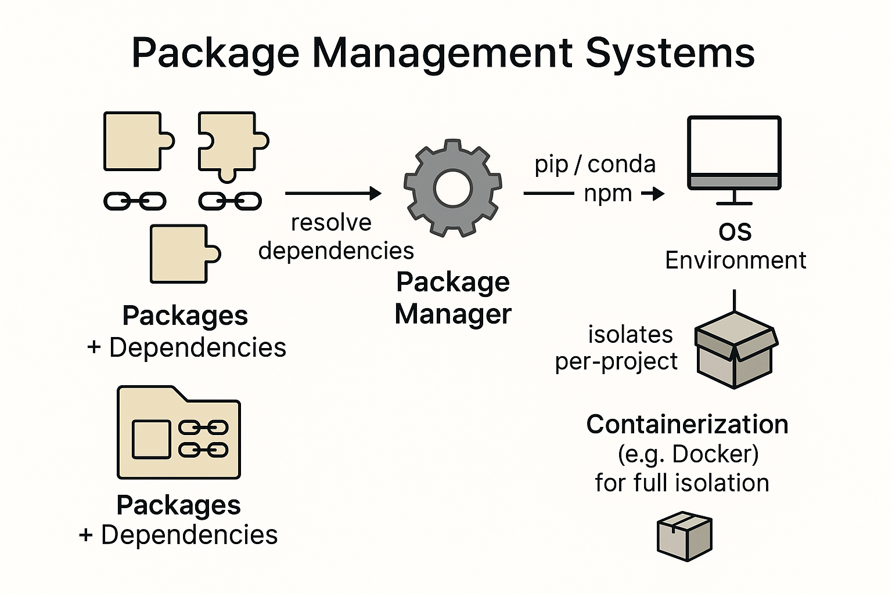

# Package Management : `apt`, `yum`, `brew` 등등

{style="display: block; margin: 0 auto; width:400px"}

SW들의 경우 다양한 기존 라이브러리에 의존할 수 밖에 없는데, 해당 라이브러리들도 계속해서 버전이 올라가기 때문에 이들 의존성을 관리해주는 건 쉬운 문제가 아님.

많은 SW가 code 자체로 배포되지 않고 많은 경우, 이미 컴파일되어 실행가능한 바이너리 형태로 배포가 되는데, 이 때 의존 라이브러리를 포함해서 빌드되지 않는 경우가 대다수임.

특정 장비에서 여러 SW가 동작해야하는데, 이들 SW가 의존하는 라이브러리가 다양하며, 심지어 같은 라이브러리를 의존해도 버전차이가 있을 수도 있기 때문에 모든 SW가 제대로 동작하도록 각각의 의존 라이브러리를 고려하여 관리하는 건 쉬운 일이 아님.

OS 차원에서 특정 SW를 다운로드 받아 설치할 때, 해당 SW의 의존성을 확인하고 관련된 라이브러리들도 설치하도록 도와주는 SW가 바로 Package Management System 임.

일반적으로 Package Management System (or SW)는 sw를 의존관계에 따라 Package로 묶어서 관리함으로서 SW와 의존관계가 있는 라이브러리들을 같이 설치해주고 관리한다.

문제는 Linux 배포판 마다, 그리고 OS마다 이같은 package management SW가 다르며 이들 간에는 호환되지 않는다. 더욱이 여러 프로그램이 서로 다른 버전을 요구하는 충돌도 자주 발생하는 문제다.

`apt`, `yum`, `rpm`, `brew` 등이 유명한 package management sw 이며, 이들  중 하나 정도는 익숙하게 사용할 수 있는 게 좋다.

programming 에서도 이같은 ***의존성 library 충돌*** 은 항상 귀찮은 문제이며 때문에 library들을 관리하며, 서로 다른 library로 구성된 개발환경을 독립적으로 분리해서 운영할 수 있게 해주는 tool들이 제공된다. Python의 경우, 이같은 의존성 라이브러리 들을 해결하기 위해서 `pip`, `conda`, `venv` 등의 툴이 제공되며, javascript의 경우 `npm` 등이 있다.

최근에는 docker와 같은 container를 이용하는 방법도 선호되고 있다. 이 방식은 Host OS에서 해당 SW를 직접 수행하기 보다는, container라는 분리된 공간에서 해당 SW가 필요한 모든 라이러리들을 설치하고 해당 공간에서 SW를 수행시킨다. 가상머신과 비슷하지만, application수준에서의 가상화(Host OS에서는 process로 간주되며 kernel을 공유함.)이기 때문에 훨씬 가볍고 큰 성능 손실 없으면서도 라이브러리 충돌없이 SW를 실행시킬 수 있다. 

> 하지만 이 방법은 같은 공유 라이브러리를 사용해도 각 container마다 따로 메모리에 할당하기 때문에 매우 많은 메모리를 요구한다. 

최근들어 cloud computing이 보편화되면서 ^^하나의 물리적인 장비에서 여러 container를 띄우는 형태의 응용^^ 이 일반화되고 있기 때문에 수년 내에 대부분의 SW엔지니어들은 가상화 계층에서의 장비에만 접근하여 개발등을 수행하는 시대가 될 것으로 보인다.

---

## 더 읽어보면 좋은 자료들

* [conda란?](https://ds31x.blogspot.com/2023/07/env-conda-anaconda-and-miniconda.html)
* [apt와 dpkg](https://dsaint31.tistory.com/454)
* [Summary: Package Manager](https://ds31x.tistory.com/335)