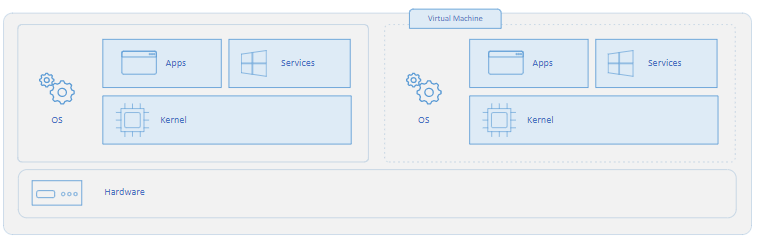

# Container and Virtual Machine

## Container

`Container`는 On-premise 나 cloud 등의 다양한 환경에서 linux 및 windows application을 패키징하고 실행하기 위한 기술로 ***docker*** 가 대표적인 예임.

`Container`는 application을 보다 쉽게 개발, 배포 및 관리할 수 있도록, application의 실행 환경을 ***격리된 경량의 환경(lightweight isolated environment)*** 을 제공함.

  - application이 요구하는 libraries와 실행 파일을 하나의 패키지로 묶어 제공함.
  - Container는 실행파일이 동작하는데 필요한 별도의 os 구성요소 (단, kernel은 제외)도 포함하여 패키징이 가능함.
      - Conainer는 별도의 Guest OS 전체를 포함하는 것은 절대로 아님.
      - Host OS와 Container는 kernel을 공유함: 이는 Container의 중요 특성으로  VM에 비해 Container가 훨씬 가볍고 빠르게 실행가능한 이유가 됨.
      - 단, application을 실행하는 데 필요한 Guest OS의 사용자 공간(User Space)의 구성요소(예:  Libraries, Runtime 등)는 application과 같이 패키징하여 제공될 수 있음.   	
  - 특정 application이 동작하는데 필요한 OS까지 포함(=guest os의 user space 구성요소)되기 때문에 Host OS에선, `container`를 수행시킬 수 있는 container runtime (예: Docker, containerd 등)에 있으면 됨.

---

> 즉, `Container`는 
> 
> * OS의 일부 기능들과 library들 (Kernel을 제외한)을 
> * Host OS의 User Space(사용자 모드)와 격리된 환경에서 
> * target application이 수행되도록 제공해준다.

`Container`에서의 파일 변경이나 설정 변경은 오직 `Container`가 제공하는 격리된 환경에만 영향을 준다

* Host OS와 일부 storage를 공유하는 경우도 있는데, 이 경우 해당 storage에서의 변경사항은 Host OS에 영향을 줄 수 있음.

`Container`는 ^^host OS와 공유하는 kernel^^ 을 제외한 격리된 실행환경을 제공하기 위해 image로 패키징 된다. 

* 해당 image에는 ^^공유하지 않는 OS의 User Space의 서비스, 시스템파일^^ 및 ^^가상 storage^^, 그리고 ^^target application^^ 이 포함됨. (다시 강조하지만 Kernel은 Host OS와 공유).
* Host OS 입장에서는 이 image는 일종의 파일로 보이고, 수행될 때에는 독립된 process처럼 보이게 됨.

> ***`Virtual Machine`의 경우, 자체 kernel을 포함한 완전한 OS를 실행*** (kernel의 공유가 없음. container와의 차이점)시키기 때문에  
> 
> * 해당 OS(=Guest OS)가 인식할 Virtual Hardware까지 함께 제공함.
> * 이는 보안적인 측면에서 보다 강력한 격리를 제공하나 Container보다 훨씬 무거워지고 실행속도도 느림. 
> * `Container`에 비해 더 많은 시스템 리소스가 필요.

{style="display: block; margin: 0 auto; width=500px"}

> Cloud Computing의 경우, Physical system 위에 Virtual Machine들이 존재하고, 해당 VM들 위에서 Container들이 동작하는 방식이 전통적인 방식임. 
> EC2 등의 서비스는 사용자가 VM을 임대받아 그 위에 conainer를 실행하는 방식으로 생각할 수 있음.  
> 하지만, 최근 들어 VM위가 아닌 Physical system 의  OS에서 Container Runtime이 직접 실행되는 베어메탈 컨테이너, 서비리스 컨테이너 서비스도 확장되고 있으며, 점점 Container Orchestrator (Kubernetes 등)을 사용하는 추세로 발전하고 있음.

---

## Virtual Machine (VM)

> Virtual Machine이 동작하는 Host System을 ***`Hypervisor` (엄밀하게는 virtual machine을 생성하는 SW로, host system에서 동작함)*** 라고 칭하기도 함.

* VM은 Host System의 OS와 완전히 격리(kernel마저 별도)되어 동작함. 
* VM 내에서는 완전한 OS가 수행되므로 VM 내에서 동작하는 OS가 기대하는 가상의 하드웨어들도 제공되어야 함.

HW의 발전으로 가능해진 것으로 마치 여러 applications가 시분할 기술을 통해 단일 OS에서 동시에 실행되는 것처럼 느껴지는 concurrency가 가능해진 것처럼, 여러 OS를 단일 물리적 시스템에서 시분할로 실행하는 방법이 Virtual machine임.

> A hypervisor is a piece of software used to create virtual machines. A virtual machine is an emulation of a computer. Virtual machines are used to create multiple computing environments on a single piece of hardware.

### Virtual Machine과 Interpreter

일반 애플리케이션과 달리, 운영체제(OS) 는

* 하드웨어(CPU)가 제공하는 Instruction Set(명령 집합) 위에서 동작하며,
* CPU, 메모리, I/O 장치 등 하드웨어와 직접 상호작용함.

여기서 중요한 점은 Instruction Set(ISA) 은 OS가 제공하는 것이 아니라 하드웨어(CPU)가 제공하는 것임.

* CPU는 ISA를 통해 실행 가능한 명령어(예: x86, ARM, RISC-V 등)를 정의하고, 이를 해석·실행할 수 있는 회로를 내장함.
* OS 커널은 이 ISA를 이용해 프로세스 관리, 메모리 관리, 파일 시스템 제어 등 하드웨어 자원을 관리함.

따라서 Virtualization은 다음과 같은 구조가 필요함:

* 물리적 시스템의 하드웨어에서 동작하는 Host OS
* VM 내부에서 실행되는 Guest OS
* Guest OS가 실행하는 명령(ISA 기반 요청)을 Host OS와 실제 하드웨어에서 처리할 수 있도록 변환·중개하는 계층

이 중간자 역할을 수행하는 것이 바로 Hypervisor 기반의 Virtual Machine이며, 이런 변환 과정을 수행한다는 점에서 **Interpreter(해석기)**와 유사하게 볼 수 있음.

즉, “OS는 반드시 물리적 시스템에 설치된다”는 기존 개념에서 벗어나,
OS가 Virtual Machine 위에서도 실행될 수 있다는 점에서 Virtual Machine이라는 이름이 붙었다고 이해하면 됨.

> 최근의 virtual machine은 개념이 확장하여, java의 바이트 코드가 동작하는 virtual machine, javascript의 바이트 코드가 동작하는 virtual machine과 같은 CPU의 ISA를 모사하는 것이 아닌 고유의 추상화된 ISA(~바이트코드의 명령어집합)를 지원하는 경우도 있음. 이는 보다 S/W적 성격의 VM임.  
>  
> * [SW로서의 Virtual Machine에 대한 보다 자세한 내용](https://ds31x.tistory.com/244)

**대표적인 Virtual Machine 소프트웨어**

* Microsoft: Hyper-V
* Oracle: VirtualBox
* VMware: VMware Workstation / ESXi

**활용 및 한계**

* 연산 집약적 작업을 수행할 경우 VM은 성능 오버헤드가 크므로, High-end PC에서도 한계가 있을 수 있음.
* 그러나 간단한 오피스 작업이나 특정 웹 애플리케이션 실행 정도는 충분히 가능함.
* 특히, 관공서나 특정 기관에서 사용하는 구형 OS나 특정 브라우저 환경이 필요한 경우, 실제 장비에 구식 OS를 설치하는 대신 VM을 활용하면 훨씬 안전하고 효율적임.

**가장 유용한 활용처**

VM이 가장 큰 가치를 발휘하는 곳은 클라우드 환경의 데이터 센터임.

* 데이터 센터는 VM을 이용하여 하나의 물리 서버 위에 다수의 OS 환경을 동시에 실행·관리할 수 있음.
* 이는 자원의 활용도를 높이고, 다양한 고객 환경을 분리해 제공하는 클라우드 서비스의 기반이 됨.

# References

* [Container vs. Docker](https://hazel-developer.tistory.com/m/242)