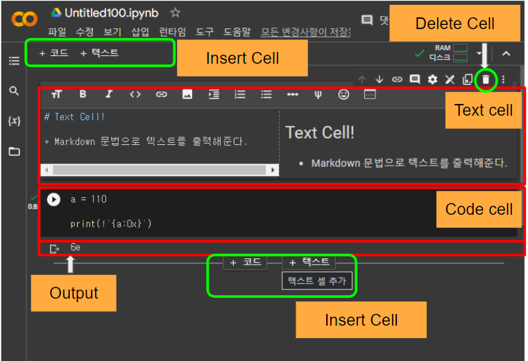
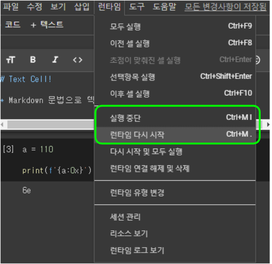
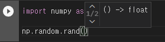
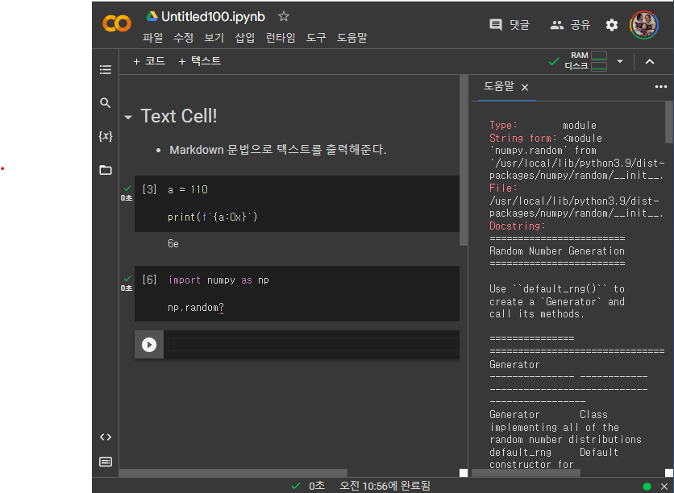

# Colab의 구성

Colab은 구글이 hosting하는 ipynb 파일 실행서버라고도 볼 수 있음. 즉, ipynb파일의 기본 단위인 Cell들로 구성된다.

- 화면 좌상단 버튼 또는 각 셀 하단에 마우스를 이동시켜 셀 추가 가능
- 셀 선택(마우스) 후 ***cell 우상단 삭제버튼*** 으로 셀 삭제 가능

> 화면 좌상단 버튼 또는 각 cell 하단에 마우스를 이동시켜 셀 추가 가능

{width="500"}

- Cells: cell은  `text cell`과 `code cell`로 구성되며 `code cell`의 경우 수행결과를 나타내는 `output`도 가짐.

    - text cell
        - markdown 문법으로 특정 텍스트를 입력하여 보여지게 하는 cell
            - 일종의 multi-line comment라고 볼 수 잇음
        - LaTeX 문법를 사용하여 text cell에 다양한 수식을 추가할 수도 있음.  
            - ex)$\sqrt{3x-1}+(1+x)^2$
            - MathJax를 통해 수식에 랜더링됨.  
        - 자동으로 목차(index)가 생성됨.

    - code cell
        - 일반적인 파이썬 코딩 방식과 동일
        - 각 code cell 은 ^^한번에 실행할 단위^^ 를 뜻함
        - 실행 (`Ctrl + Enter`) 이후에도 ^^메모리는 유지되어 다른 셀 실행 시 영향^^ 을 줌 
            - `런타임 다시 시작` 시 초기화
        - `!`로 시작하여 `ls`, `rm` 등의 system 명령어를 사용할 수 있음.
            - `cd` 명령어의 경우, cwd를 바꾸기 위해서는 magic command로 입력해야함. `%cd /your/desired/path` 형태 사용.

## Runtime

colab은 Jupyter Notebook 기반으로 동작한다. iteractive로 동작을 기본으로 가정하고 있으며, 지나치게 장기간 실행되는 python processes의 경우 중단시키는 기능을 제공한다.

* `Runtime` 밑의 `interrupt` 를 실행(`ctrl+m i`)하여 현재 수행 중인 process를 실행 중지시킴.
* `런타임 다시 시작` 등을 통한 현재 session의 메모리 상태를 초기화하고 다시 시작시키는 등의 기능을 지원함.

{width="400"}

## API 참고 기능 제공

colab은 python 객체 또는 함수의 속성을 알려주는 기능 제공 (자동 완성 으로도 알려짐).

1. `np.random.` 입력하는 경우 자동완성을 위한 목록 표시.
    - `np.random`의 모듈 내 사용가능한 attribute들의 목록 표시
    - 해당하는 attribute로 이동후 `tab` 키를 누르면 자동완성.
2. `np.random.rand(` 입력하면 
    - pop-up 으로 `rand`함수의 API문서가 뜸.(아래 그림 참고)
    - 화살표 키로 선택가능.
3. `np.random ?` 입력하고 `shift+enter` 키를 누르면
    - 사이드에 관련 API가 뜸.

{width="300"}
{width="500"}

