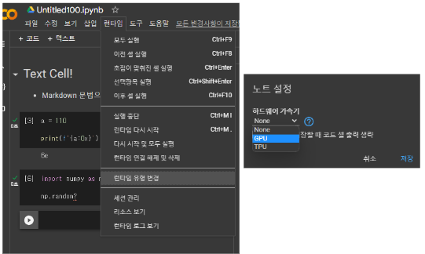

# Colab: GPU 사용하기

- 런타임 → 런타임 유형 변경 → 하드웨어 가속기를 GPU로 변경
- 유의사항 – GPU는 최대 12시간 실행을 지원
- 12시간 실행 이후에는 런타임 재시작으로 VM을 교체해야 함



GPU가속을 사용하면 다음을 통해, GPU 사양과 상태도 확인 가능함.

```
!nvidia-smi
```

---

PyTorch등에서 확인은 다음 코드를 사용.

```Python

import torch

print(torch.cuda.is_available()) 
print(torch.cuda.device_count()) # returns number of available GPU. 1 in my case
print(torch.cuda.current_device()) # returns index. 0 in my case
print(torch.cuda.get_device_name(0)) # Tesla T4
```

---

다음은 PyTorch에서 GPU를 확인하고, 특정 tensor를 GPU에 지정하는 예제코드임.

[PyTorch Example](https://gist.github.com/dsaint31x/ad7181dbb1b8c12c2db8b9454cfa0ddb)
