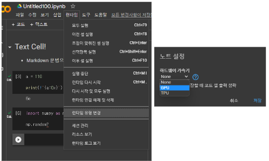

# Colab: GPU 사용하기

Colab에서는 주로 CUDA 기반의 [GPU](../ch04/ce04_51_gpu_tpu.md#graphics-processing-units) 가속을 지원

- 런타임 → 런타임 유형 변경 → 하드웨어 가속기를 GPU로 변경
- 유의사항 – GPU는 최대 12시간 실행을 지원
- 12시간 실행 이후에는 런타임 재시작으로 VM을 교체해야 함



> [TPU (Tensor Processing Unit)](../ch04/ce04_51_gpu_tpu.md#tensor-processing-unit-tpu)은 GPU가 아닌 AI Accelerator로  
> 애당초 Tensor Processing을 위해 설계 구현된 ASIC (Application Specific Integrated Circuit).

GPU 가속을 사용하면 다음을 통해, GPU 사양과 상태도 확인 가능함.

```
!nvidia-smi
```

* 참고: [GPU Acceleration 기술 소개](https://ds31x.tistory.com/375)
* 참고: [Colab에서 사용가능한 AI Accelerators](./colab_ai_acce)

---

## NVIDIA 의 CUDA (Compute Unified Device Architecture)를 이용한 GPU가속

PyTorch 에서 확인은 다음 코드를 사용.

```Python

import torch

print(torch.cuda.is_available()) 
print(torch.cuda.device_count()) # returns number of available GPU. 1 in my case
print(torch.cuda.current_device()) # returns index. 0 in my case
print(torch.cuda.get_device_name(0)) # Tesla T4
```

다음은 PyTorch에서 GPU를 확인하고, 특정 tensor를 CUDA GPU에 지정하는 예제코드임.

[PyTorch Example](https://gist.github.com/dsaint31x/ad7181dbb1b8c12c2db8b9454cfa0ddb)

---

## Apple 의 MPS (Metal Performance Shaders)를 이용한 GPU가속.

PyTorch 에서의 확인은 다음과 같음.

```Python
print(f"Metal Performance Shaders (MPS)를 지원하도록 build 되었음: {torch.backends.mps.is_built()}")
print(f"현재 mps 가속을 사용할 수 있음: {torch.backends.mps.is_available()}")

devices = []

if torch.cuda.is_available():
    for i in range(torch.cuda.device_count()):
        devices.append(f"cuda:{i}")
if torch.backends.mps.is_available():
    devices.append("mps")
devices.append("cpu")

print(f"Available devices: {devices}")

device = torch.device(devices[0])
```

다음은 PyTorch에서 MPS 가속을 사용하는 예제 코드임.

[DL_MPS_Test](https://gist.github.com/dsaint31x/bdd3b9461d5cdc1779b86665f774c821)

---

## Google 의 TPU (Tensor Processing Unit)를 이용한 XLA 가속.

PyTorch 에서는 `torch_xla` package를 통해 TPU 같은 XLA device를 사용할 수 있음.

* `torch_xla`가 XLA backend를 PyTorch에 연결하는 package

TPU 사용 가능 환경에서는 보통 다음과 같이 XLA device를 확인하고 지정함.

```python
import torch
import torch_xla

device = torch_xla.device()

print(device)                # xla:0
print(device.type)           # xla
print(torch_xla.devices())   # 사용 가능한 XLA devices
````
- `torch.cuda.is_available()` 같은 단순 TPU availability check와 완전히 대응되는 표준 함수는 없음.
- `torch_xla.device()`는 `torch_xla` runtime이 초기화되면서 XLA device를 잡는 방식에 가까움.
- `xm.xla_device()`는 `torch_xla.device()` 의 이전 방식으로 이전 문서들에서 보이는 형태임.


특정 tensor를 TPU/XLA device에 올리는 방식은 CUDA/MPS와 유사함.

```python
x = torch.tensor([1.0, 2.0, 3.0])
x = x.to(device)

print(x)
print(x.device)
```

단, TPU는 일반적인 `cuda` device가 아니라 XLA device로 동작함.

따라서 PyTorch에서 TPU를 사용할 때는 `torch_xla`를 추가로 사용하며,
환경에 따라 `PJRT_DEVICE=TPU` 같은 runtime 설정이 필요할 수 있음.

참고자료: 

* [xla 관련 개념 설명자료](https://ds31x.tistory.com/225)
* [사용법 위주 설명자료](https://ds31x.tistory.com/689)


