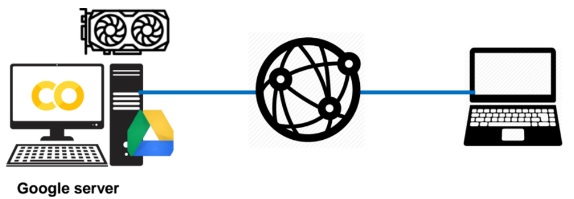

# Colab이란

Google Colaboratory = Google Drive + Jupyter Notebook

- 구글 계정 전용의 가상 머신 지원 – GPU 및 TPU를 제공
- Google drive 문서와 같이 링크만으로 접근 가능 :공동작업 가능



## Jupyter Notebook

웹 브라우저에서 파이썬 코드를 작성하고 실행해 볼 수 있는 개발도구

- 원격 코딩 가능
- 코드 블록 단위로 실행 / 디버깅 (IPython Shell)
- Text block을 이용한 문서화 (Markdown)
- 다양한 차트 및 그래프를 사용가능함.


## Colab 주 사용 언어 : Python

- ML 연구 분야에 있어서 대체하기 어려운 프로그래밍 언어
- Tensorflow, Pytorch 등의 딥러닝 프레임워크
- Numpy, Jupyter Notebook, Matplotlib, Pandas, ...


## 사용가능시간.

- GPU 사용시 최대 12시간 사용가능함 (session 최대 유지기간).
- 90분 입력이 없을 경우, 끊어짐 (=shutdown).
- Shutdown 전에 창을 끄고 다시 켜도 런타임은 유지
- free로 사용하는 경우 2개의 notebook을 동시 사용 가능함.

> 소스코드는 `.ipynd` 확장자로 구글 드라이브에 안전하게 보관됨. 사용할 데이터들도 Google Drive에 저장하고 이를 mount할 경우, 지속성을 가지고 작업가능.

## Sepc. (2023.3)

```
!cat /etc/issue.net
```

- Ubuntu 20.04.5 LTS

```
!cat /proc/cpuinfo
```

- CPU : Intel(R) Xeon(R) CPU @ 2.20GHz (2개 장착)

```
!head -n 3 /proc/meminfo
```
- 메모리 13G

```
!df -h
```

- Storage (HDD) : 108GB 제공 (25.4 GB used)
- Google Drive와 연동 가능.


GPU가속을 사용하면 다음의 사양도 확인 가능함.

```
!nvidia-smi
```

- GPU : K80 또는 T4(`Tesla T4`)  
- TPU도 사용 가능 : [TPU참고](../ch04/ce04_51.md#tensor-processing-unit-tpu)


