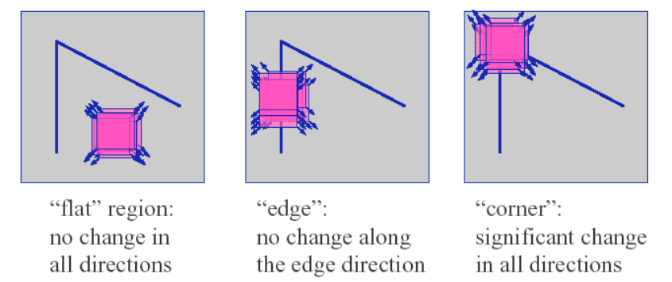
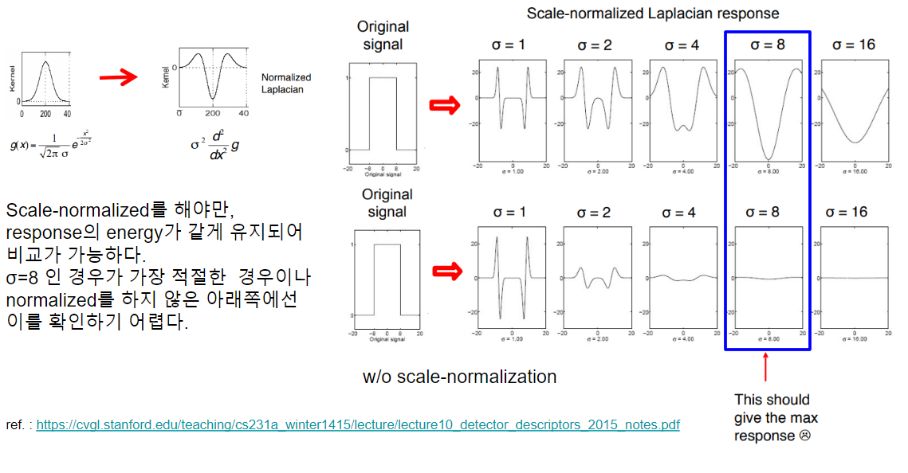

# Local Image Features (or patch feature, local feature, feature)

> An interesting part (region) of an image.

Local Feature (or Feature Descriptor)는 2000년대 correspondence problem에서 요구되는 ***correspondence를 검출*** 하는데 이용(SIFT 2004)되면서 등장하여 많은 발전이 이루어진 기술임.  

* 기존의 ^^edge segment 기반의 방식(1970년대 등장하여 1980년대 많이 사용됨)^^ 보다 우수한 성능을 보였고 
* 무엇보다 ^^gray-scale image에서 직접 계산이 가능^^ 하여 image matching 및 classification, image registration 등에서 널리 사용됨.  

> CNN, transformer등의 DL기술이 보다 높은 성능을 보이면서 과거에 비해 그 중요도가 줄어드는 추세임.  
> Dataset으로부터 ***hierarchy feature extraction 이 자동으로 이루어진다*** 는 점이 Deep Learning의 가장 큰 장점 중 하나라고 할 수 있음.

 
---

대표적인 Local Feature는 다음과 같다.

* Histogram of Oriented Gradient 계열 알고리즘 (output: float로 구성된 vector)
    * Histogram of Oriented Gradient (`HOG`) : 2005. Dalal and Triggs
    * `SIFT` (Scale Invariant Feature Transform) : 2004. Lowe et al.
    * `SURF` (Speed Up Robust Feature) : 2006. Bay et al.
* Binary Descriptors 계열 (output: binary vector)
    * Binary Robust Independent Elementary Feature (`BRIEF`) : 2010. Calonder et al.
    * Oriented and Rotated BRIEF (`ORB`) : 2011. Rublee et al.
    * Binary robust invariant scalable key-points (`BRISK`) : 2011. Leutenegger et al.
    * Fast retina key-point (`FREAK`) : 2012. Alahi et al.

Local Feature는 "원본 영상"의 `key-point`(특징점)들에서 계산되어 `local feature descriptor` (or feature vector)들로 표현된다.

* `key-point` (특징점) : "원본 영상"에서 local feature에 해당하는 위치. 해당 점을 중심으로 작은 ***region*** (or ***patch***, cell, block)이 설정되며, 이 region에 속하는 pixels을 이용하여 feature descriptor가 계산된다.
* (local feature) `descriptor` : ***key-point가 속한 patch의 local feature를 표현하고 있는 객체.*** 주로 vector (real number or binary)로 표현되기 때문에 `feature vector`라고도 불린다. Local Feature의 실제적인 값에 해당하기 때문에 feature descriptor를 계산하는 알고리즘의 이름으로 local feature를 부른다.  
즉, HOG descriptor라고 하면, HOG 알고리즘으로 얻은 local feature를 가르킨다.

> 초기에 개발된 알고리즘들은 corner 나 blob을 단순히 detection하는 것들 위주였음.   
> 이 경우 ***key-point만을 detect*** 하여 원본에서의 locational information과 size 를 계산할 뿐 이를 바탕으로 ***feature descriptor로 encoding하지 않음***.  
> locational information과 size는 *geometric transform 등에 covariant* 하기 때문에, 이들에 대해서도 invariant한 feature를 구하기 위해서는 추가적인 처리가 필요하다.  
> 이후의 알고리즘들은 이를 개선하기위해, ***feature descriptor를 계산하는 단계*** 가 추가되었다.

일반적으로 local feature를 얻는 algorithm들은 다음의 두 단계로 구성된다. (일부 알고리즘들은 하나의 단계에 대한 해법에 그치는 경우도 많다.)

1. Feature Detection : location info. 와 size (or scale) 을 얻어냄.
    * location info.와 size는 Translation, Rotation, Zoom-in/out 등의 Geometric Transform에 covariant함.
    * `key-point` 의 위치 및 크기를 구하는 과정에 해당.
    * corner나 blob을 찾던 초기 기법들은 이 단계만 수행함.
2. Feature Description : 주로 orientation과 feature vector 추출.
    * Geometric Transform에 invariant한 `feature descriptor` 를 생성.
    * 일부 기법은 detection 과정이 아닌 2번 단계에만 적용가능한 것들도 있음.

---

## Local Feature의 구성요소.

다음의 요소들로 Local feature는 구성됨.

> Local feature를 구하는 알고리즘에 따라 이들 중 일부 만을 제공할 수 있음. (모든 경우에 이들이 다 제공되는 건 아님.)

`Location information` 
: 원본 영상에서의 위치 $(x,y)$로 사실상 key-point의 위치이다.  
주로 vector로 주어짐.

`Scale (or size)` 
: local feature가 원본영상에서 차지하고 있는 넓이, 크기에 해당.  
standard deviation등에 사용되는 $\sigma$로 보통 표기됨  
(정규분포 등에서 분포의 폭을 결정하는 parameter가 std인 것에 기인).

`Orientation` 
: Local feature가 어떻게 놓여있는지를 나타냄.  
"방향"이라고 볼 수 있고, rotation에 invariant한 feature를 구하기 위한 핵심 정보임.

`Feature vector` 
: 이는 Feature descriptor의 핵심적인 요소라고도 할 수 있다.  
특정 대상에서 특정 부위가 다른 두 영상에서 다른 조명, 다른 위치에 놓여있다고 해도 해당 부위의 이상적인 feature vector는 같아야 한다.  
즉 같은 key-point인지 여부를 체크하는데 사용된다 (=local feature을 기술하는 vector임).

> 참고로 image patch를 그냥 flatten시킨 vector를 feature descriptor로 사용할 경우,  
> noise 나 rotation등에 매우 취약하다.

추가적으로 feature vector 간의 similarity를 측정하는 함수가 제공된다.

`Similarity (or distance) function`

* Correspondence (matching되는 feature descriptors, key-point pair)를 구하기 위해 제공됨.
* matching 등의 task에서 요구되며, Homeography (=projective transformation)를 구하기 위해 필수적임.
* HOG family algorithm에서는 Euclidean distance가 자주 애용되고, binary descriptor family에서는 Hamming distance들이 주로 사용됨.

---

## Use of Local Image Feature

 * ***Image representation*** 을 만들기 위해서 사용됨.
 * Image-level descriptor는 local feature 들을 모아서 만듬.
 * Matching 에도 사용이 가능.

## 좋은 Local Feature의 조건

* **Repeatability (vs. Computation cost,계산효율) (← 반복성)**
    - 같은 물체를 찍은 두 영상이 있다고 할 때,
    - 한 영상 속의 해당 물체의 **특정 위치(ex: 모서리)에서 검출된 feature** 는
    - 다른 영상의 해당 물체의 같은 위치에서 ***동일한(or 매우 유사한) 값*** 으로 얻어져야 함.
    - 이를 만족해야만, correspondence problem에서 사용가능
        - 또한 *object localization* or *tracking* 등에서 사용가능함.
    - **Repeatability** 를 위해서는 **invariance** 와 **robustness** 가 필요함.
* **Distinctiveness (vs. Locality) (←분별력)**
    - 같은 영상에서 *물체의 다른 곳과 충분히 **구분** 되는 feature값* 을 가져야 함. (←key-point의 조건을 기억)
    - 물체의 위치 별로 구분되는 feature를 가져야만 다른 영상에서 해당 위치에 1:1로 matching 이 가능.
* Locality (vs. Distinctiveness) (← 지역성)
    - 고전적인 CV 기술에서 많이 언급됨.
    - feature는 영상에서 작은 영역을 차지해야 좋음.
    - 어떤 점을 중심으로 **작은 크기의 주변 영역 정보** 만 가지고 feature detection과 feature description 이 가능해야함.
    - 우수한 Locality를 가져야만, occlusion(가림)과 clutter(혼재)가 존재할 때에도 해당 local feature가 제대로 기능을 수행가능함.
* **Accuracy (←정확성)**
    - 검출된 feature는 정확한 위치를 찾을 수 있어야 함.
    - Scale space에서의 feature는 scale axis에서도 정확도를 가져야 함(*정확한 scale을 찾을 수 있어야 함* 을 의미).
    - 특정 application에서는 sub-pixel accuracy가 필요함.
* **Sufficient Quantity (←적절한 양, 갯수)**
    - 어떤 물체의 pose(자세= 위치와 방향)을 계산하기 위해서는 **최소 3개의 대응점[(Affine Transformation)](https://www.notion.so/37e0c45380df408c86bfdafd2f82f74b)** 이 필요.
    - 여러 환경에 따른 오류가 존재하기 때문에, 최소 대응점으로는 부족함 ⇒ **대응점이 충분히 많을 경우 정확한 pose 추정이 가능** 함.
    - 하지만 지나치게 대응점이 많을 경우, 즉 대응되는 feature vector의 수가 너무 많으면 **처리에 시간이 많이 걸리고**, 에러를 가진 대응점 쌍들로 인해 matching에서 에러가 증가할 수 있임. ⇒ 적당히 많아야 함.
    - 이 때문에 local feature를 추출하는 많은 기법에서 이들의 *갯수를 조절하는 hyper parameter* 가 지원됨.
* **계산효율 (vs. Repeatability)** 
    - Local feature를 추출하는데 **적절한 계산량** 이 요구되어야 함.

**위의 특징들은 다음과 같은 trade-off 관계임.**

- Locality를 우선시(적은 영역에서 계산됨)할 경우, 보통 Distinctiveness가 떨어짐.
- 높은 Repeatability를 우선시 계산량이 많아지는 게 보통임.

---

## Good Key-points : Edge, Corner and Blob

일반적으로 좋은 Local feature는 matching등에 사용될 때, unambiguous해야한다.
때문에 local feature가 구해지는 key-point들로 원본영상의 corner, edge, blob 등의 선택된다.

* local feature을 위한 key-point 에 적합한 순서는 corner, Blob > edge >>>> Textureless region (질감 없이 균일한 영역) 순이다.

> `Blob`  
> Binary Large Object 의 준말로서, regions of interest points를 지칭하는 용어. Image region들 중에 주변(surrounding)보다 intensity가 매우 크거나 작은 것들을 가르킴.

corner, edge, blob 등은 일반적으로 Simple Image Processing Operation 등을 통해 추출됨.

* 대표적인 operation으로 Convolution, Laplacian등이 있음.

## Edge

`선` 이라고 생각할 수 있음.

Edge는 `set of points`로 주로 구분되어지는 region들 사이의 boundary에 존재한다.

Edge는 다음과 같은 특성을 가진다.

* Edge에서 pixel intensity가 급격히 바뀜.
* 이는 pixel intensity에 대한 gradient magnitude가 매우 큼을 의미함.

Edge를 만드는 요인은 다음과 같음.

* Texture
* Depth discontinuity
* Surface orientation discontinuity
* ~Reflectance discontinuity~
* ~Illumination discontinuity~

### Common Edge Detection Process

가장 널리 사용되는 algorithm은 [***Canny Edge Detection*** (1986)](./ch02_02_01_canny.md) 이며 다음의 순서를 구성됨.

1. Smoothing (= Denoising)
2. Gradient magnitude를 구함.
3. Non-max suppression 
4. Hysteresis Thresholding

`Edge`는 **높은 gradient magnitude** 를 가지므로 gradient magnitude를 구하여 해당 pixel을 구하는데, noise들도 높은 gradient magnitude를 가지므로 (Gaussian) Smoothing등을 통해 edge 외의 noise 를 제거하고나서 gradient를 구하는 경우가 일반적임.

## Corner

Corner는 contour(윤곽)의 junction(교차점)을 가르킴. 즉, 여러 edge들이 만나서 모이는 점으로 match에서 가장 좋은 local feature로 사용됨.

효과적으로 Corner를 찾아주는 고전적인 기법으로 Harris Corner Detection이 있는데 여기서 Corner와 Edge를 잘 구분해준다.

## Blob

Blob 은 **Binary Large Object** 의 줄임말로, ^^같은 성질을 가지는 픽셀들이 연결되어 어느 정도 이상의 size(크기)를 가지는 region^^ 을 가르킨다.

> Image regions that are either brighter or darker than the surrounding.

### Common Blob Detection Process

1. Smoothing
2. LoG (Laplacian of Gaussian) : Difference of Gaussian (DoG) 이 선호됨(효율측면에선)
3. Find the optimal scale and orientation parameters

3번의 과정에서 optimal scale이란 laplace filter의 폭($\sigma$)에 의해 결정된다. 아래 그림은 간단하게 각기 다른 크기의 blob 들에 대해 고정된 폭의 Laplacian filter를 가할 경우의 response를 보여주고 있다.

여기서 response가 가장 큰 magnitude를 가지는 경우는 signal의 폭과 Laplacian filter의 폭이 거의 일치한 경우이다. 즉, optimal scale이란 blob의 크기에 영향을 받으며, 최대한 laplacian의 magnitude를 크게 해주는 $\sigma$를 찾는 것임.

> 일반적으로 radius가 $r$인 원 모양의 binary blob에 대한 최적의 $\sigma$는 $\frac{r}{\sqrt{2}}$ 로 알려져 있다.

결국 ***Laplace Filter의 크기(흔히 `scale`이라고 불림)*** 를 바꿔가면서 적용해보면 원하는 blob 에서 response가 peak를 치는 filter를 찾을 수 있고 이러한 과정을 통해 얻은 filter를 통해 특정 image에서 blob을 검출할 수 있다. 즉, 물체의 shape의 크기나 형태에 따라 이에 맞는 Laplacian filter의 parameter를 찾는 것이 3번 단계이다.

> Convolve signal with Laplacian at several sizes ($\sigma$) and looking for the maximum response.

3번에서 각각의 다른 scale 들에서 response를 비교하기 위해서는 여기에 scale normalization이 필요하다. 

일반적으로 각 scale에 해당하는 $\sigma^2$ 을 곱해주어 scale normalized Laplacian을 얻는다.

> 여기서 나오는 scale은 `scale space`에서 나오는 용어임.  
> `scale space`는 대상을 여러 scale에 걸쳐 표현하는 multi-scale representation을 만드는 기법 중의 하나로 `image pyramid`와 함께 가장 널리 사용되는 방법이다.  
>
> * **scale이 클수록 image가 blurring** 되어 기본 구성요소(single pixel)가 넓은 영역을 차지하게 된다.  
> * **scale이 작아지면, image에서 detail한 정보가 보존된다.** 
>
> 큰 Blob을 검출하기 위해 scale이 커진다는 건 기본적으로 큰 blob이 구성요소로 간주되고, 작은 blob들은 무시됨을 의미한다.  
> 보통 ^^scale은 확률분포의 $\sigma^2$ 에 해당하는 값으로 표현^^ 된다(즉, variance에 해당). 동일 영상을 $\sigma^2$이 큰 Gaussian distribution으로 blurring시키면 Scale $t=\sigma^2$에 해당하는 image를 얻게 된다.

### Example

## References

* Computer Vision, 오일석, 한빛미디어
* [Lecture 10: Detectors and	descriptors](https://cvgl.stanford.edu/teaching/cs231a_winter1415/lecture/lecture10_detector_descriptors_2015_notes.pdf)
* [CS231A · Computer Vision: from 3D reconstruction to recognition](https://cvgl.stanford.edu/teaching/cs231a_winter1415/index.html)
* [[시각지능] Detecting corners](https://velog.io/@claude_ssim/%EC%8B%9C%EA%B0%81%EC%A7%80%EB%8A%A5-Detecting-corners-1#multi-scale-blob-detection-1)