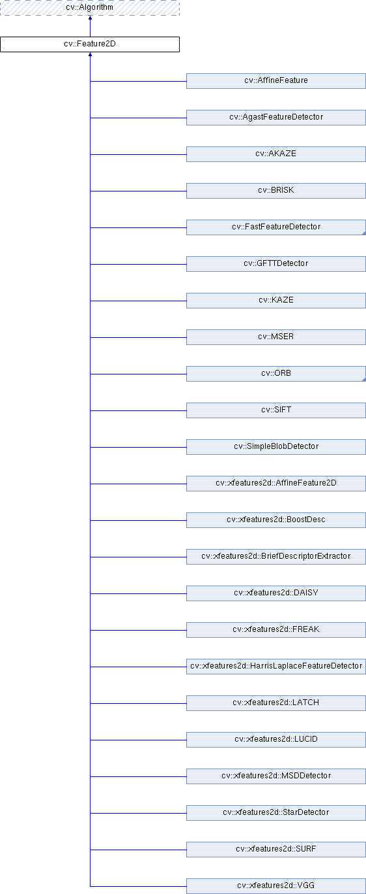

# Keypoint (특징점)

Local Feature가 계산되는 위치를 가르키며, 영상에서 corner, edge, blob등이 keypoint로 많이 사용된다.

일반적으로 주위 배경과 쉽게 구분이 가능하여 식별이 용이한 지점 (image의 특징을 잘 나타내줄 수 있는 부분을 의미)을 keypoint라고 한다.

> Local feature는 같은 keypoint라면 다른 영상에서도 역시 keypoint로 검출이 되는 repeatability를 중시한다. 때문에 corner가 굳이 실제 대상에서도 corner가 아니어도 된다. 하지만 이전에 많이 사용되던 edge segment 기반의 알고리즘에서는 corner로 검출된 경우, 실제 객체에서도 물리적으로 corner여야 함을 중시했다.

하나의 이미지의 어느 부분이 다른 이미지의 어느 부분에 대응 하는지를 확인하는 문제인 correspondence problem을 해결하기 위해 필요한 correspondence(대응점)으로 keypoint는 사용될 수 있기 때문에 matching등에서도 매우 중요한 역할을 담당한다.

## Detection

영상에서 keypoint를 찾는 것을 Keypoint Detection (or Feature Detection)이라 한다.

Detection은 keypoint를 location information과 size, orientation등을 원본영상에서 추출한다.
  
대표적인 알고리즘은 다음과 같다.

* Harris Corner Detection : 1988년 Chris Harris가 제안한 corner detector.
* Shi and Tomasi's Method : Harris Corner Detection을 개선한 알고리즘 (1994). Good Feature To Track 이라는 별칭을 가짐.
* FAST : 2006년 Edard Rosten과 Tom Drummond가 제안한 알고리즘. 미분 연산을 사용하지 않는 방식으로 기존 방식보다 높은 속도를 보임 (Feature from Accelerated Segment Test).

이외에도 OpenCV나 skimage등에서 제공하는 SimpleBlobDetecor 등이 많이 사용된다.

## OpenCV's implementation

OpenCV의 2D image관련 모든 Feature Dectector들은 **`cv2.Feature2D`** Class를 상속받아 구현되어 있음.

또한, `cv2.Feature2D`로부터 추출된 Key point들은 `**cv2.KeyPoint**` 의 instance로 abstraction 됨. 

### cv2.Keypoint 

keypoint를 추상화한 class. `cv2.Feature2D` 의 `detect` 메서드를 통해 반환되는 list의 element들의 type임. 

아래와 같은 attribute들을 가지나, 구현하고 있는 알고리즘에 따라 실제 유효한 값을 가지는 attribute 들이 다를 수 있다. 단 keypoint의 위치를 나타내는 `pt` 는 항상 유효한 값을 가진다.

- `pt` : 키 포인트(x, y) 좌표, float임. (모든 keypoint가 가지는  attribute)
- `size` : keypoint 크기, Diameter of the meaningful keypoint neighborhood. (option).
- `angle` : keypoint 방향, orientation (cw 각도), -1 = 의미없음) (option)
- `response` : keypoint response 강도 (option)
- `octave` : keypoint가 발견된 image pyramid layer (=pyramid octave)
- `class_id` : keypoint 가 속한 객체 ID

### cv2.Feature2D

**`cv2.Feature2D`**를 상속받아 구현된 Feature Dectector들은 다음과 같음.

#### cv2.Feature2D 의 대표적  methods.

`detect(src_img [, mask])-> keypoints`
: 특정 이미지로부터 해당 이미지의 keypoint들을 검출하여 반환하는 메서드임. `cv2.Feature2D` 를 상속하는 class는 이 `detect` 메서드를 상속하여 구현하고 있음.

- `src_img` : input image, it should be a binary image. (binary scale)
- `mask` : 어느 영역에서 검출을 수행할지를 지정하는  mask.
- `keypoints` : 반환되는 `cv2.Keypoint`의 리스트.

`compute(src_img, keypoints [, feature_descriptors])-> keypoints, feature_descriptor`
: src_img 로부터 keypoints 들의 위치에 대한 local feature descriptor를 계산하는 메서드임. keypoint를 검출만 하는 간단한 알고리즘들 (cv2.GFTTDector, cv2.SimpleBlobDetector등)에서는 구현이 안 되어있음. 

- `src_img` : local feature descriptor들을 구하고자 하는 대상 input image.
- `keypoints` : local feature descriptor 를 구할 위치를 나타내는 `cv2.Keypoint` 의 instance들의 list. 반환값으로도 반환된다.
- `feature_descriptors` : 결과값으로 나온 local feature descriptor들의 collection. numpy의 ndarray이며, 첫번째 차원은 keypoints의 idx와 일치하는 index에 해당하며, 2번째 차원은 각 keypoint에서의 local feature vector임.

`detectAndCompute(src_img, mask [,feature_descriptor, [,useProvidedKeyPoint]]) -> keypoints, feature_descriptors`
: detect 와 compute가 동시에 수행됨.

#### **cv2.drawKeypoints()**

검출한 keypoint들을 영상에 표시하는 함수.

**`cv2.drawKeypoints**(img, keypoints, output_mg[, color[, flags]]) -> output_img`

- `img` : 입력 이미지
- `keypoints` : 표시할 키 포인트 리스트
- `output_img` : 키 포인트가 그려진 결과 이미지
- `color` : 표시할 색상 (기본 값: 랜덤)
- `flags` : 표시 방법 선택 플래그
    - `cv2.DRAW_MATCHES_FLAGS_DEFAULT` : 좌표 중심에 동그라미만 그림 (기본 값)
    - `cv2.DRAW_MATCHES_FLAGS_DRAW_RICH_KEYPOINTS` : 동그라미의 크기를 size와 angle을 반영하여 그림