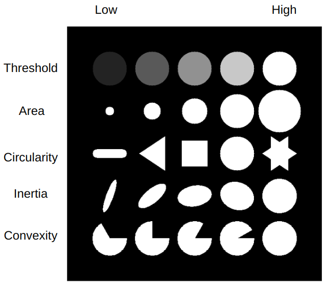

# Keypoint Detection

## skimage.feature

keypoint 중 blob을 이용한 방식들 중 대표적인 구현물이 다음 세가지임.

* `skimage.feature.blob_log`
* `skimage.feature.blob_dog`
* `skimage.feature.blob_doh`

`skimage.feature.blob_log`
: 앞서 keypoint에서 blob을 소개하면서 설명한 Laplacian of Gaussian (LoG)을 이용한 방법을 구현하고 있습니다. 위의 3가지 방법 중 가장 느리고 가장 좋은 성능을 보이는 것으로 알려져 있습니다(개인적으로는 DoG를 선호합니다.). convolution을 사용하기 때문에 size가 큰 blob 검출에서 속도가 매우 느려집니다 (큰 kernel size를 사용하는 터라). 

`skimage.feature.blob_dog`
: Difference of Gaussian (DoG)의 구현물입니다. LoG보단 빠르지만, 큰 blob을 검출하는데에는 역시 느려진다는 점은 똑같습니다.

`skimage.feature.blob_doh`
: Determinant of Hessian (DoH)의 구현물이고, 가장 빠르지만 정확도 측면에서의 성능은 제일 안 좋은 것으로 알려져 있습니다. image에서 Hessian의 determinant들의 matrix를 계산하여 blob을 찾아내기 때문에 blob의 크기가 속도에 영향을 주지 않는다는 장점을 가집니다. 문제는 작은 blob들 (skimage문서에 따르면 3pixel보다 작은 경우)을 잘 검출하지 못하는 것으로 알려져 있습니다.

> LoG와 DoG 모두 locational inforamtion과 함께, Gaussian에서 사용된 $\sigma$를 반환해줍니다. 일반적으로 blob의 radius와 $\sigma$간의 관계는 다음과 같습니다. 2D image인 경우 $r=\sqrt{2}\sigma$, 3D image인 경우 $r=\sqrt{3}\sigma$입니다.

### References

* skimage's [Blob Detection](https://scikit-image.org/docs/stable/auto_examples/features_detection/plot_blob.html)
* 다크프로그래머님's [Scale space](https://darkpgmr.tistory.com/137)


## cv2.SimpleBlobDetector

대표적인 Keypoint Detection에 사용되는 class이다.

> Blob 은 **Binary Large Object** 의 줄임말로, ^^같은 성질을 가지는 픽셀들이 연결되어있는 어느 정도 크기의 region^^ 을 가르킨다.

`skimage`의 경우, LOG, DOG와 같은 알고리즘 별로 따로 blob detector가 구현된 것과 달리 opencv는 여러 기준들을 한번에 처리하는 형태로 `SimpleBlobDetector`를 제공한다.

`cv2.SimpleBlobDetector.Params`을 이용하여 blob으로 분류될 기준을 설정하고, `cv2.SimpleBlobDetector`에 argument로 넘겨주어 해당 기준의 detector instance를 생성한 다음, `detect(gray_img)`메서드를 통해 keypoints들의 list를 반환받는 형태로 사용된다.

### `cv2.SimpleBlobDetector.Params` 

Blob (=keypoint)을 검출하기 위한 parameter들. 특정 keypoint의 주변 pixel들이 blob으로 인정받기 위해서 필요한 조건을 규정함.

크게 다음의 조건을 따지며 해당하는 attribute들은 다음과 같다.

* `filterByColor` : `True`이면, blob의 중심에서의 intensity와 blob의 intensity를 비교하여 다를 경우, blob에서 제외시킴. 
    * `blobColor=0` : 기본값이며, dark blob을 검출.
    * `blobColor=255` : light blob을 검출.
* Thresholding : 다음 두 기준을 정하여 intensity가 두 기준에 의한 범위 내에 있을 때, step에 따라 intensity를 구분함.
    * `minThreshold` : 이보다 낮은 경우(inclusive)는 같은 intensity로 본다. (구분하지 않음)
    * `maxThreshold` : 이보다 높은 경우(exclusive)는 같은 intesity로 보고 구분하지 않음.
    * `thresholdStep` : min부터 max 사이를 이 step씩 증가시면서 intensity를 구분짓는다. 만일 `maxThreshold=minThreshold+thresholdStep` 이 되면 blob이 다 사라지게 된다. 다 같은 단계로 보기 때문임.
* `filterByArea` : blob의 크기에 의해서 결정된다. 사실상 keypoint 주변의 몇개의 pixel이 intensity가 비슷한지를 나타내는 것임. 기본으로 `True`이다.
    * `minArea` : 기본값이 `25.0`임.
    * `maxArea` : 이를 넘어가면 blob이 아님. 기본값이 `5000.0`
* `filterByCircularity` : blob이 circle형태에 가까운지를 정량화하여 blob으로 결정함. 이상적인 circle은 `1.0`이나 float 연산으로 인한 오차등을 반영하여 max값을 `1.1` 정도로 줘야 제대로 동작한다.
    * `minCircularity` : blob으로 판단할 최소한의 circularity값. `0`이 ideal한 최소값이며 line에 해당한다. 기본값은 `.8`이다.
    * `maxCircularity` : blob으로 판단할 최대한의 circularity값. 이상적인 circle의 경우 `1.0`이나 float 연산오차를 반영하여 이보다 좀더 크게 잡아야한다. 기본값은 `3.4e+38`임
* `filterByInertia` : shape가 등방향성이지 아닌지로 blob을 구분한다.
    * `minInertiaRatio` : 길쭉한 타원일수록 `0.0`에 가까워진다. 이 값보다는 커야 blob이 될 수 있음. 기본값은 `0.1`임.
    * `maxInertiaRatio` : blob이 이 값보다 작은 intertia ratio를 가져야 blob이 될 수 있다. circle이 `1.0` 이나 역시 `1.1`정도로 보다 큰 값을 주어야 한다. 기본값은 `3.4e+38`임
* `filterByConvexity` : concave(오목)인지 convex(볼록)인지로 blob을 구분. $\frac{\text{area}}{\text{area of convexhull}}$로 계산된다.
    * `minConvexity` : U,또는 C 자 와 같은 형태가 convexity가 작음. 기본값은 `0.95`임
    * `maxConvexity` : circle의 경우 `1.0`인데, circularity와 마찬가지의 이유로 `1.1`정도 잡아주어야 한다. 기본값은 `3.4e+38`임.

다음 그림은 `cv2.SimpleBlobDetector.Params`를 정성적으로 이해하기 위해 그려진 그림이다.



다음 코드를 참고하라.

```python
def print_params(params):
  print(f'Color      [{params.filterByColor}]      : {params.blobColor}')
  print(f'Threshold(min,max,step): {params.minThreshold}\t,{params.maxThreshold}\t,{params.thresholdStep}')
  print(f'Area       [{params.filterByArea}]      : {params.minArea}\t,{params.maxArea}')
  print(f'Circularity[{params.filterByCircularity}]      : {params.minCircularity:.3}\t,{params.maxCircularity:.3}')
  print(f'Inertia:   [{params.filterByInertia}]      : {params.minInertiaRatio:.3}\t,{params.maxInertiaRatio:.3}')
  print(f'Convexity  [{params.filterByConvexity}]      : {params.minConvexity:.3}\t,{params.maxConvexity:.3}')

def init_params( default_mode = True, verbose=False):
  params = cv2.SimpleBlobDetector_Params()

  params.minThreshold = 10  # 25. #default
  params.maxThreshold = 225 #220. #default
  params.thresholdStep = 5 # 10. #default
  
  params.filterByArea = default_mode #True
  # params.minArea = 25.
  params.maxArea = 15000.

  params.filterByCircularity = default_mode #False
  # params.minCircularity = 0.8 # 0.8
  # params.maxCircularity = 1.1 # 3.4028234663852886e+38 #default

  params.filterByInertia = default_mode # True
  # params.minInertiaRatio = .1 # .1 # default
  # params.maxInertiaRatio = 1.1  # 3.4028234663852886e+38 #default
  
  params.filterByConvexity = default_mode # True #default
  # params.minConvexity = 0.95 # .95 # default #0.86, 0.89, 0.96
  params.maxConvexity = 1.1  # 3.4028234663852886e+38 #default

  
  if verbose:
    print_params(params)
  return params

init_params(False,verbose=True)
```

### cv2.SimpleBlobDetector

grayscale image인 `img_g`로부터 지정된 parameter들을 바탕으로 blob을 검출(= keypoint검출)하는 코드는 다음과 같다.

```python
    if int(ver[0]) <3:
      detector = cv2.SimpleBlobDetector(params)
    else:
      detector = cv2.SimpleBlobDetector_create(params)
      # detector = cv2.SimpleBlobDetector_create()

    key_points = detector.detect(img_g)
```

* 반환되는 `key_points`는 `cv2.Keypoint`들의 list이며, `cv2.SimpleBlobDetector`의 경우, 해당하는 blob의 locational information과 size (지름에 해당함)가 설정되어 있다.

`detect`에서 수행되는 과정을 간단히 말하면 다음과 같음.
1. source image에 threshold를 적용.
    - parameter에 넣은 minThreshold 값(포함)과 maxThreshold 값(불포함) 사이를 thresholdStep으로 나누어 각각의 threshold를 사용해서 binary image로 바꾼다. 
    - 기본으로 `minThreshold=50`, `maxThreshold=220`, `thresholdStep=10` 으로 설정이 되어있음.
    - binary image를 `0`과 `255`로 구성되도록 설정하고, `minThreshold=253`, `maxThreshold=255`, `thresholdStep=1`로 설정하면 한번의 threshold 연산만 수행됨.
2. 각각의 binary image에 대해서 `cv2.findContours` 함수를 적용해서 center를 계산.
3. 각각의 binary image에서 찾은 contour들을 하나로 묶어줌.
이때 `minDistBetweenBlobs` parameter를 사용됨.
4. 찾아낸 contour를 사용해서 blob의 최종 center와 diameter를 확정. 이를 keypoint로 return한다.

### 테스트용 gist

다음 URL의 ipynb를 통해, 각 파라메터들을 조절이 blob detection에 미치는 영향들을 살펴볼 수 있다.

* [DIP_blob_detection_opencv.ipynb](https://gist.github.com/dsaint31x/ee7c6da7b98b781fd68d8e2d2b32d03f)