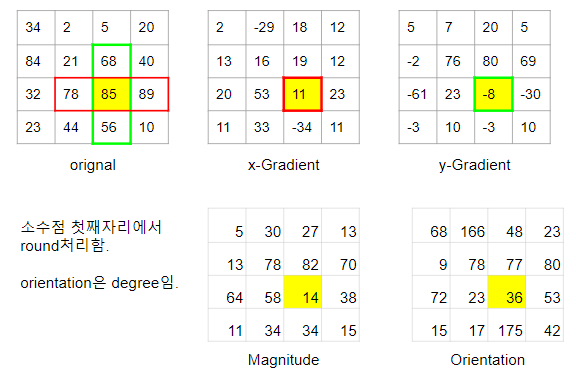

# HOG (Histogram of Oriented Gradients)

## The Steps for calaculating the **HOG** descriptor.

#### Step 0: Normalization

option이라고는 하지만, feature descripion의 특성상 noramization을 하는 경우가 보다 나은 성능을 보이는 경우가 많다.

**Gamma/Power Law Normalization.**
: $i$를 intensity를 가지는 pixel $p(x,y)$의 값을 $\log(p)$로 바꾸는 것을 가르킴. HOG를 소개한 당시 적용이 되었으나 해당 논문에서도 그리 좋은 성능을 보이지 않음.

**Square Root Nomralization**
: $i$를 intensity를 가지는 pixel $p(x,y)$의 값을 $\sqrt(p)$로 바꾸는 것을 가르킴. Gamma/Power Law Normalization보다는 값이 덜 줄어든다. 제안 당시 사용된 normalization임.

위의 두 기법 외에도 일반적인 min-max noramlization이나 standardization 도 사용가능하다.

#### Step 1: Resize Image into a fixed deimension.

HOG에서는 8 by 8 과 16 by 16 의 patch가 사용되기 때문에 이들의 배수로 image를 resize해주어야한다. 만약 image들간이 similarity등을 판단하는데 사용된다면 결과인 feacture dsecriptor의 vector가 같은 수의 element로 구성되어야하므로 똑같은 dimension으로 resize가 필요하다. 

#### Step 2: Gradient extraction

Gradient를 얻기위해 convolution opeartion으로 표현하면 다음과 같다.

$$
G_\text{x}=I*D_\text{x} \teax{ and } G_\text{y}=I*D_\text{y} 
$$

간단하게 Sobel filter 등을 이용한다.

구해진 각 pixel의 x축과 y축의 Gradient로부터 total gradient의 magnitude, $|G|$ 와 orientation $\theta$ 을 구한다.

Total gradient는 vector sum으로 구해지며 수식은 다음과 같다.

$$
\begin{aligned}
|G| &= \sqrt{(G_\text{x})^2+(G_\text{y})^2} \\
\tan{(\theta)}&=\frac{G_\text{y}}{G_\text{x}} \\
\theta &= \arctan{\frac{G_\text{y}}{G_\text{x}}}/end{aligned}
$$

주의할 건 일반적으로 orientation의 경우 사용하는 datatype을 unsigned를 이용하여 `-30`,`30`을 동일한 orientation으로 본다. 구현물에 따라 이를 구분하여 0~360도로 사용하는 경우도 있지만, 지나치게 넓은 범위이 각도로 세분화하여 구분시 오히려 성능이 떨어지는 경우가 많다.

Step1과 Step2에 대한 예를 들어 4 by 4 patch에서 gradient와 orientation등을 구해본 경우를 다음 그림이 나타낸다.

#### Step 3 : Calculating Histogram using Magnitudes and Orientations of Gradients.

