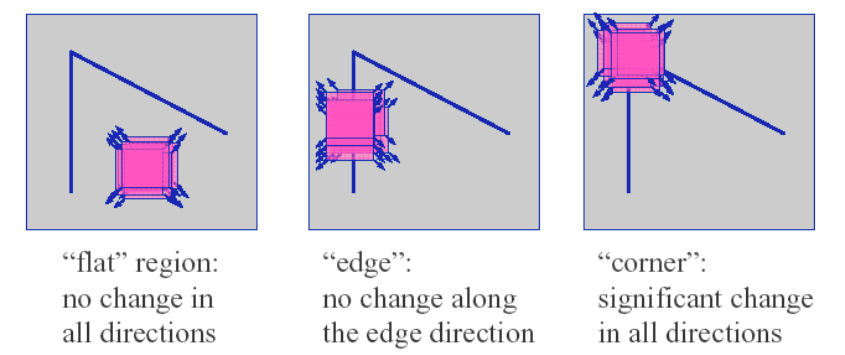
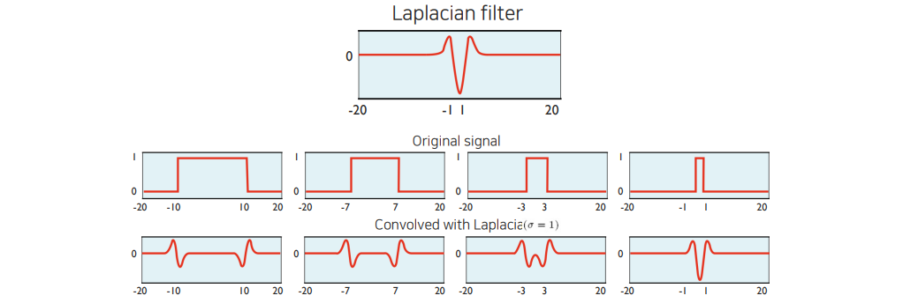
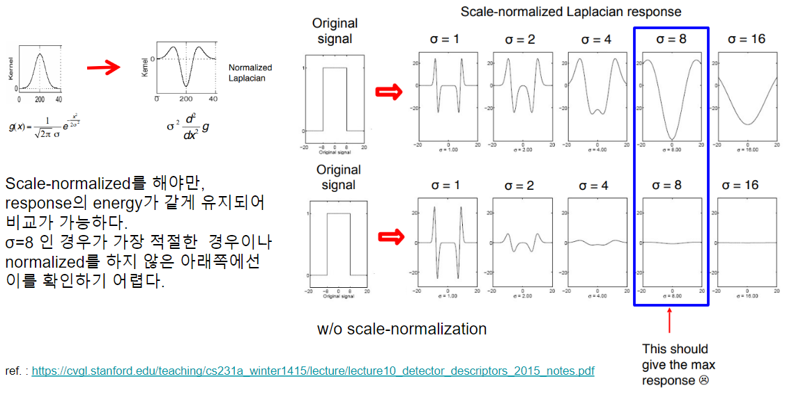
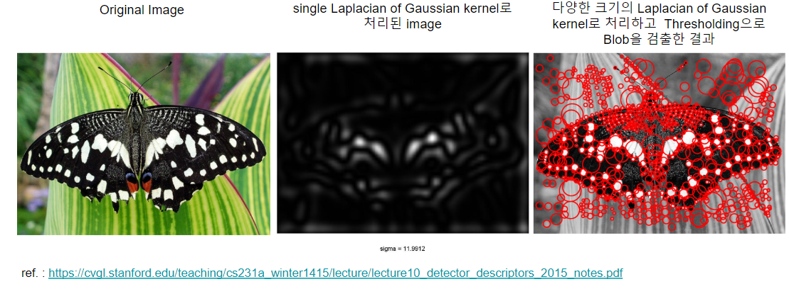

# Local Image Features

 An interesting part (region) of an image.

 ## Use of Local Image Feature

 * Image representation 을 만들기 위해서 사용됨.
 * Image-level descriptor는 local feature 들을 모아서 만듬.
 * Matching 에도 사용이 가능.

 ## 좋은 Local Feature의 조건

 * Saliency

 * Locality
     * 고전적인 CV 기술에서 많이 언급됨.
     * feature는 영상에서 작은 영역을 차지해야 좋음.

 * Repeatibility

## Good Local Feature

일반적으로 좋은 Local feature는 matching등에 사용될 때, unambiguous해야한다.
때문에 corner > edge >>>> Textureless region (질감 없이 균일한 영역) 순으로 local feature 에 적합하다.

`Blob`
:  regions of interest points를 지칭하는 용어. Image region들 중에 주변(surrounding)보다 intensity가 매우 크거나 작은 것들을 가르킴.

Simple Image Processing Operation 등을 통해 추출됨.

* 대표적인 operation으로 Convolution, Lapalcian등이 있음.

## Edge

`선` 이라고 생각할 수 있음.

Edge는 `set of points`로 주로 구분되어지는 region들 사이의 boundary에 존재한다.

Edge는 다음과 같은 특성을 가진다.

* Edge에서 pixel intensity가 급격히 바뀜.
* 이는 pixel intensity에 대한 gradient magnitude가 매우 큼을 의미함.

Edge를 만드는 요인은 다음과 같음.

* Texture
* Depth disconinuity
* Surface orientation discontinuity
* ~Reflectance discontinuity~
* ~Illumination discontinuity~

### Common Edge Detection Process

1. Smoothing (=Denoising)
2. Gradient magnitude를 구함.
3. Non-max suppression & Thresholding

Edge는 높은 gradient magnitude를 가지므로 gradient magnitude를 구하여 해당 pixel을 구하는데, noise들도 높은 gradient magnitude를 가지므로 (Gaussian) Smoothing등을 통해 edge외의 noise 를 제거하고 gradient를 구한다.

## Corner

Coner는 contour(윤곽)의 junction(교차점)을 가르킴. 즉, 여러 edge들이 만나서 모이는 점으로 match에서 가장 좋은 local feature로 사용됨.

효과적으로 Corner를 찾아주는 고전적인 기법으로 Harris Corner Detection이 있는데 여기서 Corner와 Edge를 잘 구분해준다.

## Blob

Blob 은 **Binary Large Object** 의 줄임말로, ^^같은 성질을 가지는 픽셀들이 연결되어있는 어느 정도 크기의 region^^ 을 가르킨다.

> Image regsions that are either brighter or darker than the surrounding.

### Common Blob Detection Process

1. Smoothing
2. LoG (Laplacian of Gaussian) : Difference of Gaussian 이 선호됨(효율측면에선)
3. Find theh optimal scale and orientation parameters

3번의 과정에서 optimal scale이란 lapalace filter의 폭($\sigma$)에 의해 결정된다. 아래 그림은 간단하게 각기 다른 크기의 blob 들에 대해 고정된 폭의 Laplacian filter를 가할 경우의 response를 보여주고 있다.

여기서 response가 가장 큰 magnitude를 가지는 경우는 signal의 폭과 Laplacian filter의 폭이 거의 일치한 경우이다. 즉, optimal scale이란 blob의 크기에 영향을 받으며, 최대한 laplacian의 magnitude를 크게 해주는 $\sigma$를 찾는 것임.

> 일반적으로 radius가 $r$인 원 모양의 binary blob에 대한 최적의 $\sigma$는 $\frac{r}{\sqrt{2}}$ 로 알려져 있다.

결국 Laplace Filter의 크기를 바꿔가면서 적용해보면 원하는 blob 에서 response가 peak를 치는 filter를 찾을 수 있고 이러한 과정을 통해 얻은 filter를 통해 특정 image에서 blob을 검출할 수 있다. 즉, 물체의 shape의 크기나 형태에 따라 이에 맞는 Laplacian filter의 parameter를 찾는 것이 3번 단계이다.

> Convolve signal with Laplacians at several sizes ($\sigma$) and looking for the maximum response.

3번에서 각각의 다른 scale 들에서 response를 비교하기 위해서는 여기에 scale normalization이 필요하다. 

일반적으로 각 scale에 해당하는 $\sigma^2$ 을 곱해주어 scale normalized laplacian을 얻는다.

### Example

## References

* [Lecture 10: Detectors and	descriptors](https://cvgl.stanford.edu/teaching/cs231a_winter1415/lecture/lecture10_detector_descriptors_2015_notes.pdf)
* [CS231A · Computer Vision: from 3D reconstruction to recognition](https://cvgl.stanford.edu/teaching/cs231a_winter1415/index.html)
* [[시각지능] Detecting corners](https://velog.io/@claude_ssim/%EC%8B%9C%EA%B0%81%EC%A7%80%EB%8A%A5-Detecting-corners-1#multi-scale-blob-detection-1)