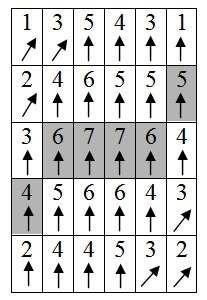
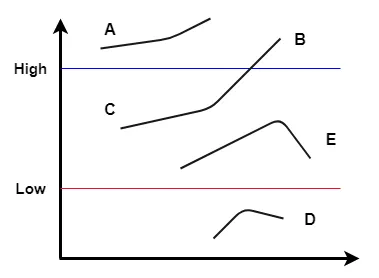

# Canny Edge Detection 

* 1986년 John F. Canny가 제안.
* Edge detection에서 가장 널리 사용되는 방법 중의 하나임.

Canny Edge Detection은 다음과 같이 4단계로 구성된 algorithm임.

**단계 1: Noise Reduction**

- Gussian Filtering을 하여 noise 제거
- edge 는 noise와 구분하기 어려운 특징 (gradient를 구할 경우, noise도 매우 큰 값을 가진다)을 가지므로 Gaussian filtering으로 이를 최대한 억제한 이후 gradient를 구하는게 일반적임.

**단계 2: Gradient Extraction**

- Sobel filter등을 이용하여 gradient 벡터의 magnitude 및 direction 을 추출.
- blurred image에서 모든 pixel 에서 1st derivative의 magnitude와 direction이 구해짐. (1st derivative, 1차 도함수, gradient)

**단계 3: Non-maximum Supression**

- $3\times 3$ kernel을 사용하여 gradient vector 방향에서 gradient 크기가 최대값인 pixel 만 남기고 나머지는 0으로 제거.
- edge에 기여하지 않는 pixel들이 제거됨.
- NMS를 통해 ***thin edge*** 가 구해짐 (=검출된 edge가 가늘어짐).



* The resulting edge pixel들은 회색으로 배경색이 칠해짐.
* gradient vector가 항상 edge에 orthogonal (perpendicular) 한 성질을 이용함.

**단계 4: Hysteresis Thresholding (=Double Thresholding)**

- 연결된 edge를 얻기 위해 두 개의 threshold(임계치)을 사용.
- `Max_Threshold(threshold2)`를 사용하여 gradient 방향에서 `Min_Threshold(threshold1)`가 나올 때까지 추적(tracking)하여 edge를 연결해 나감.
- `Max_Threshold`와 연결성이 없는 경우 edge에서 제거됨.



* Here, `A` and `B` are ***sure-edges*** as they are above `Max_Threshold`. Similarly, `D` is a sure ***non-edge***. 
* Both `E` and `C` are ***weak edges*** but since ***`C` is connected to `B`*** which is a ***sure edge***, `C` is also considered as a strong edge. 
* Using the same logic `E` is discarded.

> Hysteresis 는 우리나라 말로 이력현상 이라고 불림. 다음 URL에 간략히 설명되어 있음 : [hysteresis](https://dsaint31.tistory.com/entry/CI-Schmitt-trigger#hysteresis-%EC%-D%B-%EB%A-%A-%--%ED%--%--%EC%--%--%-C%E-%B-%A-%E-%AD%B-%E-%-F%BE%E-%B-%A--)

---

Sobel 함수나 Laplacian 과 같은 **simple edge detection** 을 통해 얻은 ***simple binary edge map*** 의 일반적으로 다음과 같은 단점이 있다.

- 첫째, **검출된 edge가 필요 이상으로 두꺼워** 객체를 훨씬 더 식별 하기 어렵게 만든다. (← non maximum supression 가 해법)
- 둘째, 영상의 모든 중요한 edge를 검출하기 위한 **명확한 threshold을 찾기가 어렵거나 불가능** 할 때가 있다. (←hysteresis thresholding 가 해법)

이를 해결한 알고리즘이 바로 **Canny Edge Algorithm** 임.

> 위의 각 문제점에 대해 Canny algorithm 의 해법이 가로 안에 기재되어 있으니 이를 참고할 것.

## cv2.Canny

OpenCV 에서는 `cv2.Canny`를 통해 제공함. 다음과 같은 parameter로 구성됨.

* Gradient mangitude를 기본으로는 l1-norm으로 구함.

```Python
edge_map = cv2.Canny(
    image, 
    min_threshold, 
    max_threshold, 
    edge_map=None,  # result가 저장될 변수. return value로 처리해도 되어 None이 기본.
    apertureSize=3, # Soble Filter의 kenrnel size. 
    L2gradient=False # grad. magnitude를 l2-norm로 구할지, l1-norm으로 구할지결정.
    )
```

다음은 이를 이용한 간단한 예제임.

```Python
import cv2
import numpy as np
import matplotlib.pyplot as plt
from google.colab.patches import cv2_imshow # for goole colab

def get_img_cv(url):
  image_ndarray = np.asarray(bytearray(requests.get(url).content), dtype=np.uint8)
  img = cv2.imdecode(image_ndarray, cv2.IMREAD_COLOR)
  print(img.shape)
  return img

url = 'https://raw.githubusercontent.com/dsaint31x/OpenCV_Python_Tutorial/master/images/sudoku.jpg'

#img = cv2.imread(img_path)
img = get_img_cv(url)
print(img.shape,img.max(),img.min())

edge = cv2.Canny(img,120,200)
print(edge.shape)
cv2_imshow(edge)
```

관련 ipynb 파일은 다음 URL을 참고 : [DIP_Canny_Edge_Detection](https://gist.github.com/dsaint31x/2afa8252d9134452db87ee5046ba1d3a)

## References

* [opencv's tutorial: Canny](https://docs.opencv.org/3.4/da/d22/tutorial_py_canny.html)
* [Moeslund, T. (2009, March 23)](https://web.archive.org/web/20150421090938/http://www.cse.iitd.ernet.in/~pkalra/csl783/canny.pdf)
* original paper : [A Computational Approach To Edge Detection](https://www.researchgate.net/publication/224377985_A_Computational_Approach_To_Edge_Detection)
