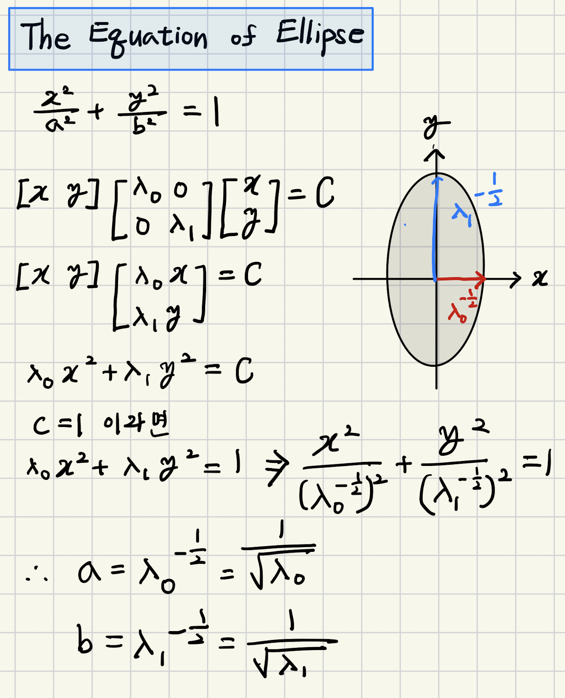

# Harris and Stephen Corner Detection (1988)

" C.Harris and M.Stephens. “A Combined Corner and Edge Detector.” Proceedings of the 4th Alvey Vision Conference: pages 147-151, 1988.

특정 point가 `corner`, `edge`인지 여부를 식별할 수 있는 방법 : `SIFT` Feature Detector보다 성능이 떨어지나 간단한 경우에서는 많이 사용된다. 물론 가장 대중적인 방법은 `SIFT`이다 (scale에 대한 robust 측면에서 SIFT가 월등히 좋은 성능을 보임)

하지만, Harris and Stephen이 제안한 방법은 mathematical approach로서 SIFT를 포함한 여러 방법의 기반이 되어줌.

Harris Corner Detector도 Moravec이 제안한 Moravec Feature Point Detector (1977)에서 사용하고 있는 (Weighted) Sum of Squared Difference (`SSD` 또는 Difference 대신 Error를 써서 `SSE`)를 사용함.

## (Weighted) Sum of Squared Difference (SSD)

특정 point, $(x_i,y_i)$에서 $(\Delta x, \Delta y)$ 만큼 특정 크기의 local window, $W$를 이동시켜서 (Weighted) Sum of Squared Difference (SSD), $E$를 계산한다. 

$$E(\Delta x, \Delta y) = \sum_{(x, y) \in W} W( x,  y) \left[ I(x+\Delta x, y+\Delta y)-I(x, y) \right]^2$$

where

- $W(x, y)$ :  Gaussian kernel 또는 uniform rectangular kernel가 사용됨. 일종의 가중치(weight)임. 이 후로는 1로 채워진 rectangular kernel이라고 가정함(for simplicity). `window function`이라고도 불림.
- $I(~)$: 입력영상의 값.
- $(x_i, y_i) \in W$ : $(x_i, y_i)$는 일반적으로 kernel $W$의 anchor (가장 가운데)에 해당함.

특정 point  $(x_i, y_i)$에서 여러 방향의 SSD를 계산하여 

- 거의 모든 방향으로 증가하면 corner이고,
- 변화가 없으면 flat region이라고 생각할 수 있음.

" Moravec Feature Point Detector (1977) 의 경우,  
위,아래,왼쪽,오른쪽으로 윈도우를 이동시켜서 각각의 SSD들을 구하고  
이들 중 최소값을 cornerness로 규정했음.

## Approximation by Tayler Series Expansion

Tayler series를 통해 $I(x+\Delta x, y+\Delta y)$를 근사하면 다음과 같음.

$$
\begin{aligned}f(x+\Delta x)&\approx f(x)+\frac{df(x)}{dx}\Delta x \\I(x+\Delta x, y+\Delta y)&\approx I(x, y) +\dfrac{\partial I(x,y)}{\partial x} \Delta x +\dfrac{\partial I(x,y)}{\partial y} \Delta y\end{aligned}
$$

* 위 식은 Tayler series expansion에서 1차 미분까지만 사용하여 approximation을 수행함.

이를 $E$에 대입하면 다음과 같은 approximation을 얻게 됨.

$$\begin{aligned}E(\Delta x,\Delta y) &= \sum_{(x,y) \in W} W(x,y) \left[ I(x+\Delta x, y+\Delta y)-I(x, y) \right]^2\\&\approx\sum_{(x,y) \in W} W(x,y)\left[ \left( \dfrac{\partial I(x,y)}{\partial x} \Delta x \right)^2 + \left( \dfrac{\partial I(x,y)}{\partial y} \Delta y \right)^2 +2 \dfrac{\partial I(x,y)}{\partial x}\dfrac{\partial I(x,y)}{\partial y} \Delta x \Delta y\right]\end{aligned}$$

## Quadratic Form Approximation

위 식은 다음과 같은 Quadratic form으로 표현이 가능함.

$$E(\Delta x,\Delta y) \approx \displaystyle \sum_{(x,y) \in W}W(x,y) \left(\begin{bmatrix}  \Delta x & \Delta y  \end{bmatrix}  \begin{bmatrix}  (\frac{\partial I}{\partial x})^2 & \frac{\partial I}{\partial x}\frac{\partial I}{\partial y}\\  \frac{\partial I}{\partial x}\frac{\partial I}{\partial y} & (\frac{\partial I}{\partial y})^2  \end{bmatrix}  \begin{bmatrix}  \Delta x\\   \Delta y \end{bmatrix}\right)$$

이를 전개하면 다음이 성립.

$$\begin{aligned}E(\Delta x,\Delta y) &\approx \displaystyle \begin{bmatrix}  \Delta x & \Delta y  \end{bmatrix} \left(\sum_{(x,y) \in W}W(x,y)\begin{bmatrix}  (\frac{\partial I}{\partial x})^2 & \frac{\partial I}{\partial x}\frac{\partial I}{\partial y}\\    \frac{\partial I}{\partial x}\frac{\partial I}{\partial y} & (\frac{\partial I}{\partial y})^2  \end{bmatrix} \right) \begin{bmatrix}  \Delta x\\   \Delta y \end{bmatrix} \\&= \displaystyle \begin{bmatrix}  \Delta x & \Delta y  \end{bmatrix} \begin{bmatrix}  W\circledast (\frac{\partial I}{\partial x})^2 & W\circledast  \frac{\partial I}{\partial x}\frac{\partial I}{\partial y}\\   W\circledast  \frac{\partial I}{\partial x}\frac{\partial I}{\partial y} & W\circledast  (\frac{\partial I}{\partial y})^2  \end{bmatrix} \begin{bmatrix}  \Delta x\\   \Delta y \end{bmatrix}\\&= \displaystyle \begin{bmatrix}  \Delta x & \Delta y  \end{bmatrix} \begin{bmatrix}  h_{xx} & h_{xy} \\h_{xy} & h_{yy}  \end{bmatrix} \begin{bmatrix}  \Delta x\\   \Delta y \end{bmatrix}\\&=\textbf{u}H\textbf{u}^T\end{aligned}$$

where

*  $\textbf{u}$를 보통 unit vector로 처리한다. (길이 1씩만 shift)
* $\Delta x, \Delta y$에 상관없이 전체 이미지 각 pixel에서 matrix $H$는 계산이 가능함.

## Hessian Matrix and Curvature

여기서, quadratic form의 가운데 matrix $H$는 Hessian matrix 의 Approximation 이며, $H$ 항상 symmetric이므로 eigen decomposition이 가능함.

> ***참고***
>  
> 가운데 matrix $H$는 엄밀하게 말하면 $\frac{1}{2}I^2$의 Hessian의 approximation (Tayer 전개에서 2차항을 무시한 approximation)임.  때문에, auto-correlation matrix 또는 2nd moment matrix 라는 용어를 엄격한 교과서에서는 보다 선호한다. 
>

위의 $2 \times 2$ Hessian matrix의 경우, diagonalization(or eigen decomposition)을 통해 2개의 eigen value와 서로 orthonormal한 eigen vector 2개를 얻을 수 있음. 

$$H=Q\Lambda Q^{-1}=Q\Lambda Q^T$$

where

* $Q$는 eigen vector들을 column으로 가지는 matrix. 각 column 에 해당하는 eigen vector들은 mutually orthogonal임.
* $\Lambda$는 eigen value들이 main diagonal에 위치하는 diagonal matrix임.
* 결국 x축, y축이 아닌, $E$가 이루는 quadratic form의 horizontal plane 들에서 이루는 ellipse의 equation의 primal axis와 secondary axis를 basis로 하는 change basis가 처리되고 각 길이에 해당하는 곱이 이루어진 이후 다시 x축, y축으로 change of basis가 이루어지게 된다.

다음 내용은 $H$의 diagonalization이 surface $E$에서의 horizontal slice에서의 ellipse와의 관계를 보여준다.

이들 중 eigen vector는 각각 curvature가 최대인 방향과 해당 방향에 직교한 방향을 가르키며, eigen value는 이들 축의 curvature(곡률) 크기를 의미한다. 

다음은 change of basis와 ellipse의 equation을 quadratic form과 연결지어서 보여줌. (단, 여기선 $Q$가 identity matrix로 놓고 처리함.)

$E$는 SSD를 의미하며 모든 방향에 대해 pixel값이 다른 경우 SSD가 커지므로 이를 locally approximation한 quadratic form의 Hessian matrix $H$의 eigen vector와 eigen value들을 통해 edge인지 corner인지를 가늠할 수 있음을 의미함.

> $E$에서의 curvature는 주변pixel간의 변화가 짧은 공간에서 급격히 이루어질수록 커짐.

이를 정리하면 다음과 같음(eigen vector의 방향에서 pixel value의 변화량이 eigen value에 해당하며 이는 해당 방향으로의 curvature임)

- $\lambda_0 \gg \lambda_1 \text{ or } \lambda_0 \ll \lambda_1$ : edge
- $\lambda_0,\lambda_1$이 둘 다 큰 값이며, 큰 차이가 없음. : corner
- $\lambda_0,\lambda_1$이 둘 다 작은 값이며, 큰 차이가 없음. : flat region

위 그림은 `Computer Vision with Python 3, Sauyrabh Kapur, Packt`에서 발췌한 것으로 위의 정리를 잘 나타내줌.

Harris & Stephen Corner Detector가 Corner에 초점을 둔 경우라면, `Frangi Filter`는 edge detection에 초점을 둔 경우임.

## Determinant와 Trace를 이용.

위의 Hessian matrix의 `determinant`와 `trace`의 값을 이용하면 다음과 같은 수식을 얻을 수 있으며, 이를 Harris corner operator라고 부름. $\frac{1}{f}$를  parallel resistor라고도 부른다. (편의를 위해 $\lambda_0 \ge \lambda_1$를 가정. → $r \ge 1$)

$$\begin{aligned}f&=\frac{\lambda_0 \lambda_1}{(\lambda_0+\lambda_1)^2}\\&=\frac{\text{Det}(H)}{(\text{Tr}(H))^2}\\&=\frac{r\lambda_1}{ (r\lambda_1+\lambda_1)^2
}\quad \leftarrow \lambda_0=r\lambda_1\\&=\frac{r}{(r+1)^2}\end{aligned}$$

즉, $\lambda_0 = \lambda_1$ 인 경우($r= 1.0$)일 때, 가장 큰 값($f=1/4$)을 가짐.  → $f$의 값이 큰 경우는 corner 혹은 flat region임. 즉,  $\lambda_0, \lambda_1$이 일정값 이상이면서 $f$가 큰 값을 가지면 corner임.

> 위의 Harris operator에 대한 다른 대안으로는 Szeliski(2005)가 제시한 방식이 있다.  
> Szeliski의 방법은 Harris와 Stephens가 1988년 제안한 방법과 같이 Hessian matrix(정확히는 2nd moment matrix)를 이용하지만 corner response function 만 차이가 있음. 
Szeliski의 방식을 정확히 기재하면 다음과 같음.  
>
> $$f=\frac{\text{Det}(H)}{\text{Tr}(H)+\epsilon}$$  
> 보다 자세한 건 다음을 참고할 것. [M.Brown, R.Szeliski, and S. Winder, Multi-image matching using multi-scale oriented patches,in IEEE Computer Society Conference on Computer Vision and Pattern Recognition (CVPR),vol.1, IEEE, 2005, pp.510–517](https://ieeexplore.ieee.org/document/1467310)

Harris corner detector의 대안인 Shi-Tomasi operator (1994)의 경우, $\text{cornerness}=\min(\lambda_0,\lambda_1)$로 정의되며, 최소 eigen value의 크기가 크면 corner로 판정한다. (Harris operator 와 큰 차이는 없으나 robustness가 조금 떨어진다고 알려져 있음) : characteristic equation $\text{det}(H-\lambda I_{2})=0$ 으로부터 유도되어 다음의 등식으로 cornerness가 구해짐.

$$\lambda_1 = \frac{1}{2}\left( (h_{xx}+h_{yy})-\sqrt{(h_{xx}-h_{yy})^2+4(h_{xy})^2}\right)$$

* $\lambda_0 \ge \lambda_1$로 sotring을 시켰다고 가정함. 

다음 그림은 왼쪽 상단의 $I$에 대한 eigen value들을 보여줌. edge에서 $\lambda_\text{max}$가 매우 큰 값들을 가짐을 확인 가능하며,corner에서 $\lambda_\text{min}$이 큰 값들을 가짐을 확인할 수 있음.

위 그림의 중단과 하단은 Harris operator와 Shi-Tomasi 간의 차이점을 보여줌.

Harris & Stephens (1998)의 경우, 실제로는 위의 Harris corner operator가 아닌 다음의 corner response function을 사용한다. (큰 값을 가질수록 corner에 해당함)

$$\begin{aligned}f&=\text{det}(H)-\alpha(\text{Tr}(H))^2 \quad \text{ whare }\alpha=1/r=0.1 \\&=h_{xx}h_{yy}-(h_{xy})^2-\alpha(h_{xx}+h_{yy})^2\\&=\lambda_0\lambda_1-\alpha(\lambda_0+\lambda_1)^2\end{aligned}$$

where

* $\alpha$는 보통 0.04에서 0.1 (or 0.06)로 잡음. (Harris operator에 대응함)

위 그림에서 upper-left와 lower-right는 edge에 해당하고, lower-left는 flat region, upper-right가 바로 corner임. 즉 Harris & Stephens의 $f$가 클수록 corner에 해당함.

## References

* [Interest Point Detection](https://www.youtube.com/watch?v=_qgKQGsuKeQ)
* [Corner Detection & Optical Flow](./ref/lecture6_Corner%20Detection_Optical%20Flow.pdf)
* [Detecting Corners](./ref/Lecture7_Detecting_Corners.pdf)
