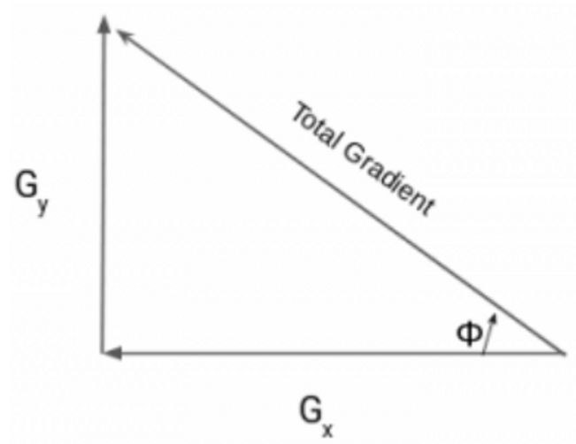
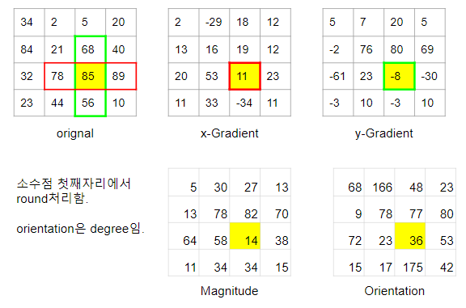
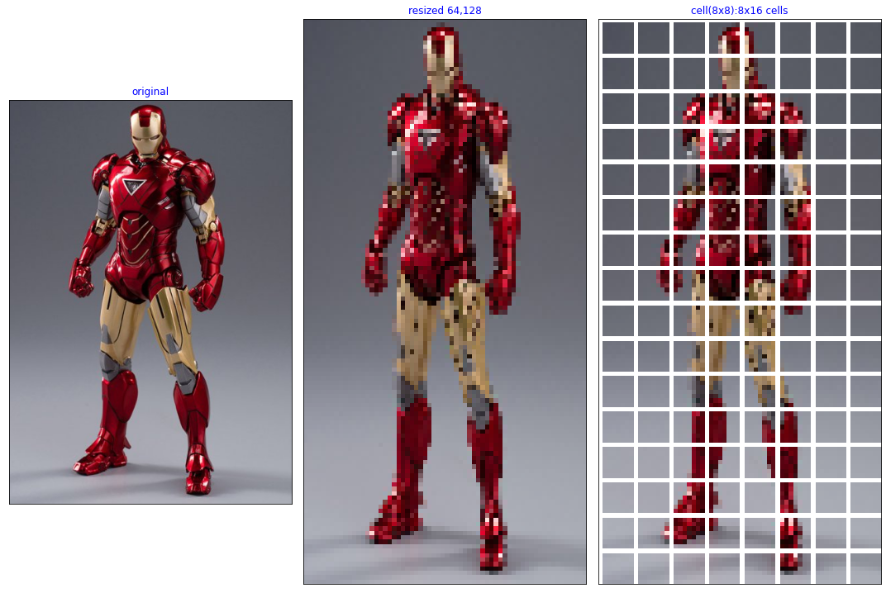
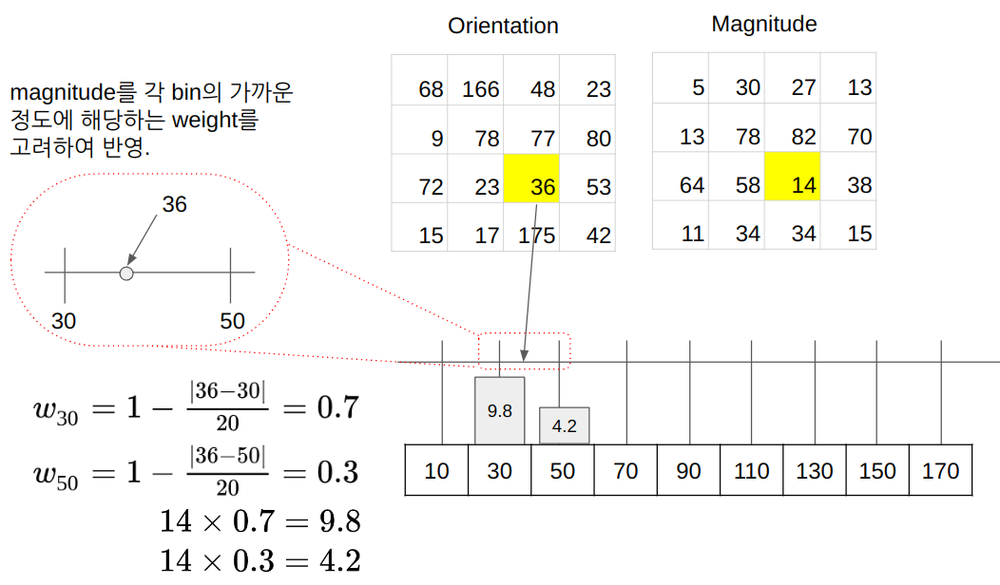
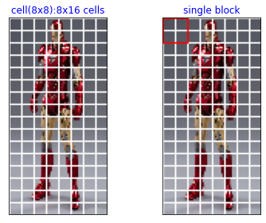
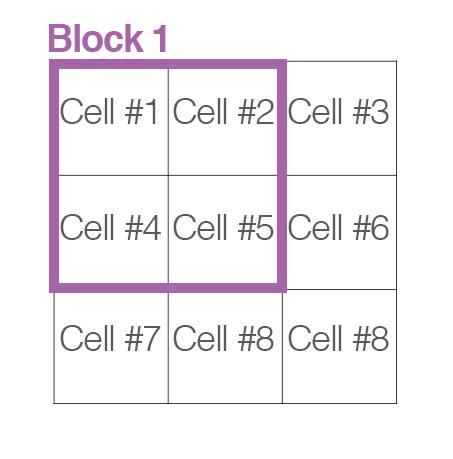
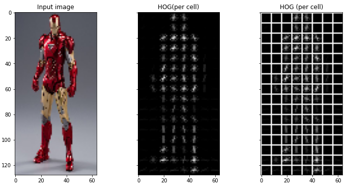
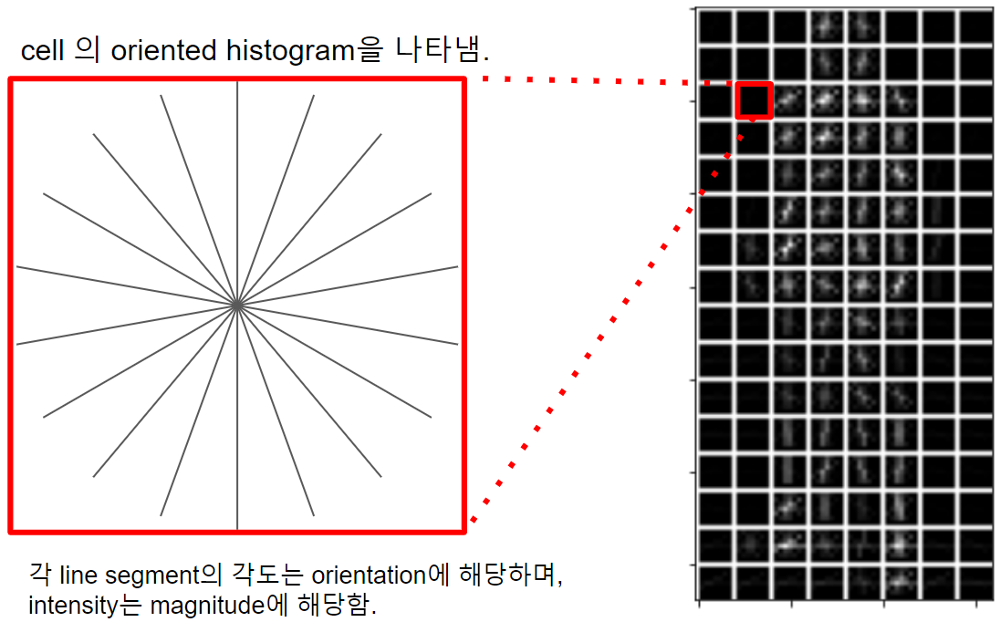

# HOG (Histogram of Oriented Gradients)

## The Steps for calculating the **HOG** descriptor.

#### Step 0: Normalization

option이라고는 하지만, feature description의 특성상 normalization을 하는 경우가 보다 나은 성능을 보이는 경우가 많다.

Color 영상인 경우에는 각 channel별로 수행된다.

**Gamma/Power Law Normalization.**
: $i$를 intensity를 가지는 pixel $p(x,y)$의 값을 $c \times p^\gamma$로 바꾸는 것을 가르킴. HOG를 소개한 당시 사용되어 성능 비교 등에 이용되었으나 오늘날은 그리 많이 이용되지 않음.

**log Normalization.**
: $i$를 intensity를 가지는 pixel $p(x,y)$의 값을 $\log(p)$로 바꾸는 것을 가르킴. HOG를 소개한 당시 적용이 되었으나 해당 논문에서도 그리 좋은 성능을 보이지 않음.

**Square Root Normalization**
: $i$를 intensity를 가지는 pixel $p(x,y)$의 값을 $\sqrt(p)$로 바꾸는 것을 가르킴. Gamma/Power Law Normalization보다는 값이 덜 줄어든다. 제안 당시 사용된 normalization임.

> 위의 두 기법 외에도 일반적인 min-max normalization이나 standardization 도 사용가능하다.

#### Step 1: Resize Image into a fixed dimension.

HOG에서는 8 by 8 과 16 by 16 의 patch가 사용되기 때문에 이들의 배수로 image를 resize해주어야한다. 만약 image들간이 similarity등을 판단하는데 사용된다면 결과인 feature descriptor의 vector가 같은 수의 element로 구성되어야하므로 똑같은 dimension으로 resize가 필요하다. 

#### Step 2: Gradient extraction

Gradient를 얻기위해 convolution operation으로 표현하면 다음과 같다.

$$
G_\text{x}=I*D_\text{x} \text{ and } G_\text{y}=I*D_\text{y} 
$$

* $*$ : convolution operator

$G_\text{x}, G_\text{y}$는 간단하게 Sobel filter 등을 이용한다.

구해진 각 pixel의 x축과 y축의 Gradient로부터 total gradient의 magnitude, $|G|$ 와 orientation $\theta$ 을 구한다.

{width="400"}

Total gradient는 vector sum으로 구해지며 수식은 다음과 같다.

$$
\begin{aligned}
|G| &= \sqrt{(G_\text{x})^2+(G_\text{y})^2} \\
\tan{(\theta)}&=\frac{G_\text{y}}{G_\text{x}} \\
\theta &= \arctan{\frac{G_\text{y}}{G_\text{x}}}
\end{aligned}
$$

주의할 건 일반적으로 orientation의 경우 사용하는 datatype을 unsigned를 이용하여 `-30`,`30`을 동일한 orientation으로 본다.  
구현물에 따라 이를 구분하여 0~360도로 사용하는 경우도 있지만, ^^지나치게 넓은 범위의 각도로 세분화하여 구분시 오히려 성능이 떨어지는 경우^^ 가 많다.

Step1과 Step2에 대한 예를 들어 4 by 4 patch에서 gradient와 orientation등을 구해본 경우를 다음 그림이 나타낸다.



> Color 영상의 경우, 최소 3개의 gradient가 구해지게 되는데 보통은 locally dominant한 color channel을 사용한다. 즉 구해진 3개의 gradient 중에서 가장 magnitude가 큰 gradient가 선택된다. 해당 gradient의 magnitude와 orientation이 사용된다.  
>  
> For color images, the gradients of the three channels are evaluated ( as shown in the figure above ). The magnitude of gradient at a pixel is the maximum of the magnitude of gradients of the three channels, and the angle is the angle corresponding to the maximum gradient.

#### Step 3 : 

위에서 구한 magnitude와 orientation을 지닌 pixel들을 `cell`로 나눈다.
`cell`은 보통 4 by 4 혹은 8 by 8 pixel로 구성된 일종의 patch이며 HOG는 이 patch별로 oriented histogram이라는 일종의 feature vector를 구한다.

흔히 이전 단계에서 resize하는 크기를 cell로 나누어 떨어지도록 하여 padding 등을 피한다.

다음 그림은 cell로 나눈 예를 보여준다. 맨 오른쪽 그림은 8 by 16 cell로 나누어져 있으며 이들 각 cell에 대해 oriented histogram이 계산된다.



* 가운데 그림은 HOG에서 권장하듯이 고정된 dimension으로 resize를 되었다. 현재 64 by 128 pixel로 구성된다.
* 왼쪽 그림에서 사용된 `pixels_per_cell`은 64로 8 by 8 pixel이 한 cell을 구성한다.

> 앞서의 gradient등을 구하는 설명의 예에서는 8 by 8 이 아닌 4 by 4 를 사용하고 있다.

#### Step 4 : Calculating Histogram using Magnitudes and Orientations of Gradients.

Histogram 은 특정 데이터(주로 continuous data)의 빈도 분포(frequency distribution)를 보여주는 diagram 또는 데이터이다.

Hog에서 사용되는 histogram은 0~180도를 20도 간격으로 9개의 bin으로 나눈다.

> histogram에서 표현될 데이터의 빈도수 분포를 나타내기 위해 전체 범위를 몇 개의 구간으로 나눈다. 이때 나누어진 구간을 bin이라고 한다. 

이후 각 cell에 대해 histogram을 구하는데, cell내의 pixel에서 orientation $\theta$에 해당하는 bin의 값에 magnitude를 더해주는 방식으로 모든 pixel 에 대해 적용한다.

> 참고로 magnitude를 더하는 것을 주의하자. 일반적인 histogram이라면, 한 pixel의 orientation이 32도에 대해, 20~40도 구간에 해당하는 bin의 값을 1개 증가(해당 bin에 해당하는 데이터 샘플의 빈도에 해당하므로)시키는 형태로 계산하지만, HoG에서는 다르다.

Oriented histogram에서는 orientation만 아니라 gradient의 magnitude도 반영하기 때문에 magnitude를 더해준다.

또한 연속된 orientation값을 discrete한 bin에 대해주는 경우 피할 수 없는 데이터 왜곡을 최소화 하기 위해 다음 그림처럼 bilinear interpolation처럼 가중치를 주어 2개의 bin의 값에 영향을 주도록 처리하는 경우도 있다.

> 다음 그림도 앞서 gradient등을 구하는 설명의 예와 마찬가지로 8 by 8 이 아닌 4 by 4 pixel로 구성된 cell을 사용하고 있다.



위 그림에서 보이듯이 36도의 경우 20~40도 구간의 bin(대표값 30도)과 40~60도 구간의 bin(대표값 50도)의 사이에 있으므로 $(1-\frac{|36-30|}{20}) \times 14= 9.8$을 20~40도 구간에 더해주고, 나머지 $14-9.8=(1-\frac{|36-50|}{20}) \times 14= 4.2$를 40~60도 구간에 더해준다.

이같은 방식은 수치적인 정확도 측면에서 장점을 가지나 연산량이 많이 요구하는 단점을 가진다. 때문에 간단하게 구현하는 경우에는 가장 근접한 bin에만 magnitude를 반영하기도 한다. (Nearest Neighborhood 가 Bilinear interpolation에 비해 연산이 단순하나 품질은 떨어지는 것을 기억하자.)

#### Oriented Histogram Normalization over Blocks

illumination 등의 차이에 robust한 feature descriptor가 되기 위해 필요한 과정이다.  

여러 cell을 묶어서 block으로 만들고, 각 block에서 oriented histogram에 해당하는 vector(histogram의 bin의 갯수에 해당하는 element들 가진 vector로 oriented histogram에 해당)들을 concatenation 처리하고 난 이후, L2-norm 혹은 L1-norm으로 normalization을 해준다.

다음 그림은 2 by 2 cell들로 하나의 block이 생성되는 것을 보여준다.



주의할 점은 cell이 pixel들을 묶는 것과 달리 block은 sliding을 하면서 만들어진다는 점이다.
다음 그림에서 2 by 2 cell로 하나의 block을 만들어내는 것을 간단히 보여줌.



* 3 by 3 cells에서 2 by 2 blocks가 만들어진다.

다음 수식을 보면 2 by 2 cell들로 하나의 block을 만들 경우, 4개의 9 by 1 의 oriented histogram vector들이 concatenation이 되어 36 by 1 의 vector가 되고 이를 L2-norm으로 normalization하는 것을 확인할 수 있다.

$$
\begin{aligned}
V&=[a_1,a_2,a_3,\dots,a_{36}]^T \\
\|v\|_{2}&=l_2 = \sqrt{ (a_1)^2+(a_2)^2+(a_3)^2+\cdots(a_{36})^2} \\
\text{Normalized Vector}&=\left[\frac{a_1}{l_2},\frac{a_2}{l_2},\frac{a_3}{l_2},\cdots,\frac{a_{36}}{l_2}\right]^T
\end{aligned}
$$

* 위 식에서 transpose를 사용하여 column vector $V$ 를 나타내고 있음.

이런 형태로 각 block당 normalized oriented histogram이 만들어지게 되면, 앞서 살펴본 8 by 16 의 cell들로부터 128개의 9 by 1의 oriented histogram vector들이 생성되었는데, 이를 2 by 2 block으로 normalization을 하면 7 by 15 blocks가 생성되고, 이로부터 36 by 1의 normalized oriented vector 105개가 생성된다.

이를 serialization하면 $7 \times 15 \times 36 = 3780$의 real number를 element로 가지는 feature vector가 되고, 이것이 해당 이미지의 HOG feature descriptor가 된다.

> HOG의 경우, SIFT, SURF, ORG등에 비해서 Local feature로서의 성능은 조금 떨어진다고 알려져 있다. (실제로 rotation등에 영향을 받는다.) 하지만, image 전체에 대한 특징으로는 경쟁 기술보다 나은 편으로 알려져있다. 

대상 객체의 자세나 조명 상태가 조금 차이가 나더라도, 해당 객체를 image에서 detection하는 task에서 HoG는 많이 사용된다.

물론, 한 image 내의 local feature로서 7 by 15의 normalized oriented histogram에 해당하는 oriented histogram vector들을 사용하는 것도 가능하다. (당연히 cell에서 생성된 oriented histogram vector도 이용가능함)

## scikit-image 를 통한 예제.

```python
from skimage.feature import hog
from skimage import exposure


img = cv2.resize(src_img,(64,128))

img_i = img.copy()

#creating hog features
feature_v, hog_image = hog(img_i, 
                    orientations=9, 
                    pixels_per_cell=(8, 8),
                    cells_per_block=(2, 2), 
                    visualize=True, 
                    multichannel=True)
```



반환된 결과는 다음과 같음.

* feature_v : 3780개의 element를 가지는 vector.
* hog_image : 각 cell당 orientation bin에 해당하는 각도의 선을 cell의 중심을 지나면서 해당 각도로 기울어지도록 그려진 image. 각 선의 intensity가 바로 magnitude에 해당함. 

다음 그림은 `hog_image`에 대한 설명을 그림으로 표현한 것임.




관련 gist에 저장된 ipynb는 다음과 같음.

* [dip_hog.ipynb](https://gist.github.com/dsaint31x/aaf4534afa36209a53b0953345715fea)

## cv2.HogDescriptor

openCV에서 `HOGDescriptor` 를 생성하기 위해서는 다음의 객체와 메서드를 제공함.

```python

#  HOG Feature Descriptor를 얻는 객체.
desc = cv2.HOGDescriptor(
    winSize,     # HOG추출영역 (설명에서 전체 이미지에 해당. target이 있는 이미지 영역).
    blockSize,   # block크기
    blockStride, # block sliding시 이동 정도
    cellSize,    # cell 크기
    nbins,       # orientation 수
)

hog = desc.compute(gray_img)
```

openCV에선 보행자 분석에 HOG와 SVM을 결합하여 많이 사용하며, HOG feature descriptor로 사전 훈련된 SVM detector를 제공하고 있다. 이들은 다음과 같은 형태로 사용함.

```python
import cv2
import numpy as np
import requests
import matplotlib.pyplot as plt


# 64 x 128 winSize
desc = cv2.HOGDescriptor()
svm_dec =cv2.HOGDescriptor_getDefaultPeopleDetector() 

# --------------------
# 48 x 96 winSize
# desc  = cv2.HOGDescriptor((48,96), (16,16), (8,8), (8,8), 9) 
# svm_dec =cv2.HOGDescriptor_getDaimlerPeopleDetector() 

desc.setSVMDetector(svm_dec)


url = 'https://github.com/dsaint31x/OpenCV_Python_Tutorial/raw/master/images/Walking.png'
img = get_img_cv(url)

# Object Detection
# - obj_bboxs : 검출된 object의 영역을 나타내는 bounding box 들의 list : n x 4 (=x,y,w,h)
# - confidences = 검출될 object에 대한 confidence value에 대한 list.
obj_bboxs, confidences = desc.detectMultiScale(img)

for (x,y,w,h),c in zip(obj_bboxs,confidences):
  if c > 1.:
    cv2.rectangle(img, (x,y), (x+w, y+h), (0,0,0), thickness=2)
    cv2.putText(img, f'c: {np.round(c)}',
                (x,y-4), cv2.FONT_HERSHEY_DUPLEX,1, (255,255,0),1)
  
plt.imshow(img[...,::-1])
plt.axis('off')
```

* `obj_bboxs, confidences = desc.detectMultiScale(img)` 를 통해, 보행자에 해당하는 window 들의 위치와 confidence level을 반환해줌.

위 예제는 youtube의 [Pedestrian Detection using OpenCV Python](https://www.youtube.com/watch?v=ey08HziSGeQ)의 동영상의 초반부 캡쳐 image를 사용하였다. [Real Life Object Detection using OpenCV – Detecting objects in Live Video](https://circuitdigest.com/tutorial/real-life-object-detection-using-opencv-python-detecting-objects-in-live-video) 에 좋은 설명이 되어있으니 참고하길 권함.

> 실제 동영상은 walking.avi로 다음 URL에서 다운로드 가능하다.  
> [rajeevratan84/ModernComputerVision](https://github.com/rajeevratan84/ModernComputerVision/raw/main/walking.avi)


## References

* scikit-image's [Histogram of Oriented Gradients](https://scikit-image.org/docs/stable/auto_examples/features_detection/plot_hog.html)
* [Histograms of Oriented Gradients for Human Detection, Navneet Dalal, et al. ](https://lear.inrialpes.fr/people/triggs/pubs/Dalal-cvpr05.pdf)
