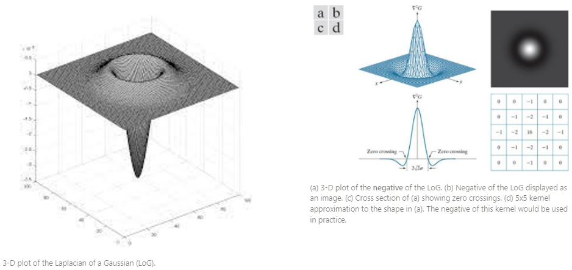
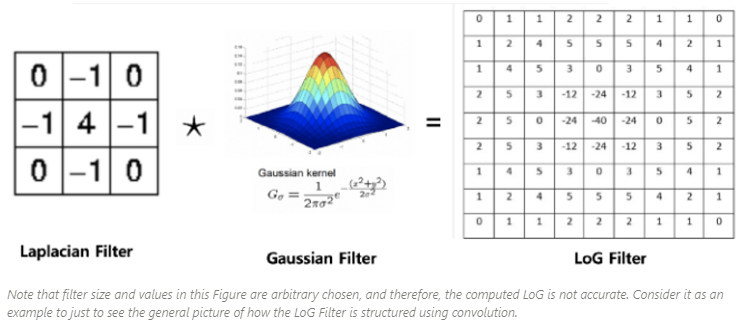
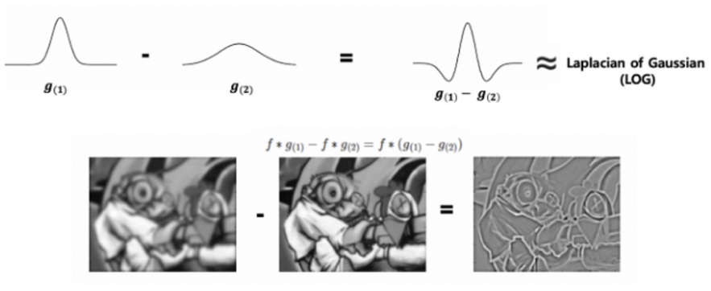

# Laplacian of Gaussian (LoG)

`LoG`는 Marr과 Hildreth에 의해 1980년에 제안된 기법. 

* Gaussian blurring을 사용하여 noise를 제거(or 완화)시킨 후 
* Laplacian을 가하여 edge를 추출.

Laplacian이 edge를 잘 찾아내는 장점을 가지나, noise도 같이 증폭시키는 단점을 가지고 있기 때문에, Laplacian의 장점을 극대화하고 단점을 상쇄하기 위해 제안되었음.

---

## Gaussian Blurring

Gaussian Blurring의 kernel은 다음 수식을 따름.

std인 $\sigma_x,\sigma_y$가 커질수록 blurring이 심해짐.

일반적으로는 isotropic이라고 가정하여 $\sigma=\sigma_x=\sigma_y$로 처리됨.

$$
G(x,y) = \dfrac{1}{2\pi\sigma_\text{x}\sigma_\text{y}} \exp \left[ -\left( \dfrac{(x-x_o)^2}{2\sigma_\text{x}^2}+\dfrac{(y-y_o)^2}{2\sigma_\text{y}^2}\right)\right]
$$

좀 더 단순하게, 앞의 상수 부분을 생략하고 다음으로도 표시하는 경우도 많다.

$$
G(x,y) = \exp \left[ -\left( \dfrac{(x-x_o)^2}{2\sigma_\text{x}^2}+\dfrac{(y-y_o)^2}{2\sigma_\text{y}^2}\right)\right]
$$

---

## Laplacian of a Gaussian (LoG)

의료영상을 포함한 영상처리에서 Laplacian은 ***수평과 수직방향의 2차 미분*** 에 해당함(Taylor series expansion 으로 approximation이 유도됨)

$$
\nabla^2 f(x,y)=\frac{\partial^2}{\partial x^2}f(x,y)+\frac{\partial^2}{\partial y^2}f(x,y)
$$

`Log`는 

1. Gaussian filter를 input image $f$에 가해주고(convolution) 
2. 이후에 Laplacian을 가해줌. 

좀더 수식에서 중요한 부분에 집중하기 위해 $x_o=y_o=0$으로 처리하여 전개하면 다음과 같음.

$$
\begin{aligned}\nabla^2G(x,y)=&\frac{\partial^2}{\partial x^2} G(x,y)+\frac{\partial^2}{\partial y^2} G(x,y)\\
=& \frac{1}{2\pi\sigma_x \sigma_y} \left[ \frac{\partial}{\partial x}\left\{\frac{-x}{\sigma_x^2} \text{exp} \left( -\left( \dfrac{x^2}{2\sigma_\text{x}^2}+\dfrac{y^2}{2\sigma_\text{y}^2}\right)\right)\right\} 
+\frac{\partial}{\partial y}\left\{\frac{-y}{\sigma_y^2} \text{exp} \left( -\left( \dfrac{x^2}{2\sigma_\text{x}^2}+\dfrac{y^2}{2\sigma_\text{y}^2}\right)\right)\right\}\right]
\\=& \frac{1}{2\pi\sigma_x^5\sigma_y}\left[x^2-\sigma_x^2 \right] \text{exp} \left(- \dfrac{x^2}{2\sigma_\text{x}^2}-\dfrac{y^2}{2\sigma_\text{y}^2}\right)
\\&+\frac{1}{2\pi\sigma_x\sigma_y^5}\left[y^2-\sigma_y^2 \right] \text{exp} \left(- \dfrac{x^2}{2\sigma_\text{x}^2}-\dfrac{y^2}{2\sigma_\text{y}^2}\right)
\\
=& \left[\left(\frac{x^2}{\sigma_x^4} - \frac{1}{\sigma_x^2}\right) + \left(\frac{y^2}{\sigma_y^4} - \frac{1}{\sigma_y^2}\right)\right] \frac{1}{2\pi\sigma_x\sigma_y}   \exp\left(-\frac{x^2}{2\sigma_x^2} - \frac{y^2}{2\sigma_y^2}\right) 
\\ =& \left(\frac{x^2}{\sigma_x^4} + \frac{y^2}{\sigma_y^4} - \frac{1}{\sigma_x^2} - \frac{1}{\sigma_y^2}\right) \frac{1}{2\pi\sigma_x\sigma_y} \exp\left(-\frac{x^2}{2\sigma_x^2} - \frac{y^2}{2\sigma_y^2}\right) 
\\ =& \left(\frac{x^2}{\sigma_x^4} + \frac{y^2}{\sigma_y^4} - \frac{1}{\sigma_x^2} - \frac{1}{\sigma_y^2}\right) G(x,y,\sigma_x,\sigma_y)

\end{aligned}
$$

Gaussian blurring처럼 isotropic이라고 가정하면 다음과 같이 좀 더 간단히 정리됨.

$$
\begin{aligned}\nabla^2G(x,y)&=
\left(\frac{x^2 +y^2}{\sigma^4} - \frac{2}{\sigma^2} \right)G(x,y,\sigma) \\
&=\left(\frac{x^2 +y^2-2\sigma^2}{\sigma^4} \right)G(x,y,\sigma)
\end{aligned}
$$

Scale-normalized LoG는 다음과 같이 $\sigma^2$를 곱해준다. 

$$
\nabla^2G(x,y)=\left[\frac{x^2+y^2-2\sigma^2}{\sigma^2}\right]G(x,y,\sigma)
$$

$G(x,y,\sigma)$에서 $\frac{x^2+y^2}{\sigma^2}$이 exp함수의 입력으로 들어가는데, normalized되는 것도 비슷한 형태 $\left[\frac{x^2+y^2-2\sigma^2}{\sigma^2}\right]$ 로 맞춰줘서 $\sigma$의 크기로 인한 문제를 해결함. 

---

## 3-D plot and Kernel

아래 그림에서 보이듯이 멕시코 전통 모자를 뒤집어놓은 것처럼 보여서 LoG 연산자는 Mexican hat 연산자 라고도 불림.

여기에 `-`기호를 씌운 다음의 형태(negative LoG)도 많이 사용됨.

<figure markdown>

</figure markdown>

LoG는 frequency domain으로 생각하면, 

* Laplacian Kernel과 
* Gaussian Blurring Kernel을 ***곱한 것*** 이 

바로 ***`LoG`의 Kernel*** 이 된다.
(spatial domain의 convolution이 freq. domain에서는 곱하기가 됨)

다음은 $9\times 9$ LoG kernel을 다음 그림에서 보여준다.

<figure markdown>

</figure markdown>

---

## Difference of Gaussian (`DoG`)

1980년 Marr와 Hildreth에 의해 제안된 `LoG`의 경우, 

* 계산량 측면에서 불리한 점들이 있어서 직접 사용되기 보다는
* `LoG`의 ***approximation들이 보다 많이 사용*** 된다.

가장 대표적인 `LoG`의 approximation이 바로 ***Difference of Gaussian*** (`DoG`)이며 다음 그림이 `DoG`를 잘 설명해준다.

<figure markdown>

<figcap>RWTH Aachen, computer vision group</figcap>
</figure>

* 주의할 점은 Gaussian filter $g(1), g(2)$가 각기 다른 $\sigma$를 가진다는 점임.
* SIFT등에서도 일반적으로 LoG가 아닌 DoG를 사용한다.

수식으로 DoG가 어떻게 LoG의 approximation이 되는지는 다음 URL을 참고하라.

* [수식으로 본 Laplacian approximation](https://dsaint31.me/mkdocs_site/DIP/cv2/ch02/dip_pyramid/#laplacian-approximation)

---

# References

* [Laplacian/Laplacian of Gaussian](https://homepages.inf.ed.ac.uk/rbf/HIPR2/log.htm)
* jun94's [3. Gradient and Laplacian Filter, Difference of Gaussians (DOG)](https://medium.com/jun94-devpblog/cv-3-gradient-and-laplacian-filter-difference-of-gaussians-dog-7c22e4a9d6cc)