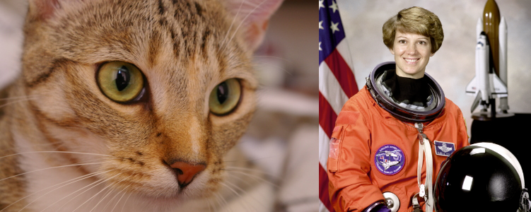
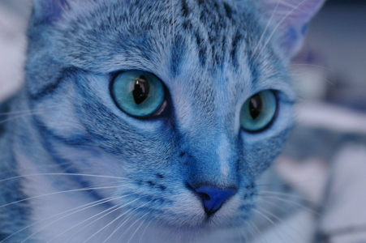

# 1. OpenCV를 통한 Image 다루기 (읽고 쓰기)

기본적으로 cv2를 이용하여 이미지를 읽어들이고, 저장하는 방법을 다룬다.

구체적인 함수는 다음과 같다.

* `cv2.imread`
* `cv2.imshow`
* `cv2.imwrite`

추가적으로 다루는 함수와 라이브러리는 다음과 같다.

*  `skimage` : scikit-image library
    * `skimage.data` : 기본으로 처리할 이미지 데이터들을 가지고 있는 모듈.

Pillow 의 기본 사용법은 다음을 참고:

* [Pillow 사용법 - Basic 01](https://ds31x.tistory.com/465)

---

## 1-1. Load sample images from `skimage`

> `skimage` 는 대표적인 image processing library로 `sci-kit` 계열의 패키지이다.  
> 일반적으로 특정 영상처리 알고리즘들이 보다 순수하게 구현되어 있는 경우가 많다.  
> OpenCV의 경우 좀 더 활용을 위해 추상화가 되어 있다면, `skimage`는 특정 기술의 논문등에서 애기한 파라메터 이름을 그대로 사용하는 방식으로 구현된 경향을 보인다. 

일단, `cv2`로 영상을 다루는 기초를 익히기 위해  
일단 샘플 데이터를 `skimage.data` 에서 구하고,  
이를 저장 후 다시 읽어들이는 방식의 예제를 통해 학습한다.

다음 코드는 `numpy`의 ndarray로 고양이 사진과 우주비행사 사진 데이터에 해당하는 객체를 얻는 예제 이다.

```Python
from skimage import data

#from skimage.color import rgb2gray
#from skimage import img_as_ubyte,img_as_float

cat = data.chelsea()     # take the test image of cat!
astro = data.astronaut() # take the test image of astronaut!
```

{style="display: block; margin: 0 auto; width=400px"}

---

## 1-2. Display (or Check) Image by OpenCV

OpenCV를 통해 이미지를 출력하는 기본 함수는 다음과 같다.

```Python
cv2.imshow(title_wnd_str, ndarray_img)
```

* `title_wnd_str` : 
    * `imshow`는 이미지를 window로 띄어 보여준다. 
    * 이 parameter는 해당 window의 title을 나타내는 문자열로 
    * 이후 해당 window에 접근할 때 id로 사용된다.
* `ndarray_img` : 
    * window에서 보여줄 이미지 데이터에 해당하는 ndarray 객체.
    * `cv2`는 이미지를 나타내는 객체로 numpy의 ndarray를 사용한다.

참고: 좀 더 자세한 내용은 다음을 참고하라 [cv2.imshow 사용하기](https://dsaint31.tistory.com/803)

간단한 예제는 다음과 같다.

```Python
import cv2

cv2.imshow('test_cat',cat)

# 특정 키 입력을 무한대로 대기(창을 띄우고 wait). 
# 키가 눌러지면 눌러진 키를 나타내는 반환값을 반환하고 다음 라인이 수행됨.
cv2.waitKey(0)

# # 키 입력을 1초 대기(milliseconds) 하고 지정한 시간 내에 입력이 오지 않으면 -1 을 반환.
# cv2.waitKey(1000) .     

# 현재 모든 cv2의 window를 닫고 자원 반환.
cv2.destroyAllWindows()   
```

> `cv2.imshow()`는 window를 띄우는 함수이므로  
> 원격지에 서버가 있는 jupyter note 혹은 colab에선 동작하지 않는다.  
> localhost에서 jupyter note를 실행한다면 동작하긴 하지만,  
> jupyter note에서 사용하기는 불편한 방법이다.  
> jupyter note로 수행할 경우엔, `matplotlib`를 사용하는 것을 권함.

colab의 경우, 

* `google.colab.patches` 모듈에서 
* `cv2_imshow` 함수(cv2.imshow의 alternative)를 대신 제공하며 
* 이 함수는 window가 아닌 출력창에 이미지를 표시함.

```Python
from google.colab.patches import cv2_imshow

cv2_imshow(cat)
cv2_imshow(astro)
```

참고로, 다음 코드를 통해 colab에서 동작여부 등을 확인할 수 있으며 적절한 함수가 호출되도록 util function을 만드는 것도 가능하다.

```Python
import sys
IN_COLAB = 'google.colab' in sys.modules
IN_COLAB

def ds_imshow(img, win_title='win_title'):
  if IN_COLAB:
    from google.colab.patches import cv2_imshow
    cv2_imshow(img)
  else:
    cv2.imshow(win_title, img)
    cv2.waitKey(0)
    cv2.destroyAllWindows()
```

일단, 이미지는 보이지만... 색깔이 뭔가 이상하다는 점을 느낄 수 있음 (아래 이미지 참고).

{style="display: block; margin: 0 auto; width:300px"}

이는 Color Space의 문제로, skimage와 OpenCV가 기본으로 사용하는 Color Space가 다르기 때문임.

* `skimage` : RGB model을 기본으로 사용함.
* `cv2` : BGR model을 기본으로 사용함.

> Color space는 color를 표현하기 위한 일종의 수학적 모델을 가리킴. 대표적으로 RGB, Gray-scale등이 있음.  
> 참고 : [Color Space](https://dsaint31.tistory.com/entry/DIP-Color-Space)

다음의 py 파일은 Color Space를 처리 등이 이루어져 정상적으로 chelsea의 모습을 볼 수 있는 코드임.  

> 'test_cat'이라는 타이틀을 가지는 window를 통해 chelsea image를 보여줌.
> 
> * [cv_imshow.py](https://github.com/dsaint31x/OpenCV_Python_Tutorial/blob/master/cv/ch00_basic/dip_0_00/cv_imshow.py)
> * [cv2.imshow 사용 예](https://dsaint31.tistory.com/803)

---

## 1-3. matplotlib를 활용하여 image 나타내기.

`matplotlib`는 차트나 이미지를 나타내는데 가장 널리 사용되고 있는 python library임. 
(MATLAB 처럼 활용가능한 plotting framework임.)

참고: [matplotlib란?](https://ds31x.tistory.com/209)


굳이 OpenCV의 `imshow`를 사용하지 않고 이를 이용할 수도 있다.

참고로 `matplotlib`는 `skimage`과 같이 RGB모델을 사용한다.  
때문에 `skimage.data`에서 얻은 현재 이미지 객체들이 `matplotlib`에서는 정상적으로 잘 보인다.

```Python
import matplotlib.pyplot as plt

plt.figure(figsize=(12,12))
plt.subplot(111); plt.imshow(cat)
plt.show()
```

위 코드를 jupyter note의 셀 또는 colab에서 수행하면, 정상적으로 고양이 chelsea가 보인다. 

그렇다면 OpenCV로 정상적으로 보이려면 어떻게 해야할까?  
정답은 Color Space를 바꾸는 것이다.

> 다음은 OpenCV와 matplotlib를 이용한 간단한 예제코드 파일임.
>
> * [cv_matplotlib.py](https://github.com/dsaint31x/OpenCV_Python_Tutorial/blob/master/cv/ch00_basic/dip_0_00/cv_matplotlib.py)
> * [위 소스를 설명하고 있는 url](https://dsaint31.tistory.com/804)

---

## 1-4. Change the Color Space of Image

OpenCV나 skimage 모두 다양한 Color space를 지원한다. OpenCV에서는 `cvtColor`함수를 통해 image객체의 color space를 변경할 수 있다.


다음은 OpenCV에서 ^^대표적으로 지원^^ 하는 Color Space들 간의 변환 방식들임.

* `cv2.COLOR_BGR2RGB`
* `cv2.COLOR_RGB2BGR`
* `cv2.COLOR_HSV2BGR`
* `cv2.COLOR_RGB2YUV`
* `cv2.COLOR_RGB2GRAY`

`cvtColor`함수와 이의 변환방식들의 사용은 다음 code snippet을 참고하라.

```Python
cat_cv = cv2.cvtColor(cat,cv2.COLOR_RGB2BGR)     #RGB -> BGR
astro_cv = cv2.cvtColor(astro,cv2.COLOR_RGB2BGR) #RGB -> BGR
cat_gray = cv2.cvtColor(cat,cv2.COLOR_RGB2GRAY)  #RGB -> Gray-scale

cv2.imshow('cat_cv'  ,cat_cv  )
cv2.imshow('astro_cv',astro_cv)
cv2.imshow('gray_cat',cat_gray)
cv2.waitKey(0)
cv2.destroyAllWindows()

# -------------------
# # for google colab을
# cv2_imshow(cat_cv)
# cv2_imshow(astro_cv)
# cv2_imshow(gray_cat)
```

현재 `cat`과 `astro` 객체는 RGB 모델을 사용하고 있기 때문에 BGR모델을 가정하고 있는 `cv2.imshow`에서 색이 이상하게 보이는 것이므로, 위의 예제처럼 제대로 변환을 해주면 정상적으로 보이게 된다.

> `cv2.cvtColor()`에 대해 좀더 자세한 것을 다음 URL을 참고: [cv2.cvtColor()에 대해](https://dsaint31.tistory.com/327)

---

## 1-5. Save an image by OpenCV

`cv2.imwrite(file_name_str, img)`를 사용한다.

* `file_name_str` : 저장될 file의 path를 나타내는 문자열임. 
* `img` : 저장할 image의 ndarray객체.

위 함수를 사용할 때, 확장자에 따라 적절한 encoder를 적용하여 영상이 저장된다.

다음 code snippet 에서 다양한 image format으로 저장을 하고 있다. 

```Python
cv2.imwrite("cat_cv.tif"  ,cat_cv  )
cv2.imwrite("astro_cv.bmp",astro_cv)
```

현재 `cwd` (or `pwd`)에 해당 파일명으로 이미지들이 저장됨을 확인할 수 있다.

> 다음 py파일은 sci-kit image의 예제 이미지들을 읽어서 color space 변환 후 저장하는 예를 보여줌.
> 
> * [cv_imwrite.py](https://github.com/dsaint31x/OpenCV_Python_Tutorial/blob/master/cv/ch00_basic/dip_0_00/cv_imwrite.py)
> * [cv2.imwrite() 에 대하여](https://dsaint31.tistory.com/807)

---

## 1-6. Read an image by OpenCV

이제 저장한 이미지들을 읽어들이는 방법을 소개한다.

OpenCV에서는 `cv2.imread()`를 통해 이를 수행한다. 만약 읽어들이는데 실패할 경우에는 `None`을 반환한다.

읽어들일 때 사용가능한 mode가 있는데 대표적인 mode는 다음과 같다.

* `cv2.IMREAD_COLOR` : Loads a color image. Any transparency of image will be neglected. It is the default flag. (1)
* `cv2.IMREAD_GRAYSCALE` : Loads image in gray-scale mode (0)
* `cv2.IMREAD_UNCHANGED` : Loads image as such including alpha channel (-1)

위의 mode들을 통해, 아예 읽어들일 때, Color Space를 변경할 수 있다

다음 예제를 참고하라.

```Python
# Load an color image in grayscale
img = cv2.imread("cat_cv.tif", 0) # Even if the image path is wrong, it won't throw any error
if img is None:
  print('Error : the image path is wrong!') # If the image path is wrong, img will be None
  # sys.exit(1)
  # sys.exit('There is not img file.')

new_cat_cv   = cv2.imread("cat_cv.tif")
new_astro_cv = cv2.imread("astro_cv.bmp")
```

> 다음은 `cv2.imread()`에 대해 좀 더 자세한 내용이 있는 URL임:
>
> * [`cv2.imread()`에 대하여](https://dsaint31.tistory.com/805)
>

---

### Note 0 : cvtColor를 대체하는 다른 방식.

여기서는 Color Space를 살펴보기 위해서, `skimage.data`에서 이미지 객체를 가져와서 처리했지만, 혼돈을 줄이기 위해서는 image를 보여주는 library와 읽어들이는 library를 맞추는게 좋다.

```Python
import cv2
import numpy as np
import matplotlib.pyplot as plt

img = cv2.imread('cat_cv.tif') #BGR

# cvtColor를 대체하는 방법 0 (느림. 권장X)
# b,g,r = cv2.split(img)
# img2 = cv2.merge([r,g,b])

# cvtColor를 대체하는 방법 1
# (가장 빠름. 하지만 channel이 4개인 Color model에선 주의해야함.)
img2 = img[:,:,::-1] # faster version. #RGB

plt.figure(figsize=(5,5))
plt.subplot(121); plt.imshow(img)  # BGR을 RGB로 보이게 된다.
plt.xticks([]); plt.yticks([])
plt.subplot(122); plt.imshow(img2) # RGB, expects true color
plt.xticks([]); plt.yticks([]) # to hide tick values on X and Y axis
plt.show()
```

---

### Note 1 : `cv2.IMREAD_UNCHANGED` 의 중요성.

alpha채널이 있는 RGBA와 같은 color model (or color space)의 데이터를 제대로 읽어들이려면 `cv2.IMREAD_UNCHANGED` 옵션이어야 제대로 로딩이 가능하다.

다음 코드는 RGBA color model로 저장된 image객체를 읽어들이는 예제이다.
(URL로부터 이미지 객체를 직접 읽어들인다.)

```Python
url = 'https://raw.githubusercontent.com/dsaint31x/OpenCV_Python_Tutorial/master/images/opencv_logo.png'


import requests

image_ndarray = np.asarray(bytearray(requests.get(url).content), dtype=np.uint8)
img = cv2.imdecode(image_ndarray, cv2.IMREAD_UNCHANGED)
print(f'shape of img :{img.shape}')
cv2.imwrite('opencv_logo.png',img)
```

이미지 객체의 `shape`가 `(120, 98, 4)`로 나와서 4채널임을 알 수 있다.

---

## 1-7. RGBA color space 

주로 `png` 확장자를 가지는 경우 사용되는 color model로 투명배경 이미지로 알려져 있다.
alpha 채널은 보통 fore-ground와 back ground를 나누는 binary map이다. 

alpha채널은 foreground와 background를 255와 0의 값으로 구분하여 가지고 있음.

```Python
img = cv2.imread('opencv_logo.png', cv2.IMREAD_UNCHANGED)
print(img.shape)
plt.imshow(img[...,3])
plt.colorbar()
```

foreground가 255의 값을 가지고 있고,  
background는 0의 값을 가지고 있음을 확인할 수 있다.

---

### Note 2: OpenCV가 지원하는 image format

OpenCV 는 다양한 image format을 지원한다.

각 image format 에 대한 간략한 소개는 다음 URL을 참고 : [Image-Format-summary](https://dsaint31.tistory.com/entry/DIP-Image-Format-summary)

---

## 관련 자료

* [관련 ipynb파일](https://github.com/dsaint31x/OpenCV_Python_Tutorial/blob/master/DIP/DIP_00_00_opencv_load_write_img.ipynb)
* [OpenCV Tutorial](https://docs.opencv.org/4.x/db/deb/tutorial_display_image.html)
* [matplotlib](https://matplotlib.org/api/pyplot_api.html)


