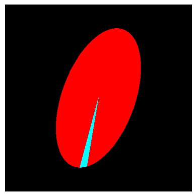
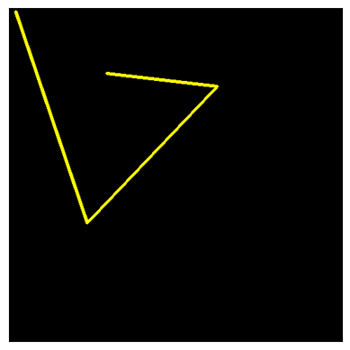

# Drawing Functions in OpenCV

> 맨 아래의 참고 자료에서 ipynb 를 실행하면서 살펴보길 권함.

## Goal

OpenCV 를 이용하여 선,원, 사각형, 글자 등을 그리는 방법을 배운다.

실질적으로 다음의 함수들을 사용하는 법을 배운다. :

* `cv2.line()`
* `cv2.circle()`
* `cv2.rectangle()`
* `cv2.ellipse()`
* `cv2.putText()`

---

## Common Parameters

우리가 다루게 될 function들에서 자주 등장하는 common argument는 다음과 같음.

`img` 
: 실제로 우리가 그리는 도형이나 글자가 그려질 image 객체.  
numpy의 ndarray 객체임.

`color`
: 도형이나 글자의 색.  
컬러 이미지의 경우 BGR로 지정되고, gray-scale인 경우는 scalar값으로 처리 가능함.  
tuple로 Blue, Green, Red 의 값을 [0,255] 로 기재하는 형태로 주는 것을 권함.

`thickness` 
: 도형 등의 line(선)의 두께. 만일 -1이 넘겨질 경우 채워줘서 그려짐 (또는 `cv2.FILLED` 로 지정).  
default thickness = `1`

`lineType` 
: 선의 형태, `cv2.LINE_4`(4-connected), `cv2.LINE_8`(8-connected), `cv2.LINE_AA` (anti-aliased line) 중에서 선택.  
default line type = `cv2.LINE_8`.

---

## Drawing Line

`cv2.line`을 이용하여 라인을 그린다.  

* 시작점, 
* 끝점, 
* 선의 두께, 
* 색 

등을 argument로 넘겨줌.

다음 예제를 보자.

```Python
import numpy as np
import cv2

# Create a black image
img = np.zeros((512,512,3), np.uint8)

# Draw a diagonal blue line with thickness of 5 px
img = cv2.line(img,
               (0,0),       # pnt0
               (511,511),   # pnt1
               (255,0,0),   # color
               5            # thickness
               )
```

다음을 통해 line(선)을 확인 가능함.

```Python
from matplotlib import pyplot as plt

imt2 = img[:,:,::-1].copy() //BGR to RGB
plt.imshow(img2)
plt.xticks([]); plt.yticks([]) # to hide tick values on X and Y axis
plt.show()
```

다음은 결과 이미지임.

<figure markdown>
{width=“300” align=“center”}
</figure>

---

## Drawing Rectangle

사각형을 그리기 위해서, 

* **top-left corner** 와  
* **bottom-right corner of rectangle** 를 

arguments 로 넘겨줌.

다음 예제를 참고하라.

```Python
import numpy as np
import cv2

# Create a black image
img = np.zeros((512,512,3), np.uint8)

img = cv2.rectangle(img,       # 그려지는 대상. 
                    (384,0),   # top-left
                    (510,128), # bottom-right
                    (0,255,0), # color, BGR
                    3          # thickness
                    )
```

다음 조각코드로 오른쪽 상단에 사각형을 확인할 수 있음.

```Python
from matplotlib import pyplot as plt

img2 = img[:,:,::-1].copy() //BGR to RGB for matplotlib
plt.imshow(img2)
plt.xticks([]); plt.yticks([]) # to hide tick values on X and Y axis
plt.show()
```

다음은 결과 이미지임.

<figure markdown>
{width=“300” align=“center”}
</figure>

---

## Drawing Circle

원을 그리는 경우,  

* `center`의 좌표와 
* `radius`를 

argument로 넘겨줌.

다음 예제를 보자.

```Python
import numpy as np
import cv2

# Create a black image
img = np.zeros((512,512,3), np.uint8)

img = cv2.circle(img,         # target image
                 (447,63),    # center
                 63,          # radius
                 (0,0,255),   # color
                 cv2.FILLED,  # thickness : -1 means cv2.FILLED
                 )
print(f'{cv2.FILLED:d}')                 
```

다음 조각코드로 오른쪽 상단에 red circle(원)을 확인할 수 있음.

```Python
from matplotlib import pyplot as plt

img2 = img[:,:,::-1].copy() //BGR to RGB for matplotlib
plt.imshow(img2)
plt.xticks([]); plt.yticks([]) # to hide tick values on X and Y axis
plt.show()
```

다음 결과를 확인할 것.

<figure markdown>
{width=“300” align=“center”}
</figure>

---

## Drawing Ellipse

타원(ellipse)을 그리기 위한 arguments는 다음과 같음. 

* 타원의 중점 좌표 : `(x,y)`. 
* 타원의 first axis과 second axis의 길이 : `(first axis length, second axis length)`.
    * first axis를 major axis (`장축`) 으로도 지칭하는 경우도 있는데 엄밀히는 조금 틀린 명칭임
    * major axis 는 장축을 의미하지만, openCV에서 first axis는 second axis보다 길이가 짧을 수 있음  .
    * first axis 는 ellipse의 회전 각도 `angle`이 0 인 경우 x-axis 가 되는 축임.
    * second axis 는 ellipse의 회전 각도 `angle`이 0 인 경우 y-axis 가 되는 축임.
* 타원의 회전 각도 : `angle`  (**clockwise direction** and **degrees**). 
    * first axis와 x-axis의 각도. 
    * 아래 그림 참조할 것.
* 타원의 arc (호)를 그리기 위한 시작각과 끝각을 argument로 받음 :`startAngle` and `endAngle` 
    * clockwise direction
    * degree 로 지정됨.
    * major axis(or first axis)가  x-axis 를 기준으로 회전한 이후의 시작 각도가 더해지는 방식. 

> For more details, check the documentation of `cv2.ellipse()`. 

<figure markdown>
{width="500" align="center"}
</figure>

* first axis와 second axis의 길이는 타원의 중심에서 타원의 각 축과의 거리임(원의 반지름에 해당)
* 위 그림에서는 `AXES.WIDTH` , `AXES.HEIGHT` 로 기재됨 (왼쪽 그림에서 `AXES.WIDTH`의 길이 확인할 것.).

다음 예제를 살펴보자.

```Python
img = np.zeros((512,512,3), np.uint8)
img = cv2.ellipse(img,
                  (256,256), # center
                  (100,200), # first axis length, second axis length : radius
                  20,        # rotation angle (CW)
                  70,        # start angle (CW)
                  80,        # end angle (CW)
                  255,       # color (gray-scale or [255,0,0]과 같음.) 
                  -1         # filled 
                  )
```

arc를 그리지 않는 경우는 다음의 같이 사용하기도 함.

```Python
img = np.zeros((512,512,3), np.uint8)
img = cv2.ellipse(img,
                  [
                    (256,256), # center
                    (200,400), # bounding box width, bounding box height
                    20,       # rotation angle (CW)
                  ],
                  [0,0,255],   # color  
                  -1           # filled (-1) or thickness (0 초과 양수) 
                  )
```

* 이 경우, 2nd argument가 ellipse에 대한 정보를 다 가지고 있음.
* 이 전의 경우와 달리, 타원을 둘러싸는 bounding box의 넓이와 높이로 주어짐: (즉, 지름에 해당한다고 생각할 것.)
  * 이 전과 같아지려며 2배를 해 줘야 함.
* `cv2.fitEllipse` 로 contour를 둘러싸는 타원을 계산할 때의 반환값이 바로 2nd argument로 들어가는 정보임. 

ref. : [fitEllipse](../ch02/dip_contour_features.md#fitting-an-ellipse)

다음 조각코드 수행시 중앙에 타원이 보인다. (arc가 일부만 되도록 한 부분 주의할 것.)

```Python
from matplotlib import pyplot as plt

img2 = img[:,:,::-1].copy() //BGR to RGB for matplotlib
plt.imshow(img2)
plt.xticks([]); plt.yticks([]) # to hide tick values on X and Y axis
plt.show()
```

위의 2코드를 동시에 그린 결과는 다음과 같음: (arc를 그리는 예를 수행한 결과임)

<figure markdown>
{width=“300” align=“center”}
</figure>


---

## Drawing Polygon

다각형을 그리는 방법은 다음과 같음.

* 우선 각 vertex의 좌표들의 ndarray를 생성. (`rows x 2`)
* 해당 ndarray를 `rows x 1 x 2` 로 reshape를 시킨다. `rows`는 vertex들의 숫자에 해당.  
* 해당 ndarray는 `int32` 를 dtype로 가짐.

> 사실, 위의 내용은 tutorial의 내용이나, 실제로 reshape를 하지 않고도 동작함.

다음의 예제를 참고.

```Python
pts = np.array([[10,5],[120,330],[320,120],[150,100]], 
               np.int32) # x,y
print(pts.shape)

# pts = pts.reshape((-1,1,2)) #openCV 튜토리얼에서 권하는 구현이나 생략해도 그려짐.
print(pts.shape)

img = cv2.polylines(img,        # target image
                    [pts],      # vertices
                    True,       # isClosed (닫혔는지여부)
                    (0,255,255),# color
                    1,          # thickness
                    )
```

다음의 조각코드를 수행하여 확인 가능함.  
4개의 점이 연결된 다각형이 그려짐.

```Python
from matplotlib import pyplot as plt

img2 = img[:,:,::-1].copy() //BGR to RGB for matplotlib
plt.imshow(img2)
plt.xticks([]); plt.yticks([]) # to hide tick values on X and Y axis
plt.show()
```

결과 이미지는 다음과 같음.

<figure markdown>
{width=“300” align=“center”}
</figure>

---

### Note0 : `cv2.polylines`

`cv2.polylines`의 세번째 argument 가 `False`이면  
닫힌 다각형이 아닌 **"끝점과 시작점이 연결이 안 된 상태"** 로 그려짐을 확인할 수 있음.

```Python
test_img = np.zeros_like(img)
test_img = cv2.polylines(test_img,[pts],False,(0,255,255),4)

img2 = test_img[:,:,::-1].copy()
plt.imshow(img2,interpolation='bicubic'
           )
plt.xticks([]); plt.yticks([]) # to hide tick values on X and Y axis
plt.show()
```

결과 이미지는 다음과 같음

<figure markdown>
{width=“200” align=“center”}
</figure>

---

### Note1 : `cv2.polylines` 의 용도

> `cv2.polylines()` 은 실제로 ***여러 개의 라인을 그리는데 사용*** 된다.
>
> 여러 선에 해당하는 list를 argument로 넘기면 해당 선들이 그려진다.  
> `cv2.line()` 을 여러번 호출하는 것보다 처리 효율이 좋다.

다음 코드를 통해 사용 방법을 익혀보자.


```Python
pts0 = np.array(
    [[3,3],[3,13]]
    ,np.int32).reshape(-1,1,2)
pts1 = np.array(
    [[10,3],[10,13]]
    , np.int32).reshape(-1,1,2)
pts2 = np.array(
    [[17,3],[17,13]]
    , np.int32).reshape(-1,1,2)
print(np.array([pts0,pts1,pts2]).shape) # (3, 2, 1, 2)

test_img = np.zeros((50,80,3), np.uint8)
test_img = cv2.polylines(test_img,[pts0,pts1,pts2],False,(0,255,255))

img2 = test_img[:,:,::-2].copy()
plt.imshow(img2, interpolation='bicubic')
plt.xticks([]); plt.yticks([]) # to hide tick values on X and Y axis
plt.show()
```

결과 이미지는 다음과 같음.

<figure markdown>
{width=“300” align=“center”}
</figure>

---

## 꽉 찬 다각형 그리기.

보통 다음 두 가지 functions를 사용한다.

`cv2.fillConvexPoly(img,points,color)`
: points에 저장된 좌표로 이루어진 볼록다각형을 color로 채운다.  
fillPoly보다 빠르지만, 오목한 경우 다르게 칠해진다.

`cv2.fillPoly(img,contours,color)`
: ^^하나 이상의 다각형^^ 을 color 색상으로 칠한다.  
`contours=[points_of_contour0, ...]`

일반적으로 contour 등을 구한 경우, 경계좌표 들로 라벨링을 해야할 때 위 2개의 함수가 이용되는데  
`fillConvexPoly`는 하나의 ***볼록 다각형을 가정*** 하기 때문에  
오목한 경우 제대로 그려지지 않는 경우가 많다.

가급적 `fillPoly` 또는 `cv2.drawContours`를 사용하는 것이 좋다.

> 참고 : [cv2.drawContours](../ch02/dip_contour_basic.md#cv2drawcontours--contour-표시하기)

* `fillPoly` 와 `cv2.drawContours`는 ***여러 개*** 의 꽉 찬 다각형을 처리하도록 구현됨.
  * `list` 로 여러 다각형을 한 번에 넘김.
* `fillConvexPoly`는 ^^하나의^^ 꽉찬 볼록 다각형을 그리는 것으로 구현됨.
  * 하나의 다각형만을 argument로 넘김 (pnt 로 구성된 `list`)

다음 예제를 참고할 것..

```Python
import cv2
import numpy as np
import matplotlib.pyplot as plt

src = np.zeros((300, 300, 3), dtype=np.uint8)

img = src.copy()
points = np.array(
    [[100, 50], [200, 100], 
     [200, 140], [50, 250], [130,100], 
     [270, 120], [220, 50],
     [100, 60]
     ])
points_a = np.array([[5,5], [10,10], [5,30]])

img = cv2.fillPoly(img, [points,points_a], color=(0, 255, 0))
img2 = img[:,:,::-1].copy()
plt.imshow(img2)

img = src.copy()
img = cv2.fillConvexPoly(img, points, color=(0, 255, 0))
img2 = img[:,:,::-1].copy()
plt.figure()
plt.imshow(img2)
```

* `cv2.fillPoly`는 여러 개의 다각형을 그리므로 넘겨지는 것이 다각형들의 꼭지점을 가진 list들의 list임 : `[points,points_a]`.
* `cv2.fillConvexPoly`는 하나의 다각형에 대한 꼭지점들의 list가 넘겨진다.
* 이 예제에서는 ^^오목형 다각형^^ 이라 `cv2.fillConvexPoly`는 제대로 그려지지 않음을 확인할 수 있음.

다음 코드는 `cv2.fillConvexPoly`의 사용법을 같이 보여준다.

```Python
src = np.zeros((3000, 3000, 3), dtype=np.uint8)
img = src.copy()

points = np.array([
   [2148,  687],[2120,  658],[2100,  650],[2062,  631],
   [2028,  596],[1994,  580],[1978,  580],[1938,  557],[1914,  519],
   [1877,  491],[1845,  485],[1825,  468],[1785,  466],[1747,  470],
   [1716,  481],[1687,  494],[1648,  535],[1626,  573],[1598,  604],
   [1597,  640],[1597,  687],[1574,  727],[1578,  782],[1582,  816],
   [1593,  849],[1597,  866],[1605,  895],[1598,  947],[1589,  978],
   [1566, 1043],[1546, 1067],[1518, 1080],[1506, 1104],[1482, 1148],
   [1481, 1227],[1484, 1251],[1498, 1271],[1498, 1289],[1514, 1310],
   [1544, 1331],[1554, 1350],[1546, 1433],[1536, 1481],[1521, 1504],
   [1518, 1548],[1510, 1579],[1508, 1606],[1512, 1647],[1493, 1698],
   [1493, 1739],[1504, 1752],[1525, 1784],[1548, 1836],[1557, 1853],
   [1574, 1872],[1567, 1889],[1581, 1917],[1563, 1946],[1566, 1971],
   [1577, 1978],[1577, 1998],[1585, 2014],[1602, 2032],[1621, 2112],
   [1631, 2147],[1642, 2184],[1647, 2213],[1663, 2271],[1688, 2305],
   [1720, 2339],[1763, 2366],[1821, 2394],[1846, 2399],[1888, 2376],
   [1930, 2185],[1946, 2136],[1951, 2117],[1974, 1993],[1805, 1662],
   [2010, 1562],[1910, 1425],[1993, 1387],[1933, 1255],[1951,  970],
   [2035, 1215],[2163, 1273],[2230, 1109],[2468, 1104],[2581, 1306],
   [2675, 1226],[2609, 1118],[2588, 1040],[2561, 1000],[2528,  976],
   [2484,  976],[2456,  984],[2384,  960],[2347,  834],[2306,  824],
   [2269,  794],[2242,  789],[2198,  744],[2176,  736],[2173,  731]])

print(points.shape)

# points가 리스트에 다시 담겨서 argument넘겨짐. 주의.
img = cv2.drawContours(img, [points], -1, (255,255,255), thickness=-1)
plt.figure()
plt.title('drawContours')
plt.xticks([]);plt.yticks([])
img2 = img[:,:,::-1].copy()
plt.imshow(img2)

img = src.copy()
cv2.fillPoly(img, [points], color=(0, 255, 0)) # points 가 list에 담겨서 
plt.figure()
plt.title('fillPoly')
plt.xticks([]);plt.yticks([])
img2 = img[:,:,::-1].copy()
plt.imshow(img2)

img = src.copy()
cv2.fillConvexPoly(img, points, color=(0, 255, 0)) # points가 직접 arguments로.
plt.figure()
plt.title('fillConvexPoly')
plt.xticks([]);plt.yticks([])
img2 = img[:,:,::-1].copy()
plt.imshow(img2)
```

결과는 다음과 같음

<figure markdown>
{width=500}
</figure>

---

## Adding Text to Images:

> 우선 한글 폰트를 넣기가 꽤 까다롭다. --;;  
> matplotlib 또는 Pillow가 훨씬 편함.  
> `cv2.putText`는 Unicode 지원이 잘 안되는게 단점임.

image에 글자를 추가하려면 다음과 같이 처리한다.

* 우선 글자에 해당하는 문자열 데이터 생성.
* `bottom-left corner`로 해당 text 가 놓일 위치를 지정.
* `Font type` 을 지정. (Check `cv2.putText()` docs for supported fonts)
* `Font Scale` 을 지정. (specifies the size of font)
* `color`, `thickness`, `lineType` 등을 지정.

> For better look, `lineType = cv2.LINE_AA` is recommended.

다음 예제를 참고하라.

```Python
font = cv2.FONT_HERSHEY_SIMPLEX

img = np.zeros((512,512,3),dtype=np.uint8)
img = cv2.putText(img,
                  'OpenCV 한글',   # text
                  (10,300),       # location
                  font,           # font Type
                  2,              # font size
                  (255,255,255),  # color
                  2,              # thickness
                  cv2.LINE_AA     # lineType
                  )
```

다음 code snippet (조각코드)로 결과를 확인할 수 있다.

```Python
from matplotlib import pyplot as plt

img2 = img[:,:,::-1].copy()
plt.imshow(img2,interpolation='bicubic')
plt.xticks([]); plt.yticks([]) # to hide tick values on X and Y axis
plt.show()
```

결과는 다음과 같음.

<figure markdown>
{width=500}
</figure>
---

## 관련 자료

* [관련 ipynb파일](https://github.com/dsaint31x/OpenCV_Python_Tutorial/blob/master/DIP/DIP_00_02_Drawing%20Functions%20in%20OpenCV.ipynb)
* [OpenCV Tutorials](https://docs.opencv.org/4.x/dc/da5/tutorial_py_drawing_functions.html)