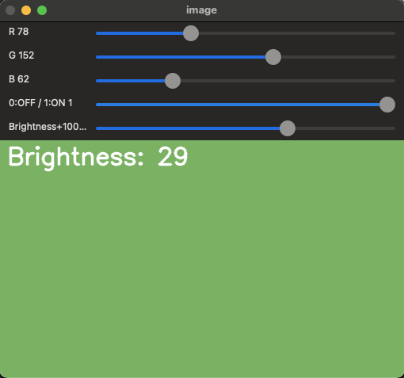

# Trackbar as the Color Palette

> 이 문서의 코드는 `cv2.imshow`가 가능한 local 서버에서 동작하는 jupyter note 등을 대상으로 구현됨.  
> Colab 이나 원격지 서버에서 동작중인 jupyter note등에서는 동작하지 않음.

## Goal

OpenCV windows에서 ***trackbar*** 연동하는 방법을 익힌다.

실제로 배우는 function은 다음과 같다.

* `cv2.createTrackbar()` : Trackbar 생성.
* `cv2.getTrackbarPos()` : 호출 당시의 trackbar의 값을 얻어오기 위해 사용됨.
* `cv2.setTrackbarMin()` : Trackbar 의 최소값을 설정.

## Code Demo

color를 조절하는 trackbar 3개와 조절여부를 on/off시키는 trackbar 1개로 구성된 간단한 application 코드를 통해 tackbar를 OpenCV window에서 다루는 법을 익힌다.
B,G,R colors 별로 trackbar하나씩이 할당되며, on/off 시키는 trackbar (0,1사이의 값을 가짐)로 구성됨.

 ```Python
 cv2.createTrackbar(
    trackbar_name, 
    win_name, 
    def_val, 
    max_val, 
    callback_func)
 ``` 

* `trackbar_name` : trackbar name임. 
* `win_name` : trackbar가 부착될 window의 이름.
* `def_val` : trackbar의 기본값. (0이상, `max_val`이하, int)
* `max_val` : the maximum value. (minimum value는 따로 설정하지 않는 경우 기본이 0임, int)
* `callback_func` : trackbar의 값이 변경될 때 호출되는 callback function 
    * 연결된 callback function 은 기본 argument로 현재 trackbar의 위치(값)을 가짐.
    
> In our case, function does nothing, so we simply pass.


```Python
cv2.getTrackbarPos(
    trackbar_name, 
    win_name)
```

* `trackbar_name` : 값을 얻어올 trackbar name
* `win_name` : trackbar가 속한 window_name


```Python
cv2.setTrackbarMin(
    trackbar_name, 
    win_name, 
    min_val)
``` 

* `trackbar_name` : 값을 얻어올 trackbar name
* `win_name` : trackbar가 속한 window_name
* `min_val` : trackbar에서 선택가능한 최소값. (int형)

**OpenCV** 에서는 button이나 switch에 해당하는 GUI component를 제공하지 않음 (정말 test용으로 사용가능한 최소한의 GUI만 만들 수 있도록 제공해줌).

때문에, 예제 중 on/off 기능의 trackbar를 활용하여 button등으로 사용해야한다.

```Python
import cv2
import numpy as np

def nothing(x):
    pass

def on_brightness_change(val):
    global brightness 
    brightness = val-100 # trackbar의 값을 [-100,100] 으로

# Create a black image, a window
img = np.zeros((300,512,3), np.uint8)
cv2.namedWindow('image')

# create trackbars for color change
cv2.createTrackbar('R','image',0,255,nothing)
cv2.createTrackbar('G','image',0,255,nothing)
cv2.createTrackbar('B','image',0,255,nothing)

# create switch for ON/OFF functionality
switch = '0:OFF / 1:ON'
cv2.createTrackbar(switch, 'image',0,1,nothing)
 
# create brightness for testing callback func
brightness = 0
cv2.createTrackbar('Brightness+100', 'image', brightness+100, 200, on_brightness_change)


while(1):

    # get current positions of four trackbars
    r = cv2.getTrackbarPos('R','image')
    g = cv2.getTrackbarPos('G','image')
    b = cv2.getTrackbarPos('B','image')
    s = cv2.getTrackbarPos(switch,'image')

    if s == 0:
        img[:] = 0
    else:
        img[:] = [b,g,r]
        img = cv2.convertScaleAbs(img, alpha=1., beta=brightness)
        cv2.putText(img, f'Brightness: {brightness}', (10, 30), 
                    cv2.FONT_HERSHEY_SIMPLEX, 1, (255, 255, 255), 2, cv2.LINE_AA)
    
    cv2.imshow('image',img)
    k = cv2.waitKey(10) & 0xFF
    if k == 27:
        break
    if cv2.getWindowProperty('image', cv2.WND_PROP_VISIBLE ) <1:
        break

cv2.destroyAllWindows()
```

수행시 나오는 window임.

<figure markdown>
{width="300"}
</figure>

---

## 관련 자료

* [관련 ipynb파일](https://github.com/dsaint31x/OpenCV_Python_Tutorial/blob/master/DIP/DIP_00_04_Trackbar%20as%20the%20Color%20Palette.ipynb)
* [OpenCV Tutorial](https://docs.opencv.org/4.x/d9/dc8/tutorial_py_trackbar.html)