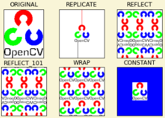

# OpenCV에서 Padding

image를 특정 사이즈로 padding해야할 경우에는 `cv2.copyMakeBorder()` 함수를 사용하면 된다.

`ret = cv2.copyMakeBorder(src, top, bottom, left, right, padding_type, value)`

* `src` : input image
* `top` : 위로 padding할 pixel 수.
* `bottom` : 아래로 padding할 pixel 수.
* `left` : 왼쪽으로 padding할 pixel 수.
* `right` : 오른쪽으로 padding할 pixel 수.
* `padding_type` : padding을 어떻게 수행할지를 나타내는 flag.
    * `cv2.BORDER_CONSTANT` - 상수로 padding. 어떤 상수로 채울지는 다음에 놓이는 `value`로 결정됨.
    * `cv2.BORDER_REFLECT` - padding이 시작하는 부분이 마치 거울인 것처럼 처리하여 padding을 수행함. 다음을 참고하면 `|abcedfgh|`가 원본이고 `|`가 원본의 경계로 padding이 시작되는 부분이라고 하면 결과가 다음과 같이 나온다. : `fedcba|abcdefgh|hgfedcb`
    * `cv2.BORDER_REFLECT_101` or `cv2.BORDER_DEFAULT` - `cv2.BORDER_REFLECT`와 거의 유사한데, 원본에서 양 끝에 있는 pixel들의 값은 padding에 사용하지 않는 차이만 있음. (OpenCV에서 기본값임). 다음을 참고 : `gfedcb|abcdefgh|gfedcba`
    * `cv2.BORDER_REPLICATE` - padding이 이루어지는 곳에 가장 가까운 pixel의 값을 계속 복제하여 사용. 다음을 참고 : `aaaaaa|abcdefgh|hhhhhhh`
    * `cv2.BORDER_WRAP` - padding하는 값에 맞게 반복되도록 처리. 다음을 참고 : `cdefgh|abcdefgh|abcdefg`
* `value` : `cv2.BORDER_CONSTANT`으로 `padding_type`가 선택된 경우, 채울 값에 해당함.

다음의 예제와 결과를 보면, padding 방식의 차이를 알 수 있음.

```Python
import cv2
import numpy as np
from matplotlib import pyplot as plt

BLUE = [255,0,0] #BGR

fstr = './DIP/img/opencv_logo.png'
fstr = './img/opencv_logo.png'

# ----------------------------
# Covnert the transparent part of PNG into white
img1 = cv2.imread(fstr,cv2.IMREAD_UNCHANGED)
alpha_channel = img1[:, :, 3]
_, mask = cv2.threshold(alpha_channel, 254, 255, cv2.THRESH_BINARY)  # binarize mask
color = img1[:, :, :3]
img1 = cv2.bitwise_not(cv2.bitwise_not(color, mask=mask))

print(img1.shape)

replicate  = cv2.copyMakeBorder(img1,100,100,100,100,cv2.BORDER_REPLICATE)
reflect    = cv2.copyMakeBorder(img1,100,100,100,100,cv2.BORDER_REFLECT)
reflect101 = cv2.copyMakeBorder(img1,100,100,100,100,cv2.BORDER_REFLECT_101)
wrap       = cv2.copyMakeBorder(img1,100,100,100,100,cv2.BORDER_WRAP)
constant   = cv2.copyMakeBorder(img1,100,100,100,100,cv2.BORDER_CONSTANT,value=BLUE)


#for matplotlib
img1       = img1[:,:,::-1]    
replicate  = replicate[:,:,::-1]
reflect    = reflect[:,:,::-1]
reflect101 = reflect101[:,:,::-1]
wrap       = wrap[:,:,::-1]
constant   = constant[:,:,::-1]


print('See the result above. (Image is displayed with matplotlib. So RED and BLUE planes will be interchanged):')
plt.subplot(231),plt.imshow(img1,'gray'),plt.title('ORIGINAL')
plt.xticks([]);plt.yticks([])
plt.subplot(232),plt.imshow(replicate,'gray'),plt.title('REPLICATE')
plt.xticks([]);plt.yticks([])
plt.subplot(233),plt.imshow(reflect,'gray'),plt.title('REFLECT')
plt.xticks([]);plt.yticks([])
plt.subplot(234),plt.imshow(reflect101,'gray'),plt.title('REFLECT_101')
plt.xticks([]);plt.yticks([])
plt.subplot(235),plt.imshow(wrap,'gray'),plt.title('WRAP')
plt.xticks([]);plt.yticks([])
plt.subplot(236),plt.imshow(constant,'gray'),plt.title('CONSTANT')
plt.xticks([]);plt.yticks([])
#plt.axis('off')

plt.show()
```




