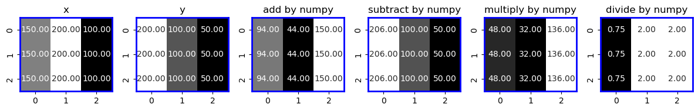
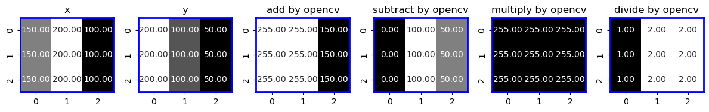
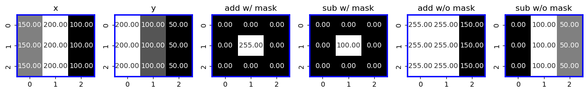

# Arithmetic Operations on Images

## Goal

Image에 적용가능한 다음의 연산들을 소개함.

* addition, 
* subtraction, 
* bitwise operations 
* etc.

> NumPy와 OpenCV의 차이점을 확인할 것.

---

---

## Image Addition

두 이미지를 더하는 방법 

* OpenCV의 `cv2.add()` 함수를 사용하는 방법
* 단순히 NumPy 연산 `res = img1 + img2`를 사용하는 방법

---

### NumPy 이용 결과

<figure markdown>
{width=500}
</figure>

```Python
import cv2
import numpy as np
import matplotlib.pyplot as plt
import seaborn as sns

x = np.uint8([250,250,250,250])
y = np.uint8([10,10,10,10])

# 250+10 = 260 => 255
print(cv2.add(x,y))

# 250+10 = 260 % 256 = 4
print(x+y)

# ----------------------

def show_heatmap(ax,title,img):
  ax.set_title(title)
  sns.heatmap(img,annot=True,fmt='.2f',cmap=plt.cm.gray, ax =ax, 
              cbar=False, linewidth=0, linecolor='blue')
  for spine in ax.spines.values():
    spine.set_visible(True)
    spine.set_edgecolor('blue')
    spine.set_linewidth(2)

x = np.array([[150,200,100],
              [150,200,100],
              [150,200,100]],
             dtype=np.uint8
             )
y = np.array([[200,100,50],
              [200,100,50],
              [200,100,50]],
             dtype=np.uint8)

add      = x + y
subtract = x - y
multiply = x * y
divide   = x / y


fig, axs = plt.subplots(1,6, figsize=(12,2))

show_heatmap(axs[0],'x',x)
show_heatmap(axs[1],'y',y)
show_heatmap(axs[2],'add by numpy',add)
show_heatmap(axs[3],'subtract by numpy',subtract)
show_heatmap(axs[4],'multiply by numpy', multiply)
show_heatmap(axs[5],'divide by numpy', divide)

plt.tight_layout()
plt.show()
```

---

### OpenCV

<figure markdown>
{width=500}
</figure>

```Python
add = cv2.add(x ,y)
sub = cv2.subtract(x, y)
mul = cv2.multiply(x ,y)
div = cv2.divide(x ,y)

fig, axs = plt.subplots(1,6, figsize=(12,2))

show_heatmap(axs[0],'x',x)
show_heatmap(axs[1],'y',y)
show_heatmap(axs[2],'add by opencv',add)
show_heatmap(axs[3],'subtract by opencv',sub)
show_heatmap(axs[4],'multiply by opencv', mul)
show_heatmap(axs[5],'divide by opencv', div)    # 200/3 = 66.666..... but in the case of opencv 200/3 = 67

plt.tight_layout()
plt.show()
```

addition과 subtration 에는 mask를 지원함. 곱셈과 나눗셈의 경우엔 따로 처리해야 함.

<figure markdown>
{width=500}
</figure>

```Python
mask = np.zeros(shape=(3,3), dtype=np.uint8)
mask[1,1] = 1

add_m = cv2.add(x,y,None,mask=mask)
sub_m = cv2.subtract(x,y,None,mask=mask)
add   = cv2.add(x,y,None,mask=None)
sub   = cv2.subtract(x,y,None,mask=None)


fig, axs = plt.subplots(1,6,figsize=(12,2))

show_heatmap(axs[0],'x',x)
show_heatmap(axs[1],'y',y)
show_heatmap(axs[2],'add w/ mask',add_m)
show_heatmap(axs[3],'sub w/ mask',sub_m)
show_heatmap(axs[4],'add w/o mask',add)
show_heatmap(axs[5],'sub w/o mask',sub)

# cv2.add(x,y,x,mask=mask) # the result of addition will be stored to x
# draw_subheatmap('mask',mask,'add',x)
plt.tight_layout()
plt.show()
```