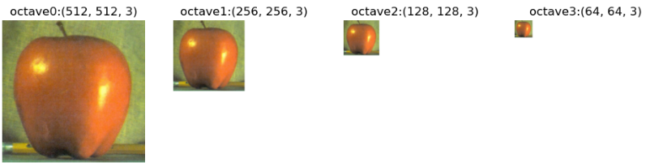

# Image Pyramid and Scale Space

다양한 scale에서 image를 분석해야하는 경우가 많다. 특히 feature extraction등의 경우 image scale에 따라 결과가 달라지는 경우가 많다. 영상 전체를 보는 큰 scale에서는 곡선이라도, scale을 줄여서 작은 영역을 자세히 보는 작은 scale에서는 직선처럼 보일 수 있다. 

scale은 한 pixel이 담고 있는 region의 크기라고도 생각할 수 있다. 만약 한 image에서 커버하고 있는 region은 유지하면서 scale이 커질 경우, 한 pixel이 실제로 커버하고 있는 영역이 커지므로 전체 pixel의 수는 줄어들고 image가 blurring된다. 반대로 scale이 작아질 경우는 pixel의 수가 늘어나고 좀 더 고해상도 영상이 된다.

때문에 image 처리시 scale이 매우 중요하며, 다양한 scale에서도 일관된 동작을 보장하기 위해서는 여러 scale의 image를 고려해야 한다.

다양한 scale의 image를 다루는 방법으로 가장 대표적인 것이 image pyramid와 scale space이다.

## Image Pyramids

raw image에 대해서 1/2 씩 작게 (or 크게) resize하여 피라미드 처럼 쌓는 방식이 바로 image pyramid임.

<figure markdown>
{width="400"}
<figcap>Illustration of an image pyramid with 5 levels (from Wikipedia)</figcap>
</figure>

scale space와 달리 down sampling이 같이 이루어진다. 즉, $\sigma=2$로 blurring을 수행하고나서 factor=2 인 downsampling을 수행하는 방식으로 image를 생성하여 위에 쌓아올린다. 즉, pyramid 맨 하단에 가장 scale이 작고 pixel수가 많은 image가 놓이고, 같은 region을 나타내나 2배 큰 scale을 가지면서 전체 pixel의 수는 $\frac{1}{4}=\frac{1}{2}\times \frac{1}{2}$인 image가 놓인다. down sampling이 없는 scale space에 비해 적은 용량을 차지한다.

상단의 image는 처리해야할 pixel 이 가장 적으면서도 target region의 전체적인 정보를 가지고 있으므로, 이를 먼저 처리하고 점점 더 fine한 정보가 필요하면 아래로 내려가는 방식의 처리가 가능하다. 마치 위성사진으로 전체 영역에서 필요한 부분을 찾고, 이후 특정 부분을 확대해서 보는 방식과 비슷하다.

좀 더 filter의 개념으로 본다면, 다음과 같이 생각할 수 있다.

> image를 여러 scale에서의 정보들로 분해하는 filter 기반의 repsentation이 바로 image pyramid이다.

### Gaussian Pyramid

Gaussian Pyramid는 OpenCV에서 `cv2.pyrDown`과 `cv2.pyrUp`을 통해 제공된다. OpenCV 튜토리얼 설명에 따르면, Lower layer의 5개의 pixel들 각각에 Gaussian weight들이 가해져서 upper layer의 1개의 pixel intensity가 결정된다. 위에서 설명한 것처럼 OpenCV의 pyramid 지원 function들에서는 factor-2의 down-sampling이 가해져서, Upper layer의 경우 1/4의 pixel로 구성되게 됨.

> Physics에서 octave란 용어는 진동수가 2배가 되는 경우를 의미한다. note(음)에서 pitch는 frequency에 의해 결정되는데, 같은 음이면서도 2배의 freq.를 가질 경우 한 octave가 올라갔다고 표현하는 것처럼, scale이 2배씩 차이가 나는 점을 이용하여 각 layer를 octave라고도 부른다.
> 
> scale이 2배 차이가 나는 layer의 경우 한 octave가 늘어났다고 애기한다. SIFT (Scale Invariant Feature Trnasformer) 등의 경우, 한 octave를 5개의 layer로 구성시키는데 한 ocatve에서 가장 맨 아래 layer와 그 위의 ocatve의 맨 아래 layer간의 scale의 차이가 2개가 난다고 이해하면 된다.

Gaussian pyramid에서 가장 기본적으로 처리될 때는 factor 2의 down-sampling이 이루어진다. 즉, 각각의 layer들이 한 octave에 해당한다.
이 경우 가장 많이 사용되는 filter의 weight은 $h=\frac{1}{16}[1,4,6,4,1]$ 또는 $h=\frac{1}{4}[1,2,1]$이다.

OpenCV에서 이를 구현한 function이 `cv2.pyrDown`이다. (`cv2.pyrUp`은 uppler layer에서 lower layer를 만드는 것으로 factor 2의 oversampling이 가해짐.)

4개의 octave로 구성된 Gaussian Pyramid 의 예이다.

이들을 같은 size로 조정하여 보면 다음과 같다.

