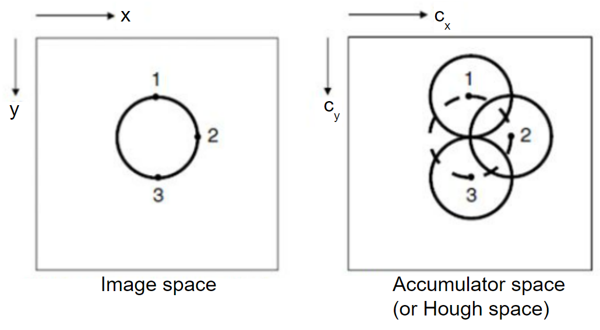
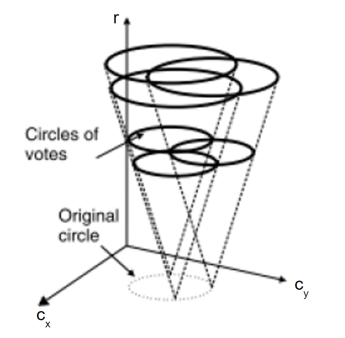
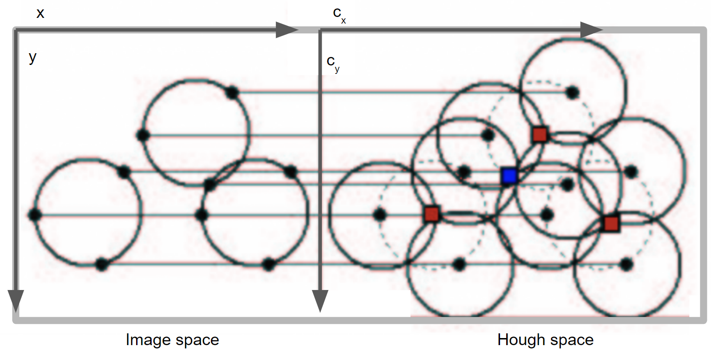
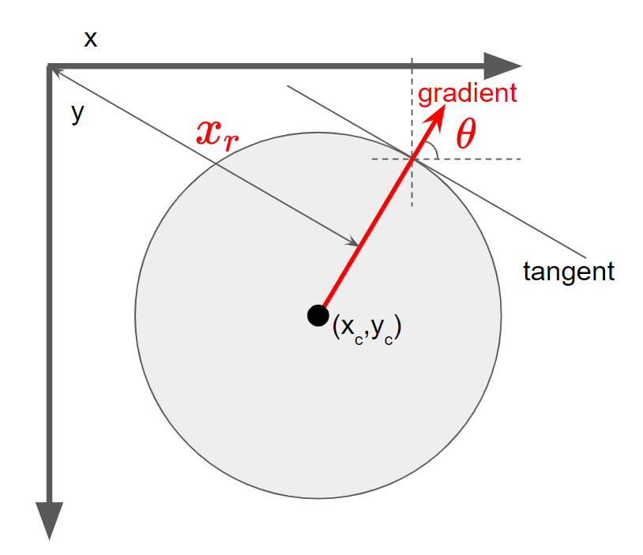
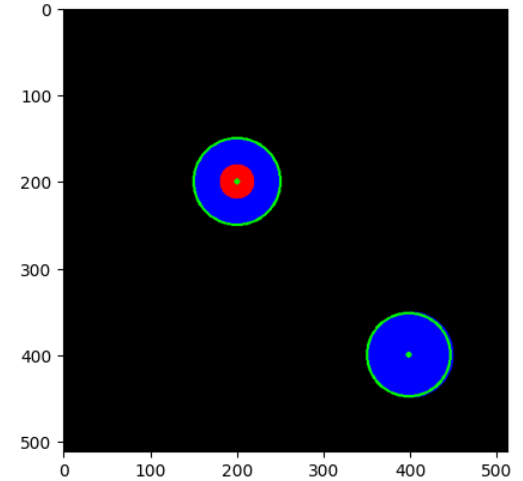

# Circle Hough Transform

Hough Transform은 image에서 line, circle 등의 간단한 도형을 찾는데 사용되는 방법임.


## Required Parameters : Circle Equation
우선 circle을 지정하는 parameter들이 무엇인지를 살펴보기 위해 원의 표준 방정식을 살펴본다.

$$
(x-x_c)^2 + (y-y_c)^2 = r^2
$$

where

* $x,y$ : image에서의 x-axis, y-axis에 대한 coordinate.
* $x_c, y_c$ : circle의 center에서의 x-axis, y-axis coordinate.
* $r$ : radius.

즉, $x_c, y_c, r$ 로 이루어진 3개의 parameter가 있으면 특정 circle을 지정할 수 있음.

## Hough Space

이전에 다룬 Line Hough Transform에서 radial distance와 angle이 line을 지정하는 parameter들이었기 때문에 2-Dimensional Parameter Space가 Hough transform의 결과였던 것처럼, circle의 경우 parameter가 3개가 나오기 때문에 3-Dimensional Parameter Space (or Hough space)가 변환의 결과가 됨.

## Preprocessing

일반적으로 Hough Transform을 실제로 수행하기 전에 이루어지는 전처리는 circle을 찾는 경우나 line을 찾는 경우나 큰 차이가 없음.

***Edge Detection (or extraction)***
: Canny algorithm을 통해 edge를 추출하여 edge는 1, 나머진 0 인 binary image를 얻어냄.

## The case of fixed radius

> 우선 radius를 고정하여 원의 중점 좌표만을 구하는 경우에서 출발한다. (보다 단순한 경우에서 출발하는 게 이해에 도움이 되므로...)

Canny algorithm으로 얻어낸 edge가 1이고 나머진 0인 binary image에서 edge인 pixel을 중점으로 삼아 고정된 radius로 circle을 결정하고 해당 circle에 속하는 pixel들의 값을 1씩 증가시킨다.

* edge가 추출된 binary image와 같은 width와 height를 가지면서 모든 pixel의 값이 0인 image를 생성.
* 해당 image에 대해 edge위치를 중점으로 하는 circle을 그림 (circle에 속하는 pixel값들을 1씩 증가시킴)

> edge에 속하는 pixel이 a,b에 대해 2개의 고정된 radius의 circle이 2개 그려지게 되고, 2개의 circle에서 동시에 속하는 pixel은 값이 2가 될 것임.

다음 그림은 이 동작을 보여줌.



* 왼쪽의 3개의 점은 하나의 원에 속하는 점들로 canny edge detection을 통해 이들 3개의 점만 1이고 나머진 0인 binary image가 얻어졌다고 가정함.
* 3개의 점들은 같은 중심을 공유하므로 이들을 각각 중점으로 원을 그리면 중심에 해당하는 pixel의 값은 3이 됨.
* 만일 canny edge detection으로 이미지 공간에서 원래의 원에 해당하는 모든 pixel들에 대해 Hough space에서 원을 그린다면 중점에 해당하는 pixel의 값이 가장 큰 값을 가지게 됨 (image space에서 circle에 속하는 pixel의 숫자와 같은 값을 가짐)

Hough transform의 결과를 특정 threshold로 binary image로 만들면, 원의 중심에 해당하는 pixel만 값을 가지는 결과를 얻어냄.

이는 radius를 고정해놓은 경우이므로 중심의 좌표를 얻었기 때문에 해당 원을 지정하는데 필요한 3가지 파라메터를 모두 구한 셈임.

## General case

앞서 애기한 부분은 radius가 고정된 경우로, radius를 고정하지 않은 경우엔 3차원의 Hough space에서 accumulated value를 가지는 voxel들을 얻게된다.



위의 그림은 3차원의 Hough space로 radius에 해당하는 축이 추가된 것을 보여준다. r축에 orthogonal plane들을 각각 살펴보면 radius가 고정되었던 경우에 해당하게 된다.

이 결과를 특정 threshold로 binarization을 하면 원의 중심에 해당하는 voxel들을 얻을 수 있고, 해당 voxel의 좌표에 해당하는 $c_x, c_y, r$을 통해 원래 image에서의 circle을 검출할 수 있다.

## src image 와의 비교의 필요성

다음 그림을 보면 여러 원이 존재하는 경우에 파란색 네모로 표시된 pixel에서도 중첩이 발생하여 없던 circle이 검출될 수 있음을 알 수 있음.



때문에 circle을 생성하고 나서 src 이미지와의 비교를 해야함.

## Hough Gradient Method

OpenCV에서는 앞서 설명한 방법 대신, Gradient를 이용하는 Hough gradient method를 사용함.

Canny로 얻은 binary edge image에서 edge pixel에서의 gradient들을 계산(Sobel filter사용)하고 해당 gradient에 해당하는 직선 (radial distance와 theta로 지정)을 지나는 pixel들의 값을 1로 증가시키는 방식으로 accumulation을 수행한다. 이를 통해 원의 중심 후보군을 얻을 수 있음. (특정 threshold로 thresholding을 통해)



얻어낸 원의 중심 후보군의 모든 위치들 각각에 대해, edge binary image의 pixel간의 거리를 구하고 이를 radius로 삼아 해당하는 $x_c, y_c, r$의 voxel의 값을 증가시키는 과정을 수행한다. 

위의 과정을 마치고나서 특정 threshold로 binarization을 수행하면 circle에 해당하는 $x_c, y_c, r$을 구할 수 있음.

앞서 살펴본 경우와 마찬가지로 src 이미지와 비교를 해서 가짜인 경우는 제거해야함. 

## Code Example for OpenCV

OpenCV는 `cv2.HoughCircles`를 통해 CHT를 제공한다.   
(내부적으로 Canny edge detection을 수행함.)

```Python
circles = cv2.HoughCircles(
    image, 
    method, 
    dp, 
    minDist
    [, param1
    [, param2
    [, minRadius
    [, maxRadius
    ]]]]])
```

* `image`: 8-bit grayscale input image
* `method`: `HOUGH_GRADIENT` 만 선택가능함. --;;
* `dp` : The inverse ratio of accumulator resolution and image resolution. `2`일 경우, Hough space의 width와 height가 원본대비 1/2로 줄어든다. 값이 클수록 scale이 커져서 큰 패턴을 찾게 됨.
* `minDist`: Minimum distance between the centers of the detected circles. 값이 작을수록 검출되는 circle의 수가 증가하나 거짓 circle을 찾을 확률도 커짐. `0`을 선택할 수 없으며 이는 OpenCV의 `HoughCircles`가 동심원을 검출하지 못하는 단점으로 이어짐.
* `param1`: The higher threshold of the two passed to the Canny edge detector (the lower canny threshold is twice smaller). 값이 작을수록 검출되는 circle의 수가 증가.
* `param2`: The accumulator threshold for the circle centers at the detection stage. 값이 작을수록 검출되는 circle의 수가 증가하나 거짓 circle을 찾을 확률도 증가함.
* `minRadius`: minimum radius that you expect. If unknown, put zero as default.
`maxRadius`: Default is 0. If <= 0, uses the maximum image dimension. If < 0, returns centers without finding the radius.

반환되는 `circles`는 $1 \times N \times 3$의 float list로 `N`은 검출된 circle의 수이고, 각각에 대해 $c_x, c_y, r$로 구성된다.

다음은 Test example임.

```Python
import numpy as np
import matplotlib.pyplot as plt
import cv2

# test image 그리기
img = np.zeros((512,512,3),dtype=np.uint8)
tmp = img.copy()
tmp = cv2.circle(tmp, (200,200), 50, [255,0,0], -1)
tmp = cv2.circle(tmp, (200,200), 20, [0,0,255], -1)
tmp = cv2.circle(tmp, (400,400), 50, [255,0,0], -1)
img = tmp.copy()
plt.imshow(tmp[:,:,::-1])

# grayscale image구하기.
tmp = img.copy()
src = cv2.cvtColor(tmp, cv2.COLOR_BGR2GRAY)
# edges = cv2.Canny(tmp, 100, 200)
# blur = cv2.GaussianBlur(edges, (5,5),0)
blur = cv2.GaussianBlur(src, (5,5),0)

plt.imshow(blur,cmap='gray')

# CHT 수행 
circles = cv2.HoughCircles(blur, 
                           cv2.HOUGH_GRADIENT,
                           1,
                           minRadius=20,
                           maxRadius=90,
                           minDist=50,
                           circles=None,
                           param1=100,
                           param2=10 
                           )
print(np.array(circles).shape) # num_of_circles x 1 x (c_x,c_y,r)

# 결과 확인
# detected circle에 초록색으로 표시하고, 중심은 붉은 색으로 표시.
tmp = img.copy()
if circles is not None:
  circles = np.array(np.around(circles), dtype=int)
  print(circles.shape)
  for c in circles[0]:
    print(c)
    cv2.circle(tmp, (c[0],c[1]), c[2], (0,255,0), 2)
    cv2.circle(tmp, (c[0],c[1]), 2, (0,255,0), 2)
plt.imshow(tmp)
```

결과는 다음과 같음.



## References

[Hough Gradient Method](https://theailearner.com/tag/hough-gradient-method/)

