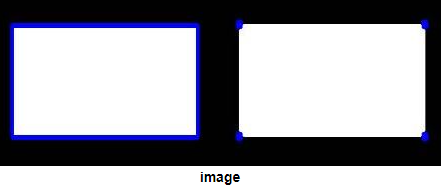
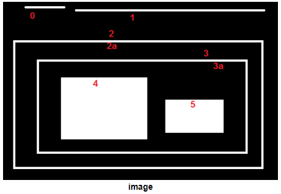
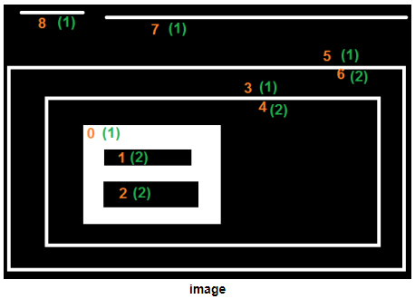
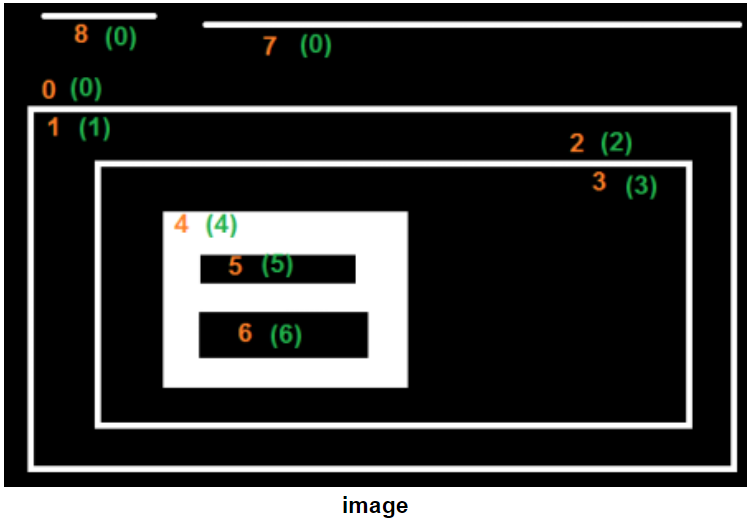

# Contour

## Contour 란

영상에서 **같은 color** 또는 **같은 intensity** 의 **연속된 점으로 구성된 곡선.**

다음의 분야에서 매우 중요하게 사용되는 tool임.

- Object detection and recognition
- Shape Analysis

일반적으로 등고선, 윤곽선, 외곽선 등으로 번역됨.

> ***Contours*** can be explained simply as
> 
> 
> ***a curve*** joining all the **continuous** points (along the boundary), having 
> 
> - same color or
> - intensity

---

---

## Binary Image와의 관계.

정확도 등을 위해 binary image상에서 구해지는게 일반적임.

- 때문에, thresholding이나 Canny edge detection 등이 전처리로 수반됨.

> OpenCV Tutorial에 따르면,  
> black background에서 white object를 찾는 것과  
> contour를 찾는게 같다고 표현하고 있음.  
> 즉, binary image를 source로 하며 object를 255의 값으로 background를 0으로 처리한 후 OpenCV에서 제공하는 contour 관련 function을 사용해야함.

Binary image에 한정할 경우, contours는 

* 같은 intensity를 가지는 한 object의 
* shape에 대한 boundary를 가리킨다.

---

---

## OpenCV에서 지원하는 관련 함수.

### `cv2.findContours` : Contour 산출

OpenCV에서 contour를 찾기 위해 제공하는 함수는 cv2.findContour로 사용법은 다음과 같음.

```Python
contours, hierarchy = cv2.findContours(
                            src, 
                            mode, 
                            method, 
                            contours, 
                            hierarchy, 
                            offset
)
```

- **src**: input image (←binary image)
- **mode**: Contour retrieval mode
    - `cv2.RETR_LIST`: 모든 contour를 포함관계를 고려한 hierarchy (계층) 없이 생성,
    - `cv2.RETR_EXTERNAL`: 가장 바깥쪽 contour만 생성,
    - `cv2.RETR_CCOMP`: 모든 contour을 2 계층 으로 생성,
    - `cv2.RETR_TREE`: 모든 라인의 모든 계층 정보를 `Tree` 구조로 생성
- **method**:  Contour approximation method (근사치를 구하는 방식)
    - `cv2.CHAIN_APPROX_NONE`: 근사 없이 모든 좌표 제공,
    - `cv2.CHAIN_APPROX_SIMPLE`: contour의 꼭짓점 좌표만 제공,
    - `cv2.CHAIN_APPROX_TC89_L1`: Teh-Chin 알고리즘으로 좌표 개수 축소,
    - `cv2.CHAIN_APPROX_TC89_KCOS`: Teh-Chin 알고리즘으로 좌표 개수 축소
- **contours**(optional): 검출한 contour 좌표 (list type) : **Output**
    - list의 각 element들은 contour를 의미하며,
    - 각 element는 NumPy의 ndarray 객체임 (=Numpy array of (x,y) coordinates of boundary points of the object).
- **hierarchy**(optional): contour 의 계층 정보 : Contour Hierarchy로 지칭됨. **Output**
    - 각 contour들은 다음 4개의 element로 구성된 array를 가짐(계층구조 파악을 위해)
        - `Next` : 같은 level의 다음 contour를 가리킴.
        - `Prev` : 같은 level의 그 전 contour를 가리킴.
        - `FirstChild` : 아래 level(현 contour에 포함된 contour들)에서의 첫번째 contourn를 가리킴.
        - `Parent` : 위 level(현 contour를 포함하고 있는 contour)를 가리킴.
    - `-1`  : 각 index들이 해당하는 경우를 가지지 않는 경우 `-1`을 가짐. (최상위 contour의 경우 , `Parent=-1` 가 됨.)
- **offset**(optional): ROI 등으로 인해 이동한 컨투어 좌표의 오프셋. **Output**

---

### `cv2.drawContours` : Contour 표시하기

contours에 해당하는 list 객체를 이용하여 간단하게 contour를 대상 image에 표시할 수 있게 해주는 helper function

```Python
cv2.drawContours(
          img, 
          contours, 
          contourIdx, 
          color, 
          thickness
)
```

- img: contour가 그려질 input image
- contours: contour들의 ndarray를 가지고 있는 list
    - `cv2.findContours()` 함수의 반환 결과를 전달하는게 일반적.
- contourIdx: contours list에서 실제 그릴 contour의 index,
    - `-1`: contours list내의 모든 contour를 그린다.
- color: 그릴 color
- thickness: 선 두께,
    - `0`: contour를 color로 채워서 그림.

---

### Example 0

전형적으로 contour를 계산하는 방식을 나타내는 예제 코드임.

```Python
import numpy as np
import cv2 as cv
im = cv.imread('test.jpg')
assert im is not None, "file could not be read, check with os.path.exists()"

imgray = cv.cvtColor(im, cv.COLOR_BGR2GRAY)
ret_thresh, bimg = cv.threshold(imgray, 127, 255, 0)

img = bimg.copy() # 가급적 원본을 복사해서 사용할 것.
contours, hierarchy = cv.findContours(
    img, 
    cv.RETR_TREE, 
    cv.CHAIN_APPROX_SIMPLE,
    )
```

---

### 참고: Contour Approximation Method

앞서 애기했지만, OpenCV에서 Binary image에 한정하여 contours를 정의한다. 

OpenCV에서 contours는 같은 intensity를 가지는 한 object의 shape에 대한 boundary를 가리키며, contour approximation method에 의해 boundary를 이루는 pixel들의 coordinate가 결정된다.

- `cv2.CHAIN_APPROX_NONE`:
    - contour를 구성하는 모든 pixel의 좌표 (x,y)들을 반환한다.
- `cv2.CHAIN_APPROX_SIMPLE`:
    - contour의 꼭짓점 좌표만 제공,
    - boundary가 직선들로 구성될 경우 유리함.
- `cv2.CHAIN_APPROX_TC89_L1`: Teh-Chin 알고리즘으로 좌표 개수 축소,
- `cv2.CHAIN_APPROX_TC89_KCOS`: Teh-Chin 알고리즘으로 좌표 개수 축소



* 오른쪽은 `cv2.CHAIN_APPROX_NONE`을 사용한 경우의 결과로 contour를 구성하는 모든 pixel을 반환하여, 각 pixel 위치마다 푸른색 원이 그려짐.
* 왼쪽은 `cv2.CHAIN_APPROX_SIMPLE`을 사용한 경우로, contour의 꼭지점 4개만이 반환됨.

---

### 참고 Output: Contours Hierarchy

`cv2.findContours()`는 image 내에 있는 여러 object를 검출하는데 사용될 수 있다. 이 경우, object들 중 일부가 다른 object에 포함되어 있는 경우 (nested figure)가 있다. 

이같은 nested figure에서 바깥쪽에서 다른 object를 포함하고 있는 object (outer one)를 `Parent`라고 부르고, 포함된 object (inner one)를 `Child`라고 지칭하고 각 object들간의 포함관계를 나타낸 representation이 바로 contours hierarchy 이다.

다음은 OpenCV Tutorial의 예제 image이다.



위의 예에서 0-5 까지 번호가 매겨진 shape들이 8개 보인다. ( `2`와 `2a` 는 external contour와 internal contour를 의미함.)

* 여기서 `0`, `1`, `2` 는 해당 object를 포함하고 있는 object가 없는 external object 또는 outer most  object라고 할 수 있다. 이들은 Parent가 -1로 지정된다.
* `2a` 는 `2` 에 포함된 contour이며, 때문에 `2a`의 Parent는 `2` 가 된다. (이는 `3`과 `3a` 에서도 똑같이 적용된다.)
* `3`은 `2`의 child이며 또 다른 하위 level의 hierarchy를 구성한다.  
* `4` 와 `5`는 같은 level에 속하고, 이들은 모든 같은 Parent를 가지고 있다.

---

---

## Contour Retrieval Mode

다음과 같이 다양한 모드가 지원되며, 이들에 따라 반환되는 hierarchy의 결과가 다름.

### `cv2.RETR_LIST`

모든 contour를 포함관계를 고려한 hierarchy (계층) 없이 생성한다. 계층적인 구조를 고려할 필요가 없을 때 사용한다.

- Parent-child 관계를 고려하지 않은 가장 간단한 형태의 contours hierarachy list를 출력한다
- list의 각 요소들에서 3번째(`First Child`), 4번째(`Parent`)의 값이 항상 `-1`임.

**Example**


```
>>> hierarchy
array([[[ 1, -1, -1, -1],
        [ 2,  0, -1, -1],
        [ 3,  1, -1, -1],
        [ 4,  2, -1, -1],
        [ 5,  3, -1, -1],
        [ 6,  4, -1, -1],
        [ 7,  5, -1, -1],
        [-1,  6, -1, -1]]])
```

---

### `cv2.RETR_EXTERNAL`

가장 바깥쪽 contour만 생성한다. (개인적으로는 이 경우가 `cv2.RETR_LIST`보다 단순하다고 생각한다.)

- OpenCV에서는 가장 바깥쪽 contour들이 속한 계층을, Hierarchy-0 level이라고 부름.

**Example**


```
>>> hierarchy
array([[[ 1, -1, -1, -1],
        [ 2,  0, -1, -1],
        [-1,  1, -1, -1]]])
```

* 0-2까지만 hierarchy 에 존재한다.

---

### `cv2.RETR_CCOMP`

모든 contour을 2 계층 으로 생성한다. (개인적으로 가장 잘 사용하지 않는 방식이고 처음 보면 생소하다.)

- 일단, 모든 contours를 2 level hierarchy로 배치한다. (이 모드는 object간의 포함이라기 보다는 하나의 object내에서의 포함관계에 집중을 하고 있다고 볼 수 있다.)
- 하나의 object에서 가장 바깥쪽 contour는 hierarchy-1에 속하고, object내에 있는 hole(black의 값을 가짐)을 나타내는 contour들은 hierarchy-2에 속하게 된다.
- 앞서의 예제에서 `2`가 hierarchy-1에 속하고, `2a`가 hierarchy-2에 속한다.

`cv2.RETR_CCOMP`를 이해하기 위해서는 다음 예제를 반드시 확인해야 한다. 아래 예제에서 주황색의 번호는 OpenCV가 검출한 object(or contour)의 번호로 hierarchy list에서의 index이고, 초록색의 parenthesis로 감싸진 번호는 hierarchy level을 의미한다. (1,2만 존재한다.)

**Example**



```
>>> hierarchy
array([[[ 3, -1,  1, -1],
        [ 2, -1, -1,  0],
        [-1,  1, -1,  0],
        [ 5,  0,  4, -1],
        [-1, -1, -1,  3],
        [ 7,  3,  6, -1],
        [-1, -1, -1,  5],
        [ 8,  5, -1, -1],
        [-1,  7, -1, -1]]])
```

- contour-0는 아래에 위치하고 가장 안쪽의 흰색 사각형 (contour-1과 contour-2로 표시된 hole을 2개 가짐)이며, hierarchy list에서 가장 먼저 위치한다.
    - `Next`가 contour-3를 가리키고 있으며, `Prev`는 없으므로 첫번째 요소임.
    - hierarchy-1에 속하므로 자식이 있을 수 있고, 실제 포함한 hole들중 하나인 contour-1을 `First Child`에서 가리키고 있다.
    - `cv2.RETR_CCOMP`는 2개 level로 hierarchy를 운영하므로, contour-0는 `Parent=-1`이다. 즉, 내부의 hole등을 쉽게 파악하기 위한 방식으로 object간의 포함관계를 고려하지 않는다.
- contour-7, contour-8과 같이 균일한 intensity로 구성된 경우는 hierarchy-1에 속하면서 자식이 없다.
- contour-5, contour-6과 같이 일종의 boundary인 경우, 안쪽 경계에 해당하는 contour들을 하나의 child를 가진다. (자식이 하나임)

---

### `cv2.RETR_TREE`

모든 라인의 모든 계층 정보를 `Tree` 구조로 생성.

모든 정보를 다 나타내고 있다. (OpenCV에서는 Mr. Perfect라는 용어, 즉 끝판왕이라고 생각하면 된다.)

앞서 설명한 계층구조를 다 가지고 있는 경우이다.

`cv2.RETR_CCOMP`와 같은 예제로 확인해보자. 마찬가지로 주황색의 번호는 OpenCV가 검출한 object(or contour)의 번호로 hierarchy list에서의 index이고, 초록색의 parenthesis로 감싸진 번호는 hierarchy level을 의미한다.

**Example**



```
>>> hierarchy
array([[[ 7, -1,  1, -1],
        [-1, -1,  2,  0],
        [-1, -1,  3,  1],
        [-1, -1,  4,  2],
        [-1, -1,  5,  3],
        [ 6, -1, -1,  4],
        [-1,  5, -1,  4],
        [ 8,  0, -1, -1],
        [-1,  7, -1, -1]]])
```

* contour-0를 보면 `Next`가 contour-7이다. 그리고 `First Child`로 contour-1을 가지고 있으며 실제로 안쪽 boundary에 해당한다.

---

---

## References

* [관련 gist](https://gist.github.com/dsaint31x/89179384a47e413c0a59b52cbae9252d)
* [OpenCV's tutorial : contours 기본](https://docs.opencv.org/3.4/d4/d73/tutorial_py_contours_begin.html)
* [OpenCV's tutorial : contour hierarchy](https://docs.opencv.org/3.4/d9/d8b/tutorial_py_contours_hierarchy.html)