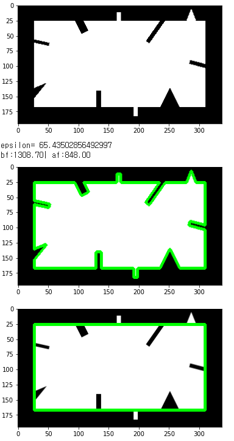

# Contour Features

## Moment

Image moments은 물체의 중심, 물체의 면적 등과 같은 일부 기능을 계산하는데 사용되는 양임.

> pixel intensity(←물리에서 force, mass등)의 ***정량적 크기***와 함께 ***분포 (어떤 기준에 대한)***를 고려한 정량적 지표.  
> 주로 `grayscale` or `binary image`에서 사용됨.

### Spatial Moment (or raw Moment)

$$m_{pq} = \sum_y\sum_x x^p y^q I(x, y) $$

- $p,q$ : degree(차수)에 해당함. 0 이상의 정수가 많이 사용됨.
- $x,y$ : pixel의 x,y 좌표값
- $I(x,y)$ : x,y 위치의 pixel intensity.

> (raw) moment의 값은 pixel intensity 뿐 아니라 pixel의 (절대)위치에 매우 큰 영향을 받는다. 보통 원점을 기준으로 계산된다.

### Central Moment

앞서 본 spatial moment는 pixel의 좌표값에 영향을 크게 받기 때문에, 이미지 내에서의 절대 위치에 따라 값이 많이 바뀌게 된다. 

이같은 raw moment와 달리, pixel 값의 분포로 결정되는 shape에 dependent하면서, 절대 위치에서 대해서는 가급적 독립적인 정량적 지표가 있다면, 특정 shape의 object를 검출에 유리하다.

이같은 특성으로 제안된 것이 바로 Central Moment이다.

$$\mu_{pq} = \sum_y\sum_x (x-\bar{x})^p (y-\bar{y})^q I(x, y) $$

$\bar{x},\bar{y}$ : x,y의 mean으로 중심(image의 중심)에 해당한다.

### Normalized Central Moment

중심 모멘트를 통해 두 이미지 상의 객체가 같은지 비교할 수 있으나, 이미지의 배율 등에 따라 central moment는 같은 object에서도 차이를 가질 수 있음. object의 전체 크기를 나누어서 좀더 robust하게 만든 것이 바로 normalized central moment임.

$$\nu_{pq}= \frac{\mu_{pq}}{\mu_{00}^{\left(1+\frac{p+q}{2}\right)}}$$


### OpenCV

OpenCV에서는 `cv2.moment()`에 object의 contour를 넘겨줌으로서 3차까지의 moment 및 관련 수치들을 구할 수 있음.

다음 예제를 보면 moment들을 구하는 방법을 확인할 수 있다.

```Python
img = cv2.imread('star01.png', cv2.IMREAD_GRAYSCALE)
assert img is not None, "file could not be read, check with os.path.exists()"
ret,thresh = cv2.threshold(img,127,255,0)
contours,hierarchy = cv2.findContours(thresh, 
                                     cv2.RETR_LIST, 
                                     cv2.CHAIN_APPROX_SIMPLE)

cnt = contours[0]
M = cv2.moments(cnt)
print( M )
```

3차까지를 제공하며 Python의 dictionary로 제공한다.  
다음의 키를 참고. (`m` : raw moment (or spatial moment, moment), `mu` : central moment, `nu` :normalized central moment)

* 'm00'
* 'm10', 'm01'
* 'm20', 'm11', 'm02' 
* 'm30', 'm21', 'm12', 'm03' 
* 'mu20', 'mu11', 'mu02' 
* 'mu30', 'mu21', 'mu12', 'mu03' 
* 'nu20', 'nu11', 'nu02' 
* 'nu30', 'nu21', 'nu12', 'nu03'

## Centroid

moment로부터 구할 수 있다.

다음과 같이 1st moment들을 0th moment로 나누어서 구한다.

$$
c_x = \frac{m_{10}}{m_{00}}, c_y = \frac{m_{01}}{m_{00}}
$$

```Python
cnt = contours[0]
M = cv2.moments(cnt)
cx = int(M['m10']/M['m00'])
cy = int(M['m01']/M['m00'])

print(cx,cy)
```


## Contour Area

Contour의 넓이에 해당함. 0th moment에 해당하기도 한다.

```Python
cnt = contours[0]
M = cv2.moments(cnt)
print(M['m00']) # area

area = cv2.contourArea(cnt)
print(area) # area
```

## Contour Perimeter

`arc length`라고도 불리는 contour의 둘레 길이. 다음의 함수로 OpenCV에서는 간단히 구할 수 있음.

```Python
perimeter = cv2.arcLength(contour[0],True)
print(perimeter)
```

* 2번째 argument는 해당 contour가 closed인지 여부를 나타냄.

## Contour Approximation

정밀도를 지정하여, contour를 해당 정밀도 내에서 보다 간단하게 근사할 수 있음. 

OpenCV에서는 이를 위해 Douglas-Peucker Algorithm의 구현물을 제공함.

대략적인 사용법은 다음과 같음.

```Python
# 전체 둘레의 5%로 오차 범위 지정 
app_rate = 0.05

# 허용가능한 정밀도의 차이 = 허용가능한 contour arclength(둘레길이)
epsilon = app_rate * cv2.arcLength(contour, True) 

# 근사 contour구하기.
approx = cv2.approxPolyDP(contour, 
                          epsilon, 
                          True)
```

* `contour` : 근사치를 구하고자하는 object의 contour.
* `epsilon` : contour arc length가 어느정도까지 줄어들 수 있는지를 나타내는 오차범위.
* `True`    : contour가 closed 인지 여부를 알려주는 argument

반환되는 `approx`가 근사처리된 contour임.

다음 예제를 참고.

```Python
import cv2
import numpy as np
import matplotlib.pyplot as plt
from urllib import request 

url = 'https://raw.githubusercontent.com/dsaint31x/OpenCV_Python_Tutorial/master/images/bad_rect.png'
fstr = 'bad_rect.png'
request.urlretrieve(url,fstr)
print('saved ok : bad_rect.png')

img0 = cv2.imread('./bad_rect.png')
img1 = img0.copy()

# 그레이스케일과 바이너리 스케일 변환
img_gray = cv2.cvtColor(img0, cv2.COLOR_BGR2GRAY) 
threshold, binary_img = cv2.threshold(img_gray, 127, 255, cv2.THRESH_BINARY)
plt.imshow(binary_img,cmap='gray')
plt.show()

# 컨투어 찾기 
contours, hierachy = cv2.findContours(binary_img.copy(), 
                                      cv2.RETR_EXTERNAL,
                                      cv2.CHAIN_APPROX_SIMPLE)
contour = contours[0]


# 전체 둘레의 5%로 오차 범위 지정 
app_rate = 0.05

#전체 contour둘레
epsilon = app_rate * cv2.arcLength(contour, True) 
print('epsilon=',epsilon)

# 근사 컨투어 계산 
# 주어진 contour(곡선 또는 다각형)을 epsilon(오차범위)에 맞춰
# contour에 속하는 점들을 줄인 approxiamation(근사 컨투어)를 반환
#
# param 1 : target contour
# param 2 : 오차범위
# param 3 : contour가 close인가? True : closed
approx = cv2.approxPolyDP(contour, epsilon, True)

print('bf:{:.2f}| af:{:.2f}'.format(
    cv2.arcLength(contour, True), 
    cv2.arcLength(approx, True)
    )
)

# 각각 컨투어 선 그리기 ---④
cv2.drawContours(img0, [contour], -1, (0,255,0), 3)
cv2.drawContours(img1, [approx], -1, (0,255,0), 3)

plt.figure('origianl contour')
plt.imshow(img0[:,:,::-1])
plt.figure('approximated contour')
plt.imshow(img1[:,:,::-1])
plt.show()
```



## Convex Hull

contour에 대해서, 해당 contour를 둘러싸는 다각형을 Convex Hull이라고 부름.


> `convexity defect`라는 용어와 `convex`라는 용어의 개념을 기억할 것.

OpenCV에서는 Sklansky algorithm을 구현하여 `cv2.convexHull()`로 제공한다. 

```Python
hull = cv2.convexHull(
    points,
    hull,
    clockwise=False,
    returnPoints=True
```

* `points` : contour를 이루는 point들로 구성된 list임. 주의할 건, `convexHull`은 하나의 contourn만을 입력으로 받는다. (복수개의 contour를 넘겨줄 수 없음)
* `hull` : None으로 지정되는 경우가 일반적이며, 반환값이 저장된 변수명이 들어감. 
* `clockwise` : orientation으로 반환되는 convexHull을 구성하는 vertex들의 순서를 시계방향으로 할지 반시계방향으로 할지를 결정.
* `returnPoints` : `True`인 경우, convexHull을 구성하는 vertex들의 좌표들로 구성된 list를 반환하고, `False`인 경우, 입력 argument로 들어온 `points`에서 convexHull에 대응하는 vertex들의 index들을 반환함.

> 파손이 된 부품에서 파손된 위치등을 찾는 경우에는 `convexicty defeat`의 위치를 찾아야 하는 경우가 많다. 이 경우에는 `returnPoints`를 False로 넘겨주어서 contour 중에서 어떤 index의 vertex가 convexHull에 속하는지를 찾고, 이로부터 `convexity defeat등을 찾을 수 있다.

## Checking Convexity

OpenCV는 특정 contour나 curve등이 convex인지 여부를 확인하는 function을 제공해줌.

```
k = cv2.isContourConvex(contours[0])
print(k)
```

## Bounding Rectangle

특정 object를 둘러싸고 있는 Bounding rectangle은 다음 그림에서 보이듯이 2가지가 존재함.


* 초록색의 사각형이 straight bounding rectangle이며, object의 회전 등을 고려하지 않음.
    * `cv2.boundingRect()`를 통해 구해짐.
* 붉은색의 사각형은 rotated bounding rectangle이라고 불림.
    * `cv2.minAreaRect()`를 통해 구해짐.

### straight bounding rectangle

```Python
x,y,w,h = cv.boundingRect(contours[0])
```

* 하나의 contour를 넘겨주면 됨.

### rotated bounding rectangle

```Python
(x,y), (w,h), angle_of_rot = cv2.minAreaRect(contours[0])
```

위와 같이 처리하는 것보다, 다음을 이용하는게 보다 간편함.

```Python
rect = cv2.minAreaRect(contours[0])
box = cv2.boxPoints(rect)
box = np.int0(box)
cv2.drawContours(tmp,[box],0,(0,0,255),2)
```

* 위에서 얻어진 `rect`를 `cv2.boxPoints`를 통해 4개의 vertex를 얻어낼 수 있음.

## Minimum Enclosing Circle

object를 감싸고 있는 원을 구할 수 있음.

```Python
(x,y),radius = cv2.minEnclosingCircle(contours[0])
center = (int(x),int(y))
radius = int(radius)
tmp0 = tmp.copy()
tmp0 = cv2.circle(tmp0,center,radius,(0,255,0),2)
plt.imshow(tmp0[...,::-1])
plt.xticks([]),plt.yticks([])
plt.show()
```


## Fitting an Ellipse

object를 (대략) 감싸고 있는 타원을 구할 수 있음. (완전히 감싸지 않음.)

```Python
ellipse  = cv2.fitEllipse(contours[0])
print(ellipse)
tmp0 = tmp.copy()
tmp0 = cv2.ellipse (tmp0,ellipse ,(0,255,0),2)
plt.imshow(tmp0[...,::-1])
plt.xticks([]),plt.yticks([])
plt.show()
```


## Fitting a Line

Object에 맞추어 놓여진 line을 구함.

```Python
rows,cols = tmp.shape[:2]
[vx,vy,x,y] = cv2.fitLine(contours[0], cv2.DIST_L2,0,0.01,0.01)
lefty = int((-x*vy/vx) + y)
righty = int(((cols-x)*vy/vx)+y)

tmp0 = tmp.copy()
cv2.line(tmp0,(cols-1,righty),(0,lefty),(0,255,0),2)
plt.imshow(tmp0[...,::-1])
plt.xticks([]),plt.yticks([])
plt.show()
```

## References

* [opencv's tutorial](https://docs.opencv.org/4.x/dd/d49/tutorial_py_contour_features.html)
* [image moments](https://en.wikipedia.org/wiki/Image_moment)