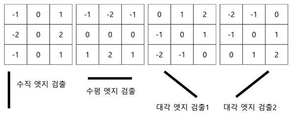
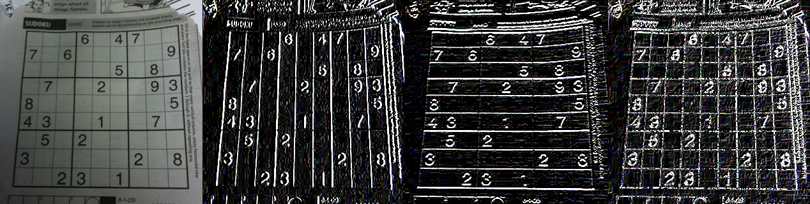

# High Pass Filter and Edge Detection 

## High Pass Filter

image의 spatial frequency domain에서 high frequency 영역을 통과시키는 필터를 가르킴.

> Fourier transform을 이용하여 구현할 수도 있으나, spatial domain에서 convolution 연산을 통해서도 구현 가능함.

### High Pass Filter의 특징.

요약하면 다음과 같다.

- Edge Detection, Sharpening이 이루어짐.
- 단, Noise도 같이 강조됨

앞서 요약에서 말했듯이 High Pass Filter는 영상의 경계선(edge)와 boundary 등이 강조되는 것은 좋지만, 동시에 noise도 강조되는 단점을 수반한다.

- 영상에서 낮은 주파수 성분을 제거하여, 물체의 윤곽선이나 세부정보를 강조하는 edge를 검출
- 영상의 경계선이 더욱 선명해지는 sharpening 영상을 얻을 수 있지만, 오히려 잡음을 증가시켜 화질이 약화될 수 있음.

> `미분` 등을 처리할 때 `np.uint8`을 사용할 경우, ***모든 음수 값이 0으로 처리*** 되는데, 하얀색에서 검정색으로 변화하는 경우와 같이 gradient가 음수값을 가지게 되며 이를 0으로 처리하게 된다. 때문에 OpenCV Tutorial에서는 결과의 데이터 타입을 정밀도가 더 높으면서 부호값을 가지는 `cv2.CV_16S`, `cv2.CV_32F`, `cv2.CV_64F`로 지정한 뒤에 다시 `cv2.CV_8U`로 변환하는 것을 추천하고 있음.  
> 자세한 건 다음 URL을 참고 : [`ddtype` 설정](https://dsaint31.tistory.com/entry/OpenCV-Desired-Data-Type-ddtype)

## Edge Detection

High pass filter 또는 gradient filter등을 이용함.

- **Filter** 등을 통해 image의 주요 feature 중 하나인 **edge 검출** 하는 것을 가르킴.
- edge detection은 background와 foreground 를 분리(segmentation)하기 위해 필요한 가장 기본적 작업.
- object recognization 에서도 기본이 되는 작업.
- 즉, image recognization, image segmentation 의 기본이 됨.

> `sharpening` : edge를 검출해서 edge에 해당하는 pixel값을 강조

## Differentiation (미분) 

- **gradient 연산** 을 입력영상에 적용.
- 디지털이기 때문에 실제론 difference(차분)연산임 : forward/backward difference

`cv2.filter2D`를 이용하여 쉽게 구현할 수 있음.

```Python
import cv2
import numpy as np
import matplotlib.pyplot as plt
from google.colab.patches import cv2_imshow

img_path = '/content/drive/My Drive/[10]Lecture/ImageProcessing/Images/sudoku.jpg'
img = cv2.imread(img_path)

#forward difference!
gx_kernel = np.array([[-1,1]])
gy_kernel = np.array([[-1],[1]])

x_edge = cv2.filter2D(img,-1,gx_kernel)
y_edge = cv2.filter2D(img,-1,gy_kernel)

results = np.hstack((img,x_edge,y_edge))
cv2_imshow(results)
```

* `cv2.filter2D`의 2nd argument는 결과의 depth정보 (desired depth, `ddepth`)에 해당하며, 예제와 같이 `-1`인 경우 1st argument인 input image와 같은 depth를 가짐.
* 앞서 언급되었듯이 `cv2.uint8` 에서 음수를 처리 못하는 문제점으로 인해, `cv2.CV_16S`, `cv2.CV_32F`, `cv2.CV_64F` 등을 사용하고 이후 `abs`를 통해 magnitude를 구하고 `cv2.CV8S`등으로 casting하길 권함.


위의 코드의 결과는 다음과 같음.

<figure markdown>

</figure>

### Lawrence Roberts Filter (Cross Filter)

1963년 로렌스 로버츠 제안.

- diagonal edge를 매우 잘 검출.
- noise에 약하고, 검출된 edge강도가 낮은 편.

```Python
import cv2
import numpy as np
import matplotlib.pyplot as plt
from google.colab.patches import cv2_imshow

img = cv2.imread(img_path)

gx_kernel = np.array([[1,0],[0,-1]])
gy_kernel = np.array([[0,1],[-1,0]])

x_edge = cv2.filter2D(img,-1,gx_kernel)
y_edge = cv2.filter2D(img,-1,gy_kernel)

results = np.hstack((img,np.abs(x_edge),np.abs(y_edge),np.abs(x_edge)+np.abs(y_edge)))
#plt.imshow(results)
cv2_imshow(results)
```

### Prewitt Filter

주디스 프리윗이 제안

- centered difference의 digital version이라고 볼 수 있음.
- It shows weak performance for diagonal edge detection.

```Python
import cv2
import numpy as np
import matplotlib.pyplot as plt
from google.colab.patches import cv2_imshow

img = cv2.imread(img_path)

gx_kernel = np.array([
                      [-1,0,1]
])
gy_kernel = np.array([
                      [-1],[0],[1]
])

x_edge = cv2.filter2D(img,-1,gx_kernel)
y_edge = cv2.filter2D(img,-1,gy_kernel)

results = np.hstack((img,np.abs(x_edge),
                     np.abs(y_edge),
                     np.abs(x_edge)+np.abs(y_edge))
)
cv2_imshow(results)
```

위의 코드의 결과는 다음과 같음.

<figure markdown>

</figure>

### Sobel Filter

1968년 Irwin Sobel이 제안

- 실무에서 널리 사용되는 **1차 미분(gradient기반)** 마스크 필터 : 디지털 형태의 1차미분.
- 1차 미분을 통한 특정방향의 Edge를 검출.
- `opencv`에서 전용함수 제공함.
- kernel이 작은 사이즈(3by3) 경우 등에서 edge의 direction에 대한 검출 정확도가 좋지 않은 단점이 있음 : `Scharr filter`가 이를 개선.

Sobel filter의 $3 \times 3$ mask는 다음과 같음.

<figure markdown>

<figcap>출처 : [bsky's blog](https://bskyvision.com/43)</figcap>
</figure markdown>

OpenCV에서 제공하는 `Sobel filter`의 경우, joint Gaussian smoothing과 differentiation operation을 결합하여 구현되어있으며, 다음의 function을 사용함.

```Python
cv2.Sobel(src, 
          ddepth, 
          dx, dy
          [, dst[, ksize[, scale[, delta[, borderType]]]]]
          )`
```

- `src`: input
- `dx`: x에 대한 미분 차수
- `dy`: y에 대한 미분 차수
- `ksize`: Sobel kernel 크기 (1,3,5,7 만 가능)

x축과 y축에 가해지는 미분 차수(degree)를 다르게 설정할 수 있으며, kernel size (`ksize`)도 조절가능함.

* [degree 란?](https://dsaint31.tistory.com/entry/Math-Differential-Equation#Degree)

> $3 \times 3$ kernel에서는 Sobel보다 뒤에 나오는 Scharr filter가 좀 더 나은 성능을 보이는 것으로 알려짐.

```Python
import cv2
import numpy as np
import matplotlib.pyplot as plt
from google.colab.patches import cv2_imshow

degree_of_diff = 1
x_edge = cv2.Sobel(img,-1,degree_of_diff,0,ksize=3)
y_edge = cv2.Sobel(img,-1,0,degree_of_diff,ksize=3)

results = np.hstack((img,np.abs(x_edge),
                     np.abs(y_edge),
                     np.abs(x_edge)+np.abs(y_edge))
)
cv2_imshow(results)
```

위의 코드의 결과는 다음과 같음.


### Scharr Filter

Sobel의 단점을 개선함.

- opencv에서 전용함수를 제공.
- Sobel과 거의 비슷하나, `ksize` 설정 파라메터가 없음.

```Python
import cv2
import numpy as np
import matplotlib.pyplot as plt
from google.colab.patches import cv2_imshow

degree_of_diff = 1
x_edge = cv2.Scharr(img,-1,degree_of_diff,0)
y_edge = cv2.Scharr(img,-1,0,degree_of_diff)

results = np.hstack((img,np.abs(x_edge), # absolute value인 점을 주의할 것.
                     np.abs(y_edge),
                     np.abs(x_edge)+np.abs(y_edge))
)
cv2_imshow(results)
```

위의 코드의 결과는 다음과 같음.




## Laplacian Filter

2차 미분 필터 (the 2nd order derivative)

- 1차 미분 필터 (예: Sobel Filter)과 비교할 경우, 영상 내에 blob이나, 섬세(fine)한 부분을 더 잘 검출(or 강조)함.
- 문제는 noise도 강조한다는 점임.
- 매우 noise에 취약 : 사전에 Gaussian Blurring 을 취하는것이 일반적.

> **2차 미분은 주로 image enhancement에 사용하며 1차 미분은 feature extraction**
에 사용되는 경우가 많음
>

noise에 민감해서 Laplacian을 단독으로 사용하기 보다 Gaussian Filter로 blurring시켜서 noise를 제거 후 Laplacian Filter를 적용하는 ***Laplacian of Gaussian (LoG)*** 를 일반적으로 사용한다.

### Example :

$3\times 3$ kernel로 `ksize=1` 인 경우의 `cv2.Laplacian`에서 사용됨.

$$
\begin{bmatrix}0 & 1 & 0  \\1 & -4 & 1 \\0 & 1 & 0 \end{bmatrix}
$$

Taylor series로 부터 유도한 2차 미분 근사식 $f^{\prime \prime}(x) = f(x+1) - 2f(x) + f(x-1)$ 을 2개의 독립변수로 확장시 다음과 같음.

$$
f^{\prime \prime}(x,y) = f(x-1,y) + f(x,y-1) + f(x+1,y) + f(x,y+1) - 4f(x,y)
$$

* 이 식으로부터 위의 kernel의 weight들이 유도됨임.

OpenCV에서는 `cv2.Laplacian`으로 제공.

* 실제로 각각의 derivate는 Sobel deraivatives로 구해짐.

```Python
cv2.Laplacian(src, 
              ddepth
              [, dst
              [, ksize
              [, scale
              [, delta
              [, borderType]]]]]
              )
```

간단한 예제 조각 코드는 다음과 같음.

```Python
import cv2
import numpy as np
import matplotlib.pyplot as plt
from google.colab.patches import cv2_imshow

degree_of_diff = 1
edge = cv2.Laplacian(img,-1)


results = np.hstack((img,np.abs(edge)) # absolute value를 사용하는 것을 잊지 말 것.
)
cv2_imshow(results)
```

위의 코드의 결과는 다음과 같음.


## References

* [OpenCV's Tutorial: Image Gradients](https://docs.opencv.org/5.x/d5/d0f/tutorial_py_gradients.html)