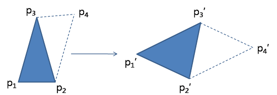
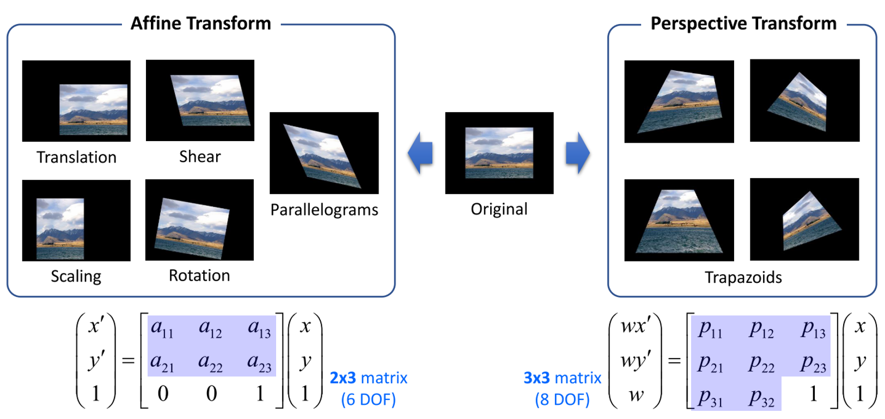
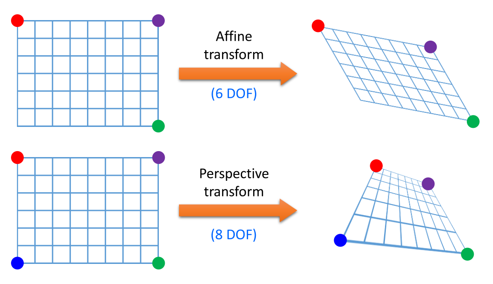
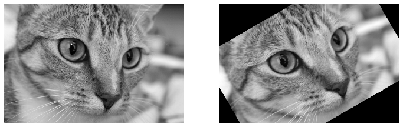
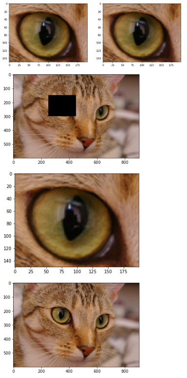
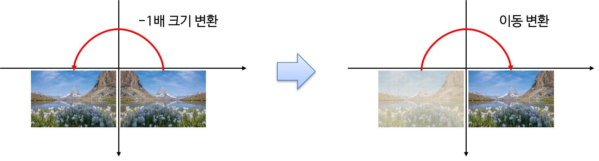
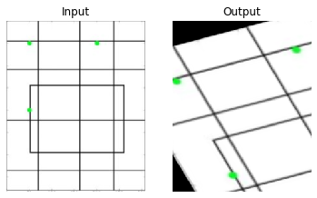
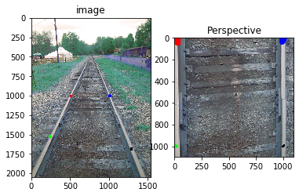
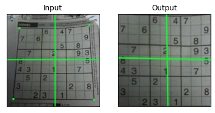

# Geometric Transformations of Images

## Goals

- Learn to apply different ***geometric transformation*** to images like
    - translation,
    - rotation,
    - affine transformation etc.
- You will see these functions: `cv2.getPerspectiveTransform`

## Transformations

> [***Transformation***](https://www.notion.so/1-8-Introduction-to-Linear-Transformations-61b0a5ff0bc747b6ba1ef9aca6168fac) 이란?
> 
> 
> The **function** to convert(map) an specific coordinate $\textbf{x}$ into other coordinate system $\textbf{x}^\prime$.
> 
>  [Basis](https://www.notion.so/4-3-Linearly-Independent-Sets-Bases-13c20d906e314ed5b920b7095c038075) 를 바꾸는 것이라고 볼 수 있음.
> 

## Pre-requirements

 다음 문서는 영상처리의 기하학적 변환의 기본이 되는 선형대수 내용이 간략히 설명됨.

[2.7 Applications to Computer Graphics](https://www.notion.so/2-7-Applications-to-Computer-Graphics-9b52d9335a344cb88ccddf1a97063d4f)

[1.8 Introduction to Linear Transformations](https://www.notion.so/1-8-Introduction-to-Linear-Transformations-61b0a5ff0bc747b6ba1ef9aca6168fac)

## 2D Geometric Image Transformations

](../../img/ch02/2d_geometric_image_transformations.png)

[Computer Vision - Algorithms and Applications](https://www.semanticscholar.org/paper/Computer-Vision-Algorithms-and-Applications-Szeliski/4282a344671189e17c9c9e00e329fe2d0fa71769/figure/263)

### **Rigid-body(강체)** transformation :

- ***shape(형태),*** ***size(크기)*** and ***angle(각)*** are preserved.
    - DoF : 3 → 2쌍 이상의 match되는 점(=4개의 값으로 갯수가 3보다 크니 충분함)이 필요.
- i.e.,
    - **Translation**,
    - **Rotation**, and
    - **Identity**
- It is called **Euclidean** transformation.
    
    $$
    \begin{bmatrix} x^\prime \\ y^\prime \end{bmatrix}=\begin{bmatrix} \cos \theta & -\sin\theta  \\ \sin\theta & \cos\theta  \end{bmatrix}\begin{bmatrix} x \\ y \end{bmatrix}+ \begin{bmatrix} c \\ d \end{bmatrix}
    $$
    
    $$\begin{bmatrix} x^\prime \\ y^\prime \\1\end{bmatrix}=\begin{bmatrix} \cos \theta & -\sin\theta &c \\ \sin\theta & \cos\theta &d \\0 & 0 & 1\end{bmatrix}\begin{bmatrix} x \\ y \\1\end{bmatrix}
    $$
    
- `cv2.estimateRigidTransform()` 을 통해 2쌍 이상의 match되는 점들로부터 변환 matrix를 구함. (실제론 affine transform matrix를 구해줌) ← [detail](https://docs.opencv.org/2.4.13.2/modules/video/doc/motion_analysis_and_object_tracking.html#estimaterigidtransform)
    
### **Similarity** transformation (or similitudes, 유사변환, 닮은변환) :

- **Rigid-body** transformation + (Isotropic) **Scaling**
    - DoF : 4 (회전각, x,y축의 translation, scaling factor)
    - 2쌍 이상의 match되는 점이 있어야 파라메터 구할 수 있음.
- ***angle*** is preserved but
- ***size** can be changed*. (확대/축소 때문에)
- i.e.,
    - **(Isotropic) Scaling**
- `cv2.estimateRigidTransform()` 을 통해 2쌍 이상의 match되는 점들로부터 변환 matrix를 구함. (실제론 affine transform matrix를 구해줌) ← [detail](https://docs.opencv.org/2.4.13.2/modules/video/doc/motion_analysis_and_object_tracking.html#estimaterigidtransform)

### 참고 : [**Linear** transformation](https://www.notion.so/1-8-Introduction-to-Linear-Transformations-61b0a5ff0bc747b6ba1ef9aca6168fac) :

- *Function* to mapping on the vector space.
- It specifies
    - **homogeniety** and
    - **additivity**.
- i.e.,
    - **Scaling (isotropic scaling 포함)**,
    - **Shear**,
    - **Reflection**, and
    - **Rotation about the origin.**

> Translation(이동)은 Homogeniety(동차성)을 만족하지 못함 → linear transformation이 아님. ← Homogeneous coordinate사용시 linearity를 가지게 되어 matrix곱만으로 처리 가능해짐.


### **Affine** transformation :

- Linear transformation + **Translation**.
    - DoF : 6
    - 3쌍의 match되는 점들이 있어야 standard matrix를 결정할 수 있음.← OpenCv에서는 $2 \times 3$ matrix로 처리됨.      
    - $\begin{bmatrix} x^\prime \\ y^\prime \\1\end{bmatrix}=\begin{bmatrix} a & b &e \\ c & d &f\\0 & 0 & 1\end{bmatrix}\begin{bmatrix} x \\ y \\1\end{bmatrix}$        
- Function between affine spaces which preserves **points**, **straight lines** and **planes**.
- 선들의 평행성이 보장된다. → ***임의의 평면이 임의의 평면***으로 ***평행성을 보존***하면서 매핑됨.

**참고**

* 
*  `cv2.getAffineTransform()` 을 통해 3쌍의 match되는 점을 통해 변환matrix를 구할 수 있음.
    * `cv2.invertAffineTransform()` 를 통해 inverse matrix도 구할 수 있음.


### **Perspective** transformation (원근변환) :

- Affine transformation w/o the property to keep parallel lines.
    - 선은 변환 후에도 선으로 유지됨.
    - 단, 선의 평행성은 유지가 보장되지 않음.
    - 임의의 평면이 임의의 평면으로 평행성을 보존하지 않고 매핑됨.
- 3D 공간의 입체적인 물체를 평면에 투영하는데 사용되며 원근감이 표현됨.
    - DoF : 8 ($3\times 3$ matrix이나 homogeneous coordinate에서 마지막 component가 1로 고정이나 다름이 없기 때문에, matrix의 3행 3열의 entry가 1이라는 constant value을 가지게 되어 9-1로 8 DoF를 가짐.)
- Perspective projection, Projective transformation, Homograpy 라고도 불림.    
- `cv2.getPerspectiveTransform()` 를 통해 *4쌍의 match되는 점* 으로부터 변환행렬 구해줌.
* `cv2.findHomography()`는 *4쌍 이상의 match되는 점들* 부터 변환행렬을 구해줌(approximate method로 , fitting, RANSAC, LMedS중 선택가능)

#### Homography를 직관적으로 이해하기 위한 한 좋은 방법

- 2D 평면에서 임의의 사각형을 임의의 사각형으로 매핑시킬 수 있는 변환이 homography 라고 생각할 수 있음.
- 어떤 planer surface 촬영대상이 서로 다른 위치의 카메라로 촬영되어 image A, image B로 투영된 경우, 이 A와 B사이의 점들의 위치 관계를 homography로 표현가능함.
- 평면물체의 2D 이미지 변환관계를 설명함.
- Projective transformation과 homography는 같은 말임.


---

## Geometric Transformation in the OpenCV

`OpenCV` provides two geometric transformation functions,

- `cv2.warpAffine` and
- `cv2.warpPerspective`,

with which you can have all kinds of geometric transformations.

- Note: **Warping** Transformation
    - 굴곡 변환
    - 비선형적 기하학적 연산

## Affine Transformation vs. Perspective Transformation



`cv2.warpAffine` takes 

- a $2\times3$ transformation matrix (6DOFs)

while `cv2.warpPerspective` takes 

- a $3\times3$ transformation matrix (8DOFs) as input.



- Affine Transformation에서 6개의 파라미터를 알기 위해서는 6개의 연립 방정식이 필요.
    - 1개의 (x, y)에 대한 homogeneous 행렬에서 DOF에 관한 2개의 식을 구할 수 있기 때문에 3개 점의 6개 식을 이용하면 6개의 DOF를 구할 수 있음.
    - 이는 위 그림과 같이 Affine Transformation이 평행사변형 형태를 유지하는 변환이기 때문에 3개의 점을 지정하면 자동적으로 하나의 점이 고정이 되어 3개의 점을 통해 변환 행렬을 구할 수 있는 것과 같은 의미임.
    - **3개의 점의 변환 전 좌표와 변환 후 좌표를 알아야 Affine 변환 행렬을 구할 수 있습니다.**
- 이와 동일한 관점에서 Perspective Transformation은 8개의 DOF를 구하기 위하여 4개의 점을 사용하여 구할 수 있음.
    - 이는 위 그림과 같이 Perspective Transformation에서는 4개의 꼭지점이 자유롭게 변환된 상태로 이미지를 변환할 수 있어야 하기 때문에 **4개의 점의 변환 전 좌표와 변환 후 좌표를 알아야 Perspective 변환 행렬을 구할 수** 있음.

---

## Translation

> Translation is the shifting of object’s location.
> 

If you know the shift in $(x,y)$-direction, 
let it be $(t_x,t_y)$, you can create the transformation matrix $\textbf{M}$ as follows:

$$
M = \begin{bmatrix}
1 & 0 & t_x \\
0 & 1 & t_y
\end{bmatrix}
$$

You can 

- make it into a **Numpy array of type** `np.float32` and
- pass it into `cv2.warpAffine()` function.

See below example for a shift of `(150,50)`:

- python code
    
    ```python
    from skimage import data
    from skimage import img_as_ubyte,img_as_float
    import cv2
    import numpy as np
    import matplotlib.pyplot as plt
    
    cat = data.chelsea() # take the test image of cat!
    img = cv2.cvtColor(cat, cv2.COLOR_RGB2GRAY)
    # img = cv2.imread('cat_cv.tif',0)
    
    rows,cols = img.shape
    
    M = np.float32([[1,0,150],
                    [0,1,50]])
    
    dst = cv2.warpAffine(img,M,(cols,rows))
    
    # cv2.imshow('img',dst)
    # cv2.waitKey(0)
    # cv2.destroyAllWindows()
    plt.figure(figsize=(12,12))
    plt.subplot(121); plt.imshow(img, cmap='gray'), plt.axis('off')
    plt.subplot(122); plt.imshow(dst, cmap='gray'), plt.axis('off')
    plt.show()
    ```
    
- Result
    
    
    

## Rotation

Rotation of an image for an angle $\theta$ can also be done using `wrapAffine()` —only the transformation matrix changes.

The transformation matrix for the rotation is as follows:

$$
M = \begin{bmatrix}
\cos\theta & -\sin\theta \\
\sin\theta & \cos\theta
\end{bmatrix}
$$

- **꼬마** 가 **신 신고**

But OpenCV provides **scaled rotation** with **adjustable center of rotation** so that you can rotate at any location you prefer.

Modified transformation matrix is given by

$$\begin{bmatrix}
\alpha &  \beta & (1- \alpha )  \cdot \text{center.x} - \beta \cdot \text{center.y} \\ -\beta & \alpha & \beta \cdot \text{center.x} + (1- \alpha ) \cdot \text{center.y}
\end{bmatrix}$$

where:

$$
\begin{array}{l}
\alpha =  \text{scale} \cdot \cos \theta , \\
\beta =  \text{scale}\cdot \sin \theta
\end{array}
$$

To find this transformation matrix, OpenCV provides a function, `cv2.getRotationMatrix2D`.
It takes 

- the center for rotation (←pixel),
- angle of rotation (←degree), and
- isotropic scaling factor as input.
- Ref. API for `getRotationMatrix2D`
    
    [OpenCV: Geometric Image Transformations](https://docs.opencv.org/3.4.0/da/d54/group__imgproc__transform.html#gafbbc470ce83812914a70abfb604f4326)
    

Check below example which rotates the image by 30 degree with respect to center without any scaling.

- python code
    
    ```python
    from skimage import data
    from skimage import img_as_ubyte,img_as_float
    import cv2
    import numpy as np
    import matplotlib.pyplot as plt
    
    cat = data.chelsea() # take the test image of cat!
    img = cv2.cvtColor(cat, cv2.COLOR_RGB2GRAY)
    #img = cv2.imread('cat_cv.tif',0)
    
    rows,cols = img.shape # there is no channel
    
    #------------------------------------
    # getRotationMatrix2D
    # the rotation center is given by Tupple.
    # (center.x cneter.y), rotation degree, scale
    M = cv2.getRotationMatrix2D((cols/2,rows/2),30,1)
    print(M)
    
    dst = cv2.warpAffine(img,M,(cols,rows))
    
    # cv2.imshow('img',dst)
    # cv2.waitKey(0)
    # cv2.destroyAllWindows()
    
    plt.figure(figsize=(12,12))
    plt.subplot(121); plt.imshow(img, cmap='gray'), plt.axis('off')
    plt.subplot(122); plt.imshow(dst, cmap='gray'), plt.axis('off')
    plt.show()
    ```
    
- result

    ```
    [[  0.8660254    0.5        -44.78872855]
     [ -0.5          0.8660254  132.84618943]]
    ```

    
    

---

## Scaling

***Scaling*** is just **resizing** of the image.

OpenCV comes with a function `cv2.resize()` for this purpose.

**`cv2.resize(img, dsize, fx, fy, interpolation)`**

- `img` : source image
- `dsize` : desired size (specified manually), `tuple (width,height)`
- `fx` : scale factor along the horizontal axis
- `fy` : scale factor along the vertical axis
- `interpolation` : the method of interpolation

The **size** of the image can be specified manually, or you can specify **the scaling factor**.

Different _interpolation methods_ are used.

- Preferable interpolation methods are `cv2.INTER_AREA` for **shrinking** and
- `cv2.INTER_CUBIC` (slow) & `cv2.INTER_LINEAR` for **zooming**.

By default, interpolation method used is `cv2.INTER_LINEAR` for all resizing purposes.

Various interpolation algorithms are provided by OpenCv as follows;

- `cv2.INTER_AREA`
    - It is preferred for shrinking the image size.
- `cv2.INTER_LINEAR`
    - default algorithm.
    - It is commonly used for zooming.
- `cv2.INTER_CUBIC`
    - It is used for zooming with a better quality but slow.
- `cv2.INTER_NEAREST`
    - Very fast but quality is not good.

You can resize an input image either of above methods:

- python code
    
    ```python
    from skimage import data
    from skimage import img_as_ubyte,img_as_float
    import cv2
    import numpy as np
    import matplotlib.pyplot as plt
    
    #img = cv2.imread('cat_cv.tif')
    
    height, width = img.shape[:2]
    print("original dimension : ({}, {}, {})".format(height,width,channel))
    
    #-------------------
    zoomed_cat = cv2.resize(img,None,fx=2, fy=2, interpolation = cv2.INTER_CUBIC)
    #OR
    zoomed_cat = cv2.resize(img,(2*width, 2*height), interpolation = cv2.INTER_CUBIC)
    #-------------------
    
    print("modified dimension :",zoomed_cat.shape)
    cv2.imshow('zoomed_cat',zoomed_cat)
    # cv2_imshow(zoomed_cat)
    
    zoomed_cat_NN = cv2.resize(img, (2*width,2*height), interpolation = cv2.INTER_NEAREST)
    cv2.imshow('zoomed_cat_NN',zoomed_cat_NN)
    #cv2_imshow(zoomed_cat_NN)
    
    cv2.waitKey(0)
    cv2.destroyAllWindows()
    ```
    
- result

    ```    
    original dimension : (300, 451, 3)
    modified dimension : (600, 902)
    ```    

## Review : Cropping

In `OpenCv`, cropping is provided by using the `slicing` of python. 

Slicing an array is just taking the array values within particular index range.

- python code
    
    ```python
    import matplotlib.pyplot as plt
    
    zoomed_cat = cv2.cvtColor(zoomed_cat,cv2.COLOR_RGB2BGR)
    zoomed_cat_NN = cv2.cvtColor(zoomed_cat_NN,cv2.COLOR_RGB2BGR)
    
    cropped_img0 = zoomed_cat[150:300,250:450]
    #cv2_imshow(cropped_img0)
    cropped_img1 = zoomed_cat_NN[150:300,250:450]
    #cv2_imshow(cropped_img1)
    
    plt.figure(figsize=(12,12))
    plt.subplot(121); plt.imshow(cropped_img0) # expects distored color
    plt.subplot(122); plt.imshow(cropped_img1) # expects true color
    plt.show()
    
    #--------------------------------------
    # be careful to modify the cropped img.
    tmp = cropped_img0.copy()
    cropped_img0[:]=0
    
    #cv2_imshow(zoomed_cat)
    #cv2_imshow(tmp)
    plt.imshow(zoomed_cat)
    plt.show()
    plt.imshow(tmp)
    plt.show()
    
    zoomed_cat[150:300,250:450]=tmp
    #cv2_imshow(zoomed_cat)
    plt.imshow(zoomed_cat)
    plt.show()
    ```
    
- result
    
        

---

## Reflection (Flip) Transformation (대칭변환)



- Reflection + Translation = flip
- Linear Transformation : [Reflections](https://www.notion.so/6dd79c1d2b27428a804825845377529d)

`cv2.flip(src, flipMode, dst = None) -> dst`

- `src` : input image
- `flipMode` : +1 (좌우), 0 (상하), -1 (원점)
- `dst` : output image

---

## Affine Transformation

In affine transformation, **all parallel lines** in the original image will still be **parallel** in the output image.

To find the transformation matrix, we need ***three points*** from input image and their corresponding locations in output image.

Then `cv2.getAffineTransform` will create a $2\times3$ matrix which is to be passed to `cv2.warpAffine`.

Check below example, and also look at the points I selected (which are marked in Green color):

- python code
    
    ```python
    import cv2
    import matplotlib.pyplot as plt
    
    img = cv2.imread('images/drawing.png')
    rows,cols,ch = img.shape
    
    pts1 = np.float32([[38,38],[145,38],[38,145]])   
    pts2 = np.float32([[10,100],[200,50],[100,250]])
    
    M = cv2.getAffineTransform(pts1,pts2)
    
    dst = cv2.warpAffine(img,M,(cols,rows))
    
    plt.subplot(121),plt.imshow(img),plt.title('Input'),plt.axis('off')
    plt.subplot(122),plt.imshow(dst),plt.title('Output'),plt.axis('off')
    plt.show()
    ```
    
- result
    
    
    

### The example for the Affine Transformation

`OpenCv`의 mouse callback function을 이용한 예제임.

- python code
    
    ```python
    import cv2
    import numpy as np
    
    points = []
    
    # 왼쪽 상단, 오른쪽 상단, 왼쪽 하단, 오른쪽 하단 순으로 클릭하시오.
    
    # mouse callback function
    def draw_circle(event,x,y,flags,param):
        if event == cv2.EVENT_LBUTTONDBLCLK:
            global points
            cv2.circle(img,(x,y),10,(255,0,0),-1)
            print(x,y)
            points.append([x,y])
            
            
    # Create a black image, a window and bind the function to window
    img = cv2.imread('images/drawing.png')
    rows,cols,ch = img.shape
    cv2.namedWindow('image')
    cv2.setMouseCallback('image',draw_circle)
    
    while(1):
        cv2.imshow('image',img)
        if cv2.waitKey(20) & 0xFF == 27: # enter ESC
            break
        if len(points) == 3:
            pts1 = np.float32(points)
            pts2 = np.float32([[10,100],[200,50],[100,250]])
            M = cv2.getAffineTransform(pts1,pts2)        
            dst = cv2.warpAffine(img,M,(cols,rows))
            cv2.imshow('after',dst)
            
    cv2.destroyAllWindows()
    ```
    

for the details : [Affine Transform](https://www.notion.so/Affine-Transform-ed7b3cb2080d47d3bdd0be0569b6b78b) 

## Perspective Transformation

For perspective transformation, you need a $3\times3$ transformation matrix.

$$
\begin{bmatrix} w\hat{x} \\ w\hat{y} \\ w \end{bmatrix}=
\begin{bmatrix}
a & b & c \\
d & e & f \\
g & h & 1
\end{bmatrix}
\begin{bmatrix}
x \\ y \\ 1
\end{bmatrix}
$$

**Straight lines will remain straight** even after the transformation.

- Perspective(원근법) 변환은 선의 성질만 유지( ***직선*** 은 변환 후에도 ***직선*** )
- 단, 선의 평행성은 유지가 되지 않음

To find **Perspective Transformation Matrix**, we need **4 points** on the input image and corresponding points on the output image.

- Among these 4 points, **3 of them should *not be colinear***.

Then transformation matrix can be found by the function `cv2.getPerspectiveTransform`.

- 8 variables can be obtained by following matrix equation.
- 8 variables = 8 Degree of Freedom (8DoF)
    
    $$
    \begin{bmatrix} \hat{x}_1 \\ \hat{y}_1 \\ \hat{x}_2 \\ \hat{y}_2 \\ \hat{x}_3 \\ \hat{y}_3 \\ \hat{x}_4 \\ \hat{y}_4 \end{bmatrix}
    =
    \begin{bmatrix}
    x_1 & y_1 & 1 & 0 & 0 & 0 & -x_1\hat{x}_1 & -\hat{x}_1y_1 \\
    0 & 0 & 0 & x_1 & y_1 & 1 & -x_1\hat{y}_1 & -y_1\hat{y}_1 \\
    x_2 & y_2 & 1 & 0 & 0 & 0 & -x_2\hat{x}_2 & -\hat{x}_2y_2 \\
    0 & 0 & 0 & x_2 & y_2 & 1 & -x_2\hat{y}_2 & -y_2\hat{y}_2 \\
    x_3 & y_3 & 1 & 0 & 0 & 0 & -x_3\hat{x}_3 & -\hat{x}_3y_3 \\
    0 & 0 & 0 & x_3 & y_3 & 1 & -x_3\hat{y}_3 & -y_3\hat{y}_3 \\
    x_4 & y_4 & 1 & 0 & 0 & 0 & -x_4\hat{x}_4 & -\hat{x}_4y_4 \\
    0 & 0 & 0 & x_4 & y_4 & 1 & -x_4\hat{y}_4 & -y_4\hat{y}_4
    \end{bmatrix}
    \begin{bmatrix}
    a \\ b \\ c \\ d \\ e \\ f \\ g \\ h
    \end{bmatrix}
    $$
    

Then apply `cv2.warpPerspective` with this $3\times3$ transformation matrix.

See the code below:

- python code
    
    ```python
    import cv2
    import numpy as np
    from matplotlib import pyplot as plt
    
    img = cv2.imread('images/Railroad-Tracks-Perspective.jpg')
    # [x,y] 좌표점을 4x2의 행렬로 작성
    # 좌표점은 좌상->좌하->우상->우하
    pts1 = np.float32([[504,1003],[243,1525],[1000,1000],[1280,1685]])
    
    # 좌표의 이동점
    pts2 = np.float32([[10,10],[10,1000],[1000,10],[1000,1000]])
    
    # pts1의 좌표에 표시. perspective 변환 후 이동 점 확인.
    cv2.circle(img, (504,1003), 20, (255,0,0),-1)
    cv2.circle(img, (243,1524), 20, (0,255,0),-1)
    cv2.circle(img, (1000,1000), 20, (0,0,255),-1)
    cv2.circle(img, (1280,1685), 20, (0,0,0),-1)
    
    M = cv2.getPerspectiveTransform(pts1, pts2)
    print(type(M))
    print(M)
    
    dst = cv2.warpPerspective(img, M, (1100,1100))
    
    plt.subplot(121),plt.imshow(img),plt.title('image')
    plt.subplot(122),plt.imshow(dst),plt.title('Perspective')
    plt.show()
    ```
    
- result

    ```
    <class 'numpy.ndarray'>
    [[-2.02153837e+00 -1.02691611e+00  2.04001743e+03]
     [-2.24880859e-02 -3.30149532e+00  3.31389904e+03]
     [-2.62496544e-04 -1.74594051e-03  1.00000000e+00]]
    ```

    
    
- python code 2
    
    ```python
    img = cv2.imread('images/sudokusmall.png')
    rows,cols,ch = img.shape
    
    pts1 = np.float32([[62,69],[392,54],[31,404],[413,410]])
    pts2 = np.float32([[0,0],[300,0],[0,300],[300,300]])
    
    M = cv2.getPerspectiveTransform(pts1,pts2)
    
    dst = cv2.warpPerspective(img,M,(300,300))
    
    plt.subplot(121),plt.imshow(img),plt.title('Input')
    plt.xticks([]);plt.yticks([])
    plt.subplot(122),plt.imshow(dst),plt.title('Output')
    plt.xticks([]);plt.yticks([])
    plt.show()
    ```
    
- result 2
    
    
    

#### The example for the Perspective Transformation

OpenCv의 mouse callback function을 이용한 예제임.

```python
import cv2
import numpy as np

points = []

# 왼쪽 상단, 오른쪽 상단, 왼쪽 하단, 오른쪽 하단 순으로 클릭하시오.

# mouse callback function
def draw_circle(event,x,y,flags,param):
    if event == cv2.EVENT_LBUTTONDBLCLK:
        global points
        cv2.circle(img,(x,y),10,(255,0,0),-1)
        print(x,y)
        points.append([x,y])
        
        
# Create a black image, a window and bind the function to window
img = cv2.imread('images/sudoku.jpg')
cv2.namedWindow('image')
cv2.setMouseCallback('image',draw_circle)

while(1):
    cv2.imshow('image',img)
    if cv2.waitKey(20) & 0xFF == 27: # enter ESC
        break
    if len(points) == 4:
        pts1 = np.float32(points)
        pts2 = np.float32([[0,0],[300,0],[0,300],[300,300]])
        M = cv2.getPerspectiveTransform(pts1,pts2)        
        dst = cv2.warpPerspective(img,M,(300,300))
        cv2.imshow('after',dst)
        
cv2.destroyAllWindows()
```

---

## 참고 : Rotation in 3D using OpenCV's `warpPerspective`

- python code
    
    ```python
    from skimage import data
    from skimage import img_as_ubyte,img_as_float
    import cv2
    import numpy as np
    import matplotlib.pyplot as plt
    '''
    input: the image that you want rotated.
    output: the Mat object to put the resulting file in.
    alpha: the rotation around the x axis
    beta: the rotation around the y axis
    gamma: the rotation around the z axis (basically a 2D rotation)
    dx: translation along the x axis
    dy: translation along the y axis
    dz: translation along the z axis (distance between lens and the object) (commonly use 200)
    f: focal distance (distance between lens and image, a smaller number exaggerates the effect)
    
    Author : Michael Jepson 
    Original src : C++ 
    Original src's URL : http://jepsonsblog.blogspot.com/2012/11/rotation-in-3d-using-opencvs.html
    '''
    def rotateImage(input, alpha, beta, gamma, dx, dy, dz, f):
        #alpha = (alpha - 90.)*np.pi/180.;
        #beta = (beta - 90.)*np.pi/180.;
        #gamma = (gamma - 90.)*np.pi/180.;
        alpha = (alpha)*np.pi/180.;
        beta = (beta)*np.pi/180.;
        gamma = (gamma)*np.pi/180.;
        
        
        # get width and height for ease of use in matrices
        h,w = input.shape[:2]
        print('height:',h,'width:',w)
        
        # Projection 2D -> 3D matrix
        A1 = np.array([
            [1,0,-w/2.],
            [0,1,-h/2.],
            [0,0,0],
            [0,0,1]])
        
        # Rotation matrices around the X, Y, and Z axis
        RX = np.array([
            [1,0,0,0],
            [0,np.cos(alpha),-np.sin(alpha),0],
            [0,np.sin(alpha), np.cos(alpha),0],
            [0,0,0,1]])
        
        RY = np.array([
            [np.cos(beta),0,-np.sin(beta),0],
            [0           ,1,            0,0],
            [np.sin(beta),0, np.cos(beta),0],
            [0,0,0,1]])
        
        RZ = np.array([
            [np.cos(gamma),-np.sin(gamma),0,0],        
            [np.sin(gamma), np.cos(gamma),0,0],
            [0           ,0,            1,0],
            [0,0,0,1]])
        
        # Composed rotation matrix with (RX, RY, RZ)
        R = np.dot(RZ,np.dot(RY,RX))
        R2 = RZ@RY@RX
        if not(np.array_equal(R2,R)):
            print(R2-R)
        
        # Translation matrix
        T = np.array([
            [1,0,0,dx],        
            [0,1,0,dy],
            [0,0,1,dz],
            [0,0,0,1]])
        
        A2 = np.array([
            [f,0,w/2.,0],        
            [0,f,h/2.,0],        
            [0,0,1,0]])
        
        # Final transformation matrix       
        M2 = np.dot(A2,np.dot(T,np.dot(R,A1)))
        M = A2 @ (T @ (R @ A1))
        if not(np.array_equal(M2,M)):
            print(M2-M)
        print(M)
        
        
        
        dst = cv2.warpPerspective(img,M,(w,h))
        return dst
    
    cat = data.chelsea() # take the test image of cat!
    
    img = cv2.cvtColor(cat, cv2.COLOR_RGB2GRAY)
    #img = cv2.imread('cat_cv.tif',0)
    h,w = img.shape[:2]
    
    dst = rotateImage(img,0,0,0,0,0,50,100)
        
    plt.figure(figsize=(20,10))    
    plt.subplot(121),plt.imshow(img),plt.title('Input')
    plt.xticks([]);plt.yticks([])
    plt.subplot(122),plt.imshow(dst),plt.title('Output')
    plt.xticks([]);plt.yticks([])
    plt.show()
    ```
    

## References

* [OpenCV's tutorial](https://docs.opencv.org/4.x/da/d6e/tutorial_py_geometric_transformations.html)
* [[영상 Geometry #3] 2D 변환 (Transformations)](https://darkpgmr.tistory.com/79?category=460965)
* [[영상처리] 일지 16: Transformations -- 기본적이며 전반적 이해를 위해](https://blog.daum.net/shksjy/228)
* [Homography - Wikipedia](https://en.wikipedia.org/wiki/Homography)
* [이미지 Geometric Transformation 알아보기](https://gaussian37.github.io/vision-concept-geometric_transformation/)
* [opencv-python 코드 snippets](https://gaussian37.github.io/vision-opencv_python_snippets/#warpaffine%EC%9D%84-%EC%9D%B4%EC%9A%A9%ED%95%9C-%EA%B8%B0%ED%95%98%ED%95%99%EC%A0%81-%EB%B3%80%ED%99%98-1)
* [Image Geometric Transformation In Numpy and OpenCV](https://towardsdatascience.com/image-geometric-transformation-in-numpy-and-opencv-936f5cd1d315)
