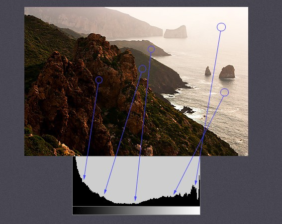
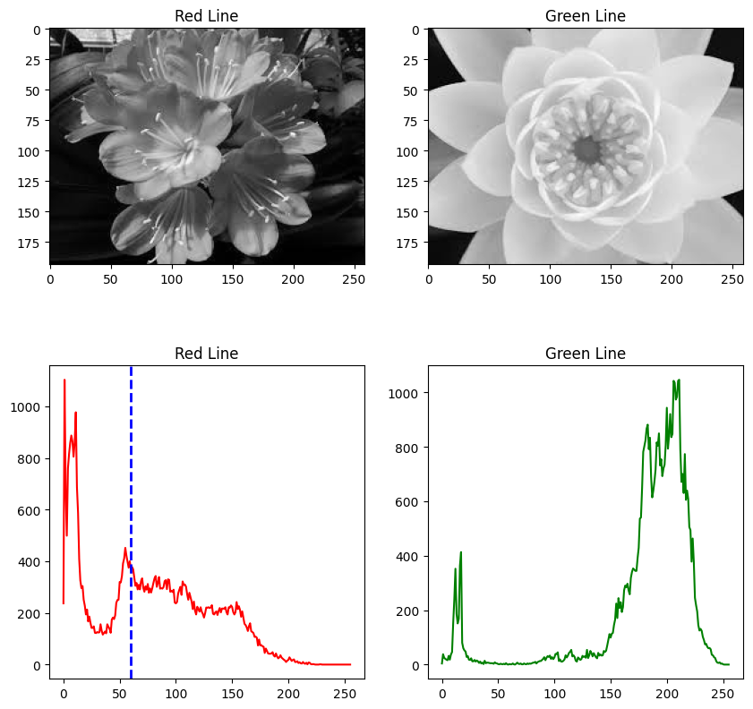
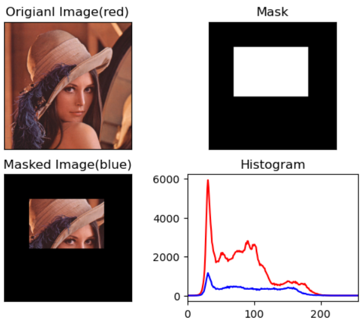
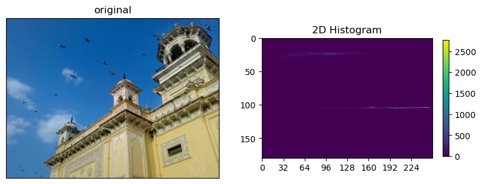
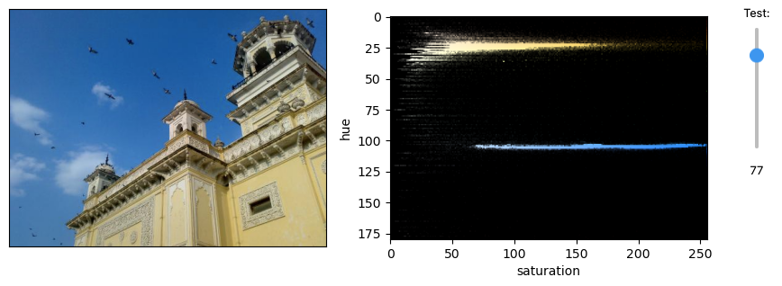

# Histogram

영상에서의 Histogram은 image의 intensity (or pixel이 가지는 값)들의 분포를 보여줌.

* chart로 표현하기도 하지만 
* image에 대한 feature에 해당하는 내부적 데이터로 사용하기도함.

image에서 histogram으로 변환은 ***비가역적 변환*** 임  
(다른 image들도 같은 histogram을 가질 수 있음).

<figure markdown>
{width="400"}
</figure>

* [관련 gist URL](https://gist.github.com/dsaint31x/f2e0f5361cf917b067f71b60acf80d23)

---

---

## Terms

* `BINS` : 
    * 히스토그램 그래프의 X축(intensity)의 bin의 수(`histSize`)를 결정 .
    * 8bit gray scale 영상의 경우에는 0 ~ 255로 intensity가 표현되며, 이 경우 BINS은 최대 256 의 수를 가질 수 있음.
    * 만약, BINS값이 16으로 지정할 경우, 0 ~ 15, 16 ~ 31..., 240 ~ 255와 같이 X축이 16개의 bin으로 표현이 됨.
    * 이는 intensity가 0~15까지 같은 bin에서 카운팅 됨을 의미!
    * OpenCV에서는 BINS를 histSize 라고 표현합니다.
* `channels` : 
    * 이미지에서 histogram을 만들기 위해 사용하는 값을  의미. 
    * 빛의 강도(intensity)를 기준으로 histogram을 만들지, RGB값을 기준으로  만들지를 결정.
    * `DIMS`로도 불림.
* `range` : 
    * X축의 범위임 (각 pixel이 가질 수 있는 범위).
    * = X축의 from ~ to.
    * 원래의 pixel의 가지는 값보다 작게 지정할 경우, 해당 range의 pixel들만으로 histogram을 만들어냄.

---

---

## OpenCV's Histogram

```Python
# 히스토그램 계산
hist = cv.calcHist(
    images=[img],      # 히스토그램을 계산할 이미지 (리스트로 전달)
    channels=[0],      # 계산할 채널 (그레이스케일 이미지에서는 채널 0)
    mask=None,         # 히스토그램을 계산할 마스크 (없으면 None)
    histSize=[256],    # 히스토그램 빈의 개수 (256개의 빈 사용)
    ranges=[0, 256],   # 값의 범위 (0에서 255 사이의 값)
    hist=None,         # 초기 히스토그램 (None이면 새로 계산)
    accumulate=False   # 히스토그램을 누적할지 여부 (False이면 새로 계산)
)
```

1.	`images`: 입력 이미지(또는 이미지 리스트).
    * 히스토그램을 계산할 이미지. 
    * 이 값은 List 형태로 전달되며, 
    * 예를 들어 `images=[img]`와 같이 사용할 수 있음.
2.	`channels`: 히스토그램을 계산할 채널.
    * 이미지의 채널 인덱스를 지정. 
    * 예를 들어, 그레이스케일 이미지는 0, 컬러 이미지에서는 0(파란색 채널), 1(녹색 채널), 2(빨간색 채널)을 사용.
3.	`mask`: 이미지에서 히스토그램을 계산할 영역을 지정하는 마스크.
    * 특정 영역만을 대상으로 히스토그램을 계산할 때 사용되는 바이너리 마스크. 
    * 이미지 전체를 대상으로 히스토그램을 계산할 경우 `None`으로 설정.
4.	`histSize`: 히스토그램의 빈(bin) 개수.
    * 히스토그램의 각 채널에 대해 계산할 빈의 개수를 지정. 
    * 일반적으로 `histSize=[256]`과 같이 설정하여 256개의 빈을 사용할 수 있음.
5.	`ranges`: 각 채널 값의 범위.
    * 히스토그램을 계산할 값의 범위. 
    * 예를 들어 `[0, 256]`과 같이 설정하면 픽셀 값이 0에서 255까지의 범위를 대상으로 히스토그램을 계산.
6.	`hist`: (선택 사항) 초기 히스토그램.
    * 이전에 계산된 히스토그램을 입력으로 전달하여 그 값을 기반으로 계산을 계속. 
    * 보통 `None`으로 설정.
7.	`accumulate`: (선택 사항) 히스토그램을 누적할지 여부.
    * `True`로 설정하면 이전의 히스토그램 값에 새로운 값을 누적하여 계산. 
    * 기본값은 `False`.

---

### Example

```Python
#-*- coding:utf-8 -*-
import os,sys
import cv2
import numpy as np
import random
from matplotlib import pyplot as plt

import requests

def ds_url_imread(url):
    t0 = requests.get(url)# requests.models.Response 
    t1 = t0.content       # bytes (immutable) 
    t2 = bytearray(t1)    # bytearray (mutable)
    t3 = np.asarray(t2, dtype=np.uint8) #ndarray
    img = cv2.imdecode(t3, cv2.IMREAD_UNCHANGED)
    return img

# to histogram with intensity of pixel, load image with cv2.IMREAD_GRAY 

url = 'https://raw.githubusercontent.com/dsaint31x/OpenCV_Python_Tutorial/master/images/flower1.jpg'
img1 = ds_url_imread(url)
assert img1 is not None, "file could not be read, check with os.path.exists()"

url = 'https://raw.githubusercontent.com/dsaint31x/OpenCV_Python_Tutorial/master/images/flower2.jpg'
img2 = ds_url_imread(url)
assert img2 is not None, "file could not be read, check with os.path.exists()"

img1 = cv2.cvtColor(img1, cv2.COLOR_BGR2GRAY)
img2 = cv2.cvtColor(img2, cv2.COLOR_BGR2GRAY)


hist1 = cv2.calcHist(
            [img1],
            [0],
            None,
            [256],
            [0,256],
     )
hist2 = cv2.calcHist(
            [img2],
            [0],
            None,
            [256],
            [0,256],
     )

fig, axes = plt.subplots(2,2, figsize=(10,10))
axes[0,0].imshow(img1, cmap='gray')
axes[0,0].set_title('Red Line')
axes[0,1].imshow(img2, cmap='gray')
axes[0,1].set_title('Green Line')
axes[1,0].plot(hist1, color='r')
axes[1,0].set_title('Red Line')
axes[1,1].plot(hist2, color='g')
axes[1,1].set_title('Green Line')
axes[1,0].axvline(x=60, color='b', linestyle='--', linewidth=2)
plt.show()

# ---------
hist3 = cv2.calcHist(
            [img1],
            [0],
            None,
            [61],
            [0,61],
     )
plt.figure()
plt.plot(hist3, color='red')
plt.axvline(x=60, color='b', linestyle='--', linewidth=2)
plt.show()
```

<figure markdown>
{width="400"}
</figure>

<figure markdown>
{width="300"}
</figure>

#### MASK 사용하기.

```Python
#-*-coding:utf-8-*-
import cv2
import numpy as np
from matplotlib import pyplot as plt
import os


url = 'https://raw.githubusercontent.com/dsaint31x/OpenCV_Python_Tutorial/master/images/lena.png'
img = ds_url_imread(url)
assert img is not None, "file could not be read, check with os.path.exists()"


# mask생성
mask = np.zeros(img.shape[:2],np.uint8)
mask[100:300,100:400] = 255

# 이미지에 mask가 적용된 결과
masked_img = cv2.bitwise_and(img,img,mask=mask)

# 원본 이미지의 히스토그램 green
hist_full = cv2.calcHist([img],[1],None,[256],[0,256])

# mask를 적용한 히스트로그램 green
hist_mask = cv2.calcHist([img],[1],mask,[256],[0,256])

fig, axs = plt.subplots(2,2, figsize=(10,10))

axs[0,0].imshow(img[...,::-1])
axs[0,0].set_title('Original Image(red)')
axs[0,0].set_xticks([])
axs[0,0].set_yticks([])
axs[1,0].imshow(masked_img[...,::-1])
axs[1,0].set_title('Masked Image(blue)')
axs[1,0].set_xticks([])
axs[1,0].set_yticks([])
axs[0,1].imshow(mask, cmap='gray')
axs[0,1].set_title('Mask')
axs[0,1].set_xticks([])
axs[0,1].set_yticks([])

# red는 원본이미지 히스토그램, blue는 mask적용된 히스토그램
axs[1,1].plot(hist_full, color='r')
axs[1,1].plot(hist_mask, color='b')
axs[1,1].set_xlim([0,256])
axs[1,1].set_title('Histogram')

fig.set_tight_layout(True)
plt.show()
```



---

---

## Histogram Calculation in NumPy

```Python
hist,bin_edges = np.histogram(
    img.ravel(),
    bins = 256,
    range = [0,256],
    weights = None,
    density = False,
)
```

* `img` : 
    * 대상 image. 
    * NumPy는 1D-array로 동작시키기 위해 `ravel`을 사용함. 
    * `a`라고 불림
* `bins` : 
    * # of bins
    * 256으로 설정하여 0~255까지의 픽셀 값을 256개의 구간
* `range` : 
    * floating point 로 주어짐. 
    * `[min, max)` 로 range를 할당.
    * 기본은 `[a.min(), a.max()]`임.
* `weights` : 
    * `a`와 같은 크기로 각 bin의 가중치임.
    * None으로 설정하여 가중치를 적용하지 않음.
* `density` : 
    * `True`이면 probability로 출력 
    * 히스토그램을 정규화할지 여부를 지정

**반환값**

* `hist` : histogram
* `bin_edges` : bin을 나누는 edge들이라 `bins+1`에 대응.

---

---

## 2D Histograms

Depth(or Channel, Feature)가 1개인 경우엔 앞서 다룬 1 Dimensional Histogram을 구성하지만,  
feature가 2개인 경우엔 2D Histogram으로 처리할 수 있다.

Color space에서 `HSV` model을 생각해보면, 

* V는 앞서 다룬 Intensity이고, 
* color에 해당하는 Hue와 Saturation을 2D Histogram으로 처리 가능하다.

(RGB를 이용하여 3D histogram도 가능은 하지만 많이 사용되지는 않는다.)

> Histogram backprojection에서  
> H와 S를 이용하기 때문에  
> 2D Histogram의 경우, Hue와 Saturation 으로 구한다.

```Python
# ---------------------
# imread by using URL
import requests

def ds_url_imread(url):
    t0 = requests.get(url)# requests.models.Response 
    t1 = t0.content       # bytes (immutable) 
    t2 = bytearray(t1)    # bytearray (mutable)
    t3 = np.asarray(t2, dtype=np.uint8) #ndarray
    img = cv2.imdecode(t3, cv2.IMREAD_UNCHANGED)
    return img

# --------------------
# load and histogramming

import numpy as np
import cv2 

url = 'https://raw.githubusercontent.com/dsaint31x/OpenCV_Python_Tutorial/master/images/2d_histogram.jpg'
# img = cv2.imread('../images/2d_histogram.jpg')
img = ds_url_imread(url)
assert img is not None, "file could not be read, check with os.path.exists()"

hsv  = cv2.cvtColor(
    img,
    cv2.COLOR_BGR2HSV,
)
hist = cv2.calcHist(
    [hsv], 
    [0, 1],           # channels
    None,             # mask
    [180, 256],       # histSize or size of bins
    [0, 180, 0, 256], # range to binning
)

print(f'{hist.shape = }')

# -------------------------
# display

import matplotlib.pyplot as plt

fig, axs = plt.subplots(1,2, figsize=(10,5))
axs[0].imshow(img[...,::-1])
cax = axs[1].imshow(
    hist,
    interpolation='nearest',
    cmap='viridis',
)
fig.colorbar(cax, ax=axs[1], shrink=0.5)

axs[0].set_xticks([])
axs[0].set_yticks([])
axs[0].set_title('original')
axs[1].set_xticks(range(0,180,30))
axs[1].set_xticks(range(0,256,32))
axs[1].set_title('2D Histogram')

plt.show()
```

<figure markdown>
 
</figure>

* 푸른 하늘에 해당하는 pixel이 많기 때문에 Hue=120 근처에서 많은 값을 보임.
* 건물에 해당하는 노란색도 많아서 20~30 사이에 보임.

histogram에서 잘 안보이기 때문에 V=255일 때의 HS map을 기반으로 처리한 2d histogram은 다음과 같음.

<figure markdown>
{width="600"}
</figure>

* scaling (slide-bar의 test)의 값이 커질수록 2D histogram에서 강조가 되어 보이도록 처리함.
* 푸른색과 노란색 부분이 강조되어 쉽게 확인이 가능함.

Hue, Saturation은 color image의 특성을 나타내는 feature로 사용할 수 있다.  
(주의할 것은 다른 image라도 거의 비슷한 2D Histogram을 가질 수 있다는 점임.)

* pixel들의 color의 분포를 나타내는 것임.
* 위치적 정보가 사라지기 때문에 color들의 분포는 비슷하면 비슷한 2D Histogram이 나올 수 있음.
* histogram간의 유사도가 image가 같은지를 나타내는 것은 아님.

---

## References

* [openCV's Tutorial](https://docs.opencv.org/4.x/dd/d0d/tutorial_py_2d_histogram.html)