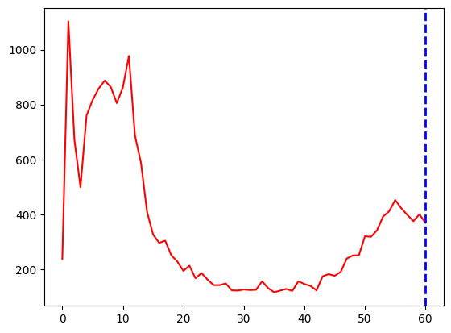

# Histogram

Histogram은 image의 intensity (or pixel이 가지는 값)들의 분포를 보여줌.

chart로 표현하기도 하지만 내부적 데이터로 사용하기도함.

image에서 histogram으로 변환은 비가역적 변환임 
(다른 image들도 같은 histogram을 가질 수 있음).

{width="400"}

## Terms

* `BINS` : 
    * 히스토그램 그래프의 X축(intensity)의 bin의 수(`histSize`)를 결정 .
    * 8bit gray scale 영상의 경우에는 0 ~ 255로 intensity가 표현되며, 이 경우 BINS은 최대 256 의 수를 가질 수 있음.
    * 만약, BINS값이 16으로 지정할 경우, 0 ~ 15, 16 ~ 31..., 240 ~ 255와 같이 X축이 16개의 bin으로 표현이 됨.
    * 이는 intensity가 0~15까지 같은 bin에서 카운팅 됨을 의미!
    * OpenCV에서는 BINS를 histSize 라고 표현합니다.
* `channels` : 
    * 이미지에서 histogram을 만들기 위해 사용하는 값을  의미. 
    * 빛의 강도(intensity)를 기준으로 histogram을 만들지, RGB값을 기준으로  만들지를 결정.
    * `DIMS`로도 불림.
* `range` : 
    * X축의 범위임 (각 pixel이 가질 수 있는 범위).
    * = X축의 from ~ to.
    * 원래의 pixel의 가지는 값보다 작게 지정할 경우, 해당 range의 pixel들만으로 histogram을 만들어냄.

## OpenCV's Histogram

```Python
cv.calcHist(
    images, 
    channels, 
    mask, 
    histSize, 
    ranges
    hist, 
    accumulate
)
```

* `image`  : 분석대상 이미지(uint8 or float32 type). Array형태.
* `channels` : 분석 채널(X축의 대상). 이미지가 graysacle이면 [0], color 이미지이면 [0,2] 형태(0 : Blue, 1: Green, 2: Red)
* `mask` : 이미지의 분석영역. None이면 전체 영역. (0 or 255)
* `histSize` : BINS 값. [256]
* `ranges` : Range값. [0,256]


#### Example

```Python
#-*- coding:utf-8 -*-
import os
import cv2
import numpy as np
import random
from matplotlib import pyplot as plt

# to histogram with intensity of pixe, load image with cv2.IMREAD_GRAY 

if IN_COLAB:
    img1 = cv2.imread(os.path.join(PATH, 'flower1.jpg'), cv2.IMREAD_GRAYSCALE)
    img2 = cv2.imread(os.path.join(PATH, 'flower2.jpg'), cv2.IMREAD_GRAYSCALE)
else:
    img1 = cv2.imread('../images/flower1.jpg',0) 
    img2 = cv2.imread('../images/flower2.jpg',0)

hist1 = cv2.calcHist([img1],[0],None,[256],[0,256])
hist2 = cv2.calcHist([img2],[0],None,[256],[0,256])


#plt.style.use('dark_background')
plt.subplot(2,2,1),plt.imshow(img1,'gray'),plt.title('Red Line')
plt.subplot(2,2,2),plt.imshow(img2,'gray'),plt.title('Green Line')
plt.subplot(2,2,3),plt.plot(hist1,color='r')
plt.subplot(2,2,4),plt.plot(hist2,color='g')
plt.xlim([0,256])
plt.show()


hist3 = cv2.calcHist([img1],[0],None,[32],[0,128])
print(np.shape(hist3))

plt.figure()
plt.plot(hist3,color='r')
plt.show()
```

{width="400"}

{width="300"}


#### MASK사용하기.

```Python
#-*-coding:utf-8-*-
import cv2
import numpy as np
from matplotlib import pyplot as plt
import os


if not IN_COLAB:
    img = cv2.imread('../images/lena.png');
else:
    img = cv2.imread(os.path.join(PATH, 'lena.png'))


# mask생성
mask = np.zeros(img.shape[:2],np.uint8)
mask[100:300,100:400] = 255

# 이미지에 mask가 적용된 결과
masked_img = cv2.bitwise_and(img,img,mask=mask)

# 원본 이미지의 히스토그램 green
hist_full = cv2.calcHist([img],[1],None,[256],[0,256])

# mask를 적용한 히스트로그램 green
hist_mask = cv2.calcHist([img],[1],mask,[256],[0,256])

# bgr > rgb
#b,g,r = cv2.split(img) # divide img into b,g,r
#img = cv2.merge([r,g,b])
#b,g,r = cv2.split(masked_img)
#masked_img = cv2.merge([r,g,b])
img = img[:,:,::-1]
masked_img = masked_img[:,:,::-1]

#plt.style.use('dark_background')
plt.subplot(221),plt.imshow(img,'gray'),plt.title('Origianl Image(red)'), plt.xticks([]), plt.yticks([])
plt.subplot(222),plt.imshow(mask,'gray'),plt.title('Mask'), plt.xticks([]), plt.yticks([])
plt.subplot(223),plt.imshow(masked_img,'gray'),plt.title('Masked Image(blue)'), plt.xticks([]), plt.yticks([])

# red는 원본이미지 히스토그램, blue는 mask적용된 히스토그램
plt.subplot(224),plt.title('Histogram')
plt.plot(hist_full,color='r'),plt.plot(hist_mask,color='b')
plt.xlim([0,256])

plt.show()
```


## Histogram Calculation in NumPy

```Python
hist,bin_edges = np.histogram(
    img.ravel(),
    bins = 256,
    range = [0,256],
    normed = False,
    weights = None,
    density = False
)
```

* `img` : 대상 image. NumPy는 1D-array로 동작시키기 위해 `ravel`을 사용함. `a`라고 불림
* `bins` : # of bins
* `range` : floating point 로 주어짐. 기본은 `[a.min(), a.max()]`임.
* `normed` : boolean. bin의 간격이 일정할 경우에만 `True`로 사용하길 권함.
* `weights` : `a`와 같은 크기로 각 bin의 가중치임.
* `density` : `True`이면 probability로 출력.

반환값

* `hist` : histogram
* `bin_edges` : bin을 나누는 edge들이라 `bins+1`에 대응.


