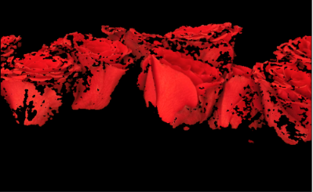

# Histogram Backprojection

Hue와 Saturation으로 이루어진 Histrogram을 이용하여 다음의 task를 수행하는데 사용되는 기법.

* Image segmentation
* Finding ojbects of interest in an image

찾고자 하는 또는 분리하고자 하는 (indexing하고자 하는) image의 Hue, Saturation의 분포를 만들고 전체 image의 Hue, Saturation 2D histogram에서 해당 분포에 속하는 Hue와 Saturation pair들을 구한 후, 이 pair에 속하는 pixel들의 index를 구하는 backprojection을 수행하는 방식이다. 

## Algorithm in Numpy

1. Hue, saturation 2d histogram을 분리하고자 하는 object 와 전체 image 각각에 대해 구한다.
2. 이 두 2d histogram의 ratio $R=\frac{\text{Obj}}{\text{I}}$를 구하고, 이 ratio를 pixel에 backprojectino한다.
    * Backprojection으로 나오는 image $B(x,y)=R[h(x,y), s(x,y)]$가 된다.
    * 즉 결과 이미지의 pixel intensity는 해당 pixel의 Hue와 Saturaiton에서의 $R$값으로 값이 클수록 찾고자 하는 object에 속한 pixel일 확률 큼.
3. 2번의 결과 이미지로 구해지는 Mask 경계를 부드럽게 하기 위해 blurring이나 morphologic processing을 수행한다. 
4. Thresholding을 통해, object에 속하는 pixel들을 선택한다.


다음은 Numpy로 구현한 예제임.

```Python
import numpy as np
import cv2 
from matplotlib import pyplot as plt

#roi is the object or region of object we need to find
roi = cv2.imread('../images/rose_red.png')
assert roi is not None, "file could not be read, check with os.path.exists()"
hsv = cv2.cvtColor(roi,cv.COLOR_BGR2HSV)
#target is the image we search in
target = cv2.imread('../images/rose.png')
assert target is not None, "file could not be read, check with os.path.exists()"
hsvt = cv.cvtColor(target,cv.COLOR_BGR2HSV)
# Find the histograms using calcHist. Can be done with np.histogram2d also
M = cv2.calcHist([hsv],[0, 1], None, [180, 256], [0, 180, 0, 256] )
I = cv2.calcHist([hsvt],[0, 1], None, [180, 256], [0, 180, 0, 256] )
```

* `M`이 찾고자하는 object의 2d histogram (or color histogram)임.
* `I`가 전체 image의 2d histogram임.

<figure markdown>
{width="500"}
<figcaption>target image</figcaption>
</figure>

```Python
R = M/(I+1)

h,s,v = cv2.split(hsvt)
B = R[h.ravel(),s.ravel()]
B = np.minimum(B,1)
B = B.reshape(hsvt.shape[:2])h,s,v = cv.split(hsvt)
```

* $R=\frac{M}{I}$를 구함.

```Python
disc = cv2.getStructuringElement(cv2.MORPH_ELLIPSE,(5,5))
B = cv2.filter2D(B,-1,disc,None)
B = np.uint8(B)
B = cv2.normalize(B,None,0,255,cv.NORM_MINMAX)

plt.imshow(B, cmap='gray')
```

* blurring을 수행하여 object의 영역을 smoothing시킴.

<figure markdown>
{width="500"}
<figcaption>2D ratio image.</figcaption>
</figure>

```Python
ret,thresh = cv2.threshold(B,
                          1,  # threshold 적절히 조절.
                          255,
                          cv2.THRESH_BINARY #0
                          )
```

* Thresholding을 수행.

```Python
mask = cv2.merge([thresh,thresh,thresh])
seg = cv2.bitwise_and(target, mask)
plt.imshow(seg[...,::-1])
```

* 이후 구해진 mask를 이용하여 segmentation을 수행.

<figure markdown>
{width="500"}
<figcaption>The result of histogram backproj.</figcaption>
</figure markdown>


## Backprojection in OpenCV

OpenCV에서는 `cv2.calcBackProject` 함수를 제공하고 있음.

* `cv2.calcHist()`와 거의 비슷한 parameter.
* 단, backproj에 사용할 2d histogram을 입력받는다는 차이가 있음.

```Python
import numpy as np
import cv2

roi = cv2.imread('../images/rose_red.png')
assert roi is not None, "file could not be read, check with os.path.exists()"
hsv = cv2.cvtColor(roi,cv2.COLOR_BGR2HSV)

target = cv2.imread('../images/rose.png')
assert target is not None, "file could not be read, check with os.path.exists()"
hsvt = cv2.cvtColor(target,cv2.COLOR_BGR2HSV)

# calculating object histogram
roihist = cv2.calcHist([hsv],[0, 1], None, [180, 256], [0, 180, 0, 256] )

# normalize histogram and apply backprojection
cv2.normalize(roihist,roihist,0,255,cv2.NORM_MINMAX)
dst = cv2.calcBackProject(
    [hsvt],        # input image (분리대상) 
    [0,1],         # 사용할 channels
    roihist,       # back proj에 사용될 2d histogram
    [0,180,0,256], # ranges (H, S의)
    1              # scale (결과에 곱해질)
)

# Now convolute with circular disc
disc = cv2.getStructuringElement(cv2.MORPH_ELLIPSE,(5,5))
cv2.filter2D(dst,-1,disc,dst)

# threshold and binary AND
ret,thresh = cv2.threshold(dst,50,255,0)
thresh = cv2.merge((thresh,thresh,thresh))
res = cv2.bitwise_and(target,thresh)
res = np.vstack((target,thresh,res))

plt.imshow(res[...,::-1])
plt.xticks([]);plt.yticks([])
plt.show()
# cv2.imwrite('res.jpg',res)
```

## References

* "Indexing via color histograms", Swain, Michael J. , Third international conference on computer vision,1990.
* [OpenCV's tutorial](https://docs.opencv.org/4.x/dc/df6/tutorial_py_histogram_backprojection.html)
