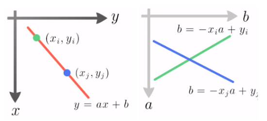
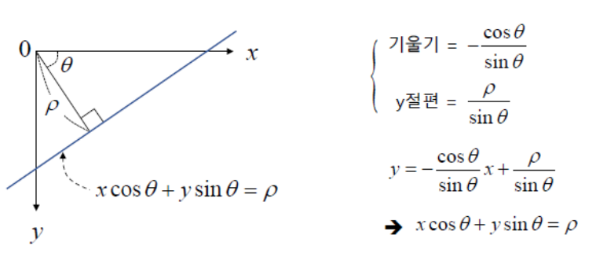
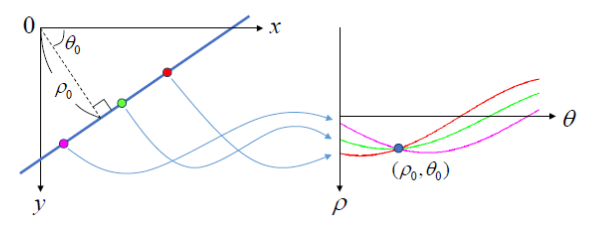
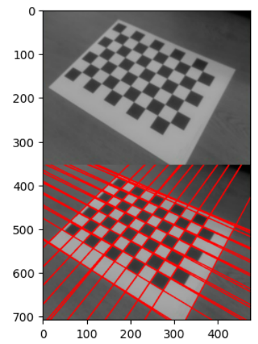
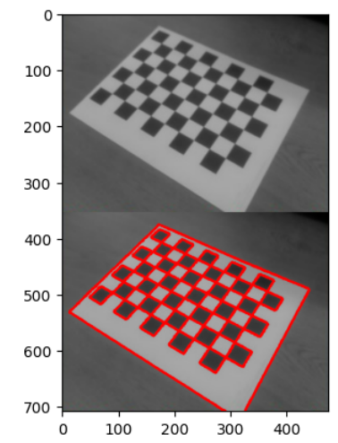

# Hough Transform

Hough transform은 image 에서 직선이나 원과 같은 간단한 shape의 object를 찾아내는데 사용되는 변환으로 찾고자 하는 shape가 일부 깨지거나 누락된 경우 (e.g. 직선의 일부가 끊어져 있는 등의 경우)에도 해당 shape를 잘 찾아내는 장점을 가짐.

기본적으로 Hough Transform은 line을 찾는데 사용되는 것으로 시작되었으나 원이나 사각형 등의 검출을 위해 확장되었음.

OpenCV에서는 기본적으로 line과 circle을 검출하는 구현물을 제공.

## 필요한 전처리

Hough Transform은 사용하기 위해서는 Canny Algorithm을 통해 edge 가 추출된 binary image를 먼저 구하고, 이를 입력으로 사용한다.

Canny algorithm을 사용하기 전에 Gaussian Blurring을 수행하여 noise를 줄이는 경우가 일반적임.

## Hough (Line) Transform : `ab` space

image에서 특정 line을 지정하는 파라메터는 기울기($a$)와 bias ($b$)라고 할 수 있다. 

$$ y=ax+b $$

Hough Transform은 x,y로 구성된 image space의 데이터 (edge binary image)를 `ab` space로 transform시킨다.

$$ f(x,y) \rightarrow h(a,b)$$

* binary edge image에서 값이 0이 아닌 edge에 속하는 각각의 pixel에 대해 해당 pixel을 통과하는 line에 대한 기울기와 bias를 구하고 해당하는 기울기와 bias를 가지는 `ab` space의 pixel들 값을 1씩 증가시킨다. 
* edge에 속하는 모든 pixel에 대해서 위의 과정을 수행하므로 `ab` space를 accumulator space라고도 한다. (누적이 되므로)

다음 그림은 image space(좌)와 `ab` space(우)를 보여주며, 녹색의 점을 지나는 모든 직선들은 `ab` space에서 녹색 line에 해당한다. 즉 녹색의 점이 edge라면 `ab` space의 녹색 line에 해당하는 accumulator들의 값이 1씩 증가하게 된다. 청색의 점에 해당하는 `ab` space의 accumulator는 청색의 직선으로 청색의 점이 edge라면 역시 청색의 직선을 구성하는 accumulator들의 값이 1씩 증가한다.



단, `ab` space의 경우, 기울기($a$)가 무한대가 될 수 있다는 단점을 가짐 (수직선의 경우). 때문에 기울기와 bias를 parameter로 사용하지 않고, polar coordinate의 직선의 방정식을 사용한다. 즉, 직선이 x축과 이루는 각도와 원점과의 거리를 통해 line을 나타내는 방법을 주로 사용함.

## Hough Transform

직선의 공식으로 polar coordinate에서의 직선의 방정식을 사용.

$$x\cos\theta+y\sin\theta=\rho$$



다음 그림은 image space와 accumulator space간의 관계를 보여줌.



* `ab` space와 마찬가지로 edge에 속하는 pixel에 해당하는 accumulator space의 pixel들의 값을 1씩 증가시키는 처리를 모든 edge의 pixel에 수행한다.
* 결국 edge binary image에 존재하는 line에 해당하는 accumulator space의 pixel은 최종적으로 매우 높은 값을 가지게 된다.

Hough Transform으로 얻어진 accumulator space에서 thresholding을 통해 binarization을 수행한 결과인 accumulator space의 binary image에서 0이 아닌 pixel의 $\theta$와 $\rho$에 해당하는 직선이 원래 image에 있었던 line이라고 할 수 있다.

## OpenCV

`cv2.HoughLines`로 제공됨.

```Python
cv2.HoughLines(
    image, 
    rho, 
    theta, 
    threshold
    [, lines
    [, srn
    [, stn
    [, min_theta
    [, max_theta]]]]]) → lines
```

* `image` : 8bit, single channel binary source image.
* `lines` : output, 반환값으로 받고 인자에선 None으로 주는게 일반적.
* `rho` : radial distance resolution. 0~1. 작으면 작을수록 accumulator space의 rho관련 accumulator bin의 수가 증가하며 정교한 결과가 나옴.(시간이 많이 걸림.)
* `theta` : angle resolution. radian 단위로 입력해야 함 `0~np.pi`. `rho`의 경우와 같이 값이 작을수록 정교한 결과를 주지만 시간이 많이 걸림.
* `threshold` : accumulator threshold. 직선으로 판정을 하기 위한 threshold로 작으면 검출되는 line수가 증가하나 false line의 수도 증가함. (초과해야 line으로 판정)
* `srn` : multi-scale Hough transform에서 사용됨. line detection에선 0을 할당.
* `stn` : multi-scale Hough transform에서 사용됨. line detection에선 0을 할당.
* `min_theta` : 검출에 사용할 최소 angle. `max_theta`보다 작아야하고 0보다는 커야함. radian으로 입력
* `max_theta` : 검출에 사용할 최대 angle. `min_theta`보다 커야하고, np.PI(3.14...)보다 작아야 함. radian으로 입력.

반환되는 `lines`는 $N \times 1 \times 2$의 list로서 $N$은 검출된 line의 수이고, 각 line별로 $\rho, \theta$ 반환. 

예제 코드는 다음과 같음.

* 사용된 input image는 다음 URL에서 받을 것 : [frame01.png](../../img/ch02/frame01.png)

```Python
import cv2
import numpy as np

img = cv2.imread('frame01.png')
img_original = img.copy()
gray = cv2.cvtColor(img, cv2.COLOR_BGR2GRAY)
edges = cv2.Canny(gray,50,150,apertureSize=3)

lines = cv2.HoughLines(edges,1,np.pi/180,100)
print(np.array(lines).shape)
for i in range(len(lines)):
    for rho, theta in lines[i]:
        a = np.cos(theta)
        b = np.sin(theta)
        x0 = a*rho
        y0 = b*rho
        x1 = int(x0 + 1000*(-b))
        y1 = int(y0+1000*(a))
        x2 = int(x0 - 1000*(-b))
        y2 = int(y0 -1000*(a))

        cv2.line(img,(x1,y1),(x2,y2),(0,0,255),2)

import matplotlib.pyplot as plt

res = np.vstack((img_original,img))
plt.imshow(res[...,::-1])
```

결과는 다음과 같음.



## Probabilistic Hough Transform

* Hough transform은 edge binary image의 모든 pixel에 대해 처리가 이루지므로 많은 시간이 소요됨.
* Probabilistic Hough Transform은 위에서 설명한 Hough transform을 개선한 것임.
* 무작위로 임의의 점을 선택하여 Hough transform을 수행하고 선택되는 임의의 점의 갯수를 progressive하게 증가시키면서 Hough transform이 수행됨.

> 모든 edge pixel이 참여하는 Hough transform과 달리 Probabilistic Hough Transform은 처리되는 pixel의 수가 적으므로 `threshold`의 값이 보다 작아야 제대로 동작함.

OpenCV에서는 `cv2.HoughLinesP`로 제공됨.

```Python
cv2.HoughLinesP(
    image, 
    rho, 
    theta, 
    threshold, 
    minLineLength, 
    maxLineGap) → lines
```

* `minLineLength` – 선의 최소 길이. 이 값보다 작으면 line으로 검출되지 못함.
* `maxLineGap` – 선과 선사이의 최대 허용간격. 이 값보다 크게 떨어져있으면 line으로 검출되지 못함.

반환되는 `lines`는 $N \times 1 \times 4$의 list로서 $N$은 검출된 line의 수이고, 각 line별로 $x_1,y_1,x_2,y_2$ 반환. 


나머지 `cv2.HoughLines`와 같은 키의 parameter들은 같은 역할을 함.

```Python
minLineLength = 0
maxLineGap = 0

lines = cv2.HoughLinesP(edges,
                        1,
                        np.pi/180,
                        2, # accumulator threshold. 작게 설정해야함.
                        minLineLength,maxLineGap
                        )
print(np.array(lines).shape)
img = img_original.copy()
for i in range(len(lines)):
    for x1,y1,x2,y2 in lines[i]:
        cv2.line(img,(x1,y1),(x2,y2),(0,0,255),3)

import matplotlib.pyplot as plt

res = np.vstack((img_original,img))
plt.imshow(res[...,::-1])
```

결과는 다음과 같음



## References

* [OpenCV's Tutorial](https://docs.opencv.org/4.x/d6/d10/tutorial_py_houghlines.html)
