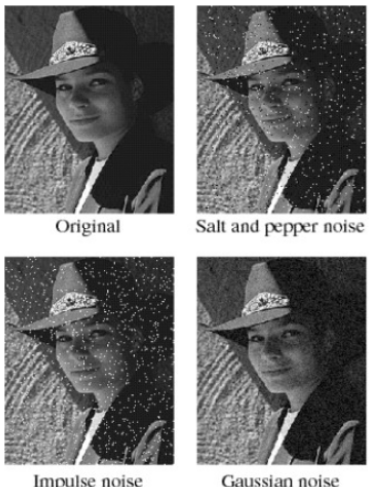

# Low Pass Filter 

filter란 입력이미지에서 

- 원하지 않는 값들은 걸러내고
- 원하는 값들을 추출하여

결과로 얻는 방법 또는 컴포넌트를 지칭.

대표적인 예로 edge 의 위치와 방향을 검출하여 Image Analysis 및 Image Segmentation의 기본이 되는 정보를 제공하거나, 영상을 blurring 또는 Sharpening하는 filter들이 있음.

> 이 문서에서는 spatial domain filter에서도 low pass filter를 다룬다.

## Spatial domain filter and Frequency domain filter

`Spatial domain filter`
: 결과 영상의 pixel값을 계산하는데, 입력 영상 해당 위치의 픽셀 하나만을 이용하기보다는 ***주변의 pixel들*** 을 값을 이용하는 Filter.  
(mask혹은 kernel과의 convolution연산을 통해 수행됨)

> convolution은 다음 url참고 : [Convolution](../etc/dip_convolution.md)

`Frequency domain filter`
: Spatial domain의 입력 영상을 Fourier Transform(FT)등을 통해 *freq. domain* 으로 변환하여 처리가 이루어지는 filter.

## Low Pass Filters (on Spatial domain)

### Box Filter

Box filter는 blurring을 시키는 가장 간단한 low pass filter이며, kernel은 다음과 같음.

$$
K=n \begin{bmatrix}
1 & 1 & 1 & ... & 1  \\
1 & 1 & 1 & ... & 1 \\
& & ... & & \\
1 & 1 & 1 & ... & 1
\end{bmatrix}
$$
where
$$
n = \begin{cases} \frac{1}{k_\text{w} \times k_\text{h}}  & \text{if normalize =True} \\
1 & \text{else} \end{cases}
$$

- 균일한 weight로 구성된 kernel
- kernel 영역에 있는 pixel들의 합을 가지도록 함 (`normalize=False`가 기본).

OpenCV에서는 `cv2.boxFilter`로 제공됨.

```Python
cv2.boxFilter(
    src, 
    ddepth, 
    ksize, 
    dst, 
    anchor, 
    normalize, 
    borderType
)
```

- `src`: input image
- `ddepth`: output image depth (-1일 경우 input image와 같음)
- `ksize`: kernel size
- `anchor`: 결과값이 저장될 위치, default: (-1,-1) = center of kernel.
- `normalize`: flag, 정규화 여부
- `borderType`: padding 방식

다음 그림은 anchor의 위치를 나타냄.

{width=600}

OpenCV에서는 `cv2.blur`라는 함수도 제공하는데 이는 normalized box filter라고 할 수 있음.

```Python
# cv2.boxFilter에서 normalize=True한 Filter.
cv2.blur(
    src, 
    ksize, 
    dst, 
    anchor, 
    borderType
)
```

### Median Filter

- kernel 범위의 pixel intensity 들의 median으로 output image 의 대상 pixel intensity를 바꿈.
- **salt and pepper noise** or **impulse noise** 제거에 탁월함.
- 가장 쉬운 비선형 필터.
    - Low-Pass Filter에 비하여 edge를 보호하면서 smoothing하는 효과
    - sharpness의 큰 차이를 보이지 않으면서 noise 제거 가능

다음 그림은 salt and pepper noise에서 얼마나 median filter가 효과적인지를 보임.


#### Example

8-neighborhood에 자신을 포함하고, intensity값에 따라 sorting한 후 median에 해당하는 intensity를 결과 영상의 anchor pixel에 설정.


OpenCV에서는 `cv2.medianBlur`로 제공됨.

```Python
cv2.medianBlur(
    src, 
    ksize, 
    dst
)
```

### Gaussian Filter

kernel이 다음의 2D Gaussian distribution을 따름.

$$
G(x,y) = \dfrac{1}{2\pi\sigma_\text{x}\sigma_\text{y}} \exp \left[ -\left( \dfrac{(x-x_o)^2}{2\sigma_\text{x}^2}+\dfrac{(y-y_o)^2}{2\sigma_\text{y}^2}\right)\right]
$$

- 새로운 pixel의 값을 결정할 때, 원래 해당 위치의 값에 가장 큰 영향을 받고, 나머지 주변 pixel에서는 가까울수록 많은 영향을 받게 됨.
- standard deviation이 클수록 blurring이 심해짐.

OpenCV에서는 `cv2.GaussianBlur`로 제공됨.

```Python
cv2.GaussianBlur(
    src, 
    ksize, 
    sigmaX, 
    dst, 
    sigmaY, 
    borderType
)
```
- `ksize` : odd number
- `sigmaX` : 0 일 경우 자동 생성됨.
    
    $\sigma_\text{x}=0.3( 0.5(\text{ksize}_\text{x}-1) -1) +0.8$
    
- `sigmaY` : default는 `sigmaX`임.
- `borderType` : padding 방식.

Helper function으로 Gaussian Kernel을 계산해주는 `cv2.GaussianKernel`을 제공함.

```Python
ret = cv2.GaussianKernel(
    ksize,
    sigma,
    ktype
)
```

* ret : 1차원 가우시안 커널이므로 `ret*ret.T` (outer product)를 통해 2차원으로 만들어 사용하는게 일반적.

### Bilateral Filter

- 픽셀 간의 거리 뿐 아니라 두 픽셀의 intensity의 차이도 고려한 가중치의 Kernel을 사용.
- 기존의 blurring filter들과 달리, edge perservaton이 우수함.

$$
f_\text{filtered}(\textbf{x})=\dfrac{1}{W_p}\sum_{\textbf{x}_i \in \Omega}f(\textbf{x})g_r(\|f(\textbf{x})-f(\textbf{x}_i)\|)g_s(||\textbf{x}-\textbf{x}_i\|)
$$

and ***normalization term***, $W_p$, is defined as

$$
W_p=\sum_{\textbf{x}_i \in \Omega}g_r(\|f(\textbf{x})-f(\textbf{x}_i)\|)g_s(||\textbf{x}-\textbf{x}_i\|) 
$$

where

- $f_\text{filtered}$ is the filtered image;
- $f$ is the original input image to be filtered;
- $\textbf{x}$ are the position vector (or coordinate) of the current pixel to be filtered;
- $\Omega$ is the window centered in $\textbf{x}_i$, so $\textbf{x}_i \in \Omega$  is another pixel;
- $g_r$ is the ***range kernel*** for smoothing **differences in intensities** (this function can be a ***Gaussian function***);
- $g_s$ is the ***spatial (or domain) kernel*** for smoothing **differences in coordinates** (this function can be a ***Gaussian function***).

OpenCV에서는 다음과 같은 `cv2.bilateralFilter`로 제공됨.

```Python
cv2.bilateralFilter(
    src, 
    d, 
    sigmaColor, 
    sigmaSpace, 
    dst, 
    borderType
)
```

- `src` : 입력 이미지, numpy의 `ndarray`
- `d` : 필터의 크기(직경). 5 이상 사용시 매우 느림.
- `sigmaColor` : color-space filter의 sigma
- `sigmaSpace` : spatial-space filter의 sigma

> `sigmaColor`와 `sigmaSpace`의 range는 10~150 로 사용하고, 둘 다 같은 값으로 지정하는 것을 OpenCV tutorial에 권함.

## Noises

Smoothing filter (or Low pass filter)에서 주로 제거하고자 하는 noise는 다음과 같음.

`Salt and Pepper noise`
: contains random occurrences of black and white pixels

`Impulse noise`
: contains random occurrences of white pixels

`Gaussian noise`
: variations in intensity drawn from a Gaussian normal distribution

<figure markdown>

<figcap>Reference : https://slideplayer.com/slide/5225380/</figcap>
</figure>

## References

