# Morphological Operations

## Introduction

Morphology 는 **형태학** 을 의미. 

> `Morphology` means ^^*the study of the shape and structure*^^ of living things from a biological perspective.  
> Morphology is a discipline of biology related to the study of ^^the shape and structure^^ of the organism and its unique structural characteristics.
> 
- 생물학자들이 동식물이 보여주는 모양 및 구조을 지칭하고 분류하는 것에서 유래.

DIP에서는 noise(작은 크기의) 제거, 구멍 메우기, 연결이 안 되어있는 선을 이어주기, boundary추출 등에서 이용되는 ***shape(형태)에 기반한 연산*** 을 가르킴.

간략히 정리하면  영상처리(or Computer vision)에서 다음의 연산을 가르킴.

- Object의 **모양(Structure, shape)을 분석** 하는데 사용되는 연산.
- Object의 **모양을 원하는 형태** 로 바꾸는데 사용되는 연산.

> 대상에 따라, binary morphology(w/ binary image)와 contrast morphology(w/ grayscale image) 로 나뉨.
> 

---

## 영상처리에서 Morphology

“Binary image와 gray scale image의 ***기하학적 구조*** 를 분석 처리하는 기법” 을 가르킴.

- Binary image : 기하학적 구조가 바뀜.
- Gray scale image : 직접적으로는 pixel의 값이 변경되면서 ***전체 영상내 object의 모양 및 구조*** 가 변경됨.

> OpenCV Tutorial에서 설명하고 있는 Morphology Operation은 다음과 같음  
>  
> Morphological transformations are some simple operations based on the `image shape`.
> 
> - It is ^^normally performed on binary images^^.
> - It needs two inputs,
>     - one is our original image,
>     - second one is called **structuring element** or **kernel** which decides the nature of operation.
> - Two basic morphological operators are `Erosion` and `Dilation`.
> - Then its variant forms like `Opening`, `Closing`, `Gradient` etc also comes into play.

주로 Image 내의 object들의 구조 및 모양 에 기반한 처리임.

- 경계, 골격구조, [convex-hull (주어진 점들을 모두 포함하는 최소 크기의 다각형)](./dip_contour_features.md#convex-hull) 등의 ^^object의 기하학적 구조 관련 feature를 처리^^ 하는데 사용됨.
- Object의 ^^기하학적 구조에 대한 description을 생성^^ 하는데 사용됨.

대표적인 연산으로는 다음 2가지 있음.

- Erosion (침식)
- Dilation (팽창)

응용분야로는

- Morphology filtering
- Thinning
- Pruning 등등

---

### Basic Operations

[Basic Operations (on a binary image) for Morphological Operation](https://dsaint31.tistory.com/entry/Basic-Operations-on-a-binary-image-for-Morphlogical-Operations)

---

## Structuring Element (SE, 구조요소, 구조화요소)

- 0과 1로 이루어진 kernel
- SE에서 1인 영역에 대응되는 대상 영상의 pixel의 값(Binary image의 경우 1 or 0)에 따라, Structuring Element의 anchor 위치(주로 중앙, origin이 anchor에 해당)에 해당하는 pixel(일반적으로 SE의 중심에 해당하는 pixel)의 값이 결정됨.
- 종류
    - `cv2.MORPH_RECT`
    - `cv2.MORPH_ELLIPSE`
    - `cv2.MORPH_CROSS`

`cv2.MORPH_RECT` 는 네모 모양의 kernel임.  
다음 코드는 해당 kernel을 $5\times5$ 로 생성.

```Python
# Rectangular Kernel
kernel = cv2.getStructuringElement(cv2.MORPH_RECT,(5,5))
print(kernel)
```

결과는 다음과 같음.

```Python
[[1 1 1 1 1]
 [1 1 1 1 1]
 [1 1 1 1 1]
 [1 1 1 1 1]
 [1 1 1 1 1]]
```

`cv2.MORPH_ELLIPSE` 는 타원(원도 포함) 모양의 kernel임.  
다음 코드는 해당 kernel을 $10\times 15$ 로 생성.

```Python
# Elliptical Kernel
kernel = cv2.getStructuringElement(cv2.MORPH_ELLIPSE,(15,10))
print(kernel)
plt.imshow(kernel, cmap='gray')
```

결과는 다음과 같음.

```Python
[[0 0 0 0 0 0 0 1 0 0 0 0 0 0 0]
 [0 0 0 1 1 1 1 1 1 1 1 1 0 0 0]
 [0 1 1 1 1 1 1 1 1 1 1 1 1 1 0]
 [0 1 1 1 1 1 1 1 1 1 1 1 1 1 0]
 [1 1 1 1 1 1 1 1 1 1 1 1 1 1 1]
 [1 1 1 1 1 1 1 1 1 1 1 1 1 1 1]
 [1 1 1 1 1 1 1 1 1 1 1 1 1 1 1]
 [0 1 1 1 1 1 1 1 1 1 1 1 1 1 0]
 [0 1 1 1 1 1 1 1 1 1 1 1 1 1 0]
 [0 0 0 1 1 1 1 1 1 1 1 1 0 0 0]]
```

`cv2.MORPH_CROSS` 는 십자 모양의 kernel임.  
다음 코드는 해당 kernel을 $5\times 5$ 로 생성.

```Python
# Cross-shaped Kernel
kernel = cv2.getStructuringElement(cv2.MORPH_CROSS,(5,5))
print(kernel)
plt.imshow(kernel)
```

결과는 다음과 같음.

```Python
[[0 0 1 0 0]
 [0 0 1 0 0]
 [1 1 1 1 1]
 [0 0 1 0 0]
 [0 0 1 0 0]]
```

OpenCV에서 제공하는 위의 kernel외에도 Numpy를 이용하여 고유한 kernel을 만들어 사용하는 것도 가능함.

---

## Erosion (침식)

`Erosion`의 경우, 

* Structuring Element가 convolution의 kernel처럼 
* 입력영상의 전영역에 걸쳐 sliding되면서 결과 영상이 나옴.

Erosion의 수식은 다음과 같음.

$$
f\ominus \text{s}= \{o(\textbf{z})|(\textbf{s})_\textbf{z} \subseteq f\}
$$

where

- $f$ : input image
- $\text{s}$ : Structuring Element
- $\textbf{z}$ : SE를 $\textbf{z}$만큼 translation. SE가 이동된 위치를 나타내는 vector.
- $o(\textbf{z})$ : 결과 영상에서 $\textbf{z}$ 위치의 pixel intensity. SE가 입력영상의 subset이거나 같으면 1이고, 아니면 0

`Erosion`의 효과는 다음과 같음.

- Object의 크기는 축소됨(binary image) → Background(배경)은 확장됨.
- ^^작은 돌출부 제거^^ 및 ^^크기가 작은 noise 제거^^
    - 단점으로는 ^^작은 크기의 object도 제거됨^^ .
- 연결성 약화 (별개의 객체인데 맞닿아 있는 경우 떨어지게 됨)
- 주변에 비해 높은 값을 가지는 noise 제거(gray-scale image)

](../../img/ch02/erosion.png)

Erosion : ref. [KOCW](http://www.kocw.net/home/search/kemView.do?kemId=1127905&ar=relateCourse)

- **Example 1**
    
    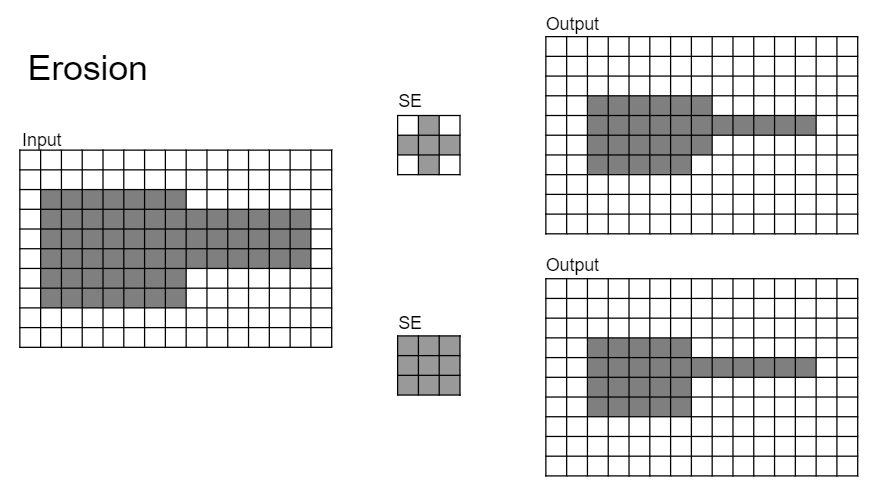
    
    - 이 예제에서는 어두운 부분이 255(or 1)에 해당하고, 흰색이 0에 해당함.


- **Example 2**
    
    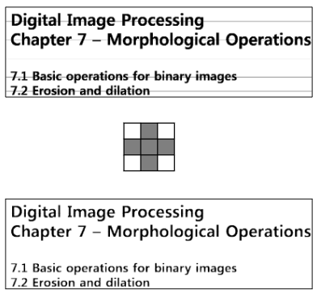
    
    - 이 예제에서는 어두운 부분이 255(or 1)에 해당하고, 흰색이 0에 해당함.
    - Object(글자)들의 경계가 침식되어 세선화 됨.
    - 가로 방향의 *가는 선분들* 제거
    - 글자의 경우, `SE`(구조요소)에 따른 erosion(침식)의 강도가 다소 낮기 때문에, 전체적인 객체의 구조가 상대적으로 잘 보존됨
    - ^^`SE`(구조요소) 보다 더 작은 부분을 잡음으로 처리^^ 하여 제거하고, 그렇지 않은 부분은 형태의 주요 요소로 보고, 가급적 그 형태를 유지.

다음 코드는 OpenCV Tutorial에서 제공한 예로, Numpy의 `ndarray`로 만든 rect kernel로 erosion 을 수행한 결과임.

```Python
import cv2
import numpy as np
import matplotlib.pyplot as plt

img = cv2.imread('./images/j.png',0)

kernel = np.ones((5,5),np.uint8)
print(kernel)

erosion = cv2.erode(img,kernel,iterations = 1)
plt.figure(figsize=(10,5))
plt.subplot('121')
plt.imshow(img,cmap='gray'), plt.axis('off')
plt.subplot('122')
plt.imshow(erosion,cmap='gray'), plt.axis('off')
```

* 사용한 `j.png`는 다음 url에서 다운로드 가능 : [j.png](https://raw.githubusercontent.com/dsaint31x/OpenCV_Python_Tutorial/8b66425411aa60ad4d3e60e4ae41c1dba922a54d/images/j.png)

결과 이미지는 다음과 같음.

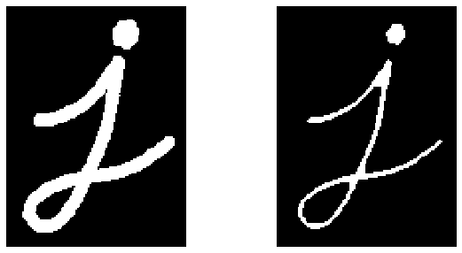

## Dilation (팽창)

Erosion의 경우처럼, Structuring Element가 convolution의 kernel처럼 입력영상의 전영역에 걸쳐 sliding되면서 결과 영상이 나옴.

Erosion의 수식은 다음과 같음.

$$
f\oplus \text{s}= \{o(\textbf{z})|(\textbf{s})_\textbf{z} \cap f \ne \emptyset \}
$$

where

- $f$ : input image
- $\text{s}$ : Structuring Element
- $\textbf{z}$ : SE를 $\textbf{z}$만큼 translation. SE가 이동된 위치를 나타내는 vector.
- $o(\textbf{z})$ : 결과 영상에서 $\textbf{z}$ 위치의 pixel intensity. SE와 입력영상의 interception이 empty set이면 0, 아니면 1

Dilation의 효과는 다음과 같음.

- Object 의 크기를 크게 함(binary image) → 배경은 축소
- 작은 구멍들을 메꿈
- 연결성 강화 (연결된 선이 끊어져보일때 연결해줌)
    - 근접한 두 object를 연결함.
- 주변에 비해 낮은 값을 가지는 noise 제거(gray-scale)

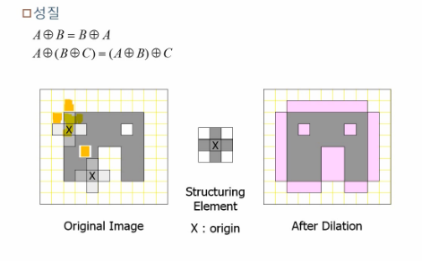

- **Example 1**
    
    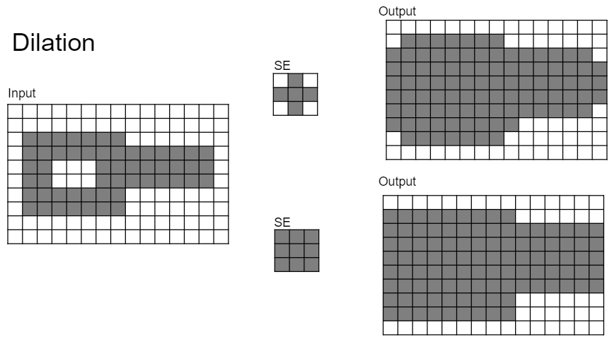
    
    - 이 예제에서는 어두운 부분이 255(or 1)에 해당하고, 흰색이 0에 해당함.
    
- **Example 2**
    
    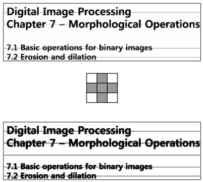
    
    - 이 예제에서는 어두운 부분이 255(or 1)에 해당하고, 흰색이 0에 해당함.
    - Object 영역의 확장
    - 가로 방향으로의 가는 선분들이 두꺼워짐 ← 연결성 강화.

OpenCV에서 dilation은 `cv2.dilate` 함수로 제공된다. 다음 코드는 이를 간단히 사용한 예를 보여준다.

```Python
dilation = cv2.dilate(img,kernel,iterations = 1)
plt.figure(figsize=(10,5))
plt.subplot('121')
plt.imshow(img,cmap='gray'), plt.axis('off')
plt.subplot('122')
plt.imshow(dilation,cmap='gray'), plt.axis('off')
```

* erosion에서 사용한 SE `kernel`를 다시 사용함.

결과는 다음과 같음.

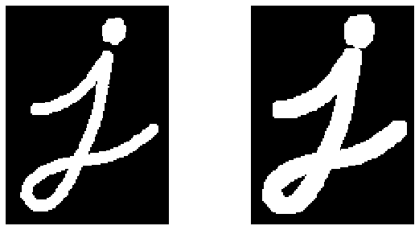


## Erosion vs. Dilation on the Binary Image

<figure markdown>
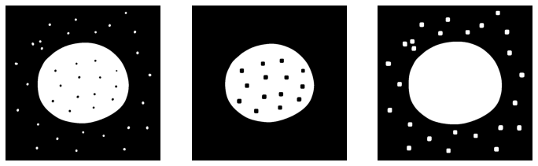{width="500"}
<figcaption>Left: original, Center: erosion, Right: dilation</figcaption>
</figure>

---

## Opening

>💡 Erosion 수행 후 Dilation

$$
f\circ \text{s} =(f \ominus \text{s})\oplus \text{s}
$$

`Erosion` 의 단점인 ^^object 크기가 줄어드는 문제를 해결^^ .

- 주변보다 밝은 noise 제거 및 맞닿아있는 객체 분리, 돌출된 작은 영역 제거에 사용됨.
- ^^주된 효과는 Erosion^^ 이며, object가 작아지는 문제를 개선! (개선된 erosion)
- **Example 1**
    
    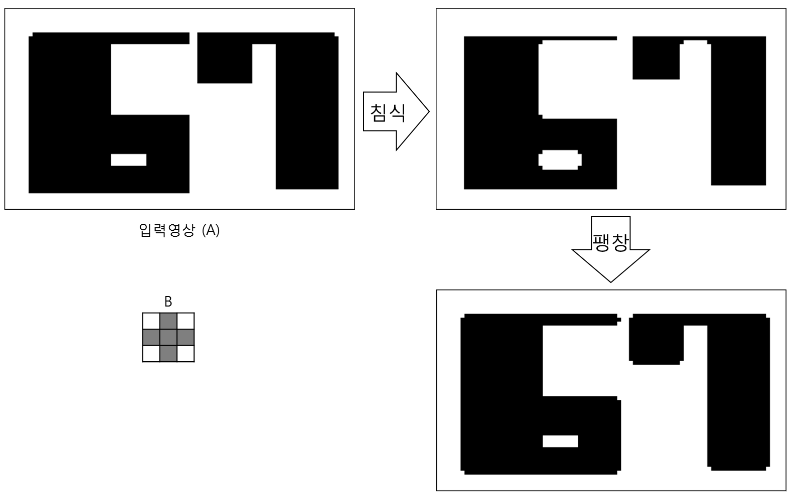
    
    - 이 예제에서는 어두운 부분이 255(or 1)에 해당하고, 흰색이 0에 해당함.
    - 모서리들이 부드러워졌으나, 원래 영상의 모양에서 큰 변화가 없음. 주의할 건 SE의 크기가 지나치게 커지면 상대적으로 작은 크기의 구조가 제거됨.(example2참고)
    
- **Example 2**
    
    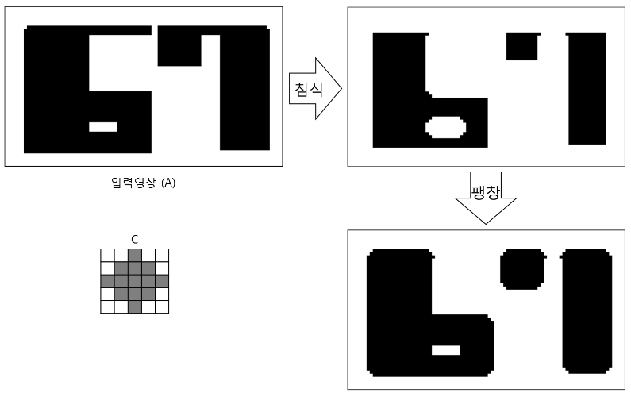
    
    - 이 예제에서는 어두운 부분이 255(or 1)에 해당하고, 흰색이 0에 해당함.
    
`opening`은 기본연산인 `erosion`과 `dilation`의 조합에 의한 확장 연산으로 OpenCV에서는 `cv2.morphologyEx`함수를 통해 제공됨.

아래의 예제는 OpenCV Tutorial에서 제공된 예제코드로 salt and pepper noise에서 salt만을 가하고 이를 `opening`을 통해 제거하는 예제임.

```Python
row,col = img.shape
s_vs_p = 1 #0.5
amount = 0.01
out = np.copy(img)

# Salt mode
num_salt = np.ceil(amount * img.size * s_vs_p)
coords = [np.random.randint(0, i, int(num_salt))
          for i in img.shape]
out[tuple(coords)] = np.max(img)
        
# Pepper mode
num_pepper = np.ceil(amount* img.size * (1. - s_vs_p))
coords = [np.random.randint(0, i, int(num_pepper))
          for i in img.shape]
out[tuple(coords)] = np.min(img)

print(img.dtype)
# kernel = np.ones((3,3),np.uint8)        
opening = cv2.morphologyEx(out, cv2.MORPH_OPEN, kernel)

plt.figure(figsize=(10,5))
plt.subplot('121')
plt.imshow(out,cmap='gray'), plt.axis('off')
plt.subplot('122')
plt.imshow(opening,cmap='gray'), plt.axis('off')
```

* 앞서 사용한 SE `kernel`을 재사용한 경우와 $3\times 3$ shape의 kernel로 변경해서 동작시켜 볼 것.

결과는 다음과 같음.


## Closing

>💡 Dilation 수행 후 Erosion

$$
f\bullet\text{s}=(f\oplus \text{s})\ominus \text{s}
$$

`Dilation` 의 단점인 ^^object의 크기가 커지는 문제를 해결^^.

- 주변보다 어두운 noise 제거(hole을 채움) 및 끊어진 부분 연결에 사용됨.
- 전체적인 윤곽 파악에 이용됨.
    - 조명 등으로 인한 조도차로 object의 구멍이 난 것처럼 보이는 문제점을 해결
- 주된 효과는 Dilation이며, object가 커지는 문제를 해결.
- **Example 1**
    
    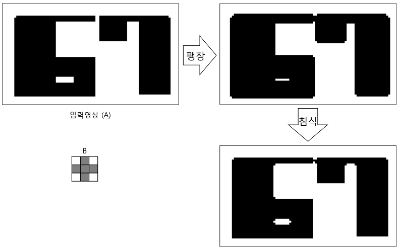
    
    - 이 예제에서는 어두운 부분이 255(or 1)에 해당하고, 흰색이 0에 해당함.

- **Example 2**
    
    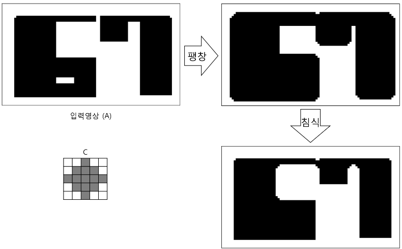
    
    - 이 예제에서는 어두운 부분이 255(or 1)에 해당하고, 흰색이 0에 해당함.
    

`closing`도 기본연산인 `erosion`과 `dilation`의 조합에 의한 확장 연산으로 OpenCV에서는 `cv2.morphologyEx`함수를 통해 제공됨.

아래의 예제는 OpenCV Tutorial에서 제공된 예제코드로 salt and pepper noise에서 pepper noise만을 가하고 이를 `closing`을 통해 제거하는 예제임.

```Python
row,col = img.shape
s_vs_p = 0.0 #1.0
amount = 0.01
out = np.copy(img)
# Salt mode
num_salt = np.ceil(amount * img.size * s_vs_p)
coords = [np.random.randint(0, i, int(num_salt))
          for i in img.shape]
out[tuple(coords)] = np.max(img)
        
# Pepper mode
num_pepper = np.ceil(amount* img.size * (1. - s_vs_p))
coords = [np.random.randint(0, i, int(num_pepper))
          for i in img.shape]
out[tuple(coords)] = np.min(img)

print(img.dtype)
#kernel = np.ones((3,3),np.uint8)        
closing = cv2.morphologyEx(img, cv2.MORPH_CLOSE, kernel)

plt.figure(figsize=(10,5))
plt.subplot('121')
plt.imshow(out,cmap='gray'), plt.axis('off')
plt.subplot('122')
plt.imshow(closing,cmap='gray'), plt.axis('off')
```

결과는 다음과 같음.

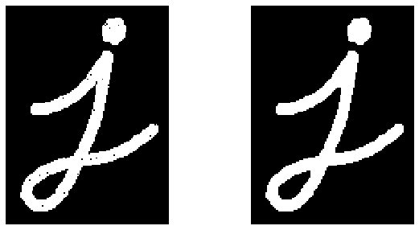

## Opening vs. Closing on the Binary Image

<figure markdown>
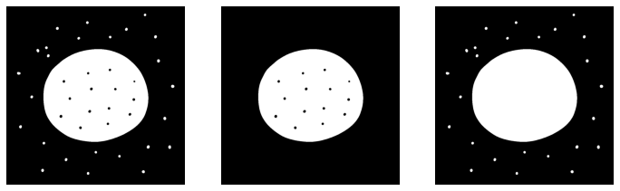

<figcaption> Left: original, Center: Opening, Right: Closing </figcaption>
</figure markdown>

---

## Opening vs. Closing on the Gray-scale Image

### **Erosion on the gray-scale image**

1. 임의의 위치의 pixel value를 기준으로
2. Structure element와 겹쳐지는 영역 내 pixel에 대해
3. “pixel의 각 값”과 대응하는 “SE의 값”을 **빼고**,
4. 그 결과 중 가장 **작은 것** 을 선택함.

수식은 다음과 같음.

$$
f\ominus\text{s}=\text{min}\{f(x+m,y+n)-\text{s}(m,n)|(x+m),(y+n)\in D_f \text{ and }m,n\in D_\text{s}\}
$$

where

- $D_f$: 입력영상 $f$의 pixel 좌표 들의 집합.
- $D_\text{s}$ : SE $\text{s}$의 pixel 좌표 들의 집합.

### **Dilation on the gray-scale image**

1. 임의의 위치의 pixel value를 기준으로
2. SE와 겹쳐지는 영역 내 pixel에 대해
3. “pixel의 각 값”과 대응하는 “SE의 값”을 **더하고**,
4. 그 결과 중 가장 **큰 것** 을 선택함.

수식은 다음과 같음.

$$
f\oplus \text{s}=\text{max}\{f(x+m,y+n)+\text{s}(m,n)|(x+m),(y+n)\in D_f \text{ and }m,n\in D_\text{s}\}
$$

where

- $D_f$: 입력영상 $f$의 pixel 좌표 들의 집합.
- $D_\text{s}$ : SE $\text{s}$의 pixel 좌표 들의 집합.

### Examples of gray-scale image

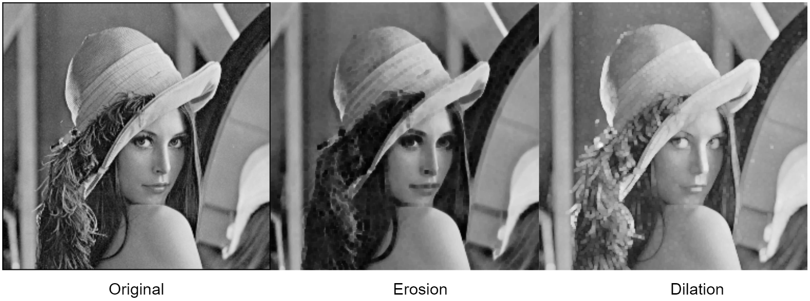

* `Erosion` : 상대적으로 크기가 작은 밝은 영역이 제거(어두워짐)되고 전체적으로 어두워짐 (min).
* `Dilation` : 상대적으로 크기가 작은 어두운 영역이 제거(밝아짐)되고 전체적으로 밝아짐 (max).
* 위에서 사용된 SE는 3x3의 박스 (1로 채워진)임.
    
    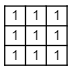{width="100"}
    

### Opening and Closing

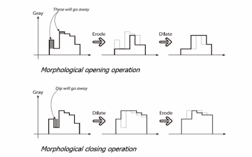

`Opening`

- 상대적으로 크기가 작은 ***밝은*** 상세 부분은 제거됨.
- 상대적으로 크기가 큰 ***밝은*** 부분은 pixel value가 유사하게 유지됨.

`Closing`

- 상대적으로 크기가 작은 ***어두운*** 상세 부분이 제거됨.
- 상대적으로 크기가 큰 ***어두운*** 부분은 pixel value가 유사하게 유지됨.

#### Example
    
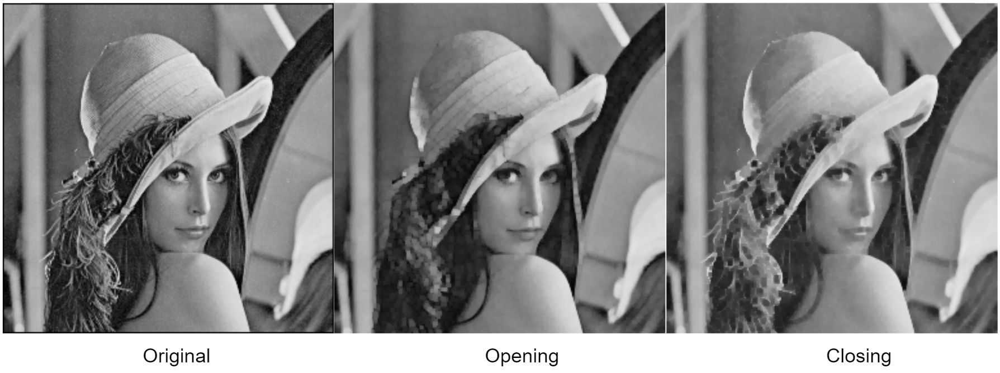
    
전체적으로 영상의 intensity가 다르게 되는 문제점을 opening과 closing은 개선하고 있음.
    
---

## Gradient


> 💡 Dilation - Erosion

Boundary Detection 이 가능함.

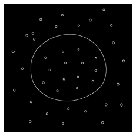

`gradient`도 확장 morphological operation이며 사용법은 `opening`과 `closing`과 유사함.

```Python
gradient = cv2.morphologyEx(img, cv2.MORPH_GRADIENT, kernel)

plt.figure(figsize=(10,5))
plt.subplot('121')
plt.imshow(img,cmap='gray'), plt.axis('off')
plt.subplot('122')
plt.imshow(gradient,cmap='gray'), plt.axis('off')
```

위 코드의 결과는 다음과 같음.

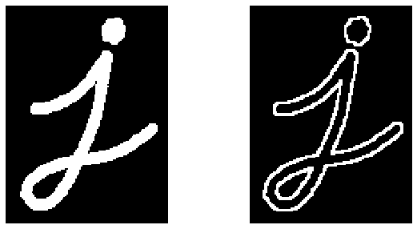

## Erosion 기반의 Boundary Detection

사실 dilation에서 erosino을 빼는 조합 외에도 Boundary Detection은 가능함.

**Object 영상** 과 **그 Object 영상의 Erosion(침식) 영상** 간의 **Difference 연산** 으로도 boundary를 구할 수 있음.

- Erosion(침식)의 결과는 객체의 경계선이 깎인 형태
- 입력 객체와 Erosion의 결과 간의 차이는 boundary(경계선)만 남김
- **Example 1**

    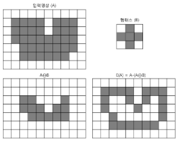
    
    - 이 예제에서는 어두운 부분이 255(or 1)에 해당하고, 흰색이 0에 해당함.    
    
### ex: Erosion 기반 경계 검출
    
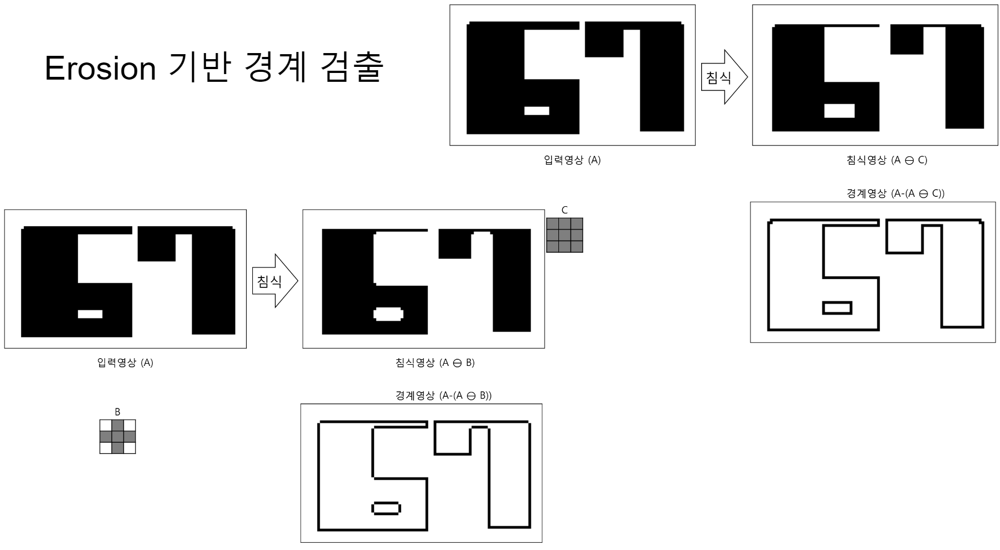
    
- 위 image에서는 어두운 부분이 255(or 1)에 해당하고, 흰색이 0에 해당함.    
    

### Morphological OP.기반 Boundary Detection의 장점.

> 참고 : `Gradient`
>    - 영상에서 pixel value의 변화율.
>    - 영상의 특성 중에서 edge를 판단하기 위한 중요한 요소.
>    - Edge의 경우, gradient가 매우 큼 : pixel value가 갑자기 커지거나 작아짐.
>        - 즉, gradient가 큰 경우 edge로 판단할 수 있음.

**Differentiation(미분) based method**

- Gradient나 Laplacian을 이용함.
- “이상적 영상(ideal)”에서 매우 잘 동작함.
- 미분의 특성상 일종의 High pass filter로 Noise도 같이 증폭시키는 단점을 가짐.
- 일반적으로 low-pass filter(e.g. Gaussian Filter)를 이용하여 noise를 제거하고 나서 미분을 수행.
    - 이 경우, LPF로 인한 blurring으로 edge 정보가 일부 손실될 수 있음..
- 또한, 미분 수행 방향에 영향을 받음.

**Morphological Edge detection**

- Edge의 방향성에 영향을 받지 않음.
- Dilation - Erosion = Edge
- or (Ojbect - Erosion )

---


## 기타…

### Tophat

> 💡 Original - Opening

- 주변에 비해 밝은(높은) intensity를 가지는 부분들이 강조됨.

다음 코드는 `tophat`의 사용법을 보여준다.

```Python
kernel = np.ones((9,9),np.uint8)

opening = cv2.morphologyEx(out, cv2.MORPH_OPEN, kernel)
tophat = cv2.morphologyEx(img, cv2.MORPH_TOPHAT, kernel)

plt.figure(figsize=(10,5))
plt.subplot('131')
plt.imshow(img,cmap='gray'), plt.axis('off')
plt.subplot('132')
plt.imshow(opening,cmap='gray'), plt.axis('off')
plt.subplot('133')
plt.imshow(tophat,cmap='gray'), plt.axis('off')
```

결과는 다음과 같음.

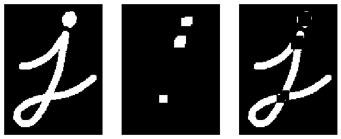

### Blackhat

>💡 Original - Closing

- 주변에 비해 어두운(낮은) intensity를 가지는 부분들이 강조됨.

```Python
kernel = np.ones((9,9),np.uint8)

closing = cv2.morphologyEx(out, cv2.MORPH_CLOSE, kernel)
blackhat = cv2.morphologyEx(img, cv2.MORPH_BLACKHAT, kernel)

plt.figure(figsize=(10,5))
plt.subplot('131')
plt.imshow(img,cmap='gray'), plt.axis('off')
plt.subplot('132')
plt.imshow(closing,cmap='gray'), plt.axis('off')
plt.subplot('133')
plt.imshow(blackhat,cmap='gray'), plt.axis('off')
```

결과는 다음과 같음.

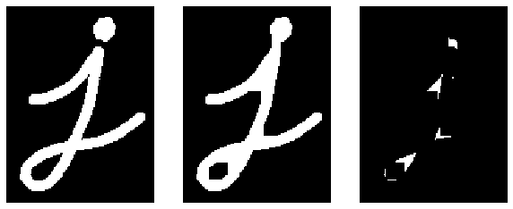

### Tophat vs. Blackhat

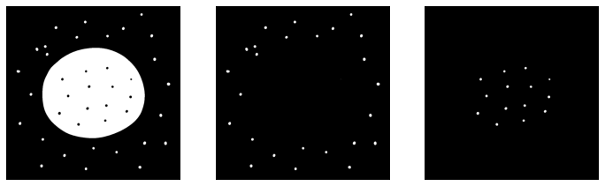

Binary image / Left: original, Center: Tophat, Right: Blackhat 

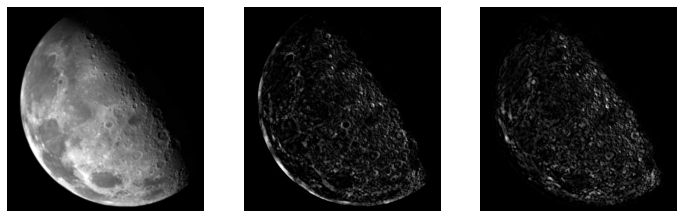
Gray-scale image / Left: original, Center: Tophat, Right: Blackhat

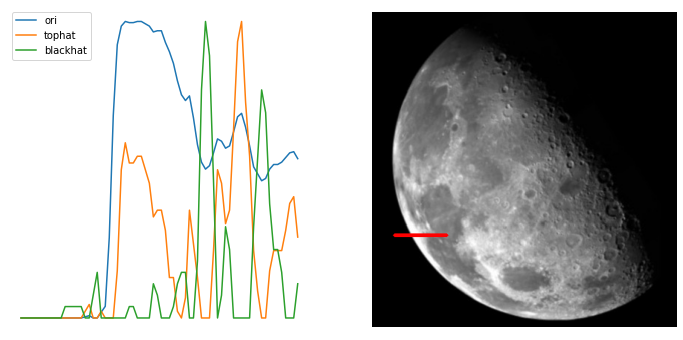

왼쪽의 달 사진의 profile을 보면, tophat과 blackhat의 차이를 알 수 있음.

(Gray-scale에서 처리됨.)

## References

- [OpenCV's tutorial](https://docs.opencv.org/4.x/d9/d61/tutorial_py_morphological_ops.html)
- [Gramman’s Morphological Transformations](https://opencv-python.readthedocs.io/en/latest/doc/13.imageGradient/imageGradient.html)
- Python으로 만드는 opencv프로젝트 : 6.3 모폴로지