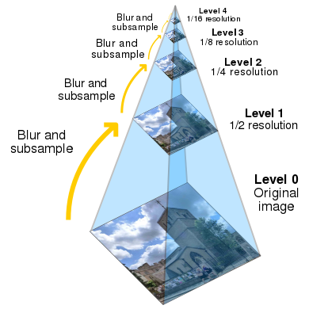
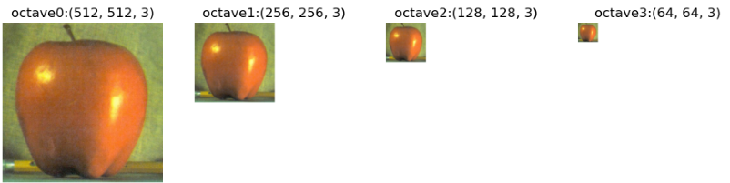
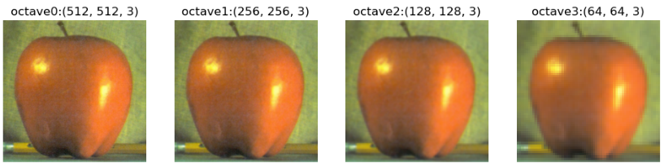
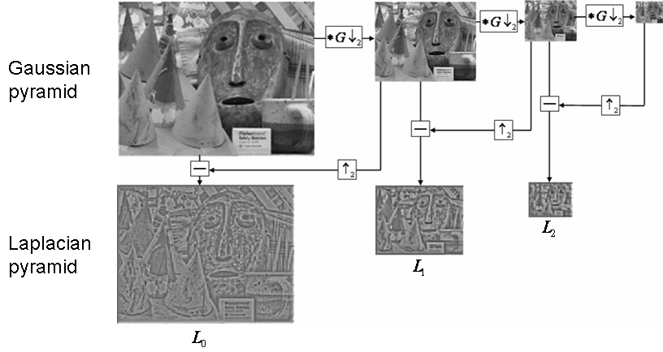
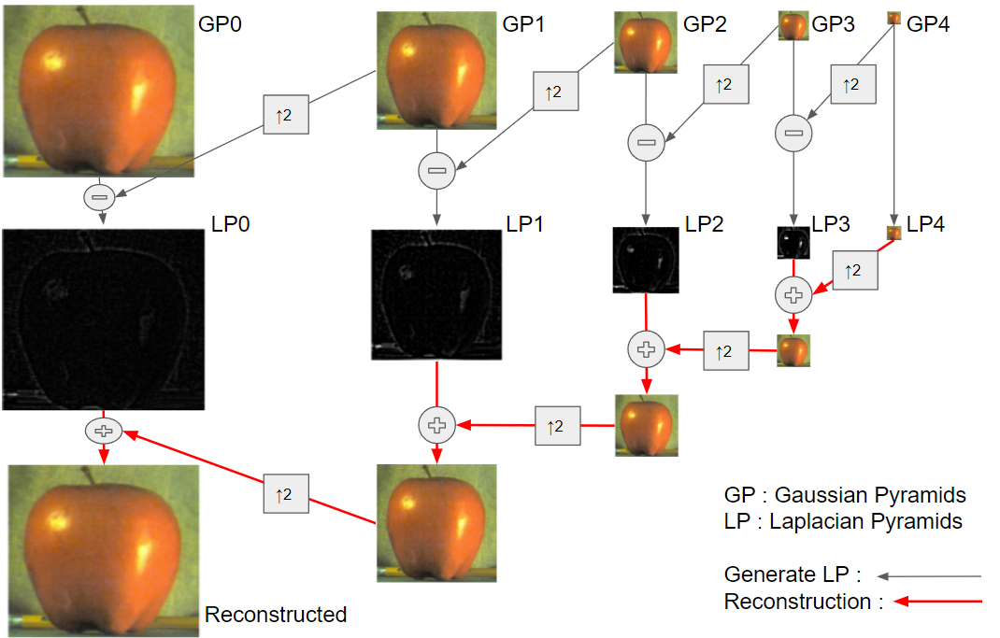
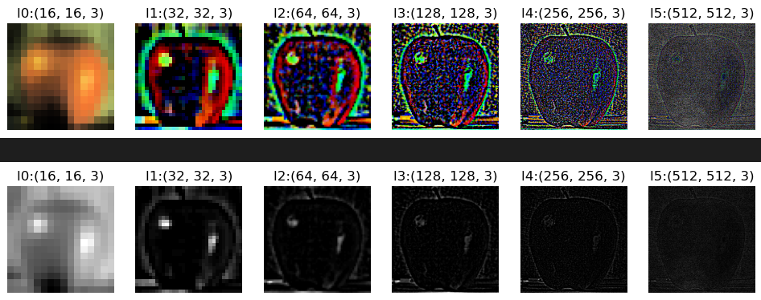

# Image Pyramid and Scale Space

Image를 처리할 때, 다양한 scale에서 image를 분석해야하는 경우가 많다.  

특히 feature extraction등의 경우 image scale에 따라 결과가 달라지는 경우가 많다. 가장 많이 드는 사례가 곡선인지 직선인지를 판별하는 경우로, 

* 영상 전체를 보는 큰 scale에서는 곡선이라도, 
* scale을 줄여서 작은 영역을 자세히 보는 작은 scale에서는 직선처럼 보일 수 있다. 

> scale은 한 pixel이 담고 있는 region의 크기라고도 생각할 수 있다. 

만약 한 image에서 커버하고 있는 region은 유지하면서 scale이 커질 경우, 한 pixel이 실제로 커버하고 있는 영역이 커지므로 전체 pixel의 수는 줄어들고 image가 blurring된다. 반대로 scale이 작아질 경우는 pixel의 수가 늘어나고 좀 더 고해상도 영상이 된다.

때문에 image 처리시 scale이 매우 중요하며, 다양한 scale에서도 일관된 동작을 보장하기 위해서는 여러 scale의 image를 고려해야 한다.

다양한 scale의 image를 다루는 방법으로 가장 대표적인 것이 image pyramid와 scale space이다.

## Image Pyramids

raw image에 대해서 1/2 씩 작게 (or 크게) resize하여 피라미드 처럼 쌓는 방식이 바로 image pyramid임.

<figure markdown>
{width="400"}
<figcap>Illustration of an image pyramid with 5 levels (from Wikipedia)</figcap>
</figure>

scale space와 달리 down sampling이 같이 이루어진다. 즉, $\sigma=2$로 blurring을 수행하고나서 factor=2 인 downsampling을 수행하는 방식으로 image를 생성하여 위에 쌓아올린다. 즉, pyramid 맨 하단에 가장 scale이 작고 pixel수가 많은 image가 놓이고, 같은 region을 나타내나 2배 큰 scale을 가지면서 전체 pixel의 수는 $\frac{1}{4}=\frac{1}{2}\times \frac{1}{2}$인 image가 놓인다. down sampling이 없는 scale space에 비해 적은 용량을 차지한다.

상단의 image는 처리해야할 pixel 이 가장 적으면서도 target region의 전체적인 정보를 가지고 있으므로, 이를 먼저 처리하고 점점 더 fine한 정보가 필요하면 아래로 내려가는 방식의 처리가 가능하다. 마치 위성사진으로 전체 영역에서 필요한 부분을 찾고, 이후 특정 부분을 확대해서 보는 방식과 비슷하다.

좀 더 filter의 개념으로 본다면, 다음과 같이 생각할 수 있다.

> image를 여러 scale에서의 정보들로 분해하는 filter 기반의 repsentation이 바로 image pyramid이다.

### Gaussian Pyramid

Gaussian Pyramid는 OpenCV에서 `cv2.pyrDown`과 `cv2.pyrUp`을 통해 제공된다. OpenCV 튜토리얼 설명에 따르면, Lower layer의 5개의 pixel들 각각에 Gaussian weight들이 가해져서 upper layer의 1개의 pixel intensity가 결정된다. 위에서 설명한 것처럼 OpenCV의 pyramid 지원 function들에서는 factor-2의 down-sampling이 가해져서, Upper layer의 경우 1/4의 pixel로 구성되게 됨.

> Physics에서 ^^octave란 용어는 진동수가 2배가 되는 경우를 의미^^ 한다. note(음)에서 pitch는 frequency에 의해 결정되는데, 같은 음이면서도 2배의 freq.를 가질 경우 한 octave가 올라갔다고 표현하는 것처럼, scale이 2배씩 차이가 나는 점을 이용하여 각 layer를 octave라고도 부른다.
> 
> scale이 2배 차이가 나는 layer의 경우, 한 octave가 늘어났다고 애기한다. SIFT (Scale Invariant Feature Transformer) 등의 경우, 한 octave를 5개의 layer로 구성시키는데 한 octave에서 가장 맨 아래 layer와 그 위의 octave의 맨 아래 layer간의 scale의 차이가 2개가 난다고 이해하면 된다.

Gaussian pyramid에서 가장 기본적으로 처리될 때는 factor 2의 down-sampling이 이루어진다. 즉, 각각의 layer들이 한 octave에 해당한다.
이 경우 가장 많이 사용되는 filter의 weight은 $h=\frac{1}{16}[1,4,6,4,1]$ 또는 $h=\frac{1}{4}[1,2,1]$이다.

OpenCV에서 이를 구현한 function이 `cv2.pyrDown`이다. (`cv2.pyrUp`은 upper layer에서 lower layer를 만드는 것으로 factor 2의 oversampling이 가해짐.)

4개의 octave로 구성된 Gaussian Pyramid 의 예이다.

이들을 같은 size로 조정하여 보면 다음과 같다.

> Gaussian filter를 취하지 않고, down-sampling만 할 경우 어떤 문제점이 있을지 생각해보자. 

### Laplacian Pyramid

1983년 Burt와 Adelson이 제안한 것으로 Gaussian Pyramid의 이웃하고 있는 level들에 해당하는 image들을 size를 맞춰주는 up-sampling을 하고나서 difference를 계산하는 방식으로 the second derivative (=Laplacian)의 approximation을 구함으로서, 다양한 scale의 image에 대한 laplacian으로 구성된 pyramid를 얻어낸다. 

> Laplacian의 경우 second derivative에 해당하기 때문에 급격하게 이미지의 intensity가 변하는 부분들에 대해 강조된 정보를 가지게 되며 histogram 분포가 0근처에 모이게 되는 특징을 가진다.

Laplacian Pyramid는 Gaussian Pyramid로부터 아래 그림과 같이 얻어진다.

<figure markdown>

<figcap>original : http://graphics.cs.cmu.edu/courses/15-463/2012_fall/hw/proj2g-eulerian/GP-LP.jpg" </figcap>
</figure>

* $\downarrow 2$ 는 down sampling을 의미하고, $*G$는 Gaussian filtering을 의미한다.
* OpenCV에서는 `pyrDown`과 `pyrUp`을 통해 $*G \downarrow 2$와 $\uparrow 2$를 제공한다.

위의 단계를 거꾸로 하면 reconstruction이라고 할 수 있다. 즉, 적은 size의 이미지에서 출발하여 원래 size의 fine scale영상을 만드는 것임. (중간의 difference정보인 Laplacian들을 이용).

<figure markdown>
{width="600"}
</figure>

Laplacian Pyramid를 같은 width, height로 살펴보면 다음과 같다. (상단은 histogram equalization 처리를 해줬고, 아래는 그냥 gray scale로 바꾸어 보여줬다)

<figure markdown>
{width="600"}
</figure>

* difference image라 잘 보이지 않아 histogram equalization의 처리를 하여 상단에 보여줌.
* color difference image를 빼서 gray-scale로 바꾸어 보여준게 하단임.

#### 좀더 전문용어(?)로 풀어본 Laplacian Pyramid

* laplacian은 high-pass filter에 해당하고, gaussian filter는 low-pass filter이다.  
* 즉, 이 둘이 조합되어 이루어진 laplacian pyramid의 각각의 layer들은 일종의 band-pass filter를 거친 결과물로 볼 수 있다. 
* 이는 달리 말해서 Laplacian of Gaussian이 일종의 band-pass filter임을 의미한다.
* 즉, Laplacian pyramid의 각 층은, 마치 Fourier transform의 경우처럼, 어떤 주파수 대역의 representation에 대응한다고 볼 수 있다.
* Gaussian pyramid를 통해 ^^다양한 scale의 공간의 표현^^ 을 가지며, Laplacian pyramid를 통해 ^^다양한 spatial frequency에 대한 표현^^ 을 얻는다고 생각할 수도 있다.

#### 수식으로 본 Laplacian approximation

laplacian은 2nd derivate라고 볼 수 있는데, Gaussian distribution의 1st derivative와 2nd derivative를 보면 다음과 같다.

$$
\begin{aligned}
g(x;\sigma)&=\frac{1}{\sqrt{2\pi\sigma^2}}e^{\frac{x^2}{2\sigma^2}}\\
\frac{d g(x;\sigma)}{dx}&=\frac{-x}{\sigma^2}g(x;\sigma)\\
\frac{d^2 g(x;\sigma)}{dx^2}&=\left(\frac{x^2}{\sigma^2}-1\right)\left(\frac{1}{\sigma^2}\right)g(x;\sigma)\\
\end{aligned}$$

위 식에서 $g(x;\sigma)$를 $\sigma$로 미분하면 다음과 같음.

$$
\frac{d g(x;\sigma)}{d \sigma} = \left(\frac{x^2}{\sigma^2}-1\right)\left(\frac{1}{\sigma}\right)g(x;\sigma)
$$

즉, Laplacian of Gaussian (LoG)의 approximation을 아래와 같이 scale $\sigma$의 image들의 difference와 $\sigma$에 대한 함수 로 표현할 수 있음.

$$\begin{aligned}
\frac{d^2 g(x;\sigma)}{dx^2}&=C_0({\sigma})\frac{d g(x;\sigma)}{d \sigma}\\
&=C_1(\sigma)\left[g(x;\sigma)-g(x;\sigma+\Delta \sigma)\right]
\end{aligned}$$

이는 image의 Laplacian pyramid를 만드는데, Gaussian filter를 사용할 경우 성립되는 approximation이다. 

### Image Blending using Pyramids.

OpenCV tutorial에서 제공해주는 응용사례로, 2개의 이미지를(사과와 귤)을 반씩 자르고 이 둘을 붙여서 표현할 때, 연결된 것처럼 보이게 하는 효과를 image pyramid를 통해 얻어내고 있다.
포토샵에서 이미지를 가져다 붙일 때 자연스럽게 보이게하는 기법 중 하나라고 생각해도 된다.

>  In that case, image blending with Pyramids gives you seamless blending without leaving much data in the images.

다양한 image fusion에 기본적으로 사용되는 방법 중의 하나이다.

> The aim of image fusion is ^^to combine relevant information from two or more source images into one single image^^ such that the single image contains most of the information from all the source images.  
> The successful fusion of images acquired from different modalities or instruments is of great importance in many applications, 
> such as ^^medical imaging^^, microscopic imaging, remote sensing, computer vision and robotics. - Sudheer T.S Kumar et al. (2014)

---

## Scale Space

Image Pyramid와 유사하지만, down sampling이 없는 것이라고 생각하면 좀 더 쉽게 이해할 수 있다. 

2D image에 scale이라는 하나의 axis를 추가하여 해당 axis에 따라 다른 scale의 image들이 놓여있게 되는 구조이다.

* scale parameter (scale의 정도를 나타내는 값)는 Gaussian filter에서의 variance $\sigma^2$ 이 사용된다.
* scale axis 에 따라, scale만 다를 뿐 image의 width와 height는 같다.

Gaussian Pyramid 관점에서 애기한다면, scale space에서 scale이 2배 ($\sigma$가 2배 커진 상태)가 되는 위치에서 factor 2의 down sampling을 하면 정보손실이 최소화된 작은 크기(area는 1/4로 줄고 2배 scale을 가진)의 image를 얻을 수 있다.

> 거의 Gaussian Filter를 통해, 보다 큰 scale의 image를 얻는다. Gaussian kernel에 의한 convolution이 연달아 일어날 경우, 각 kernel의 $\sigma^2$를 더함으로서 간단하게 최종 kernel을 얻을 수 있다는 장점을 가지고 있는데다, 큰 scale의 image를 만들 경우 fine한 image(작은 scale)에 대한 simplication을 왜곡없이 잘 생성하기 때문이다.

즉, Scale space는 image와 같은 다차원 signal에 대해서,

1. 다양한 scale에 대한 representation을 얻고
2. 이들 representation의 collection으로 해당 신호를 나타낸 것

이라고 할 수 있다.
  
---

### Applications

pyramids 와 비슷하다. feature detection, compression, image synthesis 등에서 활용된다. 가장 쉬운 예는 image fusion이지만, Euclidean Magnification과 같은 경우에도 활용된다.

## References

* [The Laplacian Pyramid as a Compact Image Code](https://citeseerx.ist.psu.edu/doc/10.1.1.54.299)
* [OpenCV tutorial: Image Pyramids](https://docs.opencv.org/4.x/dc/dff/tutorial_py_pyramids.html)
* [ENHANCED IMAGE FUSION ALGORITHM USING LAPLACIAN PYRAMID](https://www.semanticscholar.org/paper/ENHANCED-IMAGE-FUSION-ALGORITHM-USING-LAPLACIAN-Kumar-Vikram/90a1b47bafc1c0585824df923a62c665c4fad738)

