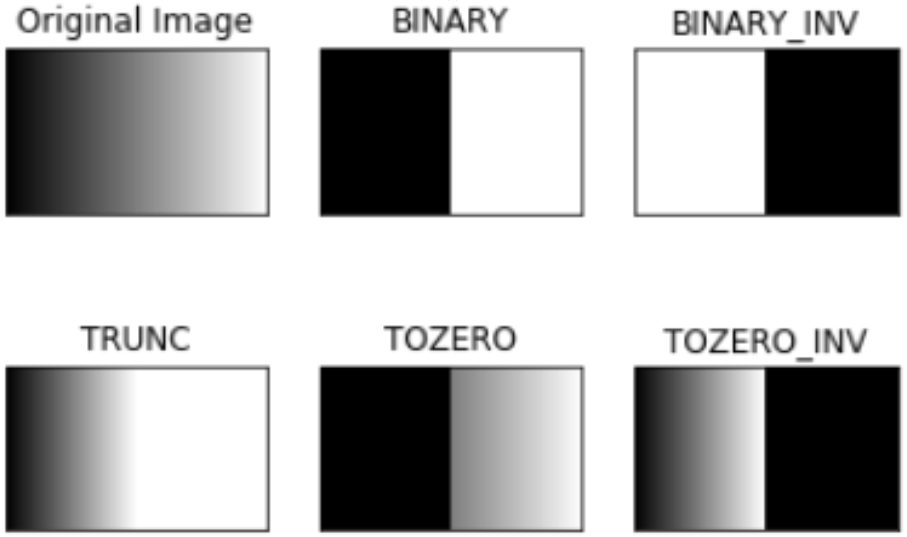

# Image Thresholding

* [관련 gist](https://gist.github.com/dsaint31x/e617e8ada55584850247d8a3837bf49a)


## Goal

이 문서에서는 `Binary Image`에 대해 소개하고,  
이를 만드는 기법인 

* `Simple Thresholding`, 
* `Adaptive Thresholding`, 
* `Otsu Thresholding` 등을 같이 소개한다.

OpenCV에서는 관련하여 다음의 함수들을 제공한다.

* `cv2.threshold`
* `cv2.adaptiveThreshold`

---

---

## Binary Image

Pixel의 intensity가 `0`과 `1` 두가지 값으로만 구성된 Image.

`Thresholding`에 의해 형성됨 

* Image 전역에 Thresholding을 하는 경우 (Global Thresholding)와
* 이미지의 작은 영역(patch, region)별로 thresholding을 하는 경우(Adaptive method)

로 나눌 수 있음.

주로 특정 object와 background를 나눈 결과물의 형태이며, 이를 나누기 위한 Masking 등에 사용됨.

---

---

## Simple Thresholding

> OpenCV는 기본적으로 `uint8`을 사용하기 때문에,  
> binary image가 앞서 설명한 0,1이 아닌 0,255를 가진다.

`Simple Thresholding`은 

* 특정 threshold 보다 큰 값은 1에서 255 중 지정된 값으로 할당하고, 
* 나머지는 0으로 할당하는 방식으로 동작하며 
* OpenCV에서는 `cv2.threshold`라는 함수를 통해 제공된다.

Global method 라고 생각하면 된다 (전체 이미지에 대해 하나의 threshold를 기준으로 적용한다).

`cv2.threshold (src_img, threshold, max_val, style_of_threshold)`

* `src_img` : thresholding의 대상이 되는 ndarray 객체.
* `threshold` : thresholding의 기준이 되는 값.
* `max_val` : `threshold`보다 높은 intensity를 가지는 pixel들에 할당되는 값 (`style_of_threshold`에 따라 낮은 값에 할당되기도 함)
* `style_of_threshold` : Thresholding 방식의 종류를 지정한다. 

다음의 표를 참고.

| Threshold Types | Threshold 초과 | Threshold 이하 |
|:----:|:----:|:----:|
|`cv2.THRESH_BINARY` | `max_val` | `0` |
|`cv2.THRESH_BINARY_INV` | `0` |`max_val` |
|`cv2.THRESH_TRUNC` | `Threshold` | `src_img(x,y)` |
|`cv2.THRESH_TOZERO` | `src_img(x,y)` | `0` |
|`cv2.THRESH_TOZERO_INV` | `0` | `src_img(x,y)` |

<figure markdown>
{width=500}
</figure>

이 외에 다음을 선택가능함.

* `cv2.THRESH_OTSU` : Otsu Algorithm으로 자동으로 threshold를 찾고 thresholding.
* `cv2.THRESH_TRINAGLE` : Triangle  Algorithm으로 자동으로 threshold를 찾고 thresholding.

---

### Example

다음 코드는 gradient image (위의 그림에서 Original Image)를 생성함.

```Python
import numpy as np
from matplotlib import pyplot as plt

width = 512
height = 256

mask1 = np.repeat(
    np.tile(np.linspace(0, 1, width), (height, 1))[:, :, np.newaxis], 
    3, axis=2)

mask1 = (mask1*255).astype("uint8")

plt.imshow(mask1)
```

Simple Thresholding의 여러 스타일을 사용하는 예제는 다음과 같음.

```Python
import cv2
import numpy as np
from matplotlib import pyplot as plt

# img = cv2.imread('gradient.png',0)
img = mask1.copy()
ret,thresh1 = cv2.threshold(img,127,255,cv2.THRESH_BINARY)
ret,thresh2 = cv2.threshold(img,127,255,cv2.THRESH_BINARY_INV)
ret,thresh3 = cv2.threshold(img,127,255,cv2.THRESH_TRUNC)
ret,thresh4 = cv2.threshold(img,127,255,cv2.THRESH_TOZERO)
ret,thresh5 = cv2.threshold(img,127,255,cv2.THRESH_TOZERO_INV)

titles = ['Original Image','BINARY','BINARY_INV',
          'TRUNC','TOZERO','TOZERO_INV']
images = [img, thresh1, thresh2, thresh3, thresh4, thresh5]

plt.figure(figsize=(10,4))
for i in range(6):    
    plt.subplot(2,3,i+1)
    plt.imshow(images[i],'gray')
    plt.title(titles[i])
    plt.xticks([]),plt.yticks([])
    
plt.show()
```

---

---

## Adaptive Thresholding

> Global Thresholding은 illumination등이 균일하지 않은 경우에는 좋은 방법이 아니다. 

Adaptive thresholding은 

* image 각 pixel에 대해 이웃하는 작은 구역들을 구하고, 
* 이를 이용해 각 구역 별로 다른 threshold를 적용하는 방식

으로 동작하며, 

* images with varying illumination 의 경우 
* 보다 나은 Thresholding을 제공한다.

OpenCV 에서는 `cv2.adaptiveThreshold` 함수를 통해 제공된다.

```Python
cv2.adaptiveThreshold(
    src_img, 
    max_val, 
    adaptive_method,
    style_of_threshold,
    block_size,
    c)
```

* `adaptive_method` : 어떤 방식을 사용할지를 고름.
    * `cv2.ADAPTIVE_THRESH_MEAN_C` :  
    block(=neighborhood area라고도 불림)의 mean을 threshold로 사용.  
    $T(x,y) = \mu_\text{block}(x,y) - C$
    * `cv2.ADAPTIVE_THRESH_GAUSSIAN_C` :  
    neighborhood 들에 대해 Gaussian window 사용한 weighted sum을 구하고 이를 threshold로 사용.  
    $T(x,y) = G* \text{N} (x,y)-C$
* `block_size` : neighborhood area 크기. 3 이상의 홀수여야 함.
* `C` - threshold 구할 때 빼주는 일종의 constant. 

---

### Example

```Python
import cv2
import numpy as np
from matplotlib import pyplot as plt
import requests


url = 'https://raw.githubusercontent.com/dsaint31x/OpenCV_Python_Tutorial/master/images/sudoku.jpg'


image_ndarray = np.asarray(bytearray(requests.get(url).content), dtype=np.uint8)
img = cv2.imdecode(image_ndarray, cv2.IMREAD_UNCHANGED)

img = cv2.medianBlur(img,5)

ret,th1 = cv2.threshold(img,127,255,cv2.THRESH_BINARY)
th2 = cv2.adaptiveThreshold(img,255,cv2.ADAPTIVE_THRESH_MEAN_C,\
            cv2.THRESH_BINARY,11,2)
th3 = cv2.adaptiveThreshold(img,255,cv2.ADAPTIVE_THRESH_GAUSSIAN_C,\
            cv2.THRESH_BINARY,11,2)

titles = ['Original Image', 'Global Thresholding (v = 127)',
            'Adaptive Mean Thresholding', 'Adaptive Gaussian Thresholding']
images = [img, th1, th2, th3]

plt.figure(figsize=(12,12))
for i in range(4):
    plt.subplot(2,2,i+1),plt.imshow(images[i],'gray')
    plt.title(titles[i])
    plt.xticks([]),plt.yticks([])
plt.show()

```

---

---

## Histogram based Thresholding

image의 ***(intensity) histogram*** 에서  
Threshold을 결정하고 이를 이용하여 Thresholding하는 방법.

* 실제로는 Threshold를 구하기가 쉽진 않음.( 명확하지 않은 히스토그램의 골과 마루, 잡음 등)
* 크게 다음으로 나뉨.
    * p-타일 기법, 
    * 모드 기법, 
    * 최대분산비 기법 (=Otsu's Thresholding, Otsu's binarization)

---

### p-tile

* histogram으로 부터 target(대상 물체)가 차지하는 비율(`p%`)에 해당하는 intensity를 Threshold로 결정하는 방법
* 대상물체의 비율을 미리 알 수 없기 때문에 매번 사람이 이를 정해야 한다.

---

### mode thresholding

1. Histogram $H$에서 일정 거리 이상 떨어진 local maxima $i$,$j$를 찾는다.
2. $i$와 $j$ 사이에서의 minimum value를 갖는 $k$를 찾는다.
3. $p=\frac{\text{min} [H(i),H(j)]}{H(k)}$를 계산한다.
4. 최대 $p$를 갖는 $k$를 threshold로 한다.

1번의 일정거리를 정하기가 좀 난감한 경우가 많다. 


---

### Otsu's thresholding (최대분산비 Thresholding) **

Global thresholding 에서 가장 많이 사용하는 방법임.

* p-tile, mode thresholding과 달리
* statistical property를 이용하여 
* 가장 적절한 global threshold를 ^^알아서 찾아줌^^.

> 아쉽지만, Global threshold를 찾는 것으로 adaptive thresholding에선 사용하기 어렵다.

Otsu thresholding은 bimodal image (histogram의 2개의 peak를 가지는 경우를 가르킴)에 가장 적절한 threshold를 찾아준다.

Otsu algorithm은 2개의 class로 나눌 때, 

* 각 class의 ^^`within-class variance`를 최소화^^ 하면서 
* 두 class의 `inter-class variance`는 최대로 

만드는 ^^threshold를 찾는다^^.

수식으로 표현하면 다음의 `weighted within-class variance`를 최소화하는 $t$를 찾는다.

$$
\sigma_w^2(t) = q_1(t)\sigma_1^2(t)+q_2(t)\sigma_2^2(t)
$$

where

$$
\begin{aligned}
q_1(t) = \sum_{i=1}^{t} P(i) \quad & \& \quad q_2(t) = \sum_{i=t+1}^{I} P(i) \\
\mu_1(t) = \sum_{i=1}^{t} \frac{iP(i)}{q_1(t)} \quad & \& \quad \mu_2(t) = \sum_{i=t+1}^{I} \frac{iP(i)}{q_2(t)} \\
\sigma_1^2(t) = \sum_{i=1}^{t} [i-\mu_1(t)]^2 \frac{P(i)}{q_1(t)} \quad & \& \quad \sigma_2^2(t) = \sum_{i=t+1}^{I} [i-\mu_2(t)]^2 \frac{P(i)}{q_2(t)}
\end{aligned}
$$

* $i$ : intensity (`uint8`인 경우, 0~255)
* $I$ : max intensity of image.
* $P(i)$ : $i$를 가지는 pixel 의 갯수 (또는 확률).

OpenCV에서 `cv2.threshold`에서 `cv2.THRESH_OTSU`를 사용하는 방법은 다음과 같음.

```Python
ret,th = cv2.threshold(
    src_img,
    0,       #min을 넣어주면 된다.
    255,     #max을 넣어주면 된다.
    cv2.THRESH_BINARY+cv2.THRESH_OTSU
    )
```

* 사용하고자 하는 thresholding style에 `cv2.THRESH_OTSU`를 더해주면 됨.
* 이 경우, 반환값 `ret`에 Otsu알고리즘으로 찾은 값이 저장됨.

---

---

## References

* [OpenCV's Tutorial : Image Thresholding](https://docs.opencv.org/4.x/d7/d4d/tutorial_py_thresholding.html)

