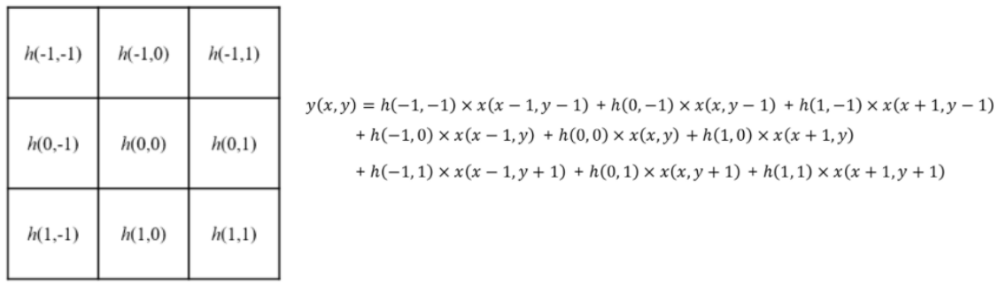
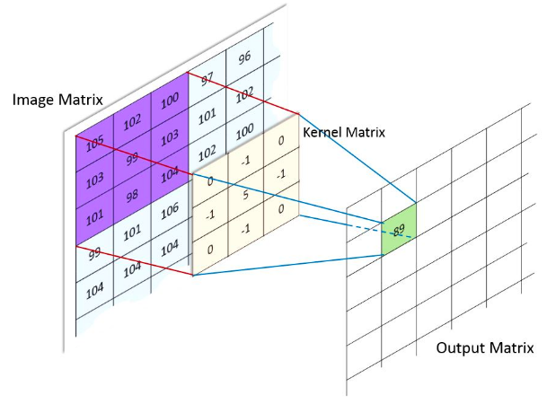
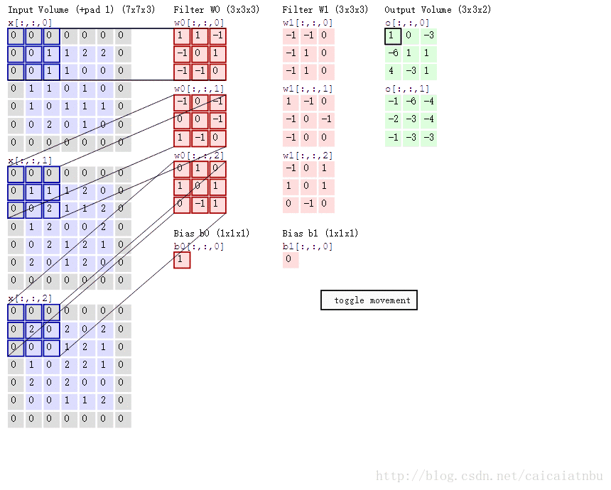
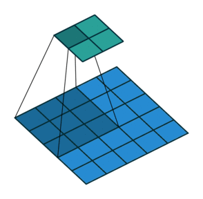
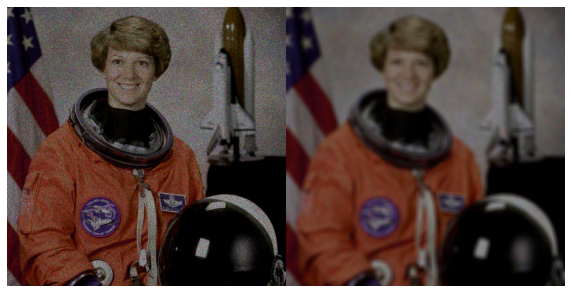

# Convolution

> 이 문서에서의 convolution은 digital image processing등에서의 convolution을 다루고 있음.  
>
> signal processing의 discrete convolution에 대한 건 다음 문서를 참고할 것:  
> [Discrete Convolution](https://dsaint31.tistory.com/394),  
> [Circular Convolution](https://dsaint31.tistory.com/393)
>
> Deep Learning의 Convolution Layer에 대한 보다 자세한 건 다음 문서를 참고할 것:  
> [Convolution Layer](../../../../ML/Ch14_cnn/CNN_convolutional_layer)

image filtering에서 spatial domain filtering은 주로 

* **filter** 또는 
* **kernel** 또는 
* **window** 라고 

불리는 행렬(=impulse response)과 입력 영상의 ***Convolution*** 으로 이루어짐.

> Convolution (합성곱)은 기호 ⊗ or ∗ 등으로 표기되지만 통일된 기호는 없음.

* 어찌보면, spatial operation의 끝판왕이라고 봐도 됨.

convolution의 수식은 다음과 같음.

$$
\begin{aligned}
g(x,y) &= \int^\infty_{-\infty}\int^\infty_{-\infty}f(\xi,\eta)h(x-\xi,y-\eta)d\xi d\eta
\\
&= h(x,y)*f(x,y)\\
&= f(x,y)*h(x,y)\end{aligned}
$$

where

- $h(x,y)$ : filter or kernel
- $f(x,y)$ : original image
- $g(x,y)$ : output image

convolution은 

* cross-correlation과 달리 ^^교환법칙이 성립^^ 하며, 
* impulse response(영상에선 point spread function)와 입력 신호를 이용하여 ***시스템의 response를 구하는 연산*** 임.

Cross correlation은 매우 유사하지만, 두 신호의 유사도를 얻기 위해 사용됨.

* cross-correlation과 달리 입력 함수 중 하나가 reflection이 이루어진다는 차이가 있음.
* cross-correlation에 대한 보다 자세한 내용은 다음 url을 참고 : [Cross correlation](https://dsaint31.tistory.com/entry/SS-Cross-Correlation)

> 하지만, 이미지 처리에서는 대부분 kernel을 대칭적인 것을 사용하다 보니 cross-correlation과 차이가 없는 경우가 많고, 특히 ML(기계학습)이나 DL(딥러닝)에서 kernel이 이미 상하좌우로 flip하여 입력하면 된다는 가정 하에 convolution의 구현이 실제로는 cross-correlation인 경우가 대다수임.

## Kernel (or Filter, Mask, Window)

- 유한한 크기의 `impulse response` (or point spread function)의 특성 계수
- 시스템 응답 특성 계수를 가지고 있는 matrix 혹은 tensor임.



DL등에서 convolution layer은 위의 2D kernel이 아닌 3D kernel로 구성되는 게 일반적임. (channel이 보통 3이므로 raw image를 입력으로 삼는 경우 kernel size의 3개의 matrix를 가지고 있다고 생각하면 됨.)

- kernel의 width와 height를 통해 local receptive field의 크기가 결정됨. 
- receptive field란 convolution의 결과로 나오는 feature map의 한 pixel(or voxel)의 값을 만드는데 관여한 input map(or image)의 영역을 의미함.


## Convolution 수행 방식



위의 그림에서 Kernel matrix는 상하좌우로 뒤집힌(reflection) 상태임. (Cross correlation과 차이)

- 다시 강조하지만, DIP나 ML, DL에서는 cross-correlation과 거의 구분하지 않음.

아래 그림은 다채널의 입력에 대해, 2개의 filter (or kernel)이 주어져서 convolution이 이루어지는 과정을 보여주고 있음.



* $5 \times 5 \times 3$ image를 상하좌우로 1씩 padding을 수행하고, 
* $3 \times 3$ kernel을(엄밀하게는 $3\times 3\times 3$) 통해 convolution을 수행하여 $3 \times 3 \times 2$ image를 얻어냄. 
* Kernel은 2 pixels의 `stride`를 사용하여 이동함.
* 결과 영상의 depth $2$는 kernel (or filter)이 2개 (`W0`, `W1`) 사용됨을 의미함.

### Stride

Convolution을 수행할 때, `stride`는 일종의 sub-sampling factor로 동작함.

이는 `stride`가 클수록 결과 feature map의 사이즈가 줄어들게 되며, DL에서 convolution layer의 computational complex를 효과적으로 낮출 수 있도록 해준다.
Kernel이 sliding을 통해 적용되어나가는데, `stride`는 어느 간격으로 Kernel이 sliding될지를 나타낸다. (`stride`가 클수록 듬성듬성 처리된다고 생각할 수 있음.)

다음은 `stride`가 $2 \times 2$인 경우(오른쪽으로 sliding할 때 2pixels, 아래로 sliding 할 때도 2pixels)임. (`stride`가 1인 경우 $3\times 3$ feature map이 나오는 것과 달리 이 경우 $2 \times 2$ feature map이 결과임)



* $5 \times 5$ 입력에 $2\times 2$ stide로 $3\times 3$ kernel로 Convolution.
* 상단의 녹색 matrix가 출력임.

---

## PyTorch 의 `nn.Conv2D`를 이용한 convolution 활용

[`nn.Conv2d`](https://gist.github.com/dsaint31x/9e6477a8b3d7f37c04ef5abdce4127a2)

---

## OpenCV를 통한 convolution

OpenCV 는 `filter2D`를 통해 convolution을 제공.

```Python
dst = cv2.filter2D(
    src, 
    ddepth, 
    kernel, 
    dst,
    anchor,
    delta, 
    borderType
)
```

- `src` : input image
- `ddepth` : output image dtype : `-1`인 경우 input image와 동일한 `dtype`를 가짐. / `CV_8U`,`CV_16U`, `CV16S`, `CV_32F`, `CV_64F`
- `kernel` : kernel or window or mask or filter matrix
- `dst` : output image
- `anchor` : kernel의 기준점. 결과값이 치환될 위치. default (-1,-1) 로 kernel의 중앙을 의미
- `delta` : 결과값에 추가할 값.
- `borderType` : padding 형태 (기본으로 `BORDER_REFLECT_101`임).

간단한 예제 코드는 다음과 같음.

```Python
#img = cv2.imread('./data/lena.jpg')
img = astro_noise.copy() # 아래 예는 poisson noise를 가함.
print(img.dtype, img.shape)

k_size = 10
kernel = np.full((k_size,k_size),1./(k_size**2))
blured = cv2.filter2D(img, -1, kernel)
print(f'from {img.shape} to {blured.shape}')

plt.figure(figsize=(10,20))
plt.imshow(np.concatenate((img,blured),axis=1))
plt.axis('off')
plt.show()
```

결과는 다음과 같음.



## References

* [A guide to convolution arithmetic for deep learning](https://arxiv.org/pdf/1603.07285v1.pdf)
    * [backup](./ref/A%20guide%20to%20convolution%20arithmetic%20for%20deep%20learning_1603.07285v1.pdf)
    * 박해선 선생님의 번역본 [A guide to convolution arithmetic for deep learning](https://tensorflow.blog/a-guide-to-convolution-arithmetic-for-deep-learning/#ch2-3)