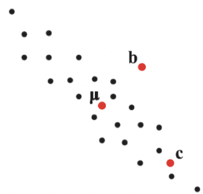
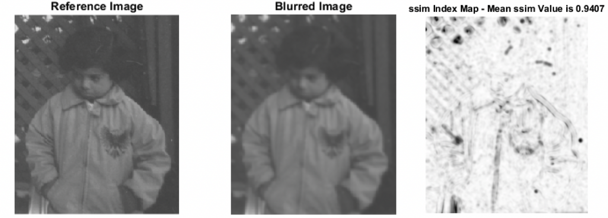
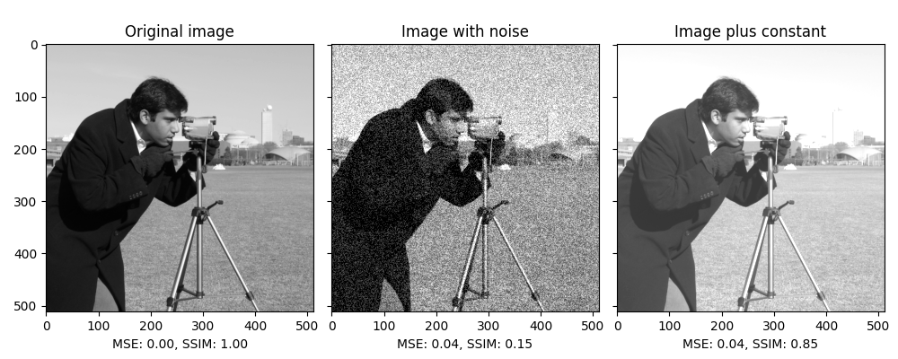

# Metrics for Image Quality

Image restoration의 경우, image degradation의 원인을 modeling하고 해당 model을 통해 ideal image에 가깝게 복원하는 것을 의미함.

주관적인 화질을 개선하는 image enhancement와 달리, image restoration은 객관적인 화질 개선을 수행한다.

ideal image가 존재할 경우, 해당 ideal image와 현재 측정된 image (or image degradation이 발생한 image)간의 차이의 크기가 바로 image degradation 정도의 크기라고 할 수 있고, image restoration은 이를 감소시키는 기술이라고 볼 수 있다.

이 페이지에서는 ideal imgae가 존재할 경우, 현재 image와 해당 ideal image간의 차이를 측정하는 metric들을 소개한다.

## Distance function (or Metric)

metric (or distance function)의 정의는 다음과 같음 (수학적 정의).

> A function that measures the distance or "closeness" between two objects or points in a space.

The requirements for a metric include being 

1. non-negative : $d(x,y) \ge 0$, 
2. identity of indiscernibles : $d(x,x)=0$,
3. symmetric : $d(x,y)=d(y,x)$, and 
4. satisfying the triangle inequality : $d(x,y) \le d(x,z)+d(z,y)$. 

Additionally, a distance function should give a small distance for similar objects and a large distance for dissimilar objects.

> distance function은 SSIM과 같이 similarity measures를 포함하는 경우도 있어서 metric보다 좀더 넓은 개념으로 취급되기도 하지만, **일반적** 으로는 metric과 같은 의미로 사용된다. Overall, the distinction between the terms "distance function" and "metric" is not always strictly observed, and the two terms are often used interchangeably in practice.

## difference 계열

### Mean Absolute Difference (MAD, or Mean Absolute Error, MAE)

$$
\text{MAE}(\textbf{y},\hat{\textbf{y}})=\frac{1}{m}\sum^m_{i=1}|\hat{\textbf{y}}_i-\textbf{y}_i|
$$

where

* $m$ : # of pixels
* $\hat{\textbf{y}}$ : current image (ideal image와 비교하고자하는 image)
* $\hat{\textbf{y}}_i$ : current image에서 $i$번째 pixel의 값 (or vector).
* $\textbf{y}$ : ideal image 
* $\textbf{y}_i$ : ideal image에서 $i$번째 pixel의 값 (or vector).

`np.mean(np.abs(img-ideal))`로 쉽게 구할 수 있으며, L-1 norm을 사용하기 때문에 outlier에 영향을 MSE에 비해 덜 받음.

### Mean Squared Error (MSE) 

$$
\text{MSE}(\textbf{y},\hat{\textbf{y}})=\frac{1}{m}\sum^m_{i=1}\left(\hat{\textbf{y}}_i-\textbf{y}_i\right)^2
$$

where

* $m$ : # of pixels
* $\hat{\textbf{y}}$ : current image (ideal image와 비교하고자하는 image)
* $\hat{\textbf{y}}_i$ : current image에서 $i$번째 pixel의 값 (or vector).
* $\textbf{y}$ : ideal image 
* $\textbf{y}_i$ : ideal image에서 $i$번째 pixel의 값 (or vector).

미분이 가능하기때문에 매우 많이 사용되지만, sign을 +로 만들기 위해 취한 squared로 인해 MAE에 비해 큰 값을 가지게 되고, outlier의 영향이 커지는 단점을 가짐.

`np.mean( (img-ideal)**2 )`로 쉽게 구할 수 있음.

---

### Root Mean Squared Error (RMSE)

$$
\text{RMSE}(\textbf{y},\hat{\textbf{y}})=\frac{1}{m}\sum^m_{i=1}\|\hat{\textbf{y}}_i-\textbf{y}_i\|_2
$$

MSE가 squared로 인해 값이 커지는 문제를 square root를 이용하여 해결함. L-2 norm기반이기 때문에 미분 가능하다는 장점을 가지지만 L-1 norm에 기반한 MAE보다 outlier의 영향이 크다는 단점을 가지고 있음.

`np.sqrt( np.mean( (img-ideal)**2 ))`으로 구하거나 MSE를 구하고 sqrt만 추가해서 구함.

> Euclidean distance라고도 불림.

---

### Sum of Squared Error (SSE)

$$
\text{SSE}(\textbf{y},\hat{\textbf{y}})=\sum^m_{i=1}\left(\hat{\textbf{y}}_i-\textbf{y}_i\right)^2
$$

MSE에서 전체 샘플 갯수로 나누는 연산이 빠진 형태. 일반적으로 pixel의 수가 고정된 경우에 사용됨. (연산량은 줄어드나 값이 커지기 때문에 MSE, RMSE보다 많이 사용되진 않는 편)

`np.sum( (img-ideal)**2 )`로 구할 수 있음.

---

### 참고 : Mahalanobis Distance

image에 직접 사용되기 보다는 image의 feature vector를 계산하고, 이들 간의 distance (or difference)를 계산하는데 사용된다.

- data의 Probability distribution(확률분포)을 고려한 distance.
- 다음 그림에서 $\mu$와 보다 가까운 것을 고를 때, 단순히 L2-norm을 고려할 경우 $\textbf{b}$가 보다 가깝지만,  각 점들의 분포를 고려하면 $\textbf{c}$라고 말할 수 있다.
    

> 이처럼 데이터의 확률분포를 고려한 distance로서 Mahalanobis distance가 사용되며,  
> 이는 mean vector, $\mu$와 [covariance matrix, $\Sigma$](https://dsaint31.tistory.com/entry/Statistics-Covariance-vs-Correlation#Example%--%-A%--Covariance%--Matrix) 를 사용하여 계산됨.  
> 참고로, covariance matrrix $\Sigma$가 identity matrix인 경우 Mahalanobis distance는 Euclidean distance와 같음.

covariance matrrix가 invertible하지 않으면 Mahalanobis distance는 구해지지 않기 때문에실제로는 PCA Whitening transformation으로 데이터를 처리 (dimensionality reduction도 같이 수행됨)한 이후에 계산함. (Whitening transformation이 이루어지면 covariance를 identity matrix로 취한 Euclidean distance를 구하는 방식으로 Mahalanobis distance를 구할 수 있음.)

[Whitening Transformation 관련자료](https://dsaint31.tistory.com/entry/Math-Whitening-Transformation)

#### ex: Sample $\textbf{s}$와 정규분포 $N(\bold{\mu},\Sigma)$사이의 Mahalanobis distance

$$
d_\text{mahalanobis}[\textbf{s},N(\mu,\Sigma)]=d_\text{m}[\textbf{s}]=\sqrt{(\textbf{s}-\mu)^T\Sigma^{-1}(\textbf{s}-\mu)}
$$

* $\textbf{s}$는 column vector임.
* row vector인 경우 transpose가 inverse of covariance 뒤로 바뀜.

#### ex: Sample $\textbf{s}_1$와 sample $\textbf{s}_2$ 사이의 Mahalanobis distance

$$
d_m(\textbf{s}_1,\textbf{s}_2)=\sqrt{(\textbf{s}_1-\textbf{s}_2)^T\Sigma^{-1}(\textbf{s}_1-\textbf{s}_2)}
$$

* $\textbf{s}_1, \textbf{s}_2$는 column vector임.
* row vector인 경우 transpose가 inverse of covariance 뒤로 바뀜. 

---

## ratio계열

### Peak Signal to Noise Ratio (PSNR)

ideal과의 차이 정도를 나타내는 지표로 많이 사용되며 단위는 dB임. 단, 완전히 동일할 경우 (무손실인 경우), 분모가 0이되므로 값을 구할 수 없다. (구현에서는 보통 infinity로 처리하고 nan으로 처리함.)

$$
\begin{aligned}
\text{PSNR}&=10 \log \left( \frac{\text{MAX}^2}{\text{MSE}}\right)\\&= 20 \log \left( \frac{\text{MAX}}{\text{RMSE}}\right)
\end{aligned}
$$

where

* $\text{MAX}$ : image pixel이 가질 수 있는 최대값으로, 8bit depth image의 경우 255임. `[0,1]` range로 normalized 된 경우에는 1이 사용됨.

가질 수 있는 최대신호 (peak signal)에 대한 noise의 ratio로 영상처리 결과 image나 압축 혹은 image restoration을 거친 image에서 얼마나 image degradation이 발생했는지를 평가하는데 사용됨. 


## implementations

```Python
import numpy as np
# import math

def mae(src,dst):
    return np.mean(np.abs(src-dst))

def mse(src,dst):
    return np.mean((src-dst)**2)

def sse(src,dst):
    return np.sum((src-dst)**2)

def rmse(src,dst):
    return np.sqrt(mse(src,dst))

def psnr(src,dst):
    mse = np.mean((src-dst)**2)
    if mse == 0:
        return np.inf #math.inf
    MAX=1 # normalized [0,1]
    return 20* np.log10(MAX/np.sqrt(mse)) #20*math.log10(MAX/math.sqrt(mse))
```

---

## SSIM (Structural Similarity Index Measure)

> SSIM은 image quality metric으로 널리 사용되지만, 엄밀한 의미에선 metric이 아님: SSIM 은 triangle inequality를 만족하지 않음. 일종의 simialrity index임.

인간의 ***시각적 화질 (휘도, 대비, 구조적 특징) 유사도*** 를 평가하기 위해 고안된 지표(index). 

>인간의 시각은 이미지의 ***구조적 특징을 추출*** 하는데 특화되어 있고, 때문에 구조적 특징에서의 degradation이 두 image에서의 차이를 인식하는데 매우 큰 영향을 준다는 가설을 기반으로 구조적 특징(structure)의 차이를 정량화하고 있음.
> 

- 기존의 MSE 방법과 달리 이미지의
    - luminance (휘도)
    - contrast (대비) 그리고
    - ***structure (구조적 특징)***
    
    을 고려하여 similarity를 측정. 
    
- ***Object간의 구조적 변화*** 를 측정하는 지표로 사용됨.
- 이미지 영역을 $N \times N$ 윈도우로 분할하고, 해당 각 윈도우에 대해 SSIM 방법을 적용하여 계산됨.

$$
\text{SSIM}(x,y)=\dfrac{ (2\mu_x\mu_y+c_1)(2\sigma_{xy}+c_2)}{(\mu_x^2+\mu_y^2+c_1)(\sigma_x^2+\sigma_y^2+c_2)}
$$

- $\mu_x$: the average of $x$
- $\mu_y$: the average of $y$
- $\sigma_x^2$ : the variance of $x$
- $\sigma_y^2$ : the variance of $y$
- $\sigma_{xy}$ : the covariance of $x$ and $y$
- $c_1$, $c_2$ : two variables to stabilize the division with weak denominator; $c_1=(k_1L)^2$, $c_2=(k_2L)^2$.
- $L$ the [dynamic range](https://en.wikipedia.org/wiki/Dynamic_range) of the pixel-values (typically this is $2^{\#bits\ per\ pixel}-1$);
- $k_{1}=0.01$ and $k_2=0.03$  by default.

[Structural similarity](https://en.wikipedia.org/wiki/Structural_similarity)

### **Formula components**

The `SSIM` formula is based on three comparison measurements between the samples of $x$ and $y$: 

- luminance ($l$),  ← $l(x,y)$는 휘도의 차이를 비교! `[0,1]`의 값을 가지면 동일시 1.
- contrast ($c$) and ← $c(x,y)$는 대비의 차이를 비교! `[0,1]`의 값을 가지면 동일시 1.
- structure ($s$).  ← $s(x,y)$는 구조의 차이를 비교! `[-1,1]`의 값을 가지면 동일시 1.

The individual comparison functions are:

$$
l(x,y)={\frac {2\mu _{x}\mu _{y}+c_{1}}{\mu _{x}^{2}+\mu _{y}^{2}+c_{1}}} \\\\ c(x,y)={\frac {2\sigma _{x}\sigma _{y}+c_{2}}{\sigma _{x}^{2}+\sigma _{y}^{2}+c_{2}}}\\\\s(x,y)={\frac {\sigma _{xy}+c_{3}}{\sigma _{x}\sigma _{y}+c_{3}}}
$$

with, in addition to above definitions:

- $c_{3}=c_{2}/2$

`SSIM` is then a ^^weighted combination of those comparative measures^^ :

$$
\text{SSIM}(x,y)=\left[l(x,y)^{\alpha }\cdot c(x,y)^{\beta }\cdot s(x,y)^{\gamma }\right]
$$

Setting the weights $\alpha ,\beta ,\gamma$ to 1, the formula can be reduced to the form shown above.

>💡 `SSIM`에서는 sample(or image patch) $x$, $y$ 의 **구조적 특징유사도** $s(x,y)$를 
사실상 **sample간의 correlation coefficient로 정의** 하고 있음을 유의할 것!!


- **detail of structure comparison function**
    
    SSIM에서 image $x,y$의 structure는 다음과 같이 정의됨.
    
    $$
    s(x)=\frac{x-\mu_x}{\sigma_x}, s(y)=\frac{y-\mu_y}{\sigma_y}
    $$
    
    그리고 이들 strucutre간의 유사도를 각 image의 strucutre간의 correlation coefficient로 정의하고, 이를 각 image간의 correlation coefficient와 equivalent로 놓고 structure간의 비교 함수는 $s(x,y)$를 정의함.
    

### Example

아래 그림은 왼쪽 부터 original, blurred image,  SSIM 순으로 구성됨. 이 중 SSIM은 전체 이미지에서 구하지 않고 전체 이미지를 같은 크기의 작은 윈도우로 나누어 계산하여 이미지로 표현된 것임. → 이후 해당 SSIM index map의 각 pixel의 값을 평균하여 SSIM value를 구함. 

<figure markdown>

<figcapture>MATLAB API document for SSIM</figcapture>
</figure markdown>

다음 예제는 scikit-image에서 제공하는 `skimage.metrics.structural_similarity`를 이용하여 ssim과 mse의 차이를 보여주는 예제임.

```Python
import numpy as np
import matplotlib.pyplot as plt

from skimage import data, img_as_float
from skimage.metrics import structural_similarity as ssim
from skimage.metrics import mean_squared_error


img = img_as_float(data.camera())
rows, cols = img.shape

noise = np.ones_like(img) * 0.2 * (img.max() - img.min())
rng = np.random.default_rng()
noise[rng.random(size=noise.shape) > 0.5] *= -1

img_noise = img + noise
img_const = img + abs(noise)

fig, axes = plt.subplots(nrows=1, ncols=3, figsize=(10, 4),
                         sharex=True, sharey=True)
ax = axes.ravel()

mse_none = mean_squared_error(img, img)
ssim_none = ssim(img, img, data_range=img.max() - img.min())

mse_noise = mean_squared_error(img, img_noise)
ssim_noise = ssim(img, img_noise,
                  data_range=img_noise.max() - img_noise.min())

mse_const = mean_squared_error(img, img_const)
ssim_const = ssim(img, img_const,
                  data_range=img_const.max() - img_const.min())

ax[0].imshow(img, cmap=plt.cm.gray, vmin=0, vmax=1)
ax[0].set_xlabel(f'MSE: {mse_none:.2f}, SSIM: {ssim_none:.2f}')
ax[0].set_title('Original image')

ax[1].imshow(img_noise, cmap=plt.cm.gray, vmin=0, vmax=1)
ax[1].set_xlabel(f'MSE: {mse_noise:.2f}, SSIM: {ssim_noise:.2f}')
ax[1].set_title('Image with noise')

ax[2].imshow(img_const, cmap=plt.cm.gray, vmin=0, vmax=1)
ax[2].set_xlabel(f'MSE: {mse_const:.2f}, SSIM: {ssim_const:.2f}')
ax[2].set_title('Image plus constant')

plt.tight_layout()
plt.show()
```

결과는 다음과 같음.



* MSE가 동일한 가운데와 오른쪽 image들의 SSIM이 차이가 남을 알 수 있음.
* 오른쪽의 일정한 상수가 더해진 경우가 훨씬 original image와 유사하다고 볼 수 있으며, 이를 SSIM은 잘 반영하고 있는 것을 확인 가능함.

## Ref.

- [scikit-image's Structural similarity index](https://scikit-image.org/docs/dev/auto_examples/transform/plot_ssim.html#sphx-glr-auto-examples-transform-plot-ssim-py)
- [MATLAB SSIM Document](https://kr.mathworks.com/help/images/ref/ssim.html)
- [Jinsol Kim's blog](https://gaussian37.github.io/vision-concept-ssim/)
